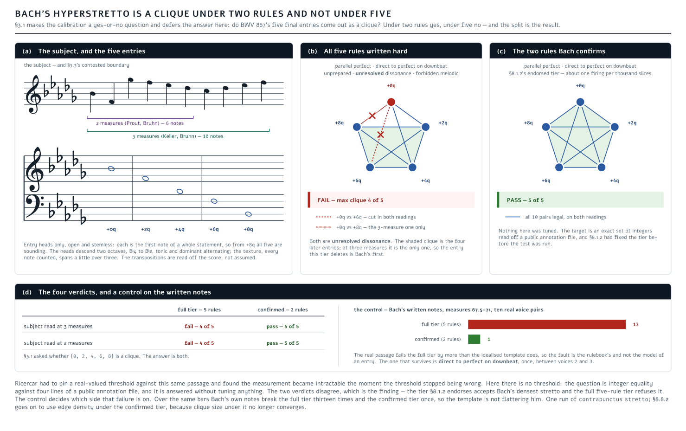
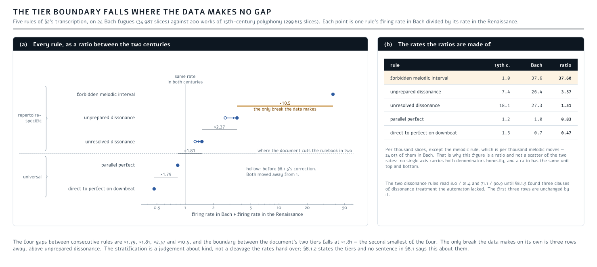
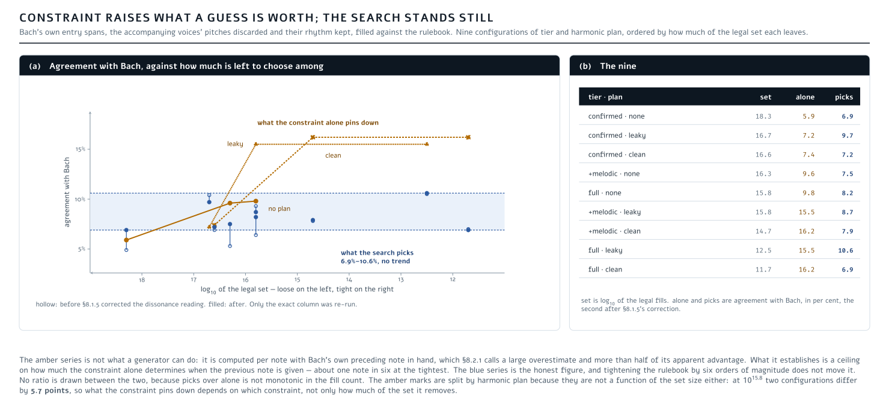
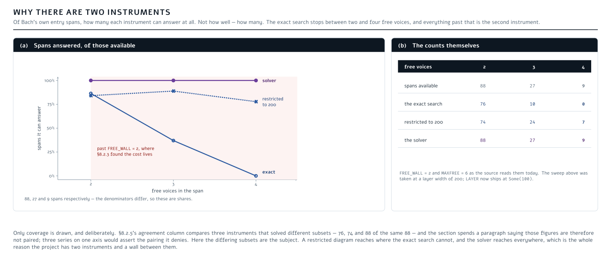
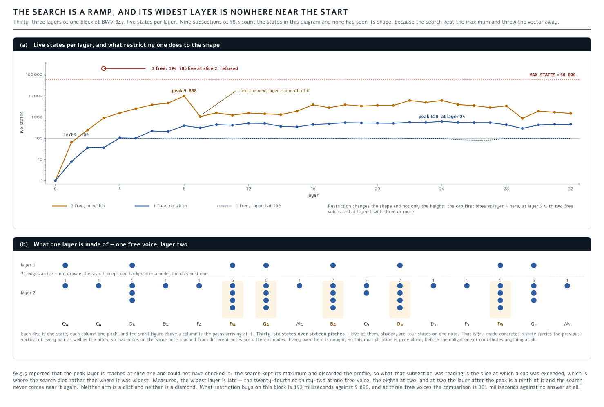
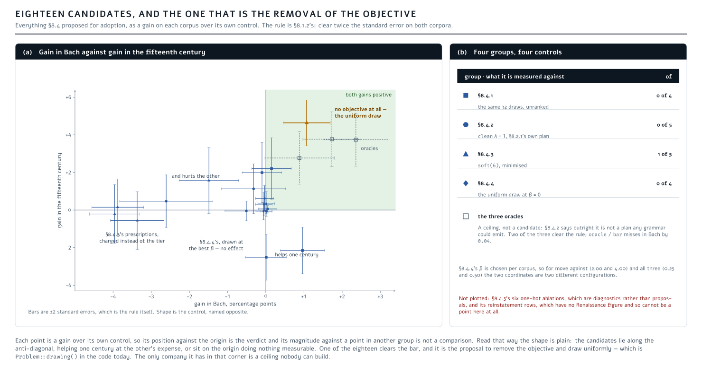
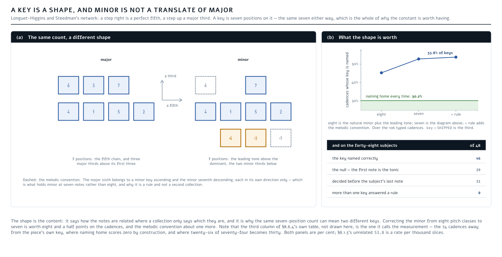
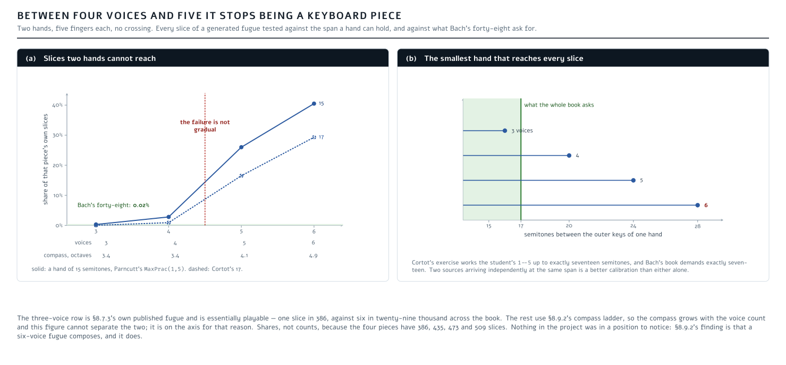
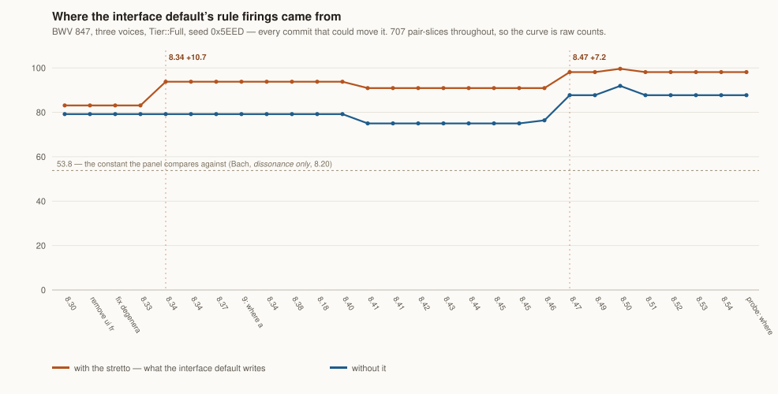
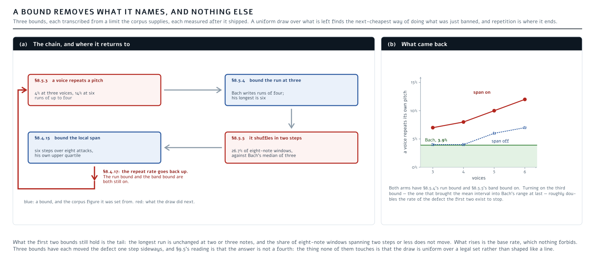

# Contrapunctus: Counterpoint is a regular language

### Fugue on the lattice: 73 states, a clique, and what Bach says about the rulebook

*Design document and current state. Automaton, stretto measure, harmonic analyser, realiser and form grammar are
built and measured; a generator writes whole fugues from a subject alone —
[§8](#8-what-is-built-and-what-it-measures). What remains open, beginning with a criterion that selects among
legal fills, is [§9](#9-roadmap). How this was reached, and what did not survive, is in
[`CHANGELOG.md`](CHANGELOG.md).*

```math
\begin{aligned}
  \underbrace{
    \mathrm{fugue}\big(
      \underbrace{D}_{\text{material}},\;
      \underbrace{\Lambda}_{\text{plan}},\;
      \underbrace{\tau}_{\text{rulebook}},\;
      \underbrace{s}_{\text{seed}}
    \big)
  }_{\text{sentence}}
  \;&=\;
  \underbrace{B}_{
    \substack{
      \mathrm{derive}(D,\Lambda)\\
      \text{"symbols"}
    }
  }
  \;\times\;
  \underbrace{V}_{
    \underbrace{
      \begin{pmatrix}
        n_{1,1} & \cdots & n_{1,k_1}\\
        \vdots  &        & \vdots\\
        n_{m,1} & \cdots & n_{m,k_m}
      \end{pmatrix}
    }_{\text{notes per voice}}
  }
  \;\times\;
  \underbrace{\mathrm{parse}(B)}_{
    \substack{
      \text{is sentence}\\
      \text{grammatically}\\
      \text{correct?}
    }
  }\;\times\;
  \underbrace{\mathrm{check}_{\tau_2}(V)}_{\text{rulebook violations}}
\end{aligned}
```

---

## Contents

- [Abstract](#abstract)
- [The name is the argument in miniature](#the-name-is-the-argument-in-miniature)
- [Formalization](#formalization)
- [0. Where this comes from](#0-where-this-comes-from)
- [1. Diagnosis: ricercar's §8 is two causes, not seven items](#1-diagnosis-ricercars-8-is-two-causes-not-seven-items)
  - [1.1 The state is a point, not a transition](#11-the-state-is-a-point-not-a-transition)
  - [1.2 Ricercar's own evidence against the continuum](#12-ricercars-own-evidence-against-the-continuum)
- [2. The reformulation](#2-the-reformulation)
  - [2.1 Exact arithmetic, and therefore no certificates](#21-exact-arithmetic-and-therefore-no-certificates)
  - [2.2 Counterpoint is a finite automaton](#22-counterpoint-is-a-finite-automaton)
  - [2.3 Harmony is a second automaton](#23-harmony-is-a-second-automaton)
  - [2.4 Form is a grammar](#24-form-is-a-grammar)
  - [2.5 The search is a shortest path](#25-the-search-is-a-shortest-path)
  - [2.6 What is *not* a variable: rhythm](#26-what-is-not-a-variable-rhythm)
  - [2.7 Where a solver takes over from the DP](#27-where-a-solver-takes-over-from-the-dp)
- [3. Stretto, capacity, and the subject](#3-stretto-capacity-and-the-subject)
  - [3.1 The calibration disappears](#31-the-calibration-disappears)
  - [3.2 Capacity is a density, and it cannot be optimised](#32-capacity-is-a-density-and-it-cannot-be-optimised)
  - [3.3 The subject is input, and its boundary is contested](#33-the-subject-is-input-and-its-boundary-is-contested)
- [4. Space filling, in the right category](#4-space-filling-in-the-right-category)
- [5. What this will not do](#5-what-this-will-not-do)
- [6. What ricercar still owns](#6-what-ricercar-still-owns)
- [7. Prior art](#7-prior-art)
  - [7.1 Parallels within the same algorithmic family](#71-parallels-within-the-same-algorithmic-family)
- [8. What is built, and what it measures](#8-what-is-built-and-what-it-measures)
  - [8.1 The rulebook, and what two corpora say about it](#81-the-rulebook-and-what-two-corpora-say-about-it)
    - [8.1.1 The automaton](#811-the-automaton)
    - [8.1.2 Two corpora stratify the rulebook](#812-two-corpora-stratify-the-rulebook)
    - [8.1.3 Fux's species as a whitelist tightens nothing](#813-fuxs-species-as-a-whitelist-tightens-nothing)
    - [8.1.4 The fourth needs a scope wider than the pair](#814-the-fourth-needs-a-scope-wider-than-the-pair)
    - [8.1.5 The dissonance rules need a metre the automaton lacked](#815-the-dissonance-rules-need-a-metre-the-automaton-lacked)
    - [8.1.6 The chord's own seventh needs no preparation](#816-the-chords-own-seventh-needs-no-preparation)
  - [8.2 Realisation: the wall, and what the search costs](#82-realisation-the-wall-and-what-the-search-costs)
    - [8.2.1 Realisation stops at two free voices](#821-realisation-stops-at-two-free-voices)
    - [8.2.2 What a voice count really costs](#822-what-a-voice-count-really-costs)
    - [8.2.3 Where the exact search stops being worth waiting for](#823-where-the-exact-search-stops-being-worth-waiting-for)
    - [8.2.4 How much of the search is built to be thrown away](#824-how-much-of-the-search-is-built-to-be-thrown-away)
    - [8.2.5 Restrict a layer instead of refusing it](#825-restrict-a-layer-instead-of-refusing-it)
    - [8.2.6 Every core, at last](#826-every-core-at-last)
    - [8.2.7 The drivers were already parallel, one level down](#827-the-drivers-were-already-parallel-one-level-down)
    - [8.2.8 There is one fill, and four faults lived in the gap when there were two](#828-there-is-one-fill-and-four-faults-lived-in-the-gap-when-there-were-two)
    - [8.2.9 A cost is attributed by timing it, not by explaining it](#829-a-cost-is-attributed-by-timing-it-not-by-explaining-it)
  - [8.3 Counting a legal set nothing can enumerate](#83-counting-a-legal-set-nothing-can-enumerate)
    - [8.3.1 The best bound in the literature cannot afford the graph](#831-the-best-bound-in-the-literature-cannot-afford-the-graph)
    - [8.3.2 Layering is checkable only where it is not needed](#832-layering-is-checkable-only-where-it-is-not-needed)
    - [8.3.3 Counting without the set in hand](#833-counting-without-the-set-in-hand)
    - [8.3.4 The transition relation up front costs five thousand times the loop](#834-the-transition-relation-up-front-costs-five-thousand-times-the-loop)
    - [8.3.5 A restricted count is not a count, and the texture was drawn from two of them](#835-a-restricted-count-is-not-a-count-and-the-texture-was-drawn-from-two-of-them)
    - [8.3.6 SampleSearch removes every dead walk and pays for it in diagram](#836-samplesearch-removes-every-dead-walk-and-pays-for-it-in-diagram)
    - [8.3.7 Gauss–Jordan would fix the right thing and still not be worth writing](#837-gaussjordan-would-fix-the-right-thing-and-still-not-be-worth-writing)
    - [8.3.8 A merge operator, and an upper bound to set against the lower one](#838-a-merge-operator-and-an-upper-bound-to-set-against-the-lower-one)
    - [8.3.9 The bracket is widest exactly where the draw needs it](#839-the-bracket-is-widest-exactly-where-the-draw-needs-it)
    - [8.3.10 The diagram is a ramp, and the widest layer is nowhere near the start](#8310-the-diagram-is-a-ramp-and-the-widest-layer-is-nowhere-near-the-start)
  - [8.4 Nothing prefers one legal fill to another](#84-nothing-prefers-one-legal-fill-to-another)
    - [8.4.1 Every step-6 failure is a deficiency, not an excess](#841-every-step-6-failure-is-a-deficiency-not-an-excess)
    - [8.4.2 A better harmonic plan is the first lever worth more than a point](#842-a-better-harmonic-plan-is-the-first-lever-worth-more-than-a-point)
    - [8.4.3 Every positive criterion has a degenerate optimum](#843-every-positive-criterion-has-a-degenerate-optimum)
    - [8.4.4 A prescription is safe under a sampler, and worth nothing](#844-a-prescription-is-safe-under-a-sampler-and-worth-nothing)
    - [8.4.5 The alphabet a generator needs is already measured](#845-the-alphabet-a-generator-needs-is-already-measured)
    - [8.4.6 The design, measured before it was built](#846-the-design-measured-before-it-was-built)
    - [8.4.7 The grammar's own harmony, and what deciding it costs](#847-the-grammars-own-harmony-and-what-deciding-it-costs)
    - [8.4.8 Where the extra firings come from](#848-where-the-extra-firings-come-from)
    - [8.4.9 The panel was judging the generator and the composer differently](#849-the-panel-was-judging-the-generator-and-the-composer-differently)
    - [8.4.10 Mattheson transcribed, and the generator off the end of three of his eight dials](#8410-mattheson-transcribed-and-the-generator-off-the-end-of-three-of-his-eight-dials)
    - [8.4.11 The breath, the disposition and the foot: the first Mattheson claim to fail by measurement](#8411-the-breath-the-disposition-and-the-foot-the-first-mattheson-claim-to-fail-by-measurement)
    - [8.4.12 An affect as a band that varies over the piece, and the two dials it cannot yet reach](#8412-an-affect-as-a-band-that-varies-over-the-piece-and-the-two-dials-it-cannot-yet-reach)
    - [8.4.13 The systematic literature, and what it says this design has wrong](#8413-the-systematic-literature-and-what-it-says-this-design-has-wrong)
    - [8.4.14 Why the band cannot reach, and the first dial the generator starts inside](#8414-why-the-band-cannot-reach-and-the-first-dial-the-generator-starts-inside)
    - [8.4.15 A compass is a range, and the search had been reading it as freedom](#8415-a-compass-is-a-range-and-the-search-had-been-reading-it-as-freedom)
    - [8.4.16 What the span bound is worth, and the percentile it has to be read off](#8416-what-the-span-bound-is-worth-and-the-percentile-it-has-to-be-read-off)
    - [8.4.17 The default flipped, and what moved](#8417-the-default-flipped-and-what-moved)
  - [8.5 Standing still: texture, repetition, and the bounds the book supplies](#85-standing-still-texture-repetition-and-the-bounds-the-book-supplies)
    - [8.5.1 Both ways of choosing a texture collapse to a constant](#851-both-ways-of-choosing-a-texture-collapse-to-a-constant)
    - [8.5.2 The rule that would have fixed it is not in the book](#852-the-rule-that-would-have-fixed-it-is-not-in-the-book)
    - [8.5.3 A voice repeats itself, and it is the draw rather than a defect](#853-a-voice-repeats-itself-and-it-is-the-draw-rather-than-a-defect)
    - [8.5.4 Bound the run, and the width cap pays for it](#854-bound-the-run-and-the-width-cap-pays-for-it)
    - [8.5.5 The bound moved the defect one step sideways](#855-the-bound-moved-the-defect-one-step-sideways)
  - [8.6 Harmony, key, and the answer](#86-harmony-key-and-the-answer)
    - [8.6.1 The harmonic analyser](#861-the-harmonic-analyser)
    - [8.6.2 Marpurg's tonal answer: one rule exact, one wrong](#862-marpurgs-tonal-answer-one-rule-exact-one-wrong)
    - [8.6.3 Key-finding against a ground truth already in the repository](#863-key-finding-against-a-ground-truth-already-in-the-repository)
    - [8.6.4 Forty-eight out of forty-eight](#864-forty-eight-out-of-forty-eight)
  - [8.7 Form: the grammar, and a whole fugue from a subject](#87-form-the-grammar-and-a-whole-fugue-from-a-subject)
    - [8.7.1 Most episodes are not sequences](#871-most-episodes-are-not-sequences)
    - [8.7.2 Does the form grammar derive the book?](#872-does-the-form-grammar-derive-the-book)
    - [8.7.3 A whole fugue from a subject](#873-a-whole-fugue-from-a-subject)
    - [8.7.4 Judging the seam between blocks buys the texture](#874-judging-the-seam-between-blocks-buys-the-texture)
    - [8.7.5 Where a second rhythm comes from](#875-where-a-second-rhythm-comes-from)
    - [8.7.6 The generator against the book](#876-the-generator-against-the-book)
    - [8.7.7 A saved fugue is a recipe, not a recording](#877-a-saved-fugue-is-a-recipe-not-a-recording)
    - [8.7.8 Only one thing an edit disturbs is global](#878-only-one-thing-an-edit-disturbs-is-global)
  - [8.8 Stretto, register, and what a subject will carry](#88-stretto-register-and-what-a-subject-will-carry)
    - [8.8.1 The clique test](#881-the-clique-test)
    - [8.8.2 Capacity ranks subjects but cannot design one](#882-capacity-ranks-subjects-but-cannot-design-one)
    - [8.8.3 Two faults of register](#883-two-faults-of-register)
    - [8.8.4 Two subjects at once expose a pair nothing judged](#884-two-subjects-at-once-expose-a-pair-nothing-judged)
    - [8.8.5 Three things a placed voice is not](#885-three-things-a-placed-voice-is-not)
    - [8.8.6 Choosing the clique arbitrarily cost forty-five statements](#886-choosing-the-clique-arbitrarily-cost-forty-five-statements)
    - [8.8.7 The register is part of the search, not a correction applied after it](#887-the-register-is-part-of-the-search-not-a-correction-applied-after-it)
    - [8.8.8 Which subject carries six voices, and it is not the one everybody would name](#888-which-subject-carries-six-voices-and-it-is-not-the-one-everybody-would-name)
  - [8.9 Past the wall: a solver, six voices, and two hands](#89-past-the-wall-a-solver-six-voices-and-two-hands)
    - [8.9.1 The wall was in the wrong place](#891-the-wall-was-in-the-wrong-place)
    - [8.9.2 What a rest was really for](#892-what-a-rest-was-really-for)
    - [8.9.3 A one-hot group's order pins every voice to its ceiling](#893-a-one-hot-groups-order-pins-every-voice-to-its-ceiling)
    - [8.9.4 A derivable pin restores the locality that was withdrawn](#894-a-derivable-pin-restores-the-locality-that-was-withdrawn)
    - [8.9.5 The two instruments disagree about what is legal](#895-the-two-instruments-disagree-about-what-is-legal)
    - [8.9.6 Where the voice count stops being a keyboard piece](#896-where-the-voice-count-stops-being-a-keyboard-piece)
  - [8.10 What a measurement is worth](#810-what-a-measurement-is-worth)
    - [8.10.1 The whole history of one number is two commits](#8101-the-whole-history-of-one-number-is-two-commits)
- [9. Roadmap](#9-roadmap)
  - [9.1 The central problem: a criterion that selects](#91-the-central-problem-a-criterion-that-selects)
  - [9.2 The other gap: which affect the music has, and what in the texture puts it there](#92-the-other-gap-which-affect-the-music-has-and-what-in-the-texture-puts-it-there)
  - [9.3 Harmony, scheduled per beat](#93-harmony-scheduled-per-beat)
  - [9.4 Two smaller shapes, waiting on the same thing](#94-two-smaller-shapes-waiting-on-the-same-thing)
  - [9.5 Open problems, in rough order of how much they block](#95-open-problems-in-rough-order-of-how-much-they-block)
  - [9.6 A possible experiment: giving the criterion something to say about harmony](#96-a-possible-experiment-giving-the-criterion-something-to-say-about-harmony)
- [10. Reproducing the results](#10-reproducing-the-results)
  - [10.1 Environment and data](#101-environment-and-data)
  - [10.2 Which command produces which section](#102-which-command-produces-which-section)
  - [10.3 Parameters](#103-parameters)
  - [10.4 How the samples were taken](#104-how-the-samples-were-taken)
  - [10.5 What is not reproducible from this repository](#105-what-is-not-reproducible-from-this-repository)
  - [10.6 Using it as a library](#106-using-it-as-a-library)
---

## Abstract

Machine composition of fugue is usually attempted in one of two categories: fitting a model to a corpus, or
searching a continuous relaxation of the score. This document argues that both are the wrong category. Fugue is a
**word problem over a finite alphabet under constraints of bounded memory**, so the natural instruments are
automata, dynamic programming and exact combinatorial search, none of which require training data and all of which
return proofs instead of samples.

The argument opens as a post-mortem. [`ricercar`](ricercar/readme.md) modelled counterpoint as a
Lipschitz-certifiable roughness field over a continuum of entry placements, and its own measurements refute it. The
legal region proved **piecewise constant at the note grid**, and rounding a certified placement onto the semitone
grid costs about ten times the margin the certificate establishes, so the proof was taken over the wrong set.
Everything expensive in that approach existed to bound a function whose answer is constant on a lattice.

On the lattice the reformulation is small and largely classical. Counterpoint is a **finite automaton** over
`(interval, motion, articulation, metric weight)` whose state is the interval together with its outstanding
obligations: a dissonance owes a resolution, a leap owes a recovery. It remains finite because strict counterpoint
requires every debt settled on the next event. Harmony is a second automaton, form a ten-line grammar, and
realising free voices against fixed entries a shortest path, escalating to a CDCL solver where layering is known to
fail. Densest stretto becomes **maximum clique in a Cayley graph** on the shift group, exactly computable, where
the continuous formulation of the same question was abandoned at thirty minutes without a single placement. Bach's
five-voice hyperstretto in BWV 867 is such a clique, and its offsets form the arithmetic progression
`{0, 2, 4, 6, 8}` quarters. The object is a clique in a Cayley graph, emphatically not a Sidon set.

The counterpoint automaton, the stretto measure, a harmonic analyser, the realiser and the form grammar are built
and measured against the 24 fugues of the Well-Tempered Clavier, Book I, and against 200 works of 15th-century
polyphony, using published ground-truth annotations and Huron's Humdrum encodings. The automaton has **73 reachable
states**, and distinguishes a prepared suspension from the same interval struck on the same beat. A field over
instantaneous pitch is structurally unable to draw that distinction, which is the device most of the repertoire
worth imitating is built from. Run as a checker over two corpora, the automaton **stratifies its own rulebook into
three tiers**. Parallel perfect consonances and direct motion to a perfect consonance on a downbeat hold in both
centuries at about one violation per thousand slices. The melodic prohibition holds in Renaissance vocal writing
and fails in Bach by a factor of thirty-eight, making it repertoire-specific but not wrong. The two dissonance
rules fail in the very repertoire they were written for. The surviving pair is precisely the pair a roughness field
cannot express, since a perfect fifth is among the smoothest intervals it knows.

The clique test selects that same two-rule tier a second time by an independent route. **Under the full five-rule
tier Bach's hyperstretto is not a clique; under the two-rule tier it is**, on both contested readings of the
subject, and a control run on the written notes instead of on idealised transpositions locates the fault in the
rulebook and not in the model of an entry. Two independent tests converge on the same two rules: one counts rule
frequencies across two centuries, the other asks whether a single passage is mutually compatible. Neither was
designed to check the other, which makes the agreement the strongest result reported here.

Capacity, measured as the **edge density of the compatibility graph**, ranks **BWV 849 first of 24**, the fugue
musicians name when they name a stretto fugue, and correlates only −0.31 with note density, so it is no proxy for
how busy a subject already is. It ranks and **cannot design**: optimising a contour against it yields a monotone,
and Bach's own contours score below random on their own rhythms. The cause is structural. Both surviving rules
require a perfect consonance to fire and a fugal answer lies at the fifth, so the measure penalises the interval
the form is built on. A design objective must therefore be harmonic, and that remains open.

The realiser then produces notes, and with them the method's characteristic difficulty, which inverts the usual
one: **a complete search fails not by finding nothing but by finding far too much.** Holding one of Bach's subject
entries fixed, taking his rhythm and a harmonic plan derived only from voices the search cannot see, and filling
the remainder exactly, the rulebook leaves seven to seventeen pitches open at every note and between `10¹²` and
`10¹⁸` complete legal fills of a three-bar span. Across every combination of rulebook and plan, **agreement with
what Bach wrote barely moves while the chance baseline nearly triples**: the constraints do all of the work and the
objective almost none. Two controls establish this. Reversing the sign of the objective scores 4.9% against
minimising's 7.8%, so the soft criteria are not noise and point the right way. Drawing from the legal set
**uniformly** instead of optimising over it at all — which the search performs exactly, having already counted the
paths through its own DAG — scores 6.9%, and paired per span that difference is not significant; on a sample five
times larger the uniform draw is ahead on both corpora. **Using the soft tier is therefore no better than ignoring
it**, and drawing is the endorsed mechanism. Where taste enters is the central problem and not an afterthought.
This document takes the **Pareto front** over soft criteria in place of a weighted sum, on the ground that no
weighting in the literature is defensible and Fux supplies none.

Two further results fall out of building it. The melodic prohibition is **repertoire-specific as a description and
load-bearing as a constraint**: the corpus stratified it out of the hard tier for flagging Bach thirty-eight times
more often than the Renaissance, yet without it nothing bounds a free voice's line at all, and restoring it halves
the pitches left open at every note. The exact search meets its wall at **two** free voices instead of the
predicted four, because the multiplier is the compounding obligation state and not the product of pitch domains.
That is an argument for conflict-learning search both stronger and earlier than the one this document set out
with.

**Method.** Nothing here is fitted to a corpus. The rules are transcribed from treatises; every threshold is either
measured against an exhibited passage or swept and reported as a curve. The single parameter that had to be chosen
is held out on half the corpus and cross-checked on the other. How this position was reached, including the four
claims it replaced, is in [`CHANGELOG.md`](CHANGELOG.md).

---

## The name is the argument in miniature

*Ricercare*, to search: that document named its method. *Contrapunctus* — **punctus contra punctum**, point against
point — names its objects. Note against note. The material is discrete, countable, and set against itself, and the
word says so in the first syllable. It is also Bach's own heading for each movement of the *Art of Fugue*, which is
the one place in the repertoire where the combinatorial content and the aesthetic content very nearly coincide.

---

## Formalization

The whole program in one pass, from the rulebook to a finished piece. Everything below is exact arithmetic over
finite sets; nothing is fitted, sampled from a corpus, or approximated.

#### The ground

A pitch is a **diatonic step with an alteration**, never a semitone integer, so that a diminished fifth and an
augmented fourth are different objects:

```math
\mathcal{P}=\mathbb{Z}\times\mathbb{Z},\qquad p=(\mathrm{step},\mathrm{alter})
```

Interval quality is then a total function $\iota:\mathcal{P}^2\to\mathcal{I}$ with no lookup and no rounding.
Time is $\mathcal{T}=\mathbb{Z}$ in ticks of one 960th of a whole note — the smallest base making every duration in
both corpora exact. A note carries an attack bit, so a struck dissonance and a tied one are distinguishable:

```math
\mathcal{N}=\mathcal{T}\times\mathcal{T}\times\mathcal{P}\times\mathbb{B},\qquad
\mathcal{V}=\mathcal{N}^{*},\qquad n=(\mathrm{onset},\mathrm{dur},p,\mathrm{attack})
```

Voices $V=(v_1,\dots,v_m)$ are sliced at the ticks where anything articulates. **$V$ is the voices and $m$ is how many there are**, throughout:

```math
\Theta(V)=\mathrm{sort}\,\lbrace \,\mathrm{onset}(n)\ :\ n\in v_i,\ i\le m\,\rbrace ,\qquad
\ell_k=[\theta_k,\theta_{k+1})
```

#### The pair automaton

Counterpoint is judged pairwise. A slice presents each pair with a letter:

```math
\Sigma=\underbrace{\mathcal{W}}_{4}\times\underbrace{\mathcal{M}^{2}}_{25}\times
\underbrace{\mathbb{B}^{2}}_{\text{tied}}\times\underbrace{\mathcal{B}}_{3}\times
\underbrace{\mathbb{B}}_{\text{altered}}\times\underbrace{\mathbb{B}}_{\text{crossed}},
\qquad |\Sigma|=4\cdot 25\cdot 4\cdot 3\cdot 2\cdot 2=4800
```

with $\mathcal{W}=\lbrace \text{P8},\text{P5},\text{imperfect},\text{dissonant}\rbrace$,
$\mathcal{M}=\lbrace \text{hold},\text{step}\pm,\text{leap}\pm\rbrace$ and $\mathcal{B}=\lbrace \text{bar},\text{beat},\text{off}\rbrace$.
The metre is three-valued because two rules want the position at two different coarsenesses.

The state is **the interval plus what you owe**. Eight obligation bits — resolve a suspension in either voice,
recover a leap up or down in either voice, leave a passing note in either voice:

```math
Q=(\mathcal{W}\cup\lbrace \bot\rbrace )\times 2^{O},\qquad |O|=8,\qquad |Q|=5\cdot 256=1280
```

Only **73** of those are reachable, and once an obligation dies with the dissonance that incurred it the count is
derivable rather than merely enumerable:

```math
\underbrace{1}_{\text{start}}+\underbrace{3\cdot 9}_{\text{consonant}\times\text{leap debts}}+
\underbrace{5\cdot 9}_{\text{dissonance readings}\times\text{leap debts}}=73
```

Nine because each voice owes up, down, or nothing; five because a dissonance owes at most one of *suspension
resolves below*, *above*, *passing note leaves below*, *above*, or nothing. 45 of the 256 obligation sets occur.

The transition reports which rules fired and where the debts stand:

```math
\delta:Q\times\Sigma\to 2^{\mathcal{R}}\times Q,\qquad
\delta(q,\sigma)=\big(\mathrm{fired}(q,\sigma),\ q'\big)
```

Finiteness is not an approximation: strict counterpoint requires debts settled on the next event, so no state
carries history beyond one slice.

#### The rulebook, as tiers

```math
\mathcal{R}=\mathcal{R}_{\text{hard}}\ \sqcup\ \mathcal{R}_{\text{soft}},\qquad
|\mathcal{R}_{\text{hard}}|=5,\quad|\mathcal{R}_{\text{soft}}|=6
```

Running $\delta$ as a checker over two corpora stratifies the hard five into a chain of tiers:

```math
\tau_{2}\ \subset\ \tau_{3}\ \subset\ \tau_{5}
```

$\tau_2$ is parallel perfect consonances and direct motion to a perfect consonance on a downbeat — the two that
hold in both centuries; $\tau_3$ adds the melodic prohibition; $\tau_5$ adds the two dissonance rules. A transition
is **legal under $\tau$** iff the rules it fires miss $\tau$ entirely:

```math
\mathrm{legal}_\tau(q,\sigma)\iff \mathrm{fired}(q,\sigma)\cap\tau=\emptyset
```

The tier that *describes* the repertoire and the tier a generator should *write against* are not the same one:
$\tau_2$ is endorsed for description, $\tau_5$ for generation.

#### The harmonic automaton

A second obligation system runs on the same grid and shares no state with the first. A plan is a segmentation with
a chord and a goodness of fit per segment:

```math
\pi=\big((t_0,t_1,c_1,f_1),\dots\big),\qquad c_j\in\mathcal{C}\cup\lbrace \bot\rbrace 
```

A pitch foreign to the prevailing chord is legal only if prepared or approached by step, and owes a resolution on
the next articulation. Writing $H$ for its obligation set, the two systems compose without special-casing, which is
what makes the product state $Q^{\text{pairs}}\times H$ well defined at all.

#### A span as a layered DAG

A fill problem fixes everything except pitch in the free voices:

```math
\Pi=(V,\ F,\ C,\ \kappa,\ \mu,\ \pi,\ \tau,\ w,\ \mathrm{prior},\ \mathrm{join})
```

$F\subseteq\lbrace 1..m\rbrace$ are free; a free voice contributes its **rhythm only** and its pitches are discarded, so the
search cannot choose when a note happens. $C_i$ is voice $i$'s compass, $\mathrm{prior}$ the pitch each voice ended
on before the span, $\mathrm{join}$ the pitch the span must be able to reach at its far edge.

A node at layer $k$ is an assignment to the free voices together with the automaton state of every pair touching
one, and the harmonic obligation:

```math
N_k\ \subseteq\ \prod_{i\in F}C_i\ \times\ Q^{\lbrace (i,j)\,:\,i\in F\rbrace }\ \times\ H
```

and an edge exists exactly where every pair and the harmony admit it:

```math
x\to y\iff \bigwedge_{(i,j)}\mathrm{legal}_\tau\big(q_{ij}(x),\sigma_{ij}(x,y)\big)\ \wedge\ \mathrm{harm}(x,y)
```

The legal set of the span is the set of source-to-sink paths, and its size is a fold over the DAG rather than an
estimate:

```math
c(x)=\begin{cases}1 & x\in N_L\\ \sum_{x\to y}c(y) & \text{otherwise}\end{cases}
\qquad |L(\Pi)|=\sum_{x\in N_0}c(x)
```

**The cost is the obligation set, not the pitch product.** Two free voices give a few hundred pitch pairs and tens
of thousands of live states, because a dissonance owed in one pair and a leap owed in another are independent bits
compounding across every pair at once. A layer exceeding the budget is **refused**, never truncated:

```math
\max_k |N_k| > 60\,000\ \Longrightarrow\ \Pi\ \text{refused}
```

#### Choosing a path

Two selections over the same $L(\Pi)$, and they are different objects:

```math
\text{minimise}:\quad \arg\min_{P\in L(\Pi)}\ \sum_{r\in\mathcal{R}_{\text{soft}}} w_r\cdot\#_r(P)
\qquad\qquad
\text{draw}:\quad \Pr[P]=\frac{1}{|L(\Pi)|}
```

The draw is realised exactly by walking the DAG backwards with $\Pr[y\mid x]=c(y)/c(x)$. **The draw is the endorsed
mechanism**, and it must be asked for rather than reached by setting $w=0$: to a shortest path a zero objective
means every path ties and the first found wins, which is a degenerate line and not a sample.

#### The form grammar and the derivation

```math
\begin{aligned}
\mathrm{Fugue}&\to\mathrm{Exposition}\ \mathrm{Middle}^{+}\ \mathrm{Final}\\
\mathrm{Exposition}&\to\mathrm{Entry}\ \big(\mathrm{Link}?\ \mathrm{Countersubject}\ \mathrm{Entry}\big)^{m-1}\ \mathrm{Redundant}?\\
\mathrm{Middle}&\to\mathrm{Episode}\ \mathrm{Entry}^{+}\\
\mathrm{Final}&\to\mathrm{Stretto}?\ \mathrm{Pedal}?\ \mathrm{Cadence}
\end{aligned}
```

A design is the material and a layout is what is done with it:

```math
D=(\mathrm{subject},m,\kappa,\mathrm{tonic},\mathrm{measure},\mathrm{beat},C),\qquad
\Lambda=(\mathrm{middles},\mathrm{episode\ bars},\mathrm{link},\dots)
```

`derive` turns the pair into blocks laid strictly end to end, so a gap and an overlap are not expressible:

```math
\mathrm{derive}(D,\Lambda)=B=(b_1,\dots,b_n),\qquad
b_i=(\mathrm{at}_i,\mathrm{len}_i,\mathrm{kind}_i,\mathrm{key}_i,\mathrm{also}_i),\qquad
\mathrm{at}_{i+1}=\mathrm{at}_i+\mathrm{len}_i
```

The lane advances by one each block, which is why a block's voice is not independently settable and a *rotation* is
what a caller may ask for instead:

```math
\mathrm{lane}(b_{i+1})=\big(\mathrm{lane}(b_i)+1+{\sum}_{j\le i+1}t_j\big)\bmod m
```

A block may place more than one line — `also` is what makes a stretto and an augmented ground expressible:

```math
\mathrm{placed}(b)=\lbrace (\mathrm{lane}(b),\,\mathrm{at}(b))\rbrace \cup
\lbrace (x.\mathrm{voice},\,\mathrm{at}(b)+x.\mathrm{at})\ :\ x\in\mathrm{also}(b)\rbrace ,\qquad
\mathrm{held}(b)=\lbrace v\ :\ (v,t)\in\mathrm{placed}(b)\rbrace 
```

Each placed line is the subject transposed by its shift — by Marpurg's rule where it is the *comes* — scaled by its
device $\in\lbrace 1,2,\tfrac12\rbrace$, and folded into the taking voice's compass by whole octaves.

#### The block fill, and the relaxation ladder

Block $i$ becomes a problem: placed lines fixed, resting voices absent, everything else free on the subject's own
note values tiled and rotated by a distinct phase per voice.

```math
F_i=\lbrace 1..m\rbrace \setminus\big(\mathrm{held}(b_i)\cup\mathrm{rest}(b_i)\big)
```

`prior` carries the last pitch of **every** voice across the seam, not only the free ones, because a parallel is a
fact about two voices moving together. What still resets at a block edge is the obligation state.

The ladder drops the generator's own convenience before it drops §2.3's obligation system, because the plan is
also what keeps the search tractable:

```math
\mathrm{fill}^{\star}(\Pi)=\mathrm{fill}\big(\Pi\setminus R_{k}\big),
\qquad k=\min\lbrace j\ :\ \mathrm{fill}(\Pi\setminus R_{j})\ \text{succeeds}\rbrace
```

where $\emptyset=R_0\subsetneq R_1\subsetneq\cdots\subsetneq R_6$ is a fixed chain, each rung dropping everything
the rung above it dropped and one thing more:

| rung | what $R_j$ drops | reported as |
|---:|---|---|
| 0 | nothing | — |
| 1 | the local span loosens to the corpus's seven steps | `without_reach` |
| 2 | the local span goes | `without_reach` |
| 3 | the band loosens to the book's longest | `without_band` |
| 4 | the band and the run bound both go | `without_run` |
| 5 | the join to the previous block | `without_prior`, `cold` |
| 6 | the harmonic plan, the seam ahead, and invertibility | `without_plan` |

Rungs 1 and 2 exist only when `Layout::span` is set, which since
[§8.4.17](#8417-the-default-flipped-and-what-moved) is the default. Without it the chain is
$R_0\subsetneq\cdots\subsetneq R_4$ with rungs 3–6 renumbered down by two — the ladder
[§8.5.5](#855-the-bound-moved-the-defect-one-step-sideways) measured, and the one every figure published
before [§8.4.15](#8415-a-compass-is-a-range-and-the-search-had-been-reading-it-as-freedom) was written
against. `compose::relaxed_of` carries the difference as a single `shift`, so the named relaxations keep
naming their own constraint under either configuration.

Two properties of the order are deliberate. It drops the generator's own convenience before §2.3's
obligation system, because the plan is also what keeps the search tractable. And the two bounds that have a
corpus-supplied looser setting **take it before they are dropped**, which is
[§8.5.5](#855-the-bound-moved-the-defect-one-step-sideways)'s repair of its own mistake: one rung shared
between two constraints let the easier one go with the harder, and wrote back exactly what the easier one
existed to stop.

Which rung each block landed on is reported per block, and the interface panel names all five relaxations.

#### The whole generator

The seed is keyed on **what a block is**, never on where it sits, so editing one block does not reseed the others:

```math
\mathrm{ident}(b)=h(\mathrm{kind},\mathrm{lane},\mathrm{key},\mathrm{len}),\qquad
s_i=g\big(s,\ \mathrm{ident}(b_i),\ \rho(\mathrm{ident}(b_i))\big)
```

with $\rho$ the reroll count. One fold over the blocks writes the piece:

```math
V^{(0)}=\emptyset,\qquad
V^{(i)}=V^{(i-1)}\ \cup\ \mathrm{fill}^{\star}\big(\Pi_i(B,\,V^{(i-1)})\big),\qquad
V=V^{(n)}
```

There is exactly one such fold. `generate` enters it at block 0 and `refill_span` enters it at block $k$ with the
prefix already written, so an edit is the same function resumed:

```math
\mathrm{refill}(B,V,k)=\mathrm{Run}\ \text{from}\ k,\qquad V^{(n)}\big|_{t\,<\,\mathrm{at}_k}\ =\ V\big|_{t\,<\,\mathrm{at}_k}
```

Finally the piece is judged by every instrument the document has, including a checker that does not know it was the
generator:

```math
\mathrm{fugue}(D,\Lambda,\tau,s)=\big(B,\ V,\ \underbrace{\mathrm{parse}(B)}_{5\ \text{verdicts}},\ \underbrace{\mathrm{check}_{\tau_2}(V)}_{\text{rule firings}},\ \mathrm{Relaxed},\ \text{seconds}\big)
```

#### The devices, and which of them are built

A statement of the subject is its image under a pitch map and a time map, which act on independent components and
therefore compose freely:

```math
\Phi=\langle T_k,\ I_a\rangle,\qquad \Psi=\langle \Delta_t,\ A_r,\ R_L\rangle,\qquad
\sigma=(\varphi,\psi)\cdot S,\quad \varphi\in\Phi,\ \psi\in\Psi
```

```math
T_k:\ \mathrm{step}\mapsto\mathrm{step}+k,\qquad
I_a:\ \mathrm{step}\mapsto 2a-\mathrm{step},\qquad
\Delta_t:\ \mathrm{onset}\mapsto\mathrm{onset}+t
```

```math
A_r:\ (\mathrm{onset},\mathrm{dur})\mapsto(r\,\mathrm{onset},\ r\,\mathrm{dur}),\qquad
R_L:\ (\mathrm{onset},\mathrm{dur})\mapsto(L-\mathrm{onset}-\mathrm{dur},\ \mathrm{dur})
```

`alter` is re-derived from the key signature instead of carried along, so $T_k$ is **diatonic**: the interval
qualities change with the degree, which is why a transposed subject is not an interval-for-interval copy. The
tonal answer is not in $\Phi$ at all. It is a partial map $M$ agreeing with $T_4$ except on the degrees
[§8.6.2](#862-marpurgs-tonal-answer-one-rule-exact-one-wrong)'s Rule I mutates, and a
partial map has no inverse, so it generates nothing.

`Voiced` realises exactly

```math
(\varphi,\psi)=\big(T_k\ \text{or}\ M,\ \ A_r\Delta_t\big),\qquad r\in\lbrace 1,2,\tfrac12\rbrace
```

so $I_a$, $R_L$ and every ratio outside those three are the unbuilt half of the single-line devices.

Devices that relate *lines* rather than transform one are three more objects:

```math
\text{stretto}:\ \lbrace\sigma_1,\dots,\sigma_n\rbrace\ \text{with}\ \exists\,i\ne j:\
\mathrm{supp}\,\sigma_i\cap\mathrm{supp}\,\sigma_j\ne\emptyset
```

```math
V_N:\ \iota(u,l)\mapsto N-\iota(u,l)
\qquad N=9\ \text{at the octave},\quad 11\ \text{at the tenth},\quad 13\ \text{at the twelfth}
```

```math
\mathrm{ped}_v(t_0,t_1):\ p_v\ \text{constant on}\ [t_0,t_1),\ \text{with every pair it forms exempt from}\ \delta
```

$V_N$ is why `Countersubject::Invertible` exists: at $N=9$ the fifth maps to $N-5=4$, a fourth, so Marpurg has the
fifth handled as a dissonance. The same arithmetic at $N=11$ and $N=13$ exempts it again and forbids other
intervals instead, which is a change to the rulebook and not to the derivation.

| device | notation | built |
|---|---|---|
| entry, *dux* | $(T_0,\Delta_t)$ | ✔ |
| real answer | $(T_4,\Delta_t)$ | ✔ |
| tonal answer, *comes* | $(M,\Delta_t)$ | ✔ §8.6.2 |
| octave displacement | $T_{7j}$ | ✔ `compose::placed` |
| augmentation | $A_2$ | ✔ §8.8.4 |
| diminution | $A_{1/2}$ | ✔ §8.8.4 |
| double augmentation, double diminution | $A_4$, $A_{1/4}$ | — |
| inversion, *al rovescio* | $I_a$ | — |
| retrograde, *cancrizans* | $R_L$ | — |
| retrograde inversion | $I_a R_L$ | — |
| stretto | overlapping $\mathrm{supp}\,\sigma_i$ | ✔ §8.8.4 |
| countersubject | a second line recurring with every $\sigma$ | ✔ §8.7.4 |
| invertible counterpoint at the octave | $V_9$ | ✔ §8.7.4 |
| at the tenth, at the twelfth | $V_{11}$, $V_{13}$ | — |
| triple, quadruple counterpoint | $V_N$ over three or four lines | — |
| pedal point | $\mathrm{ped}_v$ | — in the grammar only |
| episode as sequence | $\mathrm{Seq}(m,n,k)$, motive $m$ down $k$ steps $n$ times | ✔ |
| link, codetta | an episode inside the exposition | ✔ |
| false entry | $\sigma$ truncated to a proper prefix of $S$ | — |
| redundant entry | an extra $\sigma$ after the exposition's $m$ | — named, unchecked |
| counter-exposition | a second exposition, voices permuted | — |
| double, triple fugue | $S_1,S_2(,S_3)$ each with its own $\Phi\times\Psi$ | — [§9](#9-roadmap) |
| mirror fugue | $I_a$ applied to the **whole texture** | — |
| permutation fugue | every voice takes every line, in rotation | — |

**What the unbuilt ones would cost is not uniform, and the table hides that.** $I_a$ and $R_L$ are two more
`Device` variants: they change the map `stated` applies and touch nothing else, since the grammar schedules
statements without knowing what a statement is. $V_{11}$ and $V_{13}$ are a rulebook change, one line in the
interval classification. A pedal needs an exemption from $\delta$, which is the first thing in this document that
would ask the automaton to *not* judge something. A double fugue needs a second subject in `Design` and a grammar
that interleaves two expositions. A mirror fugue needs the texture generated once and reflected, which no part of
[§2.5](#25-the-search-is-a-shortest-path)'s search is arranged to do.

#### Stretto, as a clique

Densest stretto is not a search over the score but a question about the subject alone. Take the shift group, put a
vertex at every placement and an edge where the pair is legal:

```math
G_\tau=(\mathcal{S},E),\qquad
\lbrace u,v\rbrace \in E\iff \text{the two statements admit a legal fill under }\tau
```

Then the densest stretto is a **maximum clique** in a Cayley graph on that group, exactly computable, and capacity
— which ranks subjects and cannot design one — is its edge density:

```math
\mathrm{cap}(\text{subject})=\frac{2|E|}{|\mathcal{S}|\,(|\mathcal{S}|-1)}
```

A clique over transpositions is an upper bound on what can be *sung*: assigning the lines to voices folds them by
octaves, and an octave displacement turns a fourth into a fifth, so the arrangement is re-checked after the fold
and only what survives is kept.

---

## 0. Where this comes from

### What the literature said could not be done

Rule-based composition is sixty years old and the thing it has never reached is **form**. The two sources this
project leans on hardest say so in their own words. Schottstaedt, whose 1984 report is the closest prior attempt at
the scale attempted here, ends his account of the search with:

> *"However, this entire program ignores issues of phrasing or larger melodic and rhythmic structures. If we decide
> to carry this effort further in that direction, a much more complex decision and search mechanism will be
> required."*

And Anders & Miranda's survey of the whole field, twenty-seven years later, closes on the same absence:

> *"Other neglected fields include harmonic counterpoint, and the modeling of melody and musical form."* … *"no
> system supports that the hierarchic structure of the score can be constrained freely, but such a feature would be
> highly useful for modeling musical form."*

**Both are answered here, and the second is answered by construction.** Form is [§2.4](#24-form-is-a-grammar)'s grammar —
ten productions over entries, episodes and cadences — and the hierarchic structure of the score *is* the thing
constrained, because the plan is derived from the grammar before a note is filled.
[§8.7.2](#872-does-the-form-grammar-derive-the-book) then does the thing a claim like this is usually not made to survive: it parses the
Well-Tempered Clavier with those productions and reports **13.6%** — the share of the repertoire the grammar was
written from that it actually derives. Which is to say the grammar is mostly wrong about Bach, and that figure is
published rather than buried.

> **One caveat, in the project's own manner.** A stronger formulation of the impossibility claim — that achieving
> form is impossible by *any* such algorithm — is often attributed to this literature and is **not** in any source
> [§7](#7-prior-art) holds. The two quotations above are what those authors actually wrote: form is *unaddressed*
> and would need a much more complex mechanism, not *unreachable*. This document does not need the stronger version
> and will not borrow it.

### It writes a stricter exposition than Bach does

[§8.7.6](#876-the-generator-against-the-book) generates a fugue from each of Bach's own twenty-four subjects and parses both with the
same grammar. On the whole derivation the generator scores **23 of 24** where the book scores **13.6%**, and the
clause that separates them is the exposition running unbroken: **100%** against Bach's **18.2%**.

That is a real result and it is not a compliment. §8.7.2 measured a link inside the exposition in **82%** of the
book — §2.4's production forbids one, and `Layout::link` writes it precisely because Bach does. The generator holds
the grammar more consistently than Bach because Bach is under no obligation to it and this is. **Where the two
differ, the book is the authority and the grammar is the thing being corrected**; what the figure shows is that the
form is *reached*, deliberately and repeatably, which is what the literature above says had not been done.

The counterpoint, meanwhile, is the book's equal on the book's own measure: **0.9** rule firings per thousand
judged pair-slices against Bach's median of **0.8**, by the same checker that measured him.

### And then past him

Bach's densest keyboard fugue is the five-voice hyperstretto of BWV 867; *Die Kunst der Fuge* is in four.
[§8.2.5](#825-restrict-a-layer-instead-of-refusing-it) and [§8.2.6](#826-every-core-at-last) write **six**, legal by every transcribed rule and drawn
from the legal set in every block, and [§8.2.9](#829-a-cost-is-attributed-by-timing-it-not-by-explaining-it) writes one from **every one of Bach's twenty-four
subjects in under a minute** — a median of about ten seconds, a slowest of fifty-nine. The same generate was a
hundred and thirty-six seconds on one fixture subject at the start of the work those sections record.

[§8.9.6](#896-where-the-voice-count-stops-being-a-keyboard-piece) is what makes that worth saying rather than merely counting. It puts Parncutt's ergonomic
span table against the output and asks whether two hands could play it: **two hands cannot reach forty per cent of
that fugue's slices**, and it asks for a hand of **twenty-eight semitones** — two octaves and a fourth — where
Bach's entire book asks for seventeen. The failure is not gradual — `0.3%`, `2.8%`, `26%`, `40%` as the voices go
three, four, five, six — so somewhere between four voices and five the output stops being a keyboard piece and
becomes something only an ensemble or a machine can sound.

**That is the point of the exercise, not a side effect.** A rulebook transcribed by hand from treatises, applied by
an exact search that draws uniformly from what the rules permit, has no opinion about how many hands are available.
It composes at six voices for the same reason it composes at three, and the result is a piece that satisfies Fux
and Marpurg completely and could not have been written at a keyboard by the people who wrote the rules.

---

### The immediate cause

Ricercar reached step 5 and stopped, blocked twice: once on principle (the threshold `θ` was unpinned, so a corpus
comparison would measure the threshold rather than the subject) and once on cost (the calibrated run was killed at
thirty minutes without a single placement). [§8](ricercar/readme.md#8-what-this-will-not-do) of that document lists seven things the method will not do.

The question this answers: *starting over, without space-filling, is there an approach free of most of [§8](ricercar/readme.md#8-what-this-will-not-do), and
elegant rather than fitted?*

Yes. The first evidence for it is in ricercar's own results.

---

## 1. Diagnosis: ricercar's §8 is two causes, not seven items

| [§8](ricercar/readme.md#8-what-this-will-not-do) item | cause |
|---|---|
| the stylistic rules — parallel fifths, voice crossing | **the state is a point, not a transition** |
| resolution, suspension | same |
| harmony, "the difference between a cadence and a stop" | **the surrogate is not the thing** — roughness is psychoacoustics, not tonality |
| form | neither; it was simply never modelled |
| the 2-approximation guarantee | an artefact of the geometric framing |
| whether the result is good | irreducible — see [§5](#5-what-this-will-not-do) |

### 1.1 The state is a point, not a transition

**A parallel fifth is not a property of an instant.** Neither is contrary motion, voice crossing, a suspension, a
cadence, or voice independence in any form. They are properties of *consecutive configurations*. A field over
instantaneous pitch content is not underpowered here — it is structurally incapable of expressing any of them, and
that single fact generates most of [§8](ricercar/readme.md#8-what-this-will-not-do). Ricercar says as much: *"a field over instantaneous pitch cannot express any
of them."*

The repair is cheap once the diagnosis is stated:

> **Every rule of strict counterpoint is a condition on at most three consecutive events.**

That is not an approximation of the rulebook. It is what the rulebook says, and [§2.2](#22-counterpoint-is-a-finite-automaton) takes it literally.

Panel (c) of the map at the head of [§2](#2-the-reformulation) draws the consequence rather than restating it: the
same seventh, reached two ways — legal where it is tied over and refused where it is leapt into. A
field over instantaneous pitch content has one object there. This has two.

### 1.2 Ricercar's own evidence against the continuum

Two measurements, neither of them arguments:

- **[§7.3](ricercar/readme.md#73-step-3-result-the-legal-region-and-what-its-shape-gives-away).** *"The legal placement region is piecewise constant in entry offset, at the note grid — measured, not
  argued, and it is why fugal onsets are quantized in practice."* That is the continuum announcing it does no work.
  Every certificate in the crate exists to bound a function over a domain whose answer is constant on a lattice.
- **[§7.4](ricercar/readme.md#74-step-4-result-the-pipeline-closes-on-two-answers) against [§7.1](ricercar/readme.md#71-step-1-result-go)**, which is arithmetic on two published numbers rather than a finding either section records.
  A certified placement has to be rounded onto the semitone grid before it can be notated. Worst-case rounding is
  25 cents; the pitch constant is `0.021` per cent; so rounding can move the roughness by `≈ 0.5`. The clearances
  actually certified were `0.0489` and `0.0354`. **The rounding is an order of magnitude larger than the margin it
  destroys.**

The second one is the tell. If the answer must be rounded onto a grid at the end, and the rounding is worth ten
times the margin the proof establishes, then the proof was over the wrong set.

---

## 2. The reformulation

Everything in this section on one sheet, at the size it has to be to hold the numbers. It is drawn to
be read panel by panel rather than at a glance, and each panel names the section that measured what it
shows.


### 2.1 Exact arithmetic, and therefore no certificates

Pitch is an integer — semitones, or a scale degree with a chromatic inflection. Time is a rational on a sixteenth
grid. The transformation group of ricercar [§1](ricercar/readme.md#1-the-dictionary) becomes exact integer and rational arithmetic:

| transformation | operation |
|---|---|
| **real** transposition by `k` | `x + k` |
| **tonal** answer | its own transformation type, not a value of `k` — see below |
| inversion about axis `a` | `a − x` |
| retrograde | reverse the word |
| augmentation by `r` | multiply durations by `r ∈ ℚ` |

This representation is not a choice so much as a convergence: **Schottstaedt (1984) uses semitones above low C with
onsets and durations counted in eighth notes; Giraud et al. (2015) use semitones with onsets and durations counted
in sixteenths.** Thirty-one years and opposite tasks — generation and analysis — and the same lattice. It is what
the problem is made of.

**No floating point anywhere.** Nothing to quantise, nothing to certify, no Lipschitz constant to measure, no
safety factor to assume. Roadmap steps 1 through 3 of ricercar — the roughness constant, the branch and bound over
time, the branch and bound over placement — do not have counterparts here. They were the cost of a continuum that
[§1.2](#12-ricercars-own-evidence-against-the-continuum) says was not there.

This also disposes of the register problem [§7.6](ricercar/readme.md#76-step-5-θ-calibrated-against-bach) found the hard way. There is no `L_R` to be register-dependent
about.

**A fugal answer is usually not an exact transposition.** It is *tonal*: transposed to the dominant, and altered
in its first few notes so that the dominant pitch maps back to the tonic rather than to the supertonic. BWV 867
shows it in its first two notes — the subject opens B♭4 → F4, a descending fourth, and the answer at measure 3
opens F4 → B♭3, a descending *fifth*. A real answer would have given F4 → C4. The ground truth marks the label
`(tonal_answer)`; Huron's encoding shows the mechanism.

So the tonal answer is **its own transformation type `τ`**, and [§3](#3-stretto-capacity-and-the-subject)'s
compatibility table is indexed by `(τᵢ, τⱼ, …)` for that reason. Pitch is held as `(scale degree, inflection)`
rather than as a semitone integer, which is also Giraud's argument for matching on diatonic intervals: "a scale
will always match only a scale."

### 2.2 Counterpoint is a finite automaton

Read a pair of voices tick by tick. The alphabet at each tick:

```
symbol = ( interval class, motion type, articulation, metric weight )

interval class   (p_upper − p_lower) mod 12, tagged perfect / imperfect / dissonant,
                 plus unison-vs-compound where it matters
motion type      parallel | similar | contrary | oblique — from the signs of the two melodic steps
articulation     which voices strike at this tick, and which are tied over
metric weight    strong | weak — a function of the tick, not of the music
```

Now the rulebook, transcribed:

| rule | as an automaton condition | order | tier |
|---|---|---|---|
| parallel fifths, octaves | forbidden edge `5 → 5`, `8 → 8` under parallel motion | 2 | **hard** |
| direct fifths on a downbeat | edge `* → 5` under similar motion with a leap above | 2 | **hard** |
| forbidden melodic interval | augmented, diminished, seventh, beyond an octave | 2 | hard for Renaissance repertoire only ([§8.1.2](#812-two-corpora-stratify-the-rulebook)) |
| passing dissonance | dissonant tick approached and left by step | 3 | soft |
| **suspension** | consonant-and-tied → dissonant-on-strong → step down to consonance | 3 | soft |
| neighbour tone | step away and back | 3 | soft |
| voice crossing, overlap | `p_upper(t) ≥ p_lower(t)`, `p_upper(t) ≥ p_lower(t−1)` | 2 | soft |
| leap recovery | a leap beyond a fourth is followed by a step against it | 2–3 | soft |

The tier column is a measurement, and [§8.1.2](#812-two-corpora-stratify-the-rulebook) is how.

The state is best described in one phrase: **the interval, plus what you owe.** A leap incurs an obligation to
recover; a dissonance incurs an obligation to resolve; a suspension is an obligation created and discharged. The
obligation set is finite and small precisely because counterpoint requires debts to be settled on the very next
event — that is what "strict" means.

Three things follow.

**The suspension is repaired.** Ricercar's [§8](ricercar/readme.md#8-what-this-will-not-do) calls preparation-and-resolution *"the device most of the repertoire
worth imitating is built from"*, and the model blind to it. In an automaton a prepared dissonance and an accidental
one are **different paths spelling the same instantaneous interval**. The distinction is free, because the state
remembers where it came from. This is the single largest gain, and not a patch: it falls out of using the
right category.

**The parallel fifth is repaired.** [§7.2](ricercar/readme.md#72-step-2-result-a-proof-not-a-sample) had to *substitute its own test* because the roughness field rates a
perfect fifth at `0.089`, among the least rough intervals there are, and would never flag a parallel one. Here it
is the canonical forbidden edge — the first thing the automaton knows.

**The rulebook is smaller than the model it replaces.** The crude product of the state components is 1280 and
**73 states are reachable** ([§8.1.1](#811-the-automaton)) — measured, not asserted, which is this project's habit
and the reason the figure has moved twice, each time because a rule was stated more carefully. It read 513 until
[§8.1.5](#815-the-dissonance-rules-need-a-metre-the-automaton-lacked), where an obligation stopped
outliving the dissonance that incurred it and 440 states turned out to be an artefact of that. What is left is
**derivable** — `1 + 3 × 9 + 5 × 9` — which is a stronger form of the claim than enumeration alone, and a test
asserts the structure rather than the total.

### 2.3 Harmony is a second automaton

A functional automaton over `(key, scale degree, inversion)`, with edges for the standard progressions and
modulation via pivot chords. The two automata compose by intersection — harmony as a regular language, voice
leading as a transduction over it. This reading is classical: the components
being known-good is the point.

**What is built is the analytic half**, not the functional one. `src/harmony.rs` segments a texture at every onset
and chooses a chord path by Viterbi, charging a penalty to change chord so that the **harmonic rhythm emerges
rather than being imposed by a window**. It identifies the arrival chord of an annotated cadence 80% of the time
against a 14% baseline ([§8.6.1](#861-the-harmonic-analyser)).

**The generative half is built too**, and the claim in the first paragraph — that the two automata compose — is now
a fact about running code rather than a reading of the literature. [§8.2.1](#821-realisation-stops-at-two-free-voices)'s
realiser runs a chord-membership obligation system beside [§2.2](#22-counterpoint-is-a-finite-automaton)'s over one
grid: a note foreign to the prevailing chord must be prepared or approached by step, and owes a resolution on the
next articulation. The two systems needed no knowledge of each other, and turning the harmonic one *off* takes the
number of spans the exact search can finish from 83 of 117 to 36. **Harmony is not a refinement of the
counterpoint constraint; it is most of the constraint.**

The functional half — a cadence as a *labelled accepting path* rather than a coincidence — is **not** established.
The progression rule as written accepts nine of twelve root motions, so it admits 75% of everything before any
music is consulted, and it separates nothing. A real version needs degree successions relative to a **local** key,
and fugues modulate constantly, so it needs key-finding first ([§9](#9-roadmap)).

### 2.4 Form is a grammar

```
Fugue       → Exposition Middle+ Final
Exposition  → Entry (Countersubject Entry){V−1}
Middle      → Episode Entry+
Final       → Stretto? Pedal? Cadence
Episode     → Sequence(motive, transposition pattern, n)
```

with the key plan a bounded walk on the circle of fifths. Ten lines, and [§8](ricercar/readme.md#8-what-this-will-not-do)'s first item — *"a fugue is narrative;
a packing has none"* — is repaired by making the narrative the top-level object and letting counterpoint fill the
blocks in.

A packing cannot do this and never could, because a packing has no distinguished order. A grammar is nothing but
order. The mismatch was in the choice of formalism, not in the effort spent on it.

### 2.5 The search is a shortest path

Because the constraints have **bounded memory — order ≤ 3 ticks** — filling free voices against fixed entries is a
shortest path in a layered DAG. Plain Viterbi. Exact, no backtracking, no heuristics, no tuning, no restarts, and
no `LineSearch` that might have been climbing a lower bound.

State size at a tick is the tuple of sounding pitches with their obligations. For two or three voices this is
outright small; at four it wants pruning by the harmonic automaton, which cuts it hard because a chord constrains
every voice at once; at five it wants a beam or a constraint solver. In the solver direction the relevant tool is
Pesant's `regular` global constraint (CP 2004) — a domain-consistent propagator for *"this sequence is accepted by
this DFA"*, which is exactly this problem's shape, and it exists because this shape is common.

**The cost profile is the right way round.** In a fugue most voices are not free; they are stating the subject.
If `e` entries sound, only `m − e` voices need filling, and in a dense stretto that is zero or one. **The method is
cheapest exactly where the counterpoint is densest** — the opposite of ricercar, where the calibrated stretto was
the run that had to be killed.

One boundary, and not where it first appears to be. Melodic *shape* rules — a single climax, tessitura over a
phrase, no repeating a figure — are long-range, and Schottstaedt's source shows how long: `TotalRange`,
`PitchRepeats` and `TooMuchOfInterval` each scan the entire melody so far. However, every one of them is an
**accumulator** — a running min and max, a saturating count, a histogram — and an accumulator is finite-state
whenever its range is bounded. So the accurate statement is not about lookback:

> **Contrapuntal rules are order ≤ 3 in events. Melodic shape rules have unbounded lookback but bounded state,
> because they are accumulators.**

Everything stays finite-state; what changes is the state count, and the interval-mixture histogram is where it
stops being small. That is the reason to reach for a solver rather than a wider DP, and Schottstaedt,
having implemented all three, still concludes that his program *"makes no decisions about overall melodic shapes."*
Implementing the accumulators is not the same as controlling the shape.

### 2.6 What is *not* a variable: rhythm

The grid is fixed before the search. Which tick a note falls on is data; only pitch is unknown. That is a real
restriction, stated here so that it is not discovered later.

It is also the mainstream position, and for the same reason. Anders & Miranda's survey calls the general problem
*score topology* — a contrapuntal constraint needs to know which notes sound together, which are melodically
adjacent, and where the barline is, and none of that is determined until the rhythm is. PWConstraints' polyphonic
subsystem **Score-PMC makes note pitches the only variables and requires the rhythmic structure to be fully
determined in the problem definition**, because it computes its static variable ordering by sorting notes by start
time. The identical restriction, arrived at from the identical difficulty.

What it costs: no rhythmic invention, no choosing where a suspension may be prepared, no deciding a subject's
durations. What it buys: simultaneity is a lookup, the constraint graph is static, and [§2.5](#25-the-search-is-a-shortest-path)'s layered DAG exists at
all. For a fugue this is a fair trade — the subject's rhythm *is* given, and the episodes are the part where it
would matter.

### 2.7 Where a solver takes over from the DP

The DP dies at the voice count, not at the piece length. State at a tick is the product of the free voices'
domains: with a two-octave compass that is roughly `24^(m−e)` before obligations, so `m − e = 2` looks comfortable,
`3` wants the harmonic automaton pruning it, and `4` or more is out of reach exactly.

**That arithmetic is wrong in an instructive way, and [§8.2.1](#821-realisation-stops-at-two-free-voices) measures how.**
The phrase doing the damage is *"before obligations"*. Two free voices give a few hundred pitch pairs; the built
search reaches tens of thousands of live states on the same spans, because a dissonance owed in one pair and a leap
owed in another are independent bits that compound across every pair at once. **The wall is at two free voices, and
the multiplier is the obligation set rather than the pitch product.** Everything below is therefore an
understatement of the case for a solver rather than an overstatement, which is the direction an argument should err
in.

**Schottstaedt reached exactly this wall in 1984 and his report is the best evidence in the literature that it is
real.** Read directly rather than through the survey, it says four things that bear on the design here:

- His stated goal was *"five to eight part mixed species counterpoint"* — the same target [§8.2.1](#821-realisation-stops-at-two-free-voices) sets out for.
- Exhaustive search is hopeless and he quantifies it: a **ten-note, two-voice, first-species** problem has `16¹⁰`
  branches, about twenty minutes at one nanosecond per check. That is the smallest case in the subject.
- His branch-and-bound **is** complete — *"if any solution at all exists, we are guaranteed to find it… we are also
  guaranteed to find the best solution"* — and the version he could not ship: *"more complex cases drag to a
  halt."* What he shipped is a **beam**, keeping the sixteen best continuations per branch, with a branch cap and
  an acceptance threshold that decays over time *"somewhat like a person getting more and more frustrated as more
  effort is poured into a fruitless search."*
- And **layering does not work.** *"In the first attempt at multi-part counterpoint we solved one voice at a time…
  This worked well for three voices… As more voices were added however, the later layers became less and less
  acceptable. It became clear that the entire ensemble has to be calculated together."*

The last point is the one to take seriously, because the tempting shortcut here is exactly layering — fill one free
voice, then the next. It is reported as tried and failed, at three voices, forty years ago. The joint state is not
optional, which is precisely why the DP's product blows up and why the search has to become something cleverer than
enumeration.

> **Measured on this search in [§8.3.2](#832-layering-is-checkable-only-where-it-is-not-needed), and half of it did not transfer.** Schottstaedt was
> minimising a penalty under a beam; this project draws, and a draw has no penalty table to degrade. What layering
> costs here is **distributional** — a total variation of `0.281` from the uniform draw at two free voices and
> `0.385` at three, growing with depth as the algebra says it must — while his own symptom, the later layers
> getting worse, does not separate the two conditions. Two objections that had been travelling as one.

**This is where a CDCL solver belongs, and the reason is conflict learning, not theories.** Every system in the
survey that searches over polyphony uses plain chronological backtracking; Anders & Miranda name *thrashing* as its
known weakness — the same conflict rediscovered over and over because the search never records why it failed —
and Ebcioğlu had to build backjumping into a new language (BSL) to get around it. Conflict-driven clause learning
is that fix, done properly: the conflict is learned once as a clause and never revisited anywhere in the tree. In a
five-voice texture, where a dead end in bar 30 is caused by a choice in bar 3, this is the whole game.

Three further properties matter here specifically:

- **`unsat` is a proof**, and the unsat core names the conflicting constraints. "No fifth entry can be added" comes
  back with *which pair of entries* forbids it — a musically meaningful answer, and the thing ricercar's
  `best_remaining()` existed to fake.
- **Soft constraints are native.** [§5](#5-what-this-will-not-do) is about where taste enters, and the Pareto
  front is the position taken there; Z3's optimizer supports multi-objective search in `pareto` mode directly.
- **Incrementality.** Push an entry, re-solve, pop, which is the shape of [§3](#3-stretto-capacity-and-the-subject)'s search, and precisely what
  ricercar's `capacity()` got wrong by rebuilding.

What it is *not* good for here: none of the SMT theories earn their keep. Pitch is finite-domain, interval legality
is a precomputed table, and `(pᵢ − pⱼ) mod 12` is actively unpleasant in linear integer arithmetic. The right
encoding is **one-hot Booleans per (voice, tick), table constraints for interval legality, and the automaton
unrolled as a state variable per tick with transition clauses**, which is bounded model checking's standard trick
and lands the whole problem in pure SAT. Use the solver as a very good SAT engine with an optimiser on top, not as
an SMT solver.

Two warnings, both real at five voices. **Symmetry** — voice permutation within a register, and the global
transposition of the entire texture — inflates unsat proofs badly and nothing breaks it for you; order the voices
by register and pin the first entry at `(τ = identity, d = 0, k = 0)`. **One model is not a set of pieces**:
blocking clauses enumerate near-duplicates, so diversity has to be asked for explicitly rather than hoped for.

---

## 3. Stretto, capacity, and the subject

This is the measurement ricercar [§6.1](ricercar/readme.md#61-the-measurement) wanted and was blocked on twice.

Parameterise an entry as `(τ, d, k)` — transformation, offset in ticks, transposition — with `τ` acting relative to
the entry point. Then for any two entries the sounding interval sequence depends only on

```
( τᵢ , τⱼ , Δd , pitch offset )
```

where `Δd = dⱼ − dᵢ` and the pitch offset is `±kᵢ ± kⱼ` according to which entries are inverted. **Shifting both
entries together changes nothing**, and this holds for the whole transformation group, including retrograde and
augmentation, because every transformation is applied relative to its own entry point.

So the compatibility relation is a **precomputed table**, filled exhaustively by running the [§2.2](#22-counterpoint-is-a-finite-automaton) automaton over
each overlap. Order of magnitude: 36 transformation pairs × 128 offsets × 49 pitch offsets ≈ 2·10⁵ entries, each an
`O(n)` automaton run over a subject of a few dozen ticks. **Milliseconds, once, per subject.**

Then:

> **Densest stretto = maximum clique in the compatibility graph.**

Within a single transformation class the graph is a Cayley graph on the shift group, and a legal stretto is a set of
offsets **whose difference set is contained in the good set `A`**. Across classes it is still one small explicit
graph.

It is **not** a Sidon set, and the distinction matters. A Sidon set requires all pairwise differences to be
*distinct*; the condition here is that they all land in `A`, which highly degenerate sets satisfy. Bach's own
hyperstretto in BWV 867 is `{0, 2, 4, 6, 8}` quarters — an arithmetic progression, whose difference set repeats its
step four times over. **The densest strettos are regular, not clever**: a canon at a fixed time interval is an
arithmetic progression by construction, and if the step is legal then its multiples tend to be too. The clique
search should look for structure rather than scatter.

Three consequences.

**Infeasibility becomes a proof.** Ricercar's `best_remaining()` exists only because the greedy loop cannot tell "no
legal entry remains" from "the search gave up on a loose lower bound" — a defect the project caught by grid scan
and recorded. A complete search over a finite graph does not have the distinction to make. `best_remaining()`
deletes.

**Clique size is bounded by the voice count**, `V ≤ 5`, so this is a depth-5 search with strong pruning over a few
hundred vertices once the plausible transposition set is fixed. Maximum clique is NP-hard in general and this
instance is not the hard case; if it ever becomes one, that is an ordinary engineering problem with a large
literature behind it, not a modelling question.

**Pairwise legality is necessary, not sufficient** — dissonance treatment and harmony read the whole sonority. So
the clique is an *upper bound*, and each candidate clique is then verified against the full `V`-voice automaton.
That is exact branch and bound with an admissible bound, the same shape as the packing argument it
replaces, only finite.

### 3.1 The calibration disappears

Ricercar [§7.6](ricercar/readme.md#76-step-5-θ-calibrated-against-bach) had to pin `θ` against Bach's own hyperstretto, found `θ_pair ≥ 0.821` against the `0.300` used
throughout step 4, and concluded that *"the measurement became intractable at the moment the threshold stopped
being wrong."*

Here there is no threshold. The calibration becomes a **yes-or-no test**, and since [§9](#9-roadmap)'s step 0 the target is an
exact set of integers rather than a description:

> The subject of BWV 867 is 12 quarters long. Its five final entries entries stand at quarters
> **`{266, 268, 270, 272, 274}`** — one per voice, `{0, 2, 4, 6, 8}` from the first.
> **Does `{0, 2, 4, 6, 8}` come out as a clique in that subject's compatibility graph?**

If yes, the automaton is calibrated — by construction, since Bach's five-voice hyperstretto is acceptable
counterpoint. If no, it is too strict and *that is the finding*. Nothing is tuned either way.

**The answer is both, and the split is the result** ([§8.8.1](#881-the-clique-test)): the full five-rule tier rejects
Bach's hyperstretto and the two-rule tier accepts it, on both contested readings of the subject.



The numbers on that plate are [§8.8.1](#881-the-clique-test)’s, where it appears again beside them.

Note how much the test tightened by having the data. Ricercar spent [§7.5](ricercar/readme.md#75-the-real-subject-and-two-things-it-broke) and [§7.6](ricercar/readme.md#76-step-5-θ-calibrated-against-bach) establishing this passage from a
score by hand and arrived at a real-valued threshold that then made the computation intractable. The same passage
is four lines of a public annotation file, and the test it supports is integer equality.

### 3.2 Capacity is a density, and it cannot be optimised

Clique *size* is the obvious capacity measure and it does not work: under the tier Bach confirms, 81% of entry
pairs are compatible and the largest legal stretto grows until the search is cut off. The measure that does work is
the **edge density of the compatibility graph** — bounded in `[0, 1]` by construction, so it cannot run away, and
it ranks subjects sensibly ([§8.8.2](#882-capacity-ranks-subjects-but-cannot-design-one)).

**Density ranks and cannot design.** Optimising a subject's contour against it produces a monotone, and Bach's own
contours score *below* random on their own rhythms. The reason is structural rather than a defect: both surviving
hard rules require a perfect consonance to fire, so maximising density means minimising the perfect consonances a
subject forms against its own transpositions, and a fugal answer is at the fifth. **The measure penalises the
interval the form is built on.** A design objective has to be harmonic, and ricercar
[§6.2](ricercar/readme.md#62-the-design-problem)'s design problem is therefore still open
([§9](#9-roadmap)).

### 3.3 The subject is input, and its boundary is contested

Capacity is a function of the subject, and this section assumes the subject is given. Giraud et al. built a ground truth for the
24 Bach fugues of WTC I against four musicological sources — Prout, Tovey, Keller, Bruhn, plus Charlier — and
report that **in eight of the twenty-four, at least two sources disagree about where the subject ends**, sometimes
by several notes. On Fugue No. 9 they quote Tovey to the effect that it is not worth settling where the subject
ends and the countersubject begins; the flow between them is continuous.

**The ground truth turns that from a warning into a list.** The disagreement is recorded in the data as `S alternative`
labels carrying the dissenting source, and it falls in fugues **5, 7, 9, 10, 11, 18, 19 and 22** — eight, as
claimed. The spread is not uniform: No. 19 carries three alternatives (Prout at `−5/8`, Bruhn at `−2/8`, Tovey and
Keller at `0`), No. 9 two, and **the target fugue is one of the eight** — BWV 867's subject is 3 measures for
Keller and Bruhn's "female ending" and 2 for Prout and Bruhn's "male", a difference of a third of the subject.

A subject four notes longer overlaps more, forbids more offsets, and has lower capacity. So **a single capacity number
silently encodes an editorial decision**, and a corpus ranking built from single numbers would be measuring the
editors as much as the subjects — the same failure mode as ricercar's unpinned `θ`, reached from a completely
different direction.

Three ways to take it, in increasing order of rigour:

1. use the algomus ground truth and cite it — reproducible, but inherits one committee's view;
2. report capacity **as an interval** over the alternative subject-ends the sources give, which the ground-truth
   files record;
3. treat the subject end as a *free variable* and report the capacity profile over it, which is more interesting
   than either, because "where does this subject stop stretto-ing well" is a musical question, and the profile's
   shape may be the argument for one editor over another.

(3) is the version worth building, and it costs nothing extra: the compatibility table is computed per subject
length anyway, so the profile is a loop over prefixes of one table. It is also not optional. Capacity turns out
**non-monotonic in subject length** and the editorial choice can halve it
([§8.8.2](#882-capacity-ranks-subjects-but-cannot-design-one)), so a single figure is not a well-behaved function of
the one input a reader would assume it depends on.

---

## 4. Space filling, in the right category

The instinct behind ricercar was not wrong. Counterpoint really is a tiling problem. The error was the category:
not packing in `ℝᵈ`, but **factorisation of a finite abelian group**.

A tiling rhythmic canon is a partition of `ℤₙ` into translates of a rhythmic motif — every beat covered exactly
once, no gaps, no overlaps, which is space filling in the strictest sense available. The mathematics is Vuza's
canons, the Coven–Meyerowitz conditions, and Hajós groups, and it has been pursued in a music-theoretic setting by
Andreatta, Amiot and Agon.

It is discrete, elegant, unfitted to anything, and deep. If the aesthetic pull of this project
is *counterpoint as tiling*, that literature is where the pull is actually satisfied, and adjacent to [§3](#3-stretto-capacity-and-the-subject),
since a difference-set condition on entry offsets is the same kind of object.

---

## 5. What this will not do

Written in ricercar's [§8](ricercar/readme.md#8-what-this-will-not-do) form, because the point of that section is that it exists.

- **Whether the result is good.** Unchanged and irreducible. A legal fugue is not a beautiful one, and no formalism
  fixes that.
- **The failure mode inverts.** A complete solver does not fail by finding
  nothing; it fails by finding *far too much*. Completeness is not selectivity. That is ricercar [§5](ricercar/readme.md#5-the-objection-and-what-it-is-actually-an-objection-to)'s boundary
  arrived at from the other side, the same boundary.

  **Measured, by Komosinski & Szachewicz (2014).** For an eleven-note *cantus firmus*, first species, two voices —
  the smallest interesting case there is — the number of legal counterpoints is **10⁵ to 3·10⁶**, growing
  exponentially in length. Whatever this method is short of, candidates is not it.

  **And measured here**, on this rulebook rather than theirs, in [§8.2.1](#821-realisation-stops-at-two-free-voices):
  `10¹²` to `10¹⁸` legal fills of a three-bar span of a Bach fugue, and agreement with what Bach wrote that stays
  put however much of the rulebook is switched on. The paragraph below is not a caution about a future difficulty.
  It is the current one, and the numbers are ten orders of magnitude worse than the ones that prompted it.

- **And the standard reply is wrong, which is the most useful thing the literature says.** The usual fix is to
  weight the broken rules and minimise `Σ pᵢ·nᵢ`. Komosinski & Szachewicz reject it on two grounds. The weights are
  unobtainable — the treatises rank rules only loosely, and they quote Fux himself declining to rank one: *"I shall
  leave to your discretion the use or avoidance of it."* And a sum is the wrong algebra, because it makes breaking
  one important rule equivalent to breaking three trivial ones, which is not how anyone hears music.

  Their alternative is to **not aggregate**: report the **Pareto front** under the dominance relation — every
  counterpoint not beaten on all criteria at once. No weights, no trade-offs asserted, nothing lost that is best at
  anything.

  **The hard/soft split is Schottstaedt's, from 1984**, as a stratified penalty table — `Infinity` for the rules
  that may not be broken (parallel fifths and unisons, dissonance, out of mode, out of range, bad cadence, no
  leading tone) and small integers for the rest. Komosinski's criticism applies to the **soft tier alone**, and there it is decisive, because those integers are unarguable magic numbers: a sixth followed by motion in the same
  direction costs 34, a fifth in the same position costs 8, a skip costs 1, three repeated notes 4 and four
  repeated notes 7. Nothing justifies 34 against 8.

  **So the literature offers three different algebras on the soft criteria, and the choice is the whole question.**

  | | how soft criteria combine | what it asserts |
  |---|---|---|
  | Schottstaedt 1984 | **weighted sum**, hard rules at infinity | a full exchange rate between every pair of rules |
  | Ebcioğlu 1990 | **lexicographic** — heuristics weighted by decreasing powers of two, so each outranks all below it combined | a total order on the rules |
  | Komosinski 2015 | **Pareto** — no aggregation | nothing |

  Only the third asserts nothing, which is why it should be the default here: **the automaton carries the hard
  rules, the Pareto front carries the soft ones**, and taste enters exactly once, at the end, as a person choosing
  from an incomparable set. Conveniently, this is also free — a modern optimising solver implements all three modes
  (`box`, `lex`, `pareto`), so the choice is a flag rather than a rewrite, and the three can be compared on the
  same encoding.

  Two caveats Komosinski records: the front can reach ~700 members for an eleven-note *cantus firmus*, which is too
  many to read; and exhaustive enumeration "will not be practical" for longer melodies, which is the argument for
  [§2.7](#27-where-a-solver-takes-over-from-the-dp)'s solver. Ebcioğlu had already put the first one more bluntly — in music generation *"the list of all
  solutions is of impractical length and is quite boring."*
- **The rules are stipulated, not derived.** This is the real methodological cost, and a genuine loss against
  ricercar. Plomp–Levelt *derives* consonance: [§7.1](ricercar/readme.md#71-step-1-result-go) found interior minima at 316, 386, 498, 702 and 884 cents —
  the minor third, major third, fourth, fifth and major sixth — falling out of summed partial pairs rather than
  being put in by hand. An automaton transcribed from Fux has consonance **stipulated in its alphabet**. It is
  transcription of an explicit theory rather than fitting to data, which is what "elegant, not fitted" asks for,
  but it is not derivation and should not be described as such.
- **A style, and a caricature of one.** Fux is not Bach, and Bach breaks Fux constantly. Whose rulebook goes into
  the automaton is an arguable, inspectable modelling choice — better than an unarguable one, but still a choice,
  and the output is bounded by it. **Both papers demonstrate the cost on themselves.** Komosinski & Szachewicz
  print a Pareto-optimal counterpoint and note in its own caption that Fux would forbid it, for a chromatic half
  step their rule set omitted. Schottstaedt — five species, up to eight voices, the most ambitious of its
  generation — closes his report with a list of what the program does not do, which is more damning than the
  survey's secondhand verdict and should be quoted instead of it: it *"has no provision for starting a melody with
  a rest, nor does it reward invertible counterpoint and imitation. It tends to let voices get entangled in each
  other, and makes no decisions about overall melodic shapes."*

  And the rhythm, in fifth species, is not composed at all: *"we just load up an array with the legal rhythmic
  patterns and choose among them **randomly**. This approach obviously leaves much to be desired. Musical styles
  are differentiated more by rhythmic practices than melodic."* A system can satisfy every rule it was given and
  still be choosing its rhythm by coin flip. **That is the failure to expect here** — not illegal output, but legal
  output that is empty where the style lives — and [§9](#9-roadmap)'s step 1 is written to catch it early.

  Two of his omissions are pointed. *"Does not reward invertible counterpoint and imitation"* is exactly the fugal
  content this document is about; *"makes no decisions about overall melodic shapes"* is [§2.5](#25-the-search-is-a-shortest-path)'s accumulator
  boundary, reported from the far side by someone who implemented the accumulators.
- **Infeasibility is real and is not always a bug.** Komosinski & Szachewicz found *cantus firmi* for which **no**
  counterpoint satisfies even their two hard rules — the legal set is empty, not small. A complete method reports
  that as a proof rather than as a timeout, which is the right behaviour, but it means "no solution" will
  sometimes be the honest answer to a musically reasonable request.
- **Melodic invention.** The subject is input. [§3.2](#32-capacity-is-a-density-and-it-cannot-be-optimised) makes designing one cheaper, but designing for *capacity* is
  not designing for interest.
- **Robustness.** See [§6](#6-what-ricercar-still-owns).
- **Performance.** Expressive timing, dynamics, ornamentation, articulation. The output is a score, not a
  performance.

---

## 6. What ricercar still owns

Not superseded — pointed at a different question, which is the thing the project conflated.

- **Robustness under continuous perturbation.** *"This texture is legal under any tuning within ±20 cents and any
  micro-timing within ±15 ms"* is irreducibly a continuous statement, it is candidate (1) of ricercar [§3](ricercar/readme.md#3-where-the-lipschitz-property-lives-and-where-it-does-not), and no
  lattice method can produce it. The Lipschitz certificate is the right instrument and this document has nothing
  to say about it.
- **Free canon.** Continuous delay and continuous interval — ricercar [§3](ricercar/readme.md#3-where-the-lipschitz-property-lives-and-where-it-does-not)'s candidate (2). Genuinely a continuum,
  genuinely self-similar, and genuinely not a fugue.
- **A derived model of consonance**, per [§5](#5-what-this-will-not-do) above.

In summary, ricercar answers the robustness question well and the fugue question badly, and that
the two were not distinguished when the domain was chosen.

---

## 7. Prior art

None of this is novel, which is a feature: the components are known-good and the risk sits in the composition
rather than in the parts. Rows marked ✔ are in [`literature/`](literature/) and were read in full. The first six
are the survey and the books the music rows below them are cited from; the last two were read for a particular
question and their rows say which. **Marpurg is the one primary source not among them** — held locally rather than
here, and transcribed in part rather than read entire. The last seven rows are not about music at all, and come
from the WaveFunctionCollapse README and its own bibliography, for the reasons
[§7.1](#71-parallels-within-the-same-algorithmic-family) gives. **Every DOI here was resolved against
Crossref**, and the four citations that have none (Schottstaedt's technical report, Longuet-Higgins and Steedman's
book chapter, Vuza's four-part article, and Gumin's repository) say so rather than carry a plausible-looking one.

| source | identifier | what it gives |
|---|---|---|
| ✔ Anders & Miranda, "Constraint Programming Systems for Modeling Music Theories and Composition", *ACM Comput. Surv.* **43**(4):30, 2011 | [10.1145/1978802.1978809](https://doi.org/10.1145/1978802.1978809) | the survey to read first — music CP end to end, and the source for most rows below |
| ✔ Komosinski & Szachewicz, "Automatic species counterpoint composition by means of the dominance relation", *J. Math. & Music* **9**(1):75–94, 2015 | [10.1080/17459737.2014.935816](https://doi.org/10.1080/17459737.2014.935816) | first-species counterpoint by the **dominance relation** — the argument against weighted sums, and [§5](#5-what-this-will-not-do)'s numbers |
| ✔ Giraud, Groult, Leguy & Levé, "Computational Fugue Analysis", *Computer Music Journal* **39**(2):77–96, 2015 | [10.1162/COMJ_a_00300](https://doi.org/10.1162/COMJ_a_00300) | fugue **analysis**, and the ground-truth corpus [§9](#9-roadmap) now uses |
| ✔ Schottstaedt, *Automatic Species Counterpoint*, CCRMA Report STAN-M-19, Stanford, May 1984 | no DOI — [ccrma.stanford.edu/STANM/stanms/stanm19](https://ccrma.stanford.edu/STANM/stanms/stanm19/) | Fux, five species, up to eight voices, stratified penalties — the closest prior attempt at [§2.7](#27-where-a-solver-takes-over-from-the-dp)'s scale, printed as complete source, and the most useful negative result here |
| ✔ Ebcioğlu, "An Expert System for Harmonizing Chorales in the Style of J. S. Bach", *J. Logic Programming* **8**(1):145–185, 1990 | [10.1016/0743-1066(90)90055-A](https://doi.org/10.1016/0743-1066(90)90055-A) | ~350 rules in first-order predicate calculus, generate-and-test with **intelligent backtracking**, in a language (BSL) built because PROLOG would not do — the argument for factoring a rulebook rather than listing it |
| ✔ IJzerman, *Harmony, Counterpoint, Partimento: A New Method Inspired by Old Masters*, Oxford University Press, 2018 | [ISBN 9780190695026](https://global.oup.com/academic/product/9780190695026) | the **partimento** tradition as a method: the Rule of the Octave, the galant schemata, figured bass, and — per [§8.1.5](#815-the-dissonance-rules-need-a-metre-the-automaton-lacked) — the three clauses of dissonance treatment this project's automaton did not have. The first book here that is about *what chord goes here* rather than about what is forbidden, which is [§8.4.3](#843-every-positive-criterion-has-a-degenerate-optimum)'s open problem stated in a positive form |
| ✔ Longuet-Higgins & Steedman, "On Interpreting Bach", *Machine Intelligence* **6**:221–241, 1971 | no DOI — reprinted as ch. 9 of Longuet-Higgins, *Mental Processes: Studies in Cognitive Science*, MIT Press, 1987 | key-finding **by rules and no statistics**: a key is a box on a lattice of fifths and major thirds, and a subject names its key by eliminating the boxes it will not fit. All 48 fugues of the WTC from the subject alone — [§8.6.4](#864-forty-eight-out-of-forty-eight) is that claim replicated, and the paper's seven-note minor collection put to work on [§8.6.3](#863-key-finding-against-a-ground-truth-already-in-the-repository)'s problem |
| ✔ Parncutt, Sloboda, Clarke, Raekallio & Desain, "An Ergonomic Model of Keyboard Fingering for Melodic Fragments", *Music Perception* **14**(4):341–382, 1997 | [10.2307/40285730](https://doi.org/10.2307/40285730) | Table 1: minimum and maximum practical, comfortable and relaxed spans in semitones for all ten pairs of right-hand fingers, estimated ergonomically and adjusted by consultation rather than fitted to a corpus. `MaxPrac(1,5)` is the fifteen semitones [§8.9.6](#896-where-the-voice-count-stops-being-a-keyboard-piece) asks two hands for, and the footnote quoting Cortot's stretching exercises is the seventeen it checks that against. The optimal fingering of a longer passage is a shortest path through a network, which is [§2.5](#25-the-search-is-a-shortest-path)'s instrument arriving from the ergonomic side |
| Pesant, "A Regular Language Membership Constraint for Finite Sequences of Variables", *CP 2004*, LNCS **3258**:482–495 | [10.1007/978-3-540-30201-8_36](https://doi.org/10.1007/978-3-540-30201-8_36) | the domain-consistent DFA-membership propagator of [§2.5](#25-the-search-is-a-shortest-path) |
| Boenn, Brain, De Vos & Ffitch, "Automatic music composition using answer set programming", *Theory and Practice of Logic Programming* **11**(2–3):397–427, 2011 | [10.1017/S1471068410000530](https://doi.org/10.1017/S1471068410000530) | the same programme in answer-set programming, which may be the most elegant surface syntax available for it |
| Coven & Meyerowitz, "Tiling the Integers with Translates of One Finite Set", *J. Algebra* **212**(1):161–174, 1999 | [10.1006/jabr.1998.7628](https://doi.org/10.1006/jabr.1998.7628) | the tiling conditions behind [§4](#4-space-filling-in-the-right-category) |
| Hiller & Isaacson, *Experimental Music: Composition with an Electronic Computer* (1959); the *Illiac Suite*, 1957 | — | rule-based counterpoint by generate-and-reject; the field starts here |
| Ebcioğlu (1980), two-part florid counterpoint | — | ~50 constraints, including the windowed melodic-peak rule that refines [§2.5](#25-the-search-is-a-shortest-path). A 16th-century strict-counterpoint program preceded CHORAL and supplied its search method |
| Laurson, PWConstraints / Score-PMC (1996); Anders, Strasheela (2007) | — | the two ends of the design space: fixed rhythm with a fast static ordering, versus arbitrary score topology |
| Vuza, "Supplementary Sets and Regular Complementary Unending Canons", *Perspectives of New Music*, 1991–93; Andreatta, Amiot, Agon | — | tiling rhythmic canons — [§4](#4-space-filling-in-the-right-category) |
| Fux, *Gradus ad Parnassum* (1725) | — | the rulebook itself, and — per [§8.1.2](#812-two-corpora-stratify-the-rulebook) — a book about a repertoire this project mostly did not test it on |
| Marpurg, *Abhandlung von der Fuge* (1753; new edition 1806) — **transcribed in part** | no DOI — [archive.org/details/abhandlungvonder00marp](https://archive.org/details/abhandlungvonder00marp) | the fugue treatise of Bach's own circle, and the answer to [§9](#9-roadmap)'s standing question about which rulebook fits the WTC. Taken from it: the **tonal answer** as a table of degree correspondences ([§8.6.2](#862-marpurgs-tonal-answer-one-rule-exact-one-wrong)), **double counterpoint at the octave** ([§8.7.4](#874-judging-the-seam-between-blocks-buys-the-texture)), and eight of the worked examples engraved on Tab. XV, read off the plates by [`literature/music_sheet_parser/`](literature/music_sheet_parser/). Not read: **invertible counterpoint** at three and four parts, and the **repercussion**. Scans are not tracked here — see [§10.5](#105-what-is-not-reproducible-from-this-repository) |
| Gumin, *WaveFunctionCollapse*, 2016 | no DOI — [github.com/mxgmn/WaveFunctionCollapse](https://github.com/mxgmn/WaveFunctionCollapse) | the whitelist/blacklist contrast of [§7.1](#c1-is-a-whitelist-and-fux-is-a-blacklist), and Weak C2 |
| Karth & Smith, "WaveFunctionCollapse is Constraint Solving in the Wild", *FDG 2017* | [10.1145/3102071.3110566](https://doi.org/10.1145/3102071.3110566) | the CSP reading made explicit, with backtracking and global constraints |
| Karth & Smith, "WaveFunctionCollapse: Content Generation via Constraint Solving and Machine Learning", *IEEE Trans. Games* **14**(3):364–376, 2022 | [10.1109/TG.2021.3076368](https://doi.org/10.1109/TG.2021.3076368) | the same argument at journal length |
| Merrell, "Example-Based Model Synthesis", *I3D 2007*, 105–112 | [10.1145/1230100.1230119](https://doi.org/10.1145/1230100.1230119) | the predecessor WFC generalises; adjacency by AC-3 |
| Knuth, "Estimating the Efficiency of Backtrack Programs", *Mathematics of Computation* **29**(129):122–136, 1975 | [10.1090/S0025-5718-1975-0373371-6](https://doi.org/10.1090/S0025-5718-1975-0373371-6) | the size of a search tree from **one random walk down it**, unbiased, in time proportional to its depth. [§8.3.2](#832-layering-is-checkable-only-where-it-is-not-needed) is why this is on the list: `Texture::Drawn` needs a count the exact search cannot afford, and this estimates one without enumerating anything. Chen, "Heuristic Sampling", *SIAM J. Comput.* **21**(2):295–315, 1992 ([10.1137/0221022](https://doi.org/10.1137/0221022)) is the standard answer to its variance |
| Chakraborty, Meel & Vardi, "A Scalable Approximate Model Counter", *CP 2013*, LNCS **8124**:200–216 | [10.1007/978-3-642-40627-0_18](https://doi.org/10.1007/978-3-642-40627-0_18) | model counting by random parity constraints, with an `(ε, δ)` guarantee — the count [§8.3.2](#832-layering-is-checkable-only-where-it-is-not-needed) wants, asked of the solver [§8.9.1](#891-the-wall-was-in-the-wrong-place) already built. The samples are the companion paper, "Balancing Scalability and Uniformity in SAT Witness Generator", *DAC 2014* ([10.1145/2593069.2593097](https://doi.org/10.1145/2593069.2593097)) |
| Kilby, Slaney, Thiebaux & Walsh, "Estimating Search Tree Size", *AAAI 2006*, 1014-1019 | no DOI - [cdn.aaai.org/AAAI/2006/AAAI06-159.pdf](https://cdn.aaai.org/AAAI/2006/AAAI06-159.pdf) | the menu [§8.3.3](#833-counting-without-the-set-in-hand) picked one item off without reading. Knuth's probe against two later estimators - a **weighted backtrack** estimator that reuses the branches chronological search has already visited, and a **recursive** one assuming the unexplored tree resembles the explored part. The first is the interesting one here, because this generator's search *is* a backtracking pass that is already being run |
| Gogate & Dechter, "SampleSearch: Importance sampling in presence of determinism", *Artificial Intelligence* **175**(2):694-729, 2011 | [10.1016/j.artint.2010.10.009](https://doi.org/10.1016/j.artint.2010.10.009) | the named cure for the thing §8.3.3 measured at **68% to 81%**: a sampler whose samples are mostly rejected. It backs the sampler with a search so that nothing is rejected, then characterises the bias that introduces and corrects it back to unbiased. Whether the correction is affordable here is unmeasured; the rejection rate it addresses is not |
| Bergman, Cire, van Hoeve & Hooker, "Discrete Optimization with Decision Diagrams", *INFORMS J. Computing* **28**(1):47-66, 2016 | [10.1287/ijoc.2015.0648](https://doi.org/10.1287/ijoc.2015.0648) | width-bounded decision diagrams over a dynamic programme, which is what `realise::fill` already builds. A layer over the cap is **merged**, giving a superset of the solutions, or **deleted** from, giving a subset - and this project does neither, it refuses. The lower-bounding half is Bergman, Cire, van Hoeve & Yunes, *J. Heuristics* **20**:211-234, 2014 ([10.1007/s10732-014-9238-1](https://doi.org/10.1007/s10732-014-9238-1)) |
| Soos, Nohl & Castelluccia, "Extending SAT Solvers to Cryptographic Problems", *SAT 2009*, LNCS **5584**:244-257 | [10.1007/978-3-642-02777-2_24](https://doi.org/10.1007/978-3-642-02777-2_24) | Gauss-Jordan elimination over parity constraints inside CDCL - CryptoMiniSat, and the named reason §8.3.3's hashed count costs `1.8x` per hash in a solver that has none |
| Soos & Meel, "Arjun: An Efficient Independent Support Computation Technique and its Applications to Counting and Sampling", *ICCAD 2022* | [10.1145/3508352.3549406](https://doi.org/10.1145/3508352.3549406) | the other half of that repair. A hash is only as long as the sampling set, and the pick variables are far from a minimal **independent support**, since a one-hot group is determined by fewer bits than it uses. Reported at 387 more benchmarks counted of 1 896 when put in front of ApproxMC4 |
| Mackworth, "Consistency in Networks of Relations", *Artificial Intelligence* **8**(1):99–118, 1977 | [10.1016/0004-3702(77)90007-8](https://doi.org/10.1016/0004-3702(77)90007-8) | arc consistency |
| Mohr & Henderson, "Arc and Path Consistency Revisited", *Artificial Intelligence* **28**(2):225–233, 1986 | [10.1016/0004-3702(86)90083-4](https://doi.org/10.1016/0004-3702(86)90083-4) | AC-4, the propagator WFC uses |
| Efros & Leung, "Texture Synthesis by Non-parametric Sampling", *ICCV 1999*, 1033–1038 | [10.1109/ICCV.1999.790383](https://doi.org/10.1109/ICCV.1999.790383) | the texture-synthesis line WFC descends from |

Deliberately excluded: Cope's EMI and everything downstream of it. Recombinant methods are fitted to a corpus by
construction, which is the constraint this document was written under.

**Two things the survey says that bear directly on [§2.3](#23-harmony-is-a-second-automaton) and [§2.4](#24-form-is-a-grammar).** Its conclusion names the gaps: *"Other
neglected fields include harmonic counterpoint, and the modeling of melody and musical form."* And, more precisely,
*"no system supports that the hierarchic structure of the score can be constrained freely, but such a feature would
be highly useful for modeling musical form."* The harmonic automaton and the form grammar are therefore **not**
reinventions — they are the two things this literature reports as missing. That is the strongest reason to think
the composition is worth attempting even though every part is off the shelf.

**A calibration on speed**, from the same conclusion: an all-interval series or first-species Fuxian
counterpoint solves in milliseconds; harmonising a melody or **two-voice florid counterpoint takes seconds**. So
[§9](#9-roadmap)'s realisation step should be budgeted in seconds for two voices, and five voices should be treated as genuinely
open rather than as more of the same.

**One methodological note, from Giraud.** Discussing why they did not learn their thresholds: machine learning
*"could improve the thresholds and weights of these models, but strategies have to be designed to address the
problem of overfitting, a concern for data sets as small as these are prone."* Thirty-six fugues is not a corpus
you can fit anything to. The no-fitting constraint this document was written under has an empirical justification
as well as an aesthetic one.

### 7.1 Parallels within the same algorithmic family

**[WaveFunctionCollapse](https://github.com/mxgmn/WaveFunctionCollapse)** (Gumin, 2016) synthesises images: given a
small bitmap it produces larger ones locally indistinguishable from it. It is the same object as this document in a
different category, it was arrived at independently and from the opposite direction, and **one difference between
the two explains [§8.2.1](#821-realisation-stops-at-two-free-voices)'s central number in a sentence**. Its own README says
as much in the vocabulary used here — *"WFC translates a texture synthesis problem into a constraint satisfaction
problem"*, and *"the overlapping model relates to the simple tiled model the same way higher order Markov chains
relate to order one Markov chains"*, which is [§2.2](#22-counterpoint-is-a-finite-automaton)'s bounded-order
automaton stated for pixels. Gumin also notes that *"one of the dimensions can be time"*, and the ports list
includes a piano-roll application.

| WaveFunctionCollapse | this document |
|---|---|
| cell of the output grid | slice on the tick lattice ([§2.6](#26-what-is-not-a-variable-rhythm)) |
| `N × N` pattern | order-*N* window — the automaton state, order ≤ 3 ([§2.2](#22-counterpoint-is-a-finite-automaton)) |
| adjacency data | the compatibility table ([§3](#3-stretto-capacity-and-the-subject), [`stretto.rs`](src/stretto.rs)) |
| the *wave*: a superposition per cell | the live state set of a DP layer ([§8.2.1](#821-realisation-stops-at-two-free-voices)) |
| propagation, by AC-4 | forward propagation along the layered DAG |
| *observe*: collapse the minimal-entropy cell | **nothing** — the DP is exact and left to right, so it needs no variable ordering |
| contradiction, then restart | the `dead` column of [§8.2.1](#821-realisation-stops-at-two-free-voices) |
| **(C1)** *"the output should contain only those `N×N` patterns of pixels that are present in the input"* | the hard tier: only the transitions the automaton permits |
| **(Weak C2)**, the distribution condition | **nothing whatever**, which is the finding |

#### C1 is a whitelist and Fux is a blacklist

WFC's constraint says *only these configurations may occur*. This project's says *these five things may not*. A
whitelist drawn from a real artefact is enormously tighter than a handful of prohibitions, and that difference is
the whole of `10¹⁵` legal fills of three bars.

It also inverts the failure mode, which is the clue that the difference is structural rather than one of degree.
Gumin's practical problem is running out of options: *"it may happen that during propagation all the coefficients
for a certain pixel become zero"*, and the algorithm restarts. The search here has **never once failed for being
over-constrained** — across every row of [§8.2.1](#821-realisation-stops-at-two-free-voices) the `dead` column tops out at
eight of 117, while `refused`, which counts searches abandoned for having too many states, reaches 81.

**The unfitted route to a whitelist is already in the source material.** Species counterpoint *is* an enumeration:
Fux sets out the permitted note-against-note configurations species by species, and this project transcribed the
prohibitions while leaving the enumeration on the table. Transcribing the species as permitted figures is exactly
as unfitted as transcribing the prohibitions — it is the same book — and the structural change most likely to
move `10¹⁵` toward a number at which choosing means anything.

#### Weak C2 answers §8.2.1's question, and answers it by not optimising

[§8.2.1](#821-realisation-stops-at-two-free-voices) measured that minimising the soft criteria scores 7.8%, maximising them
4.9%, against a per-note baseline of **16.2%**, and reported that as an open problem.

WFC does not have the problem, because it never forms an objective. Its answer to *which of the many legal outputs*
is **(Weak C2)**: *"probability to meet a particular pattern in the output should be close to the density of such
patterns in the input"*, implemented as *"collapse this element into a definite state according to its coefficients
and the distribution of `N×N` patterns in the input."* Sample proportionally; aim to be **typical** rather than
optimal.

**That prediction was testable here and it failed**, which is the more useful outcome. Drawing uniformly from the
legal set — Weak C2 with the corpus half removed — scores **6.9%**, below the 7.8% of the objective it was meant to
improve on ([§8.2.1](#821-realisation-stops-at-two-free-voices)). Typical does not beat extremal in this repertoire. What
the exercise bought instead was the honest baseline: the 16.2% figure turns out to be an artefact of handing the
scorer Bach's own preceding note, and a generator that has to live with its own mistakes gets 6.9%.

Two versions of that are available and only one is permitted by this project's founding constraint.

- **Uniform sampling from the legal set** asserts nothing and needs no data. It is also nearly built: the search
  computes exact path counts through the DAG, checked against brute-force enumeration
  ([§8.2.1](#821-realisation-stops-at-two-free-voices)), so drawing a uniformly random legal fill is a backward walk
  weighting each predecessor by its count. That turns the 16.2% column from a baseline into a generator.
- **Frequency weighting proper** needs frequencies. Taking them from a corpus is what [§0](#0-where-this-comes-from)
  rules out; taking them from a treatise is not, since Fux states preferences — imperfect consonances over perfect,
  and so on — and transcribing a stated preference is not fitting.

WFC's *overlapping* model learns both C1 and Weak C2 from a bitmap and is therefore fitted by construction. Its
**simple tiled** model is not: *"it's convenient to initialize the simple tiled model with a list of tiles and their
adjacency data"*, authored by hand. Structurally this project is already the simple tiled model, with the adjacency
table transcribed from treatises instead of drawn by an artist.

#### Where the analogy breaks, and in which direction

**Time's arrow is worth a great deal.** Two-dimensional texture has no canonical order, which is why WFC needs a
variable-ordering heuristic — Gumin's minimal-entropy rule, minimum-remaining-values by another name — and
bidirectional arc consistency. Music is ordered, so an exact left-to-right dynamic programme is available, and it
buys something WFC structurally cannot have: **WFC cannot say how many outputs satisfy its constraints, and the DP
here can, exactly.** That count is the whole of [§8.2.1](#821-realisation-stops-at-two-free-voices).

**The backtracking contrast supports [§2.7](#27-where-a-solver-takes-over-from-the-dp) rather than undermining it.**
WFC as published has no backtracking at all — contradiction, restart — and Gumin reports that working because *"in
practice, however, the algorithm runs into contradictions surprisingly rarely."* That holds when the constraint
graph is two-dimensional and local. [§8.2.1](#821-realisation-stops-at-two-free-voices) measured this project's state
explosion as driven by **obligations compounding across voice pairs**, which is precisely the regime in which
restart-on-failure thrashes; and every serious derivative — Karth & Smith, and the community ports — has added
backtracking. The complexity claim is the one [§2.7](#27-where-a-solver-takes-over-from-the-dp) makes: deciding
whether a bitmap admits nontrivial outputs satisfying C1 *"is NP-hard, so it's impossible to create a fast solution
that always finishes."*

#### What it changes

Two entries for [§9](#9-roadmap)'s step 6, neither of which was visible from inside this project.

1. **Transcribe the species as a whitelist**, not only the prohibitions as a blacklist. Same book, same no-fitting
   position, and the only proposal so far that attacks `10¹⁵` at its root rather than choosing better within it.
2. **Sample uniformly from the legal set** instead of optimising over it. Built and measured, and it does *not*
   beat the objective, but it supplies the like-for-like baseline the section lacked, and the only way to
   ask how many of those `10¹⁵` fills are any good, since it can now draw them.

Neither is an argument for adopting WFC. It is an argument that a difficulty which looked specific to counterpoint
— a complete search over a permissive rulebook returning far too much — has a well-studied shape, a name, and at
least one answer that costs nothing this document is unwilling to spend.

---

## 8. What is built, and what it measures

`cargo run --release` in this directory. Everything below is the current state. How it was arrived at — the
approaches tried and abandoned, and the claims that did not survive the experiment after the one that produced
them — is in [`CHANGELOG.md`](CHANGELOG.md).

**Ten headings, and a named subsection under each for every measurement that stands on its own.** The subsections
are what the prose cites and what the anchors point at, so a reference lands on the paragraph that carries the
figure rather than at the top of the heading holding it. Where a subsection here is a *finding* whose defect and
repair are only history, the history is in `CHANGELOG.md` and what survives is the rule it cost.

Pitch is a diatonic step with an alteration rather than a semitone integer, because a diminished fifth and an
augmented fourth are the same six semitones and different intervals. Time is in ticks of 1/960 of a whole note —
the smallest base making every duration in both corpora exact, dotted values and Renaissance coloration included.
No rounding anywhere.

### 8.1 The rulebook, and what two corpora say about it

What §2's transcription does when it is pointed at music somebody wrote. Everything here is a rate on a corpus, and
the point of every one of them is that a rule is only worth having if it fires differently on music that is good and
music that is not.

#### 8.1.1 The automaton

| | |
|---|---:|
| alphabet | 4800 |
| crude product of the state components | 1280 |
| **reachable states** | **73** |
| distinct obligation sets | 45 of 256 |
| rules transcribed | 11 — 5 written hard, 6 written soft |
| **hard in both corpora** ([§8.1.2](#812-two-corpora-stratify-the-rulebook)) | **2** |

All three verdict tests pass, including the two ricercar could not state at all. Parallel fifths are flagged. A
bare fifth is consonant — the roughness field measured it at `0.089`, among the least rough intervals there are,
which is why [§7.2](ricercar/readme.md#72-step-2-result-a-proof-not-a-sample) of that document had to substitute a
different test. A 7–6 suspension is accepted where the same seventh, leapt into on the same beat, is rejected:
**the same instantaneous interval, distinguished by the path taken to it**, which a field over instantaneous pitch cannot do.

#### 8.1.2 Two corpora stratify the rulebook

24 Bach fugues (114 voice pairs, 34 987 slices, 24 013 melodic moves) against 200 works of 15th-century polyphony
(299 613 slices) — Busnois, Dufay and Josquin, which is what the first 200 files in path order actually are.

| rule | Renaissance | Bach | reading |
|---|---:|---:|---|
| parallel perfect | 1.2 | **1.0** | **universal** — two centuries, two media |
| direct to perfect on downbeat | 1.5 | **0.7** | **universal** |
| forbidden melodic interval | **1.0** | 37.6 | **repertoire-specific**, ×38 — a correct rule about Renaissance vocal writing, applied to keyboard music |
| unprepared dissonance | **7.4** | 26.4 | **repertoire-specific**, ×3.6 |
| unresolved dissonance | **18.1** | 27.3 | **repertoire-specific**, ×1.5 |

The two dissonance rows read **8.0 / 21.4** and **71.1 / 90.9** until
[§8.1.5](#815-the-dissonance-rules-need-a-metre-the-automaton-lacked), which found three clauses of
dissonance treatment the automaton did not have and is where those figures and these are put side by side. The
first three rows are unchanged by it: the correction touches nothing but the two rules it is about.

Per thousand slices, or per thousand melodic moves for the melodic rule.

**Two rules are confirmed by both corpora**, and they are precisely the two a roughness field cannot express, since
a perfect fifth is among the smoothest intervals it knows. The part of the rulebook that most justified abandoning
the continuum is the part that survives contact with the music.



> **The axis the split falls along is *medium*, and the phrase above says so without following it.** The two
> corpora differ in century and in instrument together, and *repertoire-specific* names the first. The melodic row
> is the one where the second is legible: a forbidden melodic interval is a **singability** rule — it is about what
> a voice can pitch accurately — and 1.0 against 37.6 is what happens when it is asked of a keyboard. This is the
> only place in the document where the rulebook is measured to depend on what the music is played on, and nothing
> downstream reads it: a caller gets the same five rules whatever the medium. [§9](#9-roadmap) carries it as an
> open problem, and notes that the corpora to settle it further are already pinned.

**The melodic rule is not refuted, it was mis-applied.** One violation per thousand moves in the repertoire Fux is
writing about. **The two dissonance rules were implementation faults** rather than a repertoire mismatch, which
[§8.1.5](#815-the-dissonance-rules-need-a-metre-the-automaton-lacked) confirms by fixing three of them
and halving both figures. They still sit outside the endorsed tier: at 26.4 and 27.3 in Bach they are an order of
magnitude above the two rules above them, and a rule that fires twenty-six times in a thousand slices of the music
it was written for is not a hard rule. However, they now behave like the melodic rule — tight in the repertoire the
treatise is about, loose outside it — rather than failing everywhere.

A control on the obvious confound: chromaticism explains 6% of the melodic rule's variance across fugues
(r = +0.249), so the difference is repertoire and medium rather than chromatic writing piece by piece.

#### 8.1.3 Fux's species as a whitelist tightens nothing

[§9](#9-roadmap) step 6's other proposal, and the one that attacks `10¹⁵` at its root rather than choosing better
within it. Fux's book *is* a whitelist and was transcribed here as a blacklist: the species enumerate the permitted
note-against-note figures one at a time — first species consonance throughout, second the passing tone, third the
neighbour, fourth the suspension tied over and resolving down. `src/species.rs` transcribes that enumeration and
nothing else.

**A whitelist is a checker before it is a constraint**, and [§8.1.2](#812-two-corpora-stratify-the-rulebook)'s
method decides whether it earns its place: one measurement on two corpora three centuries apart, asking what
fraction of the dissonances real music writes are figures Fux lists. A whitelist that cannot account for the music
is not a tighter rulebook but a wrong one, and generating against it would be pointless.

| corpus | reading | dissonances | explained | unlisted per 1000 slices |
|---|---|---:|---:|---:|
| Bach | strict | 12 208 | 61.9% | 133.0 |
| Bach | figures only | 12 208 | 76.0% | 83.8 |
| Bach | fourth consonant | 8 410 | **77.4%** | **54.3** |
| 15th-c. | strict | 70 050 | 59.3% | 95.0 |
| 15th-c. | figures only | 70 050 | 74.8% | 58.8 |
| 15th-c. | fourth consonant | 39 426 | **82.2%** | **23.5** |

**It fails, and it fails symmetrically.** At its most generous the enumeration cannot account for one dissonance in
five — 23% of Bach's and 18% of the Renaissance's — and rejects 54.3 and 23.5 slices per thousand. The two rules it
was written to replace flag 21.4 and 90.9 per thousand in Bach, 8.0 and 71.1 in the Renaissance, so the whitelist falls **between them in both centuries**: better than *unresolved dissonance*, worse than *unprepared*. That is the
same band, not an improvement, so it does not go into the tier. Note that the failure is even across the two
corpora, unlike the melodic rule's ×38 in [§8.1.2](#812-two-corpora-stratify-the-rulebook) — this is an
enumeration that is *incomplete*, not one that belongs to a repertoire.

Two results outweigh the proposal itself.

**The perfect fourth is a large classification artefact, and it may be most of an older mystery.** Reclassifying it
as a consonance removes **31% of Bach's flagged dissonances and 44% of the Renaissance's** — from 12 208 to 8 410
and from 70 050 to 39 426. `pitch.rs` calls the fourth a dissonance, which is the classical two-voice position that
Schottstaedt and Komosinski both adopt, and its own comment warns that a texture judged this way will flag things
that are not errors. In three parts or more a fourth between upper voices over a supporting bass **is** a
consonance; only a fourth against the bass is not. A pairwise walk through a four-voice fugue cannot see the
difference. [§8.1.2](#812-two-corpora-stratify-the-rulebook) reports the two dissonance rules failing in the very
repertoire they were written for and calls them implementation faults awaiting a diagnosis; this is a candidate
diagnosis, and measurable — those rules should be re-run with the fourth resolved against the lowest sounding
voice rather than pairwise.

**Fux's metric condition costs fourteen points in both centuries.** Requiring suspensions on the beat and passing
tones off it drops the explained fraction from 76.0% to 61.9% in Bach and 74.8% to 59.3% in the Renaissance. Real
counterpoint strikes dissonances on strong positions far more often than the species allow, which is the
difference between a pedagogical exercise and the repertoire it is supposed to be teaching, expressed as a number.

The residue after all of that is seconds and sevenths, which are the intervals a *chord* explains rather than a
melodic figure. That is [§2.3](#23-harmony-is-a-second-automaton)'s claim from the other side: what is left over
when every voice-leading figure has been accounted for is exactly what harmony is for.

#### 8.1.4 The fourth needs a scope wider than the pair

`corpus::Fourth`. [§9](#9-roadmap)'s oldest open problem, and the one lead it had.
[§8.1.2](#812-two-corpora-stratify-the-rulebook) measured `UnpreparedDissonance` and `UnresolvedDissonance` at
**8.0 and 71.1** per thousand slices in the Renaissance and **21.4 and 90.9** in Bach, which is why they were
stratified out of the hard tier; and
[§8.1.3](#813-fuxs-species-as-a-whitelist-tightens-nothing)'s whitelist could not replace them.

What §8.1.3 did leave was a suspicion about **which interval** is doing it: the perfect fourth accounts for 31% of
Bach's flagged dissonances and 44% of the Renaissance's. The fourth is the one interval whose quality a *pair*
cannot determine. Over a supporting bass it is a consonance; only against the bass is it not.
[§2.2](#22-counterpoint-is-a-finite-automaton)'s automaton judges a pair and therefore cannot see the difference,
which would make these two rules wrong in their **scope** rather than in their content — *"a change to the scope a
rule is judged in rather than to the rule"*, as §8.1.3 put it.

[§8.6.2](#862-marpurgs-tonal-answer-one-rule-exact-one-wrong) then supplied a second and
independent reason to look at exactly this interval. Marpurg's chapter on invertible counterpoint arrives at it
from the other side: the fifth must be handled as a dissonance **because inversion turns it into a fourth**. Two
unrelated routes to one suspicion is the strongest signal this project has had about these rules.

Three scopes, both corpora. `pairwise` is what §8.1.2 measured; `over a bass` is the proposal; `consonant` exempts
every fourth and is the blunt control, so that the principled rule cannot take credit for what merely dropping the
interval would do.

| corpus | scope | unprepared /1k | unresolved /1k | both |
|---|---|---:|---:|---:|
| Bach | pairwise | 21.4 | 90.9 | 112.3 |
| Bach | **over a bass** | 18.8 | 83.8 | **102.6** |
| Bach | consonant | 16.3 | 70.7 | 87.1 |
| 15th-c. | pairwise | 8.0 | 71.1 | 79.1 |
| 15th-c. | **over a bass** | 3.4 | 57.8 | **61.2** |
| 15th-c. | consonant | 2.9 | 46.9 | 49.8 |

The `pairwise` rows reproduce §8.1.2's four figures exactly, which makes the rest of the table readable.

**The lead is answered, and it is not the answer.** Judging the fourth against the bass removes **9%** of what the
two rules flag in Bach and **23%** in the Renaissance, and leaves them firing at **102.6** and **61.2** per
thousand. A rule that fires a hundred times in a thousand slices of the music it was written for is not a hard
rule, and rescoping does not make it one. The oldest open problem stands, with one hypothesis eliminated.

**Why so little, and the number that explains it.** Only **38%** of Bach's flagged fourths have a voice below them;
the other 62% are against the bass, where the pairwise rule was right to fire all along. In the Renaissance it is
**61%**, which is why the same correction is worth nearly three times as much there. That is a repertoire split of
the kind §8.1.2 keeps producing, and for once the mechanism is plain rather than inferred: more voices and more
upper-voice writing mean more fourths with something underneath them.

**The correction is right anyway, and it is not adopted for that reason.** That a fourth over a bass is a
consonance is not a contested claim, and `corpus::Fourth::OverBass` implements it. However, this document's tables are
the record of the runs as made, the two rules are already outside the endorsed tier
([§8.1.2](#812-two-corpora-stratify-the-rulebook)), and a scope correction worth 9% does not change any verdict
that rests on them. It is measured, kept runnable, and left off, and what it establishes is that **the fourth was
never the whole of the problem**, so the replacement §9 still wants has to explain the other 90% too.

#### 8.1.5 The dissonance rules need a metre the automaton lacked

`cargo run --release -- dissonance`

[§8.1.4](#814-the-fourth-needs-a-scope-wider-than-the-pair) closed the project's oldest open problem by
measuring the size of what was left of it: *whatever replaces these rules has to explain the other ninety per
cent.* This is that explanation, and it **adds nothing to the rulebook**. Every clause below was already in the
theory; none of them was in the automaton.

The text is Job IJzerman's ***Harmony, Counterpoint, Partimento*** (Oxford, 2018), a partimento method built on the
Rule of the Octave and the galant schemata — the tradition Bach's own sons were taught in, and the first book this
project has read that is about *what chord goes here* rather than about what is forbidden.

##### Three clauses

**1. A suspension is a dissonance on the strong beat.** IJzerman states it flatly: "the actual dissonance occurs on
the strong beat, preceded by a preparation and followed by a resolution. Both preparation and resolution are
consonances on weak beats." The automaton had exactly one bit of metre — `downbeat` — used by exactly one rule,
Fux's direct-to-perfect. The dissonance rules had none. So a tie counted as a preparation *wherever it fell*, and a
voice merely **sustaining** while the other stepped into a clash with it was read as a suspension and required to
resolve downward.

That single misreading was **55% of everything the two rules flagged in Bach**: 2 153 firings of *the sustaining
voice failed to resolve*, every one off the beat, every one with the other voice stepping in. They are not
suspensions. They are passing and neighbour tones in the voice that moved, and the debt belongs to the mover, who
owes a step in either direction and usually takes it. [`automaton::Beat`](src/automaton.rs) is accordingly
three-valued — bar, beat, off — because two rules want the position at two different coarsenesses.

**2. The altered intervals are semi-consonances.** "These harmonic intervals are semi-consonances: they require a
resolution but do not need a preparation." The augmented fourth, diminished fifth, augmented sixth, diminished
seventh. This is not a marginal exemption: the entire **Rule of the Octave** is built out of chords that could not
otherwise stand, and IJzerman's claim for it is that these progressions "define the key as no other interval
progression". A rulebook that demands a preparation for every tritone forbids tonal harmony.

[`Interval::is_altered`](src/pitch.rs) is **the first predicate in this repository that reads
[§2.1](#21-exact-arithmetic-and-therefore-no-certificates)'s lattice for the thing it is for.** A diminished fifth
and an augmented fourth are the same six semitones and different intervals; they resolve in opposite directions,
inward to a third and outward to a sixth. Nothing in the rulebook had ever asked.

**3. An obligation dies with the dissonance that incurred it.** Not a treatise clause — a defect, found by looking
for the first two. An obligation is owed to a dissonance that is **sounding**; once the interval is consonant there
is nothing left for a waiting voice to resolve, and the other voice taking the resolution over is the 7–3 and 2–6
pattern every treatise sanctions. It excuses **waiting** and never leaping out of a live clash, which is judged as
it always was.

##### The ladder

Each row adds one clause and keeps the ones above it. The blunt control is §8.1.4's, kept so that a principled rule
cannot take credit for what merely exempting an interval would do.

| corpus | reading | unprepared /1k | unresolved /1k | both |
|---|---|---:|---:|---:|
| Bach | as measured ([§8.1.2](#812-two-corpora-stratify-the-rulebook), §8.1.4) | 21.4 | 90.9 | 112.3 |
| Bach | + the suspension is on a beat | 41.4 | 39.9 | 81.3 |
| Bach | + altered is semi-consonant | 30.7 | 39.9 | 70.7 |
| Bach | + the debt dies with it | 30.7 | 31.6 | 62.3 |
| Bach | + the fourth over a bass (§8.1.4) | **26.4** | **27.3** | **53.8** |
| Bach | *(control)* every fourth consonant | 16.3 | 70.7 | 87.1 |
| 15th-c. | as measured (§8.1.2, §8.1.4) | 8.0 | 71.1 | 79.1 |
| 15th-c. | + the suspension is on a beat | 15.4 | 33.9 | 49.2 |
| 15th-c. | + altered is semi-consonant | 13.9 | 33.9 | 47.8 |
| 15th-c. | + the debt dies with it | 13.9 | 25.1 | 39.0 |
| 15th-c. | + the fourth over a bass (§8.1.4) | **7.4** | **18.1** | **25.5** |
| 15th-c. | *(control)* every fourth consonant | 2.9 | 46.9 | 49.8 |

**112.3 to 53.8 in Bach, 79.1 to 25.5 in the Renaissance.** A 52% fall and a 68% fall, against a blunt control that
reaches only 87.1 and 49.8. Two centuries, two media, three clauses, and the same direction in both. **53.8 is the
figure every generated rate in this document is compared against.**

**The stratification changes sign, which is the part that matters.** Under the old reading the *Renaissance* — the
repertoire strict counterpoint was actually written for — scored 79.1 against Bach's 112.3: only 30% better at
rules it should have obeyed nearly perfectly. It now scores less than half what Bach does. That is what every other
row of [§8.1.2](#812-two-corpora-stratify-the-rulebook) looks like — tight where the treatise applies, loose
where it does not. The two dissonance rules were not failing to describe two repertoires. They were failing to
describe **dissonance**.

##### The state count becomes derivable

| | before | after |
|---|---:|---:|
| alphabet | 1 600 | 4 800 |
| crude product of the state components | 1 280 | 1 280 |
| **reachable states** | **513** | **73** |
| distinct obligation sets | 128 of 256 | 45 of 256 |

An obligation that outlives its dissonance can be carried across any number of consonant slices, and every
combination it could be carried *into* was a reachable state. Once a debt dies with the thing it is owed to, the
count is not merely smaller — it is **derivable**, which 513 never was:

> 1 start state, plus 3 consonant intervals × 9 leap debts, plus 5 dissonance readings × 9 leap debts = **73**.

Nine because a voice leaps one way at a time, so each of the two owes up, down, or nothing; five because a
dissonance owes at most one of *suspension resolves in the lower voice*, *in the upper*, *passing note leaves
below*, *above*, or nothing. The state space of two-voice counterpoint is a product of two small independent
things. [§2.2](#22-counterpoint-is-a-finite-automaton)'s claim is stronger than it was written: not *small enough
to enumerate* but **small enough to derive by hand and check the enumeration against**.

##### What it is worth downstream

[§8.2.1](#821-realisation-stops-at-two-free-voices)'s reconstruction is the project's hardest test: hold Bach's own entry
spans, discard the accompanying voices' pitches, keep their rhythm, and fill them against the rulebook. Re-run
under the corrected reading, unchanged in every other respect — `cargo run --release -- reconstruct`:

| tier | plan | solved | | notes | | exact agreement | |
|---|---|---:|---:|---:|---:|---:|---:|
| | | *before* | *after* | *before* | *after* | *before* | *after* |
| confirmed(2) | none | 36 | **40** | 617 | 695 | 4.9% | **6.9%** |
| confirmed(2) | clean | 83 | **96** | 1 647 | 2 004 | 6.9% | **7.2%** |
| confirmed(2) | leaky | 81 | **101** | 1 676 | 2 269 | 10.4% | 9.7% |
| conf+melodic | none | 42 | **56** | 733 | 1 003 | 5.3% | **7.5%** |
| conf+melodic | clean | 99 | **109** | 2 129 | 2 491 | 7.8% | **7.9%** |
| conf+melodic | leaky | 110 | **116** | 2 523 | 2 786 | 9.3% | 8.7% |
| full(5) | none | 96 | **106** | 2 079 | 2 388 | 6.4% | **8.2%** |
| full(5) | clean | 108 | 105 | 2 466 | 2 433 | 7.0% | 6.9% |
| full(5) | leaky | 115 | 112 | 2 731 | 2 706 | 10.5% | 10.6% |

**Eight of the nine rows solve more spans, and every row without a harmonic plan agrees with Bach more.** The
`none` rows are where a fill has nothing but the counterpoint rules to go on, so they are where a correction to
those rules should show, and they move by 2.0, 2.2 and 1.8 points — proportionally the largest gains this project
has measured from anything that is not the harmonic plan itself. §8.2.1's best honest condition, `conf+melodic` with
a `clean` plan, goes from 99 spans at 7.8% to **109 spans at 7.9%**: ten more of Bach's own passages are fillable
at all, at no cost in agreement.

Three rows go slightly the other way — the two `leaky` rows and `full(5)/clean` — for the same reason: a rulebook
that refuses less has more to choose among, and
[§8.4.3](#843-every-positive-criterion-has-a-degenerate-optimum) is the section saying
nothing here prefers among them. A larger legal set is a better *model* and, with no criterion over it, not
automatically a better *guess*. That is the project's central open problem restated, not a cost of this correction.

> **§8.2.1's, §8.4.2's and §8.4.3's tables are the runs as made, under the reading this section corrects.** Nothing
> above changes what they *conclude* — the plan is worth a free voice, and no positive criterion beats leaving the
> objective out, because both are comparisons between conditions run against the same rulebook. What moves is the
> yardstick beside them.

##### What is left, and it is no longer a counterpoint question

The residue is 26.4 and 27.3 per thousand in Bach — an order of magnitude above the two rules
[§8.1.2](#812-two-corpora-stratify-the-rulebook) endorses, so this does **not** promote them to the hard tier.
However, its composition is nameable now, where the old 112.3 was not. What remains under `unprepared` is dominated by
the **minor seventh leapt into against a sustained voice**, and IJzerman's account of it is explicit and is not
contrapuntal: "the seventh in question here is not prepared — on the contrary, the symphony opens with it.
Consequently, the seventh seems to be a firm component of *the chord*."

A pair cannot see a chord. [`harmony`](src/harmony.rs) can — [§8.6.1](#861-the-harmonic-analyser) built it and
[§8.6.3](#863-key-finding-against-a-ground-truth-already-in-the-repository) built the local key it needs. The next clause
is *a chord seventh needs no preparation*, and it would be the first time the two automata of
[§2.3](#23-harmony-is-a-second-automaton) had to talk to each other rather than run side by side.

> The lesson is [§8.5.2](#852-the-rule-that-would-have-fixed-it-is-not-in-the-book)'s, inverted. That section found a
> rule that measured as unanimous and turned out to be the default in disguise. This one found three rules that
> were **absent**, and read as the music's fault for eleven sections. *A figure that has been stable for a long
> time is not thereby confirmed; it may only mean that nothing has re-asked what it measures.*

---

#### 8.1.6 The chord's own seventh needs no preparation

`cargo run --release -- dissonance`

[§8.1.5](#815-the-dissonance-rules-need-a-metre-the-automaton-lacked) named its own next step: the residue under
`unprepared` is dominated by a seventh leapt into, IJzerman calls that seventh *"a firm component of **the
chord**"*, and a pair of voices cannot see a chord. This is that clause, and it is the first time
[§2.3](#23-harmony-is-a-second-automaton)'s two automata talk to each other rather than run side by side.

| Bach, per thousand slices | unprepared | unresolved | both |
|---|---:|---:|---:|
| as §8.1.2 and §8.1.4 measured | 21.4 | 90.9 | 112.3 |
| §8.1.5's three clauses | 26.4 | 27.3 | 53.8 |
| **+ the chord's own seventh** | **12.5** | 27.3 | **39.8** |

`112.3 → 39.8` is a **65% fall** where §8.1.5 reached 52%, and the Renaissance corpus goes `79.0 → 22.5`. The blunt
control — every fourth simply declared consonant — reaches only 87.1 and 49.8, so none of this is exempting an
interval and calling it a rule.

##### The exemption is asymmetric, and the source is what makes it so

IJzerman's sentence about the Beethoven opening is one half of his account. The other half is flat: *"Each seventh
descends stepwise to the next consonance; this is called the resolution."* So a chord seventh is exempt from
**preparation** and owes exactly the resolution any other dissonance owes, which is why `unresolved` does not move
and should not. `a_chord_seventh_needs_no_preparation_and_still_needs_a_resolution` asserts both halves, including
that the debt is bit-identical with the exemption on and off — **a version that exempted both would have been a
rule fitted to the residue rather than transcribed from the book**, and it would have looked like a better result.

`Sym::chordal` is a bit on the symbol for `Sym::altered`'s reason: the state stays what it was and §8.1.1's count
remains a count of the same thing. A pair cannot set it, so whoever knows the harmony does — `realise` at every
slice, `solve` from the same plan, and `corpus::Reading` from an analysis handed in. The rule is in `HARD` and not
in `CONFIRMED`, and that has not changed.

##### It does not close §9's item, and the residue is now named twice over

`12.5` and `27.3` are still an order of magnitude above the `~1` per thousand the two confirmed rules score, so
[§8.1.2](#812-two-corpora-stratify-the-rulebook)'s endorsed tier is untouched. What is different is that `unresolved`
is the larger term now and its composition has been measured rather than guessed:

| of 956 firings in Bach | | of which the chord's seventh |
|---|---:|---:|
| a suspension that stepped the wrong way | 107 — 11.2% | 5 |
| **a dissonance quitted by leap** | **849 — 88.8%** | 121 |
| …of those, a leap of a third | 408 — 42.7% | |
| …recovered by a step back | 242 | |

**It is not another seventh exemption**: 121 of 849. The 242 that leap a third and step back are Fux's *nota
cambiata*, which [§8.1.3](#813-fuxs-species-as-a-whitelist-tightens-nothing) transcribed for species and the automaton
has never known — but that is a quarter of the residue and exempting it would leave some twenty per thousand. The
next clause is therefore not one clause, and this section says so rather than leaving the number to imply otherwise.

---

### 8.2 Realisation: the wall, and what the search costs

The exact search of §2.5, measured: where it stops, what makes it stop, and what each way past it is worth. The wall
is not the voice count and never was — it is the obligation set compounding across pairs, which is why every figure
here is quoted against the number of voices the search must *choose*.

#### 8.2.1 Realisation stops at two free voices

`src/realise.rs`, `src/midi.rs`. [§2.5](#25-the-search-is-a-shortest-path)'s shortest path, built as stated there:
rhythm is given and pitch is the only variable ([§2.6](#26-what-is-not-a-variable-rhythm)), the layers are the
slices at which some voice articulates, a node carries [§2.2](#22-counterpoint-is-a-finite-automaton)'s automaton
state for every pair involving a free voice, and an edge is a transition no hard rule refuses. A free voice is
handed in as a `Voice` whose **pitches are discarded and whose onsets are obeyed**, so the search cannot choose
when a note happens even by accident.

[§2.3](#23-harmony-is-a-second-automaton)'s harmony runs beside it as a second obligation system over the same
grid: a note foreign to the prevailing chord is legal only if prepared or approached by step, and it owes a
resolution on the next articulation. The two obligation systems do not know about each other and needed no
special-casing to compose, which is the part of §2.3 that was a claim until it was built.

**The stretto is audible.** `out/stretto.mid` is [§8.8.1](#881-the-clique-test)'s clique — BWV 867's five entries at
`{0, 2, 4, 6, 8}` quarters, 50 notes, two violations on the full tier and **none** on the confirmed tier, the same
verdict the clique test gives. No search was involved: with five entries in five voices there are no free voices at
all, which is §2.5's cost profile as predicted. `out/stretto-bach.mid` is the same bars as Bach wrote
them, in the same track order, so the idealisation and the original can be compared by ear.

**MIDI is an output format here and never an interchange one.** A MIDI note number is a semitone integer —
precisely the representation [§2.1](#21-exact-arithmetic-and-therefore-no-certificates) exists to reject — so the
diatonic spelling is destroyed at the file boundary. Read back, 13 of 20 notes of a C minor passage return under
the wrong name: `D♯5` for E♭, `A♯4` for B♭. Nothing is broken and no host is at fault; there is no spelling in the
file to read. Nothing may therefore be read back from MIDI into the model, or the interval qualities §2.2's
automaton switches on would return decided by a coin flip. The corpus is read from `**kern`, which spells its
pitches, for exactly this reason.

**Four properties are checked by `cargo test --release`**: the generator and the checker
assemble a slice's symbol through **one shared function**, and the fill is asserted to pass the checker — a
generator computing the lo/hi roles even slightly differently from its own checker can emit counterpoint the
checker then flags, and then neither number means anything; the count of legal fills is checked against
**brute-force enumeration** on a small instance; the search never chooses a rhythm; and a non-chord tone is
approached and left by step.

##### Reconstructing Bach's free voices

For every annotated subject entry in the book, hold the entry voice, **discard the other voices' pitches while
keeping their rhythm**, and fill them. Bach's own notes are the answer key and the search never sees them.

Three rulebooks and three sources of harmony, crossed:

| | |
|---|---|
| `confirmed(2)` | the two rules [§8.1.2](#812-two-corpora-stratify-the-rulebook) found universal — this document's endorsed tier |
| `conf+melodic` | those two plus the melodic prohibition |
| `full(5)` | all five rules written hard, dissonance rules included |
| `none` | no harmonic plan — the control for how much [§2.3](#23-harmony-is-a-second-automaton) is carrying |
| `clean` | the plan analysed from the **fixed voices only**: the honest condition, since a form grammar would supply one and the notes being generated must not inform it |
| `leaky` | the plan analysed from the whole texture, the answer included. Cheating, and run to price the cheat |

| tier | plan | solved | dead | refused | notes | exact | pitch class | chance | log₁₀ legal fills | open/note | time |
|---|---|---:|---:|---:|---:|---:|---:|---:|---:|---:|---:|
| confirmed(2) | none | 36 | 0 | 81 | 617 | 4.9% | 15.9% | 5.9% | 18.3 | 17.1 | 91s |
| confirmed(2) | clean | **83** | 5 | 29 | 1647 | **6.9%** | 13.5% | 7.4% | 16.6 | 14.1 | 59s |
| confirmed(2) | leaky | 81 | 1 | 35 | 1676 | 10.4% | 21.1% | 7.2% | 16.7 | 14.4 | 70s |
| conf+melodic | none | 42 | 0 | 75 | 733 | 5.3% | 15.8% | 9.6% | 16.3 | 11.1 | 94s |
| conf+melodic | clean | **99** | 6 | 12 | 2129 | **7.8%** | 13.2% | 16.2% | 14.7 | 7.0 | 34s |
| conf+melodic | leaky | 110 | 1 | 6 | 2523 | 9.3% | 17.4% | 15.5% | 15.8 | 7.3 | 41s |
| full(5) | none | 96 | 1 | 20 | 2079 | 6.4% | 12.7% | 9.8% | 15.8 | 10.9 | 69s |
| full(5) | clean | **108** | 8 | 1 | 2466 | **7.0%** | 13.2% | 16.2% | 11.7 | 7.0 | 11s |
| full(5) | leaky | 115 | 1 | 1 | 2731 | 10.5% | 17.3% | 15.5% | 12.5 | 7.3 | 11s |

Every column but the last is deterministic and reproduces exactly between runs; `time` is wall clock on one
machine, quoted because tractability is one of the findings. The `leaky` rows are **not** paired with the `clean`
ones — a plan that solves one span may refuse another — and most of what they show is the difference between a
right plan and a wrong one rather than the value of having one:
[§8.4.2](#842-a-better-harmonic-plan-is-the-first-lever-worth-more-than-a-point) measures that properly.

**The notes are not determined. That is the result.** Read `exact` against `chance` rather than against zero:
the baseline is what picking at random from the pitches actually open at that note would have scored, under the
same tier and plan the search used. Agreement never gets far from it in either direction — the best row reaches
1.4 times chance and the tighter tiers sit at **half** of it. Meanwhile the rules and the plan together leave seven
to seventeen pitches open at every note, and the number of complete legal fills of a three-bar span runs to eleven
or more orders of magnitude even under the full five-rule tier. **This is [§5](#5-what-this-will-not-do)'s inverted
failure mode, measured and not merely predicted.** A complete search over this rulebook does not fail by finding
nothing.

The sharpest way to put it is that **`exact` barely moves across the entire table while `chance` nearly triples.**
Every constraint added — the melodic rule, the two dissonance rules, a harmonic plan — shrinks the legal set and so
raises what a random legal choice is worth. None of it changes what the search picks out of that set by more than a
few points. Constraint is doing all the work; the objective is doing almost none.



**Is the objective wrong, or merely weak?** Three runs on the same tier, the same plan and the same 99 spans:
reverse the sign of the objective, and **draw from the legal set uniformly instead of optimising over it at all**,
which the search can do exactly because it already counts the paths through its own DAG.

| conf+melodic, clean plan | exact | pitch class |
|---|---:|---:|
| soft criteria **minimised** | **7.8%** | 13.2% |
| **uniform draw from the legal set** | 6.9% | 13.4% |
| soft criteria **maximised** | 4.9% | 13.0% |
| per-note `chance` baseline | 16.2% | — |

The middle row is the like-for-like control: it commits to a whole path, its errors compound exactly as the
search's do, and the same function scores it. What survives paired per span is `4.9 < 6.9` — minimising beats
maximising by `3.00 ± 1.01`, so the criteria are not noise and do point the right way. What does **not** survive is
that using them beats leaving them out; the uniform draw is `−0.74 ± 0.97` against the tier on these spans, and
[§8.4.3](#843-every-positive-criterion-has-a-degenerate-optimum) is where that goes.

**The `chance` column is a large overestimate of what any generator can do.** It is computed per note with **Bach's
own preceding note** in hand, and more than half of its apparent advantage is that handout. The honest baseline for
a generator is the 6.9%. What 16.2% establishes is a different and still useful thing — a ceiling on how much the
constraint alone determines when the previous note is *given*: about one note in six.

##### A treatise weighting generalises to neither corpus

The obvious next move is [§7.1](#71-parallels-within-the-same-algorithmic-family)'s **Weak C2** with the corpus
half removed: draw each fill in proportion to how much the *treatise* likes it. Fux supplies the directions and no
magnitudes at all, which is Komosinski's objection to Schottstaedt's weights, so there is **one** number rather
than six, an inverse temperature `β`, each fill drawn in proportion to `exp(−β × soft cost)`. `β = 0` is the
uniform draw and `β → ∞` is the cheapest fill. The rule was fixed before the run: keep it only if one `β` beats the
uniform draw on **both** corpora by more than twice the standard error.

It does not.

| β | Bach agreement | gain on β = 0 | 15th-c. polyphony | gain on β = 0 |
|---:|---:|---|---:|---|
| 0.00 | 6.8% | — | 9.8% | — |
| 0.25 | 7.4% | +0.26 ± 0.35 | 9.9% | −0.17 ± 0.31 |
| 0.50 | 7.8% | +0.78 ± 0.53 | 9.7% | −0.46 ± 0.33 |
| 1.00 | **8.3%** | **+1.33 ± 0.62** | 9.1% | **−1.04 ± 0.40** |
| 2.00 | 8.2% | +1.29 ± 0.74 | 8.4% | −1.88 ± 0.45 |
| 4.00 | 8.2% | +1.41 ± 0.88 | 7.6% | **−2.68 ± 0.52** |

67 Bach spans from 24 fugues, 577 Renaissance spans from 200 works, eight draws each. Gains are **paired per-span
differences** against the same spans at `β = 0`, one standard error; the span is the unit of replication, because
eight draws sharing one span's fixed voices and plan are not eight independent observations. The weighting buys
Bach a little over a point at `β = 1` — itself only about two standard errors, across five swept values — and it
*costs* the earlier repertoire more than that, **monotonically worse the harder it is applied**. Every production
call site passes `β = 0`; the parameter survives only so this table stays reproducible.

**The direction is backwards from what the source would predict.** Fux is writing about Palestrina, so a weighting
transcribed from Fux ought to fit 16th-century vocal polyphony *better* than Bach, and it does the reverse. The
likeliest reading is in the corpus rather than the weighting: per
[§10.4](#104-how-the-samples-were-taken) the control is 15th-century Franco-Flemish music, a century *before* Fux's
subject, in which open fifths and octaves are idiomatic and equal-range voices cross constantly, and three of the
six criteria penalise exactly those. So the weighting fails to span 1450 to 1722; **Fux's own repertoire sits
between the two and remains untested.** That is a real limit on the claim and does not rescue the weighting, which
was asked to generalise and did not.

##### What the search cannot see: register

**Pitch class is recovered about twice as often as pitch**, right across the table. One span, BWV 847 at bar 11,
two free voices, the melodic tier and an honest plan:

```
 Bach   E♭2 A♭3  G3  F3 E♭3 D♭3  C3 B♭2 A♭2  C4 B♭3 A♭3  G3  F3  G3 A♭3
 fill    G3  F3  G3 A♭3  G3  D3  D3 E♭3  D3  C3 B♭2  A2  D3  C3  D3  D3
                                            ^^^^^^^^^^^^
                                            the right three notes, an octave low
```

The harmonic plan pins down *which note of the chord* far better than chance; what it says nothing whatever about
is **which octave**, and neither does anything else in the rulebook, because every soft criterion in the tier looks
at one slice or two. Register is a property of a line over a phrase. It is the first concrete thing
[§9](#9-roadmap)'s "criterion that is not local" would have to supply, and this is how it would be measured.

**Every constraint buys tractability, and none of them buys agreement.** Tightening the tier from two rules to five
with the plan held fixed takes the spans the exact search can finish from 83 to 108 of 117, the refusals from 29 to
1, the legal fills down by five orders of magnitude and the running time from 61 seconds to 11 — while `exact`
moves from 6.9% to 7.0%. Supplying a plan where there was none takes the finished spans from 42 to 99 and `exact`
from 5.3% to 7.8%, but takes `chance` from 9.6% to 16.2% at the same time, so the ratio falls.

**The melodic rule is repertoire-specific as a description and load-bearing as a constraint**, and those are
different questions with different answers. [§8.1.2](#812-two-corpora-stratify-the-rulebook) stratified it out of
the hard tier because Bach breaks it thirty-eight times more often than the Renaissance does, which settles what
it is worth as a *description* of Bach and says nothing about its worth as a *constraint on a generator*. 96% of
his melodic moves obey it; and without it **nothing whatever bounds a free voice's line**, since the two-rule tier
permits a two-octave leap between quavers. Adding it halves the pitches left open at every note.

**[§2.7](#27-where-a-solver-takes-over-from-the-dp)'s wall is at two free voices, not four.** That section put the
state at roughly `24^(m−e)`, the product of the free voices' pitch domains, and called two free voices comfortable.
Two free voices give about **225** pitch pairs. The measured peak is **59 598 live states in a single layer**, and
that is the budget biting rather than a ceiling, since a layer that passes 60 000 is refused rather than counted.
**The multiplier is the obligation set, not the pitch product**: a dissonance owed in one pair and a leap owed in
another are independent bits, and they compound across every pair at once. The correction moves §2.7's conclusion
in the direction it was already pointing — it makes the case for a conflict-learning solver stronger and earlier,
since compounding independent obligations is exactly the state that clause learning collapses and enumeration
cannot. Both budgets are refusals, not beams: a span that exceeds either is reported in `refused` and excluded,
never silently truncated, because §2.7 predicts this failure and a quiet beam would hide the prediction coming
true.

##### The weighting is a choice, and it changes every note

| objective minimised | cost | direct→perf | perfect | direct | crossing | unrec. leap | repeat | the line it chooses |
|---|---:|---:|---:|---:|---:|---:|---:|---|
| uniform | 9.0 | 0 | 0 | 1 | 0 | 7 | 1 | E♯3 D♯3 D♯3 C♯3 G♯2 G♯2 A♯2 B♯2 C♯3 G2 |
| direct to perfect | 0.0 | 0 | 6 | 2 | 0 | 7 | 6 | D2 C♯2 D♯2 C♯2 C♯2 C♯2 C♯2 C♯2 E♯2 D♯2 |
| perfect consonance | 0.0 | 0 | 0 | 7 | 0 | 7 | 5 | D2 C♯2 D♯2 C♯2 C♯2 E♯2 E♯2 D♯2 E♯2 F♯2 |
| direct motion | 1.0 | 0 | 6 | 1 | 0 | 7 | 6 | D2 C2 C2 C♯2 C♯2 C♯2 C♯2 C♯2 E♯2 D♯2 |
| voice crossing | 0.0 | 1 | 6 | 3 | 0 | 7 | 7 | D2 C♯2 D♯2 C♯2 C♯2 C♯2 C♯2 C♯2 C♯2 D♯2 |
| unrecovered leap | 2.0 | 1 | 1 | 7 | 9 | 2 | 1 | D2 C♯2 D♯2 C♯2 **G♯4 F♯4 G♯4 A♯4 B♯4 A♯4** |
| repeated note | 1.0 | 2 | 5 | 4 | 0 | 7 | 1 | D2 C2 C2 D♯2 C♯2 C♯2 D♯2 C♯2 E♯2 D♯2 |

BWV 848, bars 42–44, one free voice, two-rule tier, the plan from the two fixed voices; counts read back off the
**checker** rather than off the search's own accounting. A single objective disagrees with the uniform one on up to
**100%** of notes, and **two of the seven fills are mutually non-dominated** — the uniform one and, of all things,
the one that minimises unrecovered leaps by sending the free voice above the others for half the passage.

Every one of these fills is legal, on the same rhythm, against the same plan, in the same fugue. They are what
changes when the *only* thing that changes is which soft criterion the sum is taken over, and §5's position is
that no such sum is defensible. The Pareto front is not a refinement to add later; it is what is left once the
scalarisation is admitted to be arbitrary, and the front here is not a single point. Several of these lines are
also nearly static, because repeating a note is cheap under most of these objectives and the rulebook has nothing
to say against a voice that does almost nothing.

##### What a listener hears, and what agreement measures

One listener, unblinded, on the passage tabulated above, comparing `out/fill.mid` with `out/fill-bach.mid`:

> voice 2 spans a smaller pitch range compared to fill-bach, but overall the result is on par, nothing is better
> or worse than Bach himself.

The first half confirms the register finding by ear. **The second half is the useful part**, because these two
statements are both true and not in tension: the search reproduces Bach's *particular notes* at half the rate of a
random legal choice, and the notes it picks instead are, to one listener, no worse.

What that pulls apart is the assumption quietly linking them. `exact` measures **identity with Bach**, which is a
proxy for quality and not quality itself, and a proxy is only as good as the assumption that the target is the
unique good answer. The median span under this tier and plan admits about `10¹⁵` legal fills; if even a small
fraction are musically acceptable, a low agreement rate is a fact about *how many acceptable answers there are*
rather than about how bad the chosen one is.

The reading is therefore narrower than it first appears: **the rulebook plus a harmonic plan is enough to write
acceptable counterpoint and nowhere near enough to write Bach's.** That relocates the open problem in
[§9](#9-roadmap) from *quality* to *stylistic identity*, and makes a criterion that is not local the thing which
would distinguish a composer rather than the thing which rescues the output. The cautions are stated because one
listener on six seconds is thin evidence in both directions: unblinded, one passage, one listener, a flat MIDI
piano, and a texture in which the top voice is Bach's in both files. A real test is an A/B over many spans with the
sources hidden, and it has not been run.

#### 8.2.2 What a voice count really costs

`cargo run --release -- texture`

If every voice sounds in every bar, an exposition — whose entire identity is voices arriving one at a time — has no
arrival in it. Fixing that looks like a musical improvement and turns out to be the same question
[§9](#9-roadmap) asks about four voices. [§2.7](#27-where-a-solver-takes-over-from-the-dp) put the wall at the
voice count; [§8.2.1](#821-realisation-stops-at-two-free-voices) measured it at **two free voices**. A voice that rests is
neither held nor free — it is absent, and its whole domain leaves the product.

One entry block, BWV 847's subject, `full(5)`, a twelfth of compass per voice a fifth apart. Peak live states in a
single layer, which is the figure §8.2.1's budget bites on.

| voices | resting | free | with the plan | without it |
|---|---|---|---|---|
| 2 | 0 | 1 | 68 | 158 |
| 3 | 0 | 2 | **8 434** | refused |
| 3 | 1 | 1 | 68 | 158 |
| 4 | 0 | 3 | refused | refused |
| 4 | 1 | 2 | **8 434** | refused |
| 4 | 2 | 1 | 68 | 158 |
| 5 | 0 | 4 | refused | refused |
| 5 | 1 | 3 | refused | refused |
| 5 | 2 | 2 | **8 434** | refused |
| 5 | 3 | 1 | 68 | 158 |

**Read down the *free* column and the table has three rows.** The cost is identical wherever the free count is and
does not move with how many voices sound around them: 68 states at one free voice, 8 434 at two, refused at three.
**Four voices with one resting costs exactly what three voices cost** — the same peak, the same 150 ms, nothing
relaxed in either.

> **The wall is on the voices the search must choose, not on the voices you can hear.** §2.7 wrote it as `24^(m−e)`
> and §8.2.1 corrected the multiplier to the obligation set; both were about `m − e` and neither noticed that `m − e`
> is a *parameter* rather than a consequence of `V`. Four voices is not out of reach. Four voices **all sounding at
> once** is, and no fugue does that for long.

**The second column is the sharper finding.** Without the harmonic plan, two free voices is already past the wall —
the three-voice case §8.7.3 generates every day refuses outright. So the plan is not merely tractability insurance:
it is **worth exactly one free voice**, and the relaxation ladder's ordering is the only survivable one rather than
a preference.

##### The cheapest rule, which is what the generator does

The rule that costs nothing is the grammar's own: **a voice says nothing until it has entered.** The exposition
already says who enters when, so there is nothing for anybody to choose, and `compose::resting` is that rule with
no parameter attached. Free voices per block under it — `E` exposition, `L` link, `m` middle, `c` close:

| | | worst |
|---|---|---|
| 3 voices | `E0 E1 L2 E2 m2 m2 m2 m2 m2 m2 c2 c2` | 2 — fills |
| 4 voices | `E0 E1 L2 E2 `**`E3`**` m3 m3 m3 m3 m3 m3 c3 c3` | 3 — refused |
| 5 voices | `E0 E1 L2 E2 E3 E4 m4 ...` | 4 — refused |

**The first block is one voice alone**, which `realise::fill` refuses and is right to: a solo line needs no
counterpoint, so it is answered by `fill_block` directly instead of searched.

**It is not enough for four voices**, and it fails in the most pointed place available: at four, the fourth entry
is already three free voices, so a four-voice fugue under this rule alone refuses at the block that completes its
own exposition. What it buys is the opening, at three voices, for nothing.

So four voices needs a voice to rest **after** it has entered, and nothing in the grammar says which one. That is a
parameter or a search rather than a rule, and `Layout::rests` is the field. `compose::rests_that_fit` fills one in
— resting whichever voice has gone longest since holding anything, wherever a block would otherwise have three
free. That choice is a **feasibility helper and not a rule**: it claims the voice count is reachable, not that this
is the texture anybody would write, and §1's constraint is why the distinction is laboured.

| | four voices |
|---|---|
| nobody resting | refused at bar 8 — 202 752 live states against a 60 000 cap |
| one resting, 9 of 13 blocks | **composed**, 29 bars, 1.3 s |

Zero parallel perfects and zero direct-to-perfect on a downbeat over 991 slices; unprepared dissonance **2.0** per
thousand and unresolved **3.0**. All four of §8.7.2's checks pass, including *exposition covers the voices*. The
cost is priced: a resting voice has no `Problem::prior`, so every re-entry is a cold start and **3 of 13 blocks
lost the join**, against 1 of 12 for the three-voice piece.

**The texture never reaches four, and that is not a limitation of the rest pattern.** Sounding voices per bar run
`1 1 2 2 3 3 3 …` — the exposition arrives, and after it one voice is always out.

> **Two things were being called "four voices" and only one of them is a solver problem.** Four entries is a
> texture decision and costs a `Layout` field. Four parts *sounding together* is three free voices and is the wall
> itself, which no arrangement of rests can move. §9's CDCL item survives this, narrowed: it is about density, not
> about the voice count.

##### Letting the search choose the rests, which invents no rule and does not work

`rests_that_fit` picks the least recently heard voice, which is a heuristic and says so. The alternative that
invents nothing is to put the rest patterns **in the legal set**: every pattern a block could take is a search of
its own, `realise::fill` counts each one's legal set exactly, and a pattern drawn with probability `n_i / Σn`
followed by a fill drawn uniformly inside it gives every fill in the union probability `1/Σn`. Texture out of the
same mechanism the notes come from, covered by
[§8.4.3](#843-every-positive-criterion-has-a-degenerate-optimum)'s finding without
extension. `Layout::drawn_texture`.

It reaches four voices with no pattern given at all, in 0.7 s against 0.5. Over twelve seeds, 156 blocks:

| voices sounding | blocks | |
|---|---|---|
| 3 — the most the wall allows | 131 | 84.0% |
| 2 | 13 | 8.3% |
| 1 | 12 | 7.7% |

The 25 thin blocks are the expositions: twelve pieces, each opening one voice then two. **One block in 156 chose to
be thinner than it had to be.** The reason is arithmetic, measured on a single block: at three voices the full texture admits
**12 719 151** fills and resting either other voice admits **4 744** and **2 894**, so the full texture takes
**99.94%** of the draw.

> **Drawing beats optimising, and applied to texture it returns the one thing texture is supposed to vary.** A
> pattern with one more voice playing admits thousands of times more music, because that is what another free voice
> *is*. So a uniform draw over textures is a draw over densities weighted by density, and it returns the densest
> legal one every time. At three voices the flag changes not one note.

What it does buy is the **choice among equals**. Where the wall forces one voice out, the ways to do it are within
a factor of two of one another and the draw spreads across them. That replaces a heuristic with something that
invents nothing, and on this subject the two agree in four blocks out of five. It ships **off**, for a measured
reason rather than caution.

**What this does not say.** That the counterpoint is good. §8.7.3's list of what the numbers cannot see applies
here, and this adds one of its own: a voice that drops out for a block and returns has no line to return *from*,
and nothing here has looked at whether those seams sound like anything a composer would write. The rate table says
they are legal. It has never said more than that.

---

#### 8.2.3 Where the exact search stops being worth waiting for

`src/compose.rs`.

[§8.9.2](#892-what-a-rest-was-really-for) wired the
solver in behind `realise::fill` and ended by naming what nothing had measured:
*trying the solver first would lose the exact draw wherever the search would have
succeeded, which is the wrong trade at three free voices and the right one at
four; nothing measures where it turns over.* This measures it.

Every block of a generated fugue, timed twice — once by the instrument that
answered it, and once by the one that did not:

| free voices | exact search | solver | who answers |
|---:|---|---|---|
| ≤ 2 | 0–77 ms, always fills | — | the exact search |
| 3 | 1 457 ms, then explodes | 0 ms | the solver, after the wait |
| 4 | 780–4 223 ms, either way | 0–2 ms | either, after the wait |
| 5 | **0 ms**, refuses at once | 0–6 ms | the solver |

> **`MAXFREE` was 4 when this was measured and is 6 now.** [§8.2.5](#825-restrict-a-layer-instead-of-refusing-it)
> raised it in the same change that let a layer be restricted rather than refused, because a
> five-free-voice block is the point of that. The rows stand as they were taken; what no longer holds
> is the *reason* given for the refusal. `MAXFREE` is now the width of `Node`'s arrays and nothing
> else, and the search's real limit is the layer width — which, since `LAYER` is `Some(100)` by
> default, is also why `realise::MAX_WORK` never fires on the shipped path: both of its call sites
> are guarded by `pr.width.is_none()`, so only an unrestricted fill has an edge budget at all.

**The five-voice row is the argument.** A block with five free voices was past
`realise::MAXFREE` when this was measured, so the exact search declined it before doing any work at all
and the whole block cost milliseconds. A block with *four* is inside that limit
and outside §8.2.1's measured wall of two, so the search is allowed to try, spends
its entire work budget, and then hands over the same block to a solver that
fills it in two milliseconds. **The cost is not the difficulty of the block. It
is the search being permitted to attempt what it cannot do.**

So the order is decided before either runs, from the free count and
[`FREE_WALL`] — which has been the constant for *how many free voices the exact
search can afford* since [§8.2.2](#822-what-a-voice-count-really-costs),
and this is the first place that asks it about a search rather than about a rest.

| a whole fugue | before | after |
|---|---:|---:|
| three voices | 11 ms | 13 ms |
| four voices | 498 ms | **12 ms** |
| five voices | 15 556 ms | **18 ms** |
| six voices | 6 151 ms | **107 ms** |
| worst single block | 4 460 ms | **83 ms** |

**Three voices are unchanged, and that is not luck.** Every block of a
three-voice fugue has two free voices or fewer, so the new branch is never taken
and the path is the one §8.7.3 measured. That was checked rather than assumed: the
published figure comes back at 707 slices and 56 violations, to the digit.

What it costs is the exact draw on blocks with three or four free voices, where
the search would sometimes have succeeded. §8.4.3 endorses drawing uniformly from
the legal set and a solver's fill is not a draw — but it is a fill three orders
of magnitude sooner, and §8.2.1 measured the wall at two, so those blocks were
already past what this document claims the search can do.

##### And the interface, which is where this was noticed

None of the above is why it was looked at. The complaint was that the interface
froze for up to twenty seconds on a plan-strip edit at five voices, and the
measurement above is the *second* of two faults behind that.

The first is `ui/`'s and belongs to `docs/ui-spec.md`: an edit did its whole fill
inside the frame that asked for it, where a Compose had been a block a frame
since the spec's section 7.3 asked for one. Both are runs now, and on the desktop
a run goes to a thread of its own — because a block cannot be stopped part-way,
so a budget of six milliseconds a frame is a budget only *between* blocks, and
one block at 4 460 ms is one frame at 4 460 ms however carefully it is scheduled.

> **A per-frame budget is not a bound when the unit of work is unbounded.** The
> block-a-frame loop was written against blocks that cost tens of milliseconds
> and it was correct for them. What made it wrong was the voice count going up,
> which is exactly the change that made a block cost seconds — the mechanism that
> was supposed to keep the window answerable and the thing that broke it were the
> same measurement, read a section apart.

Worst frame during an edit, drawing the whole interface: **2 412 ms before, 7.6 ms
after**, and the gesture itself is 0.2 ms.

##### And the other freeze, which was mine

Measuring the frame turned up a second one, smaller and newer: **picking a
subject cost up to 1 125 ms**, and twenty of the book's twenty-four cost more
than a frame. [§8.8.5](#885-three-things-a-placed-voice-is-not)
put a clique search inside `derive`, and `STRETTO_BARS` bounded how *long* a
subject it would search without bounding how *finely* — the search puts a
candidate on every beat, and the same four bars is twelve offsets notated in
quarters and twenty-four notated in eighths. BWV 860 is written in eighths.

`STRETTO_CANDIDATES` bounds the placements instead, coarsening the step until
the search fits: **86.5 ms worst, across all twenty-four.** Coarsening rather
than refusing, because a stretto whose entries land on beats is still a stretto
— Bach's own is at even quarters — and a subject admitting none because of how it
happens to be barred would be the search's limit wearing the subject's clothes.
§8.7.3's figure is unmoved and the stretto it finds is the same one.

> **Two bounds on the same explosion, and the first was the wrong axis.**
> §8.8.5's cap was written against the case that had bitten — a thirty-bar import
> — and read as though length were the variable. It is one of two, and the other
> is a property of the notation rather than of the music.

Three things followed from wanting the frame free, and each is an instance of
the same rule:

- The memo is **shared between threads** rather than per thread. A `thread_local`
  one means the drawing thread pays a search the generating thread has already
  done.
- The run is **derived on the thread that runs it**. `Run::new` calls `derive`,
  so building one where the answer is wanted put the search straight back in the
  frame.
- And the panel reads the stretto's size **off the piece** instead of deriving a
  plan to ask. The piece already has the answer, and what the piece has is the
  more honest thing to report.

#### 8.2.4 How much of the search is built to be thrown away

`cargo test --release --bin contrapunctus branching -- --ignored --nocapture`

`Fixed::expand` enumerated the product of each free voice's surviving options and then asked the free-against-free
pairs about each combination. Whether that is the right shape depends entirely on how much of the product survives,
and this section exists because that was measured once, at the wrong depth, and generalised.

| free voices | width | combinations walked | survived | **kept** |
|---:|---|---:|---:|---:|
| 2 | — | 18 402 908 | 13 994 514 | 76.0% |
| 2 | 200 | 2 182 906 | 1 694 520 | 77.6% |
| 3 | — | 10 372 388 | 6 648 906 | 64.1% |
| 3 | 200 | 1 801 484 | 1 007 232 | 55.9% |
| 4 | — | *no span solved* | | |
| **4** | **200** | 3 617 018 | 970 975 | **26.8%** |

**The product grows as `|opts|^k` and the pairs filtering it as `k(k−1)/2`, so the two race and the filter wins.**
Three-quarters of the work at four free voices is building combinations in order to throw them away.

> **This was measured before [§8.2.5](#825-restrict-a-layer-instead-of-refusing-it)
> and read the other way.** At two and three free voices the answer is 76% and 64%, which says the enumeration is
> the right shape and pruning it would buy half a factor — so it was not built. The four-voice row could not be
> taken at all, because the unrestricted search solves **none** of those spans. A measurement made only where a
> constraint does not bind, and generalised: [§8.5.1](#851-both-ways-of-choosing-a-texture-collapse-to-a-constant)'s
> mistake exactly, made again two sections after writing it up.

So the loop descends instead: assign one voice, ask every pair whose other end is already known, and never build the
subtree under a combination that has already failed. Six voices go from `6 054 ms` to `3 165 ms` on the fixture and
from `45.7 s` to `34.9 s` on Bach's own subjects, where [§8.7.6](#876-the-generator-against-the-book)'s other figures do not move.

**It emits exactly what the product loop emitted, and that is the whole difficulty.** Voices are taken last index
first, which is the order the product varied them in, so `emit` sees the same sequence and the layer's tie-breaks do
not shift. The costs are summed at the leaf in index order rather than accumulated on the way down, because a sum
reordered is a different float and §8's published figures are read off these. `the_fill_count_matches_brute_force`
and `the_draw_is_uniform_over_the_legal_set` are what say it worked.

#### 8.2.5 Restrict a layer instead of refusing it

`cargo test --release --lib compose::tests::probe_drawn -- --ignored --nocapture`

[§8.3.3](#833-counting-without-the-set-in-hand)'s roadmap item
said `realise::fill` is already a width-bounded decision diagram that **refuses** when a layer exceeds `MAX_STATES`,
and that the literature's answer is to carry on: *delete* nodes and the diagram holds a subset of the fills, so
every path through it is still real music and its count is a lower bound. This is that, built.

| | 3 voices | 4 voices | 5 voices | 6 voices |
|---|---:|---:|---:|---:|
| before | 61 ms | 5 095 ms | 44 984 ms | **135 875 ms** |
| after | 41 ms | **346 ms** | **4 120 ms** | **6 054 ms** |
| blocks **drawn**, before | 12/12 | 13/13 | 6/14 | **5/15** |
| blocks drawn, after | 12/12 | 12/13 | **11/14** | **12/15** |
| blocks that had to relax | 0 → 0 | 0 → 0 | 1 → **0** | 1 → **0** |

**Twenty-two times quicker at six voices, and that is the smaller half of it.** (On the fixture design.
[§8.7.6](#876-the-generator-against-the-book) measures the same generator on Bach's own subjects and gets `45.7 s` — an arbitrary
subject at six voices is an order of magnitude dearer than this one, and both figures are needed to say what the
generator costs.) Two-thirds of a six-voice piece used
to be an arbitrary satisfying assignment, because past [§8.2.1](#821-realisation-stops-at-two-free-voices)'s wall the exact
search refused and `compose` escalated to a solver — and [§8.4.3](#843-every-positive-criterion-has-a-degenerate-optimum)
measured an arbitrary fill at `1.3%` against the composer, five points *below* the objective it replaced. Now
four-fifths of it is drawn from the legal set, and the last relaxation is gone.



##### Why deleting is sound, and why it had to be deleting

A restricted diagram keeps the `w` states the most paths reach and throws the rest away. Everything downstream of a
deleted state goes with it, so what remains is a **sub-diagram** of the real one: every path through it is a path
the unrestricted search would also have walked, which is what makes the music legal, and the count is the number of
paths that remain, which is what makes it a **lower bound** rather than an estimate.
`restricting_a_layer_undercounts_and_stays_legal` asserts both against the unrestricted search, and
`a_cap_that_never_binds_is_the_exact_search` asserts that a cap wider than the search needs changes not one note —
because a restriction that moved the figures the day it was switched on would have invalidated §8.

Keeping by **path count** invents nothing. It is not a criterion over music; it is *keep the biggest part of the
legal set*, which is the only choice that makes the lower bound as tight as the width allows.

> **The merge operator was the other half of the roadmap item and is not here.** Merging states rather than deleting
> them gives a *relaxed* diagram and an **upper** bound, and the two together would bracket the count. Deleting
> needed no new idea; merging needs a weakest element of [§2.2](#22-counterpoint-is-a-finite-automaton)'s obligation
> set and is left for whoever wants the bracket.

##### The surprise: a narrower diagram writes music closer to Bach

`cargo test --release --bin contrapunctus restricted -- --ignored --nocapture`

On §8.2.1's own spans, against the instrument this replaces:

| | free voices | solved | agreement with Bach | fraction of the legal set kept | ms/span |
|---|---:|---:|---:|---:|---:|
| unrestricted | 2 | 76 of 88 | 7.2% | 1.000 | 113.8 |
| **width 200** | 2 | 74 of 88 | **8.6%** | 0.131 | **12.8** |
| solver | 2 | 88 of 88 | 5.0% | — | 15.7 |
| unrestricted | 3 | 10 of 27 | 9.2% | 1.000 | 949 |
| **width 200** | 3 | **24 of 27** | 9.2% | 0.023 | 43.9 |
| solver | 3 | 27 of 27 | 6.6% | — | 20.1 |
| unrestricted | 4 | **0 of 9** | — | — | 2 057 |
| **width 200** | 4 | **7 of 9** | **10.1%** | — | 244 |
| solver | 4 | 9 of 9 | **4.9%** | — | 9.9 |

Two things. **It reaches where the exact search cannot** — none of nine four-free-voice spans against seven of nine
— and the music is roughly **twice as close to Bach as the solver's**, which is §8.4.3's argument arriving as a
figure: a draw over a subset beats a pick over everything.

And the one nobody predicted: at two free voices, where the unrestricted search is affordable and exact, **a width
of 200 keeps 13% of the legal set and agrees with Bach more often than keeping all of it** — `8.6%` against `7.2%`,
while running nine times quicker. Keeping the states the most paths reach concentrates the draw on the roomiest part
of the legal set, and that part is apparently the more Bach-like one. This is a correlation on 74 spans and not a
mechanism, and it is the reason the width is a tuned number rather than a comfortable large one.

> **Amended: the shipped width is 100, and this table is why it is not.** Everything above was measured at
> **two** free voices, where a fill is cheap and only the width's effect on the *music* shows. At five the
> width **is** the cost, and 200 was a third of a six-voice generate. `compose::LAYER` is `Some(100)`, and
> `compose::SLICES` turns it into a per-block budget — `(LAYER × SLICES / slices)` floored at half — so a
> block longer than `SLICES` gets a narrower diagram rather than a slower one. That is CLAUDE.md's *measure
> at the depth the constraint binds* for the third time, and it is the same mistake as
> [§8.2.4](#824-how-much-of-the-search-is-built-to-be-thrown-away)'s, made in the work that fixed it. The
> figures in this subsection are left as they were taken, at 200.

> **A caveat this table cannot remove.** The three instruments solve different subsets — the solver solves all of
> them — so the agreement figures are not paired. The direction is consistent across three depths and the solver's
> extra spans should if anything flatter it, but the honest statement is *twice as close, unpaired*.

##### Two ways of handling a refusal that are both wrong, both measured

A restricted refusal is **not a proof**: the states that would have led somewhere may be exactly the ones cut. So
something else has to try, and the obvious somethings are both worse than the solver.

| what a narrowed refusal does next | 5 voices | 6 voices |
|---|---:|---:|
| retries at no limit — the full exact search | 6 140 ms | 66 869 ms |
| climbs a ladder of 2 000 then 20 000 first | 43 183 ms | over 700 s |
| **escalates to the solver** | **4 120 ms** | **6 054 ms** |

**Widening is the tempting answer and it is the wrong one, because the blocks a narrow diagram cannot do are the
blocks a wide one cannot afford — they are the same blocks.** That is why no rung between the two helps, and why
the ladder was worse than the jump. `Relaxed::picked` exists so this is visible rather than inferred: it names the
blocks nothing drew, and at six voices there are three of them.

> **The first version of this escalated *every* narrowed refusal to the solver and the tests caught it.**
> `a_refill_reports_the_relaxations_of_the_piece_it_wrote` failed on its own non-vacuity guard — no fixture relaxed
> any more — because a block that was merely narrow-dead was being handed to a solver instead of relaxing, so the
> relaxations had not improved, they had been hidden. A guard that fires when a test stops being able to prove
> anything is worth more than the assertion under it.

##### The wall it removed was holding a control shut

[§8.5.1](#851-both-ways-of-choosing-a-texture-collapse-to-a-constant)'s addendum reported that
`Texture::Drawn` silently thinned the piece above three voices, and left two repairs on the table that were both
bad. Neither was needed. The candidates were filtered to patterns leaving at most `FREE_WALL` voices free *because
only the exact search counts*, and that filter forced a rest wherever more than two voices were loose. With the
search counting above the wall the filter inverts: the candidate set is now the full texture plus every way of
resting at most `DRAWN_RESTS` voices, which bounds **how many searches one draw costs** rather than how full a
texture may be. At six voices the drawn fill sounds `4.26` voices where it sounded `2.76`, against `4.75` for
`Given`.

The bound that remains is honest about what it is. §8.2.2 measured a pattern with one fewer voice sounding at orders
of magnitude less music, so the subsets left out are ones that could not have won — but that is an argument from a
measurement made elsewhere, and the exhaustive comparison has not been run.

##### And a rest stops buying a voice count, for the second time

`four_voices_compose_when_one_of_them_rests` had to change its premise. It asserted that three free voices is past
the exact search's wall, which was true and is not: the narrowed search answers it inside 200 states.
[§8.9.2](#892-what-a-rest-was-really-for) found `Layout::rests` was a search workaround
wearing a musical decision's clothes and said so; this is the same sentence one wall lower, and the test now says
both — that the *unrestricted* search still refuses, through `block_cost_at(.., None)`, and that the shipped one
does not.

#### 8.2.6 Every core, at last

`cargo test --release --lib compose::tests::probe_drawn -- --ignored --nocapture`

[§9](#9-roadmap)'s *one core* item ruled out two kinds of parallelism by measurement — blocks are a chain, and the
solver is a refinement loop with under one conflict per solve — and ended by naming a third it did not build: *the
exact search's layer expansion is a map over the previous layer written back by index, which would pay at three to
five voices where the exact search is what answers.* [§8.2.5](#825-restrict-a-layer-instead-of-refusing-it) made the exact search answer at six
as well, which is what makes it worth doing. It is built.

| voices | before [§8.2.5](#825-restrict-a-layer-instead-of-refusing-it) | with the restricted layer | with [§8.2.4](#824-how-much-of-the-search-is-built-to-be-thrown-away)'s descent | **on every core** |
|---:|---:|---:|---:|---:|
| 3 | 61 ms | 41 ms | 49 ms | 45 ms |
| 4 | 5 095 ms | 346 ms | 492 ms | **229 ms** |
| 5 | 44 984 ms | 4 120 ms | 1 753 ms | **573 ms** |
| 6 | **135 875 ms** | 6 054 ms | 3 165 ms | **1 018 ms** |

**A six-voice fugue in one second, from a hundred and thirty-six.** On Bach's own subjects, where a generate is an
order of magnitude dearer, six voices went from `45.7 s` to `26.0 s` over the last two sections and four voices from
`1.5 s` to `1.0 s`.

##### What is parallel and what cannot be

A node's successors depend on that node alone, so a layer's expansion shares nothing and goes wide. The merge into
the next layer is a hash join and stays on one core. That split is the whole design, and it is why the speedup is
about three rather than the seven workers this machine offers: the merge, the traceback and the block chain are all
serial, and §8.2.4's descent had already removed the work that parallelised best.

**Nothing moved, and that was the requirement.** `par::map` is order-preserving by construction because §10 asks
every figure to reproduce exactly; the merge runs in node index order, so the layer that comes out is the one a
single core built — edge for edge and tie-break for tie-break. The three tests that would catch otherwise are
`the_fill_count_matches_brute_force`, `the_draw_is_uniform_over_the_legal_set` and
`stepping_a_run_writes_what_generating_it_would_have`, and [§8.7.6](#876-the-generator-against-the-book)'s scorecard is unmoved on
every column but the clock.

`PARALLEL` is sixty-four: below that a layer is not worth the threads. The browser build takes the sequential
branch, because `wasm32-unknown-unknown` has no threads and section 7 of the interface spec wants one build for
both.

> **The item this closes had ruled parallelism out twice and was right both times.** Blocks looked independent and
> were a chain; the solver looked like a search and was a refinement loop. What it also did was name the one place
> that *was* a map — and then correctly decline to build it, because at the time the exact search refused above two
> free voices and the case that needed the cores was the case it could not do. The order of the two fixes is the
> whole story: restrict the layer first, and the parallelism it names becomes worth having.

#### 8.2.7 The drivers were already parallel, one level down

`cargo run --release -- reconstruct --workers 1` against the same command without it

[§9](#9-roadmap) carried one item that was pure engineering: *`par::map` over the drivers — 24 subjects ranked,
1 267 spans filled, hours of §8.4.2 and §8.4.3 — embarrassingly parallel, changes no figure by construction.* Both
halves of that turned out to be worth checking. The parallelism was real; **it was also already being taken**, one
level down, and nesting the two was three times slower than either alone.

##### The item, closed

Five drivers map over spans now — [§8.2.1](#821-realisation-stops-at-two-free-voices)'s reconstruction,
[§8.4.2](#842-a-better-harmonic-plan-is-the-first-lever-worth-more-than-a-point)'s plans,
[§8.4.3](#843-every-positive-criterion-has-a-degenerate-optimum)'s objectives, §8.4.3's shape criteria and its
temperature sweep. Each span is a separate exact search sharing nothing with its neighbours, `par::map` returns the
results in the **input's** order, and every accumulation folds in that order. That last clause is the whole of the
correctness argument: a sum of floats is not associative, so a figure reproduces to the digit only if the sequence
of additions is fixed, and the sequence is fixed by construction rather than by hope.

`fn one` used to take `&mut Score`, which is the one thing a parallel map cannot hand out. It returns its own
`Score` now and `Score::merge` folds it, which is the shape every one of the five ended up in.

| driver, on the same reduced corpus | one worker | three | |
|---|---:|---:|---:|
| [§8.4.2](#842-a-better-harmonic-plan-is-the-first-lever-worth-more-than-a-point) `plan` | 490 s | **155 s** | 3.16× |
| [§8.4.3](#843-every-positive-criterion-has-a-degenerate-optimum) `soft` | 512 s | **185 s** | 2.77× |
| [§8.2.1](#821-realisation-stops-at-two-free-voices) `reconstruct` | 512 s | **188 s** | 2.72× |
| §8.4.3's `objective` | 80 s | **28 s** | 2.85× |
| §8.4.3's `shape` | 26 s | **9 s** | 2.74× |

**Every figure is bit-identical**, and `--workers 1` is why that can be said rather than believed. The flag pins the
worker count for the process; at one, `par::map` is the sequential map and `realise::fill`'s own threading stands
down, so the arm is not *a differently scheduled parallel run* but the exact code path that produced every number in
§8 before this section. The tables above were diffed line for line, twice for §8.4.2 — once across the parallelisation
and once again across the fix below.

##### The fix below, which is the finding

The first version of this was **no faster at all**: `reconstruct` ran 8 m 32 s sequentially and 8 m 29 s on three
workers. The per-row times say why, and they say it loudly.

| §8.2.1's row | one worker | three, nested | three, outer only |
|---|---:|---:|---:|
| `confirmed(2)` / `none` | 105 s | **323 s** | **38 s** |
| `conf+melodic` / `clean` | 21 s | 8 s | 7 s |
| `full(5)` / `leaky` | 12 s | 5 s | 4 s |
| **whole driver** | 512 s | 509 s | **188 s** |

Every row gained except one, and that one **lost a factor of three** and was large enough to eat the whole gain.
[§8.2.6](#826-every-core-at-last) gave `realise::fill` a `par::map` over the nodes of a layer, taken
whenever a layer is at least `PARALLEL = 64` wide. `confirmed(2)` with no harmonic plan is the loosest configuration
in the table — the largest legal sets, the widest layers — so it is exactly where that inner map fires on nearly
every layer. Run inside a driver that is itself mapping, it becomes `workers²` threads on `workers + 1` cores, with
a scope spawned and joined **per layer of every span**.

So the inner map stands down when the thread is already a worker: `par::nested()` is a thread-local set inside
`map`'s workers, and `realise::fill` consults it. The outer map wins that trade by construction — its items are
whole searches and there are hundreds of them, where the inner one re-spawns per layer of one.

> **`105 → 323 → 38` is the shape to remember.** Not *parallelism did not help*, which is what the whole-driver
> number said and would have closed this item as a disappointment. A figure that averages a threefold gain with a
> threefold loss reads as no change, and the only reason this one was taken apart is that the driver prints its rows
> separately. **A per-row time is a measurement and a total is a summary**, and the summary here was actively
> misleading.

Nothing changes for a single generate, which is what §9 predicted and is still true: the interface has no outer map,
so `nested()` is false there and §8.2.6's threading is untouched. What changed is that the two are no longer allowed
to fight.

#### 8.2.8 There is one fill, and four faults lived in the gap when there were two

`compose::Run` is the only thing that writes notes — entered at block nought by `Run::new` or mid-piece by
`Run::resuming`, with `generate` and `refill_span` three lines each. It was two paths for a while, and four
separate faults lived in the gap between them: a saved fugue that came back as different notes, an edit whose
effect was global where everything else was local, a refill that reported the relaxations of the piece it had
replaced, and a countersubject one path knew about and the other did not. Each was found by a test comparing the
two paths, and none by listening. The repairs are in [`CHANGELOG.md`](CHANGELOG.md); what belongs here is the
rule they cost — **two functions that must agree about anything are one function**, and until they are, the way
to keep them honest is a test that runs both and diffs the result.

#### 8.2.9 A cost is attributed by timing it, not by explaining it

A six-voice generate went from a second to a hundred and thirty-five, and the cause was blamed twice on
mechanisms that were sound in the abstract — doomed solver escalations, then the relaxation ladder — before
anybody timed the rungs. Timing them took ten minutes and showed **43 of 45 blocks never reach the ladder**: the
cost was a per-round rebuild of `realise::Fixed` that nothing had looked for. A width constant tuned two free
voices shallower than it is used was the other half. Both repairs and their figures are in
[`CHANGELOG.md`](CHANGELOG.md). What generalises is the method: **a mechanism that would account for a slowdown
is not evidence that it did**, and the measurement that settles it is usually ten minutes long.

##### Which rungs, and what each one cost

The same probe, re-run on the shipped **seven-rung** ladder — three six-voice generates from Bach’s
own subjects, `Layout::default()`, `CONF_MEL`, seed `0x5EED`. It reproduces the count above exactly,
and says something the count could not:

| piece | blocks | at rung 0 | the block that climbed | rungs tried | whole generate |
|---|---:|---:|---|---|---:|
| BWV 847 | 15 | **15** | — | | 16.1 s |
| BWV 852 | 15 | 14 | block 7, to **rung 1** | `5 811` → `10 210 ms` | 43.6 s |
| BWV 861 | 15 | 14 | block 13, to **rung 5** | `17` `20` `30` `17` `13` → `2 513 ms` | 8.5 s |

The denominator is every block including each piece’s opening entry, which has no free voice to fill
and never enters the loop — `Run::attempts` is one slot per block and that slot stays at nought.

**Two blocks in forty-five reach the ladder and neither is like the other.** One climbed a single rung
and spent **sixteen seconds** doing it, better than a third of that piece’s whole generate. The other
climbed **five** and spent two and a half, of which the five refusals were **ninety-seven milliseconds
between them**. So the cost of the ladder is not a function of how far it is climbed: a rung that
refuses does it in milliseconds, and what is expensive is always the one search that succeeds. Why rung
five in particular is dear here is **not** measured, and by this section’s own rule that is where it
stays.


### 8.3 Counting a legal set nothing can enumerate

§8.4.3's draw needs the size of the legal set, and past §2.7's wall no exact count exists. Four instruments were tried
against the one depth where an exact count is available to check them, which is the only reason any of these claims is
checkable at all.

#### 8.3.1 The best bound in the literature cannot afford the graph

`cargo test --release --lib compose::tests::probe_clique_bounds -- --ignored --nocapture`

[§8.8.7](#887-the-register-is-part-of-the-search-not-a-correction-applied-after-it)'s stretto search is a maximum
clique search written the way this project's other searches are written, and not the way the maximum-clique
literature writes one. Asked to try the literature's way — **vertices in descending degree, candidates as a
bitset, and a greedy colouring for the bound** — and told not to protect the published arrangements while doing
it, the answer came out the other way round from either of us expected, and the reason is worth more than the
result.

Both searches, on the same 48 rows, **back to back in one process**, because these are wall-clock figures and this
machine's load moves a suite total by seven times:

| vertex order and bound | ms | the graph | the search | statements |
|---|---:|---:|---:|---:|
| offset-major, offsets remaining — **as it ships** | **455** | lazy | 455 | 174 |
| degree, colouring | 2 811 | 2 791 | **20** | 174 |
| degree, colouring, offsets remaining | 2 835 | 2 814 | 21 | 174 |
| degree, offsets remaining | 2 848 | 2 807 | 41 | 174 |
| index order, offsets remaining | 2 811 | 2 775 | 36 | 174 |

**The colouring bound is the better bound by a factor of twenty-two.** Every alternative finds the same 174
statements — they are all exact searches for the same maximum — and the one with the colouring finds them in
**20 ms** against the shipped search's 455.

**And it cannot be had, because the graph costs 2 791 ms to build.** A colouring needs the adjacency *among the
candidates* to exist before it can count colour classes, so the whole graph has to be judged up front. That is 130
times the search it pays for.

> **This is a graph that has to be computed, not one that is given.** Every edge is a run of
> [§2.2](#22-counterpoint-is-a-finite-automaton)'s automaton over two lines — 62 thousand of them at 352 vertices
> — and the shipped search never builds most of it. That is the whole of its advantage: a traversal pruned hard
> enough asks about a small part of the graph, and a bound good enough to prune harder has to see all of it first.
> The maximum-clique literature assumes an adjacency matrix it was handed. Here the matrix *is* the problem.

Two smaller things fall out of the same table, and both are the opposite of what the standard advice says.

**Descending degree is worth nothing here** — `degree, offsets remaining` at 41 ms against `index order, offsets
remaining` at 36. It is the ordering heuristic that makes colouring pay in the literature, and with the domain
bound doing the pruning there is nothing left for it to improve.

**The domain bound is worth more than the generic one**, and it is not close. *Offsets remaining* counts a
constraint the graph does not contain: a stretto takes at most one entry per offset, which is a fact about a
stretto and not about counterpoint — two entries an offset apart are frequently legal together, so the edge is
there and no colouring of that graph can see the restriction. Take it away and the colouring search is still 20 ms,
because colouring happens to be strong enough here to cover for it; take the colouring away and leave the offsets,
and the search is 36 ms. Either alone is enough. Neither is the problem.

**Nothing changed.** The search that ships is the one in §8.8.7 with the constant factors taken out of it, and
`compose::tests::sung_mcq` is the alternative kept in the test build so that this table can be re-run rather than
believed.

> **The lead this leaves.** The colouring's 20 ms is real, and what stands between it and being usable is that
> every candidate set at depth one is most of the graph. A colouring taken only where the candidate set is already
> small — deep in the search, where it is a few dozen vertices rather than three hundred — would judge a fraction
> of the pairs for a fraction of the bound. That is not measured here and is the obvious next thing.

#### 8.3.2 Layering is checkable only where it is not needed

`cargo test --release --bin contrapunctus layering -- --ignored --nocapture`

Asked from a chair, after [§8.5.1](#851-both-ways-of-choosing-a-texture-collapse-to-a-constant)'s
addendum: fill the voices the exact search can afford, then fill the rest against them. It is the obvious way past
a wall whose whole cause is a joint state space, and it is worth more than the two candidates that section left,
because it keeps a count in every stage instead of throwing the count away.

[§2.7](#27-where-a-solver-takes-over-from-the-dp) already answers it, and the answer is forty years old. Layering
is what Schottstaedt tried first — *"we solved one voice at a time… This worked well for three voices… As more
voices were added however, the later layers became less and less acceptable"* — and §2.7 calls it the tempting
shortcut on the strength of that quote alone. **He was minimising a penalty under a beam and this project draws, so
the failure does not transfer for free.** It has to be re-derived, and it turns out to be two objections that had
been travelling as one.

##### What a chain of draws is, exactly

Stage `i` draws voice `v_i` uniformly from what the stages before it left. Writing `N` for the joint count and
`N_i` for stage `i`'s:

```text
  P_chain(v_1..v_k) = Π 1/N_i          P_joint(v_1..v_k) = 1/N
```

The last stage *is* the joint conditional, so the whole discrepancy lives in the marginal and the total variation
distance between the layered draw and the uniform one is

```text
  TV = ½ · E_chain |1 − (Π N_i)/N|
```

which is an average over draws the probe can take, because `N` is exactly what
[`realise::Solution::legal_fills`](src/realise.rs) already reports. `(Π N_i)/N` is the **completion ratio**: 1.0 is
a prefix with the average number of continuations, below 1.0 is one the chain over-weights, 0.0 is a prefix that
cannot be completed at all.

Both orders are run, because layering has to pick one and nothing read so far says which. The spans are
[§8.2.1](#821-realisation-stops-at-two-free-voices)'s — real entries in real Bach fugues, one voice stating and the rest to
be reconstructed — so agreement with Bach is that section's own metric, and it is paired per span, since the two
conditions are two treatments of the same notes.

| | 2 free voices | | 3 free voices | |
|---|---:|---:|---:|---:|
| | low first | high first | low first | high first |
| **total variation from the joint draw** | **0.281** | **0.292** | **0.385** | **0.398** |
| draws that dead-ended | 7.1% | 7.2% | **1.9%** | **31.2%** |
| completion ratio, 5th pct | 0.000 | 0.000 | 0.137 | 0.000 |
| median | 0.867 | 0.833 | 0.817 | 0.423 |
| 95th pct | 2.397 | 2.321 | 2.952 | 2.402 |
| agreement with Bach, layered − joint, paired | −0.30 | **−0.62** | +0.63 | +0.99 |
| standard error | 0.26 | 0.26 | 0.69 | 1.37 |
| peak live states | 316 | 309 | 278 | 200 |
| — the joint search, for comparison | 11 935 | | 49 065 | |

##### Three things, and the third is the one that decides it

**It compounds.** `0.281` to `0.385` for one more voice, which is what the algebra says — a chain of `k` stages
multiplies `k` distortions — and it is the thing a single depth cannot show. Five free voices is where this would
actually be used.

**The order stops being a coin flip.** At two free voices both orders dead-end at 7%. At three, filling the low
voice first dead-ends 1.9% of draws and the high voice first **31.2%**, with a median completion ratio of 0.42
against 0.82. So the ordering becomes load-bearing exactly at the depth where layering is worth doing, and this
project has nothing to choose it with: §7's sources are read for rules about what a voice may do, and none of them
says which voice to write first. An order picked here would be the invented rule [§1](#1-diagnosis-ricercars-8-is-two-causes-not-seven-items) forbids,
and picking it wrongly is worth a third of the draws.

> **Schottstaedt's symptom did not reproduce, and that is a distinction worth having.** Agreement with Bach
> separates the two conditions in one cell of eight — `−0.62 ± 0.26`, past [§8.1.2](#812-two-corpora-stratify-the-rulebook)'s
> own bar of twice the standard error — and nowhere else. *Less and less acceptable* was a penalty table degrading
> under a beam; a draw has no penalty table to degrade. **The quality objection and the distributional objection
> are two objections**, §2.7 inherited the first from a source that could only have had the first, and it is the
> second that applies here.

##### And the limit that constrains all of it: it can only be checked where it is not needed

At three free voices the probe compares **10 spans of 27**. Of the 17 it could not use, **16 are the joint search
running out of room** and one has no legal fill at all. There is no ground truth where the joint count cannot be
computed, and where the joint count cannot be computed is the definition of the case layering exists for.

So every figure above is measured on the affordable tail, which is the sample most favourable to the chain — and
the total variation grew anyway. That is the strongest form the finding takes, and it is also the reason it is not
a refutation: what happens at five free voices is not in this table and cannot be put there by running it longer.

**What the chain buys** is two orders of magnitude of state: 11 935 live states down to 316, and 49 065 down to
278. Quoted in states rather than milliseconds deliberately — the identical joint work timed 8.5, 10.3, 22.7 and
28.0 seconds across four runs of the same binary, while the state counts were equal to the digit every time.

##### Where the approximation belongs instead

Layering approximates the **draw**: the notes come out of a distribution measurably not the uniform one, inside a
pattern weighted correctly. The alternative is to approximate the **weight**: keep the joint draw exactly uniform
and estimate the count that decides between patterns. [§8.4.3](#843-every-positive-criterion-has-a-degenerate-optimum)'s
argument is about the notes, so that is the better place to put the error, and the requirement is weaker than it
looks — `Texture::Drawn` needs the counts only as *ratios*.

Two candidates, both in [§7](#7-prior-art), neither built:

- **Knuth's estimator (1975).** Walk one random root-to-leaf path, multiply the branching factors, and the product
  is an *unbiased* estimate of the tree's size in time proportional to its depth. The fit is uncomfortably close:
  `realise::Layer` already holds the out-edges and the sampler already walks them — proportional to the path mass,
  where this would walk uniformly and accumulate the product. Variance is the known weakness and Chen's stratified
  refinement is the standard answer to it.
- **Hashing-based counting** — ApproxMC, and UniGen for the samples. Random parity constraints cut the solution
  space into cells, one small cell is enumerated exactly by the solver that already exists, and the count is
  multiplied back with an `(ε, δ)` guarantee. What stands in the way is that `src/sat.rs` is written here and XOR
  clauses are what CDCL handles worst without Gauss–Jordan elimination over them, which is the whole reason
  CryptoMiniSat exists.

Both are checkable the way this section is: at two free voices `legal_fills` is exact, so an estimator's error can
be measured against ground truth before anything is asked to trust it.

**Both were built, and [§8.3.3](#833-counting-without-the-set-in-hand) is what they cost.** One of them works.

#### 8.3.3 Counting without the set in hand

`cargo test --release --bin contrapunctus by_random_walk -- --ignored --nocapture`

[§8.3.2](#832-layering-is-checkable-only-where-it-is-not-needed) ended with the observation that the
approximation belongs in the **weight** rather than in the draw. `Texture::Drawn` weighs a rest pattern by how many
legal fills it admits; `realise::fill` counts those exactly and cannot afford to past [§8.2.1](#821-realisation-stops-at-two-free-voices)'s
wall; `solve::fill` reaches past the wall and cannot count at all. What is missing is a third instrument, and two
were named. Both are built here and both are measured against `legal_fills`, which is exact at two free voices and
is therefore the only reason either claim is checkable.

##### What had to be shared before either could be measured

`realise::fill`'s per-slice expansion is now `Fixed::expand`, and both walkers call it. This is not tidying. A
second description of "the successors of this state" would have meant estimating a different quantity than the one
`legal_fills` reports, and the comparison below would have been between two things neither of which was the search.
`the_fill_count_matches_brute_force` and `the_draw_is_uniform_over_the_legal_set` both still pass on the refactored
search, which is what says the extraction was faithful.

**And the first version of it was slower, which is the part worth writing down.** `expand` returned its successors
as a list and `fill` read them back; a `Node` is some eighty bytes and that is one write and one read per edge, at
millions of edges. On `probe_where`'s three-voice row — the one the exact search dominates — that measured
`829 ms`, against `555` for the callback that replaced it and `568` to `690` for the search before it was split at
all. So a refactor undertaken for honesty had a price, it was paid once, and it is not being paid now.

> **The five- and six-voice rows cannot referee this and were nearly allowed to.** They are the solver's, and the
> same binary timed six voices at `18 071`, `20 872`, `27 918` and `28 749` ms across four runs. Reading a `−25%`
> off one such pair would have been reading load. Only the rows the exact search dominates say anything, which is
> the same discipline [§8.8.7](#887-the-register-is-part-of-the-search-not-a-correction-applied-after-it) needed and for the same reason.

##### Knuth's estimator: it works

Walk from the start node. At slice `s` the state has `d_s` successors, all legal; take one uniformly and multiply a
running product by `d_s`. A walk that finishes had probability `Π 1/d_s` of being taken and reports `Π d_s`, so
every legal fill contributes exactly `1` to the expectation and the mean over walks **is** the size of the legal
set. A walk that dies, or that ends where the pin refuses, reports zero — which is what keeps it unbiased and is
also where the variance lives.

| free voices | spans | with an exact count | mean exact | signed error | **absolute error** | inside its own 2 s.e. | dead walks | ms/span |
|---:|---:|---:|---:|---:|---:|---:|---:|---:|
| 2 | 88 | 75 | 10<sup>14.5</sup> | −10.4% | 60.1% | 45/75 | 69% | 8.7 |
| 2 | 88 | 75 | 10<sup>14.5</sup> | −11.8% | **24.1%** | 60/75 | 68% | 83.6 |
| 3 | 27 | 10 | 10<sup>13.7</sup> | −32.8% | 84.2% | 3/10 | 81% | 38.4 |
| 3 | 27 | 10 | 10<sup>13.7</sup> | −6.5% | **19.5%** | 10/10 | 81% | 328.9 |
| 4 | 9 | **0** | — | — | — | — | 77% | 321.6 |
| 4 | 9 | **0** | — | — | — | — | 76% | 3203.2 |

Two hundred walks then two thousand, at each depth. **A quarter's error on a number with fourteen digits, from two
thousand random walks**, and ten times the walks buys `60.1%` down to `24.1%` — close to the `1/√n` the theorem
promises.

**Its self-assessment is optimistic, and that is the finding.** Two standard errors should cover 95 per cent of the
time and cover 80 at two thousand walks and 60 at two hundred. The reported error understates the real spread,
which is the known weakness of a heavy-tailed product estimator and is here measured rather than cited: two-thirds
to four-fifths of walks die, so the whole mass is carried by a minority of survivors and the sample variance of
that is itself badly estimated. Chen's stratified refinement is the standard answer and is not built.

> **It is not a win where it can be checked.** At two free voices it costs `83.6 ms` for a quarter's error against
> an exact search costing about `114 ms` on the same spans. The entire case for it is the last two rows: at four
> free voices the exact count exists for **none of the nine spans** and this returns a number in a third of a
> second. An estimator earns its place only past the wall, and past the wall is exactly where nothing can check it —
> which is [§8.3.2](#832-layering-is-checkable-only-where-it-is-not-needed)'s limitation again, arriving
> from the other side.

**The cost has the right shape**, and that is why it reaches at all. A walk holds **one** state whatever the
free-voice count, and its work per slice is the *pitch product*. §8.2.1 measured the wall and found the multiplier was
the **obligation set** compounding across pairs rather than the pitch product — and one walk carries one obligation
state. So it sidesteps precisely the thing that blows the DP up and pays only the part that never was the problem.

##### ApproxMC: the guarantee is real and the price is not payable here

`cargo test --release --bin contrapunctus parity_cost -- --ignored --nocapture`

Cut the space with `m` random parity constraints, enumerate one cell in full, multiply back by `2^m`, take a median.
Unlike Knuth's walk this carries an `(ε, δ)` bound, which is the only thing on offer anywhere that does.

**A prediction of this section's, measured and wrong.** The encoding `solve::fill` builds is a *relaxation* — the
automaton deliberately stays outside the formula, because putting it in costs some 350 000 clauses per pair-slice —
so its models are a superset of the fills, refined only where the judge has already caught one. The obvious
objection was that a cell would hold vastly more relaxation-models than fills, and that a hash cuts both by the same
factor and so cannot improve the ratio. It is a clean argument and the number refutes it: with no hashing the
refinement loop throws away **one to three** models for every one it keeps, and enumerates seventy-three fills in
five to eleven milliseconds. The refinement clauses prune fast enough that the relaxation is barely a relaxation.

What actually costs is the thing the literature says costs. One cell, on the **smallest** of the seventy-five spans:

| hashes `m` | fills kept | thrown | **ms for one cell** |
|---:|---:|---:|---:|
| 0 | 73 | 112 | 6 |
| 2 | 73 | 100 | 14 |
| 4 | 73 | 242 | 51 |
| 6 | 41 | 359 | 160 |
| 8 | 49 | 351 | 490 |
| 10 | 27 | 373 | 1 331 |
| 12 | 26 | 374 | 4 453 |
| 14 | 30 | 370 | 11 751 |
| 16 | 21 | 379 | **42 548** |

**About `1.8×` per hash, and it does not bend.** A parity constraint over `n` variables propagates nothing until
`n-1` of them are assigned, so unit propagation — where a CDCL solver spends its life — learns nothing from it at
all. Solvers that count for a living pair CDCL with Gauss–Jordan elimination over the parity constraints, and this
table is what that pairing is for.

The arithmetic that closes it: this span has `4.3 × 10^5` fills, so a cell fits inside the pivot at about `m = 13`,
where one cell already costs some five seconds and cannot finish inside four hundred proposals. **A typical
two-free-voice span has `10^14.5` fills and needs `m ≈ 47`** — thirty-four more hashes, which at `1.8×` each is a
factor of `10^8`. The method is not slow here; it is thirteen orders of magnitude away.

> **Three runs were killed before this table existed**, at ninety-one, twenty-seven and twenty minutes, and the
> defect was the same each time and it was not the solver's: nothing in the loop could report *I cannot do this*. A
> linear search for `m` from one, a membership test that was a linear scan over a list that grew all run, and an
> in-cell refinement loop with no round cap. `Hashing::cells` and `Budget::rounds` bound it now and `Counted::gave_up`
> says so. `CLAUDE.md` already carries this rule for a different instrument — *don't pipe a long run through `tail`,
> because a run that is merely slow is indistinguishable from one that is stuck* — and it is the same rule. It cost
> three hours to meet it again inside a function rather than around one.

##### What this leaves

The weight `Texture::Drawn` needs above three voices is **available and unguaranteed**. Knuth's walk supplies it at
four free voices in a third of a second, at an accuracy of roughly a quarter where anything can check it, and with a
self-reported error that is optimistic by about fifteen points of coverage. Whether that is good enough is not a
question about estimators: the draw needs the counts only as *ratios* between patterns, and how much ratio error a
texture can absorb is a separate measurement. It is below.

ApproxMC is closed until `src/sat.rs` can eliminate over parity constraints, which is a solver rewrite and not an
addition. Recorded rather than abandoned: the table above is the reason, and it is reproducible.
[§9](#9-roadmap) carries it, along with the two things that would make it worth trying again — and the first of
those, which needed no estimator at all, is [§8.2.5](#825-restrict-a-layer-instead-of-refusing-it).

##### Later: the error does not reach the decision, and that closes a lead

`cargo test --release --bin contrapunctus draw_from_estimates -- --ignored --nocapture`

The paragraph above says the next measurement is how much ratio error a texture can absorb. It is done, and it
changes what is worth building.

`Texture::Drawn` never reads a count. It reads **ratios** between the candidate rest patterns of one block, and a
span with two free voices offers exactly the three patterns `fill_block` would offer — both playing, one resting,
the other resting — every one of which has an exact `legal_fills`. So the draw the estimates produce can be put
beside the draw the truth produces, in the same total variation [§8.3.2](#832-layering-is-checkable-only-where-it-is-not-needed)
used.

| walks | TV over all three patterns | TV over the equal-density pair | preference reversed | ratio error |
|---:|---:|---:|---:|---:|
| 200 | 0.0427 | 0.0127 | 1 of 75 | 0.18 dex |
| 2 000 | **0.0128** | **0.0037** | **0 of 75** | 0.05 dex |
| 20 000 | 0.0048 | 0.0022 | 0 of 75 | 0.02 dex |

**A `60%` error on the count is a `4%` error on the draw.** The three patterns of a block share their fixed voices,
their plan and their rhythm, so their estimates are wrong *together* and most of the error divides out of the ratio.
Layering, for comparison, sits at `0.281`: the estimated draw is twenty times closer to the true one at two hundred
walks than the layered draw is, and seventy times closer at two thousand.

The second column is the one that had to be separated out. Over all three patterns the answer is dominated by
[§8.2.2](#822-what-a-voice-count-really-costs)'s finding that one more voice playing admits thousands
of times more music — a ratio no estimator could plausibly get wrong. The **equal-density pair** is the real test,
because choosing *which* voice rests where one must is what §8.2.2 said the flag actually buys, and there the two
counts are of the same order and nothing protects the comparison. It is `0.0037` at two thousand walks and the
preference never reverses.

> **So Chen's stratified refinement is not worth building, and the reason is a measurement rather than a
> preference.** It exists to cut the variance of exactly this estimator, and the variance is already three orders of
> magnitude below what would change a decision. Two hundred walks is the setting to want, not two thousand — the
> single reversal in seventy-five is the only thing standing against it, and it is a coin landing on its edge in a
> comparison the exact search would also have made narrowly. A lead closed by finding out it was already solved is
> the cheapest kind there is.

**And the limit is [§8.3.2](#832-layering-is-checkable-only-where-it-is-not-needed)'s again.** This is
measured where `legal_fills` exists, so it is measured on patterns of at most two free voices — and the patterns
that matter for §8.5.1 are the denser ones above the wall, where the dead-walk rate is higher and nothing can check
whether the errors still cancel. The *mechanism* for the cancellation is structural and should survive: the
candidates differ in one voice's presence and share everything else. That is an argument, not a figure, and it is
labelled as one.

#### 8.3.4 The transition relation up front costs five thousand times the loop

`cargo test --release --lib solve::tests::probe_encoding -- --ignored --nocapture`

[§8.9.1](#891-the-wall-was-in-the-wrong-place) rejected the obvious encoding — §2.2's automaton as clauses, one-hot
over its reachable states per pair per slice — and costed it at *some 350 000 clauses per pair-slice*. It chose a
refinement loop instead, and [§9](#9-roadmap) has carried *§8.9.1 did not measure the alternative* ever since.

Two reasons to re-ask rather than trust it. That estimate was made when the automaton had **513** reachable states
and [§8.1.5](#815-the-dissonance-rules-need-a-metre-the-automaton-lacked) took it to **73**, so the arithmetic under
it moved by seven times and nothing re-ran it. And an estimate of a thing nobody built is not a measurement of it:
the transition relation is *sparse* in principle, and *states × symbols* is a dense upper bound rather than a size.

Both hopes are answered by counting it.

| | |
|---|---:|
| reachable states × symbol alphabet | 73 × 4 800 = 350 400 |
| transitions the automaton actually admits | **242 812 — 69.3%** |
| a six-voice block, 15 pairs × 16 slices, up front | **58 292 400 clauses** |
| the refinement loop on the same block | **10 119**, after 202 rounds |
| | **5 761×** |

**The relation is not sparse.** Seven in ten of the dense pairs are legal transitions, so there is no structure to
exploit and §8.9.1's estimate was if anything generous. And the loop is not a compromise against it: it discovers by
counterexample the ten thousand clauses that matter out of fifty-eight million that would have to be posted, at
four voices as well as six.

> **The re-ask was worth making and the answer did not move.** §8.1.5's `513 → 73` improved the alternative
> sevenfold and it remains three and a half orders of magnitude too large — which is the useful form of this
> result, because the state count is the only term that has ever moved and it cannot move far enough. §9's item
> asked for this measurement and it is closed: **the refinement loop is not a thing to fix.**

What that leaves on the same path is smaller and is not an encoding question. §8.2.5 took the solver from filling
most of a six-voice piece to filling three blocks of fifteen, and §8.9.5 gave it the harmonic plan to judge, so the
loop runs on less and less. `par::map` over the **drivers** — 24 subjects ranked, 1 267 spans filled — remains
embarrassingly parallel, changes no figure by construction, and does nothing for one generate.

#### 8.3.5 A restricted count is not a count, and the texture was drawn from two of them

`PATTERNS=1 FILE=… cargo test --release --features serde --lib compose::tests::probe_repeats -- --ignored --nocapture`

Reported from a chair, on the same six-voice piece: **only five voices ever sound at once**, outside the strettos.
Blocks 6, 7, 9, 10 and 11 had voice 0 silent throughout, blocks 12 and 13 voice 2, and all six sounded in three
blocks of seventeen — `1.1%` of slices.

The cause is not the texture control and not this document's newest bounds. It is that
[§8.2.5](#825-restrict-a-layer-instead-of-refusing-it) turned `Solution::legal_fills` into a **lower bound** and wrote
down that a caller must check `Solution::restricted` before quoting it, and the one caller that mattered never did.

##### The comparison that cannot be made

`Texture::Drawn` weighs a rest pattern by how many legal fills it admits, and
[§8.4.3](#843-every-positive-criterion-has-a-degenerate-optimum)'s argument for that is exact: take pattern `i` with
probability `n_i / Σn` and then a uniform fill from within it, and every fill in the union comes up with probability
`1/Σn`. The texture is then drawn from the same legal set the notes are and **nothing prefers one texture to
another**. `pick_pattern`'s own doc comment adds the consequence: the fullest texture wins almost always, because a
pattern with one more free voice admits orders of magnitude more fills.

Every word of that needs `n_i` to be a count. Under `LAYER = 100` it is a lower bound, and **the bound is worse the
denser the pattern**, because a wider layer loses more of itself to the same cap. One block of the reported piece:

| pattern | fills reported | |
|---|---:|---|
| four voices free — the fullest that filled | `5.0 × 10¹⁰` | restricted |
| three voices free | **`7.1 × 10¹³`** | restricted |
| three voices free | `2.5 × 10¹²` | restricted |
| three voices free | `6.9 × 10¹¹` | restricted |
| three voices free | `1.4 × 10¹¹` | restricted |

**Fewer free voices reporting a thousand times more music**, which cannot be true of the real counts and decided the
draw 1 400 to 1 anyway. Every candidate on every block of this piece is restricted, so this was not an edge case in
the piece — it was the mechanism, on every block, for as long as `LAYER` has existed.

> **The bias is towards the thin, and that is the worst direction it could have taken.** A draw meant to be
> indifferent between textures was systematically choosing the sparsest of them, in a program whose entire claim in
> [§0](#0-where-this-comes-from) is that it writes more voices than a person can. §8.2.5 measured what restriction
> costs the *count* and reported it honestly as a lower bound; nobody asked what it costs a *comparison between*
> two of them, and the answer is that it destroys it.

##### What replaces it, and why it is not a new criterion

Two patterns with the same number of free voices are cut by the same width and truncated alike, so the draw between
them is still the draw §8.4.3 endorses. Two patterns with different free counts are not comparable at all once either
is restricted. So `pick_pattern` settles the **density first** — the most voices that filled — and draws among the
patterns at that density, and only when something is restricted; where every count is exact the old draw runs
untouched and every figure in §8.5.1 and §8.2.5 stands.

Taking the densest is a **preference** and this section calls it one. What makes it the right preference is that it
agrees with the exact draw in the regime where the exact draw can be taken — which is not a new claim but the one
`pick_pattern`'s doc comment has made since §8.5.1: with true counts, one more free voice is orders of magnitude more
music and the fullest texture wins almost every time. The change makes the restricted case behave like the exact one
instead of like its opposite.

| the reported piece | full texture | mean sounding | blocks with all six |
|---|---:|---:|---:|
| before | 1.1% | 4.03 | 3 of 17 |
| **after** | **8.4%** | **4.43** | **5 of 17** |

##### What is left, and it is the bounds

The remaining thin blocks are not a draw any more; they are blocks where the fullest texture **does not fill**.
`PATTERNS=1` shows the fullest pattern simply absent from the round on blocks 9, 10 and 11. That is real, and
[§8.5.4](#854-bound-the-run-and-the-width-cap-pays-for-it) and [§8.5.5](#855-the-bound-moved-the-defect-one-step-sideways)
are most of it — the same sweep that chose the band bound, with the texture beside the loitering:

| band | eight-note windows spanning ≤ 2 | longest stay | mean sounding | full texture |
|---|---:|---:|---:|---:|
| none | 30.1% | 47 | 4.68 | **22.4%** |
| 2 × 22 | 17.2% | 22 | 4.30 | 7.4% |
| 2 × 12 | 14.2% | 16 | 4.25 | 4.5% |
| 2 × 8 | 8.8% | 22 | 4.27 | 8.8% |
| **2 × 6** | **6.0%** | 22 | **4.43** | **8.4%** |
| 2 × 4 | 5.7% | 22 | 4.16 | 5.5% |
| **Bach** | **3.9%** | **22** | | |

**The cost is paid at the first step and the rest is free.** Any band bound at all takes the full texture from
`22.4%` to somewhere between four and nine per cent; tightening it from 22 to 6 costs nothing further and buys most
of the loitering back. So the shipped `(2, 6)` is not a compromise along this curve — it is at the good end of both
columns, and the trade the user is actually making is *bounded loitering or a fuller texture*, not *how tightly
bounded*.

> **A refuted hypothesis, and it cost an hour.** If the fullest texture cannot be filled at rung nought, the ladder
> could climb to rung one — which only *loosens* the band to the longest stay Bach himself writes, and so buys a
> texture with nothing that could be called a relaxation — and prefer the fuller result. It was built, and it fires
> on three blocks of this piece, and it costs 1.3 to 4.6 seconds each. It moved the full texture from `8.4%` to
> `8.8%`. The fullest pattern does not fill at rung one either; the band bound is not what is refusing it. Reverted,
> and recorded here because the argument was good and the number was not.

What refuses it is the rulebook. This file asks for `Tier::Full` — all eleven rules hard, including the two that
forbid a perfect consonance and a repeated note outright — at six voices in a compass of twelve diatonic steps each.
`Texture::Given` on the same file **refuses the piece entirely**, at block 11, having exhausted the ladder and the
solver. Six voices under the full tier is not a texture this rulebook can always write, and the honest place for
that fact is here rather than in a silently thinner piece.

#### 8.3.6 SampleSearch removes every dead walk and pays for it in diagram

`cargo test --release --bin contrapunctus by_search -- --ignored --nocapture`

[§8.3.3](#833-counting-without-the-set-in-hand) left Knuth's estimator throwing away 68% to 81% of its walks, and
[§9](#9-roadmap) named the treatment: Gogate & Dechter's **SampleSearch** — refuse the zero, descend only into
children that *can* be completed, and correct the estimator for having done so.

##### The hard part of the method is free here

Importance sampling under determinism needs the **backtrack-free** distribution `Q_F`: the proposal restricted, at
every variable, to values that extend to a solution. Gogate & Dechter cannot compute it — extensibility in a general
graphical model depends on the whole assignment so far — and most of their paper is spent bounding it from the
traces of the search, which is what makes their estimator one-sided rather than unbiased.

**In a layered diagram it is a function of the node.** [§2.5](#25-the-search-is-a-shortest-path)'s state carries
everything the future depends on — the same Markov property [`fill`](#821-realisation-stops-at-two-free-voices)
exploits to merge paths at all — so `live(s, node)` is well defined, memoises, and is shared by every walk. `Q_F` is
therefore **exact** here rather than bounded: a path is drawn with probability `Π 1/k_s` over the live children at
each step and reports `Π k_s`, so every legal fill contributes exactly `1` and no walk returns zero.

`realise::search_estimate`. `sample_search_lands_on_the_exact_count` checks it against `fill`'s own count on a
fixture small enough to count, because a `live` that wrongly called a reachable child dead would still produce legal
music and still look like an estimator — it would just quietly under-count.

##### What it buys

Every span of §8.2.1's set, both estimators, same seeds. `checked` is the spans where an exact count exists to
compare against; `known` is SampleSearch's memo, in settled nodes.

| free | walks | | signed | **absolute** | in 2 s.e. | **dead** | known | ms/span |
|---:|---:|---|---:|---:|---:|---:|---:|---:|
| 2 | 200 | Knuth | +2.1% | 75.5% | 45/77 | 66% | — | **9.5** |
| 2 | 200 | search | −1.7% | **45.4%** | 54/77 | **0%** | 13 857 | 151.8 |
| 2 | 2 000 | Knuth | −13.1% | 28.0% | 57/77 | 66% | — | **227.8** |
| 2 | 2 000 | search | −3.9% | **18.7%** | 63/77 | **0%** | 20 440 | 872.7 |
| 3 | 2 000 | Knuth | +26.0% | 74.1% | 5/7 | 79% | — | **708.5** |
| 3 | 2 000 | search | **+2.7%** | **22.2%** | 6/7 | **0%** | 227 906 | 8 886.7 |

**It does what the paper says.** No walk is discarded, the absolute error falls by a factor of `1.7` to `3.3` at
equal walk count, and the signed error stays at the noise — `−1.7%`, `−3.9%`, `+2.7%` — which is the check that the
exact `Q_F` argument above is not merely plausible. Its self-assessment improves with it, from `45/77` to `54/77`
and from `57/77` to `63/77`, though neither is the 95% two standard errors claim.

And where the work budget binds, it is biased **low** exactly as it should be: at three free voices and 200 walks,
1 969 extensibility questions were abandoned and answered *dead*, and the signed error is `−25.1%`. A method that
can only lose fills can only under-count, and it says so through `Searched::gave_up` rather than leaving it to be
inferred.

##### What it costs, which is the finding

`known` is the column to read. The memo reaches **13 857** settled nodes at two free voices, **227 906** at three,
and **584 355** at four. §8.2.1's wall is a refusal at 60 000 live states in a single layer, and at three free
voices the diagram this estimator exists to avoid building reports **160 449 live at slice one**. The two numbers
are the same order, and that is the whole result:

> **The estimator that avoids building the diagram ends up settling as much of it as the diagram would have been.**
> Proving a child *live* is a descent that stops at the first complete path and is cheap. Proving it *dead* is a
> descent that exhausts its subtree, and there is no cheaper way to know. SampleSearch converts Knuth's dead walks
> into exactly that exhaustion, once per node instead of once per walk — which is the right trade only while the
> nodes are fewer than the walks.

On a clock it is therefore not ahead. Knuth's error falls as `1/√n`, so matching SampleSearch's `18.7%` at two free
voices needs `(28.0/18.7)² = 2.24` times its 2 000 walks — about **510 ms** against SampleSearch's **873**. At three
free voices the same arithmetic gives `11.1×` and about **7.9 s** against **8.9**. Knuth is ahead at two and level
at three, and the caveat cuts the other way: its coverage column says the `1/√n` extrapolation is optimistic,
because a heavy-tailed product estimator has not reached the regime where that scaling is honest.

At four free voices — the depth the whole exercise is for — SampleSearch takes **147 s a span** against Knuth's
**4.9**, memoises 584 355 nodes, and abandons **10.8 million** extensibility questions, which makes its answer a
lower bound of unknown slackness. Nothing there is worth having.

> **§9 called the dead walks a cost problem rather than an accuracy one, and had the medicine the wrong way round.**
> SampleSearch is an accuracy treatment: it halves the error and makes the estimate honest about its own bias. What
> it does to the cost is make it worse, and worse in the one direction that matters — proportional to the diagram
> rather than to the walks. The item is closed by measurement, not by adoption.

#### 8.3.7 Gauss–Jordan would fix the right thing and still not be worth writing

`cargo test --release --bin contrapunctus parity_density -- --ignored --nocapture`

[§8.3.3](#833-counting-without-the-set-in-hand) measured one ApproxMC cell costing `1.8×` more for every parity
constraint posted, put the blame on the shape — a chain of two-input gates propagates nothing until nearly every
literal is assigned — and named the cure the literature gives: pair CDCL with **Gauss–Jordan elimination** over the
parity constraints. [§9](#9-roadmap) has carried it since.

It is the largest single piece of engineering this repository could undertake: `sat::Solver` is a hand-rolled CDCL,
and Gauss–Jordan means XOR rows beside the clause database, watched-variable propagation over them, reasons that
conflict analysis can use, and matrix state restored on every backtrack. Writing it to find out whether it helps is
not a measurement anybody can afford. So the question was put to the one variable that stands in for it.

##### The mechanism, confirmed

`Hashing::density` is the chance each variable of the sampling set appears in a hash, and the CNF chain is that many
gates long. Gauss–Jordan does not shorten a constraint; it makes a long one behave like a short one. So sweeping the
length measures the ceiling on what it could buy. Smallest span of §8.2.1's set, 142 pick literals, one cell:

| density | XOR length | conflicts at `m = 12` | **cost per hash** |
|---:|---:|---:|---:|
| 0.5 | 71 | 48 736 | **1.56** |
| 0.25 | 36 | 11 825 | 1.42 |
| 0.125 | 18 | 2 704 | 1.26 |
| 0.0625 | 9 | 562 | **1.12** |
| 0.03125 | 4 | 65 | 0.91 |

**Monotone, and the conflicts fall with it by two orders of magnitude.** §8.3.3's attribution was right: the growth
per hash is made of the length, which is the thing Gauss–Jordan removes. Nothing else in the table moves — the same
73 models are kept wherever a cell is small enough to finish.

##### And the extrapolation refuses it anyway

The factor is not the whole cost. A span is **150 cells** at `δ = 0.9` and about **335** at the shipped `δ = 0.2`,
each of which grounds the formula and enumerates its models — work Gauss–Jordan does not touch, measured at `9 ms`
a cell with no hashes at all. A typical two-free-voice span has `10^14.5` fills and needs `m ≈ 47`:

| cost per hash | one cell at `m = 47` | **a span** |
|---:|---:|---:|
| 1.56 — today | `10^10` ms | — |
| 1.26 | 470 s | — |
| 1.12 — the best the sweep shows | 1.9 s | **620 s** |
| 1.05 | 89 ms | 30 s |
| **1.00 — hashes entirely free** | **9 ms** | **3.0 s** |

**Three seconds a span is the floor, and it is reached only if Gauss–Jordan makes the constraints cost nothing at
all.** The exact search counts the same spans in `114 ms`; [§8.3.3](#833-counting-without-the-set-in-hand)'s walk
gives 28% error in `228 ms` and [§8.3.6](#836-samplesearch-removes-every-dead-walk-and-pays-for-it-in-diagram)'s
gives 18.7% in `873 ms`. The consumer that actually wants a count — `Texture::Drawn`'s per-block weight, which
[§8.3.5](#835-a-restricted-count-is-not-a-count-and-the-texture-was-drawn-from-two-of-them) found comparing
incomparable ones — needs **milliseconds**, once per rest pattern per block.

> **The item is closed against building it.** Gauss–Jordan would fix precisely the thing §8.3.3 blamed, and the
> sweep says so rather than the literature. It would still leave an `(ε, δ)` count at three seconds a span in the
> best case and ten minutes in the likely one, for a caller that needs a thousandth of that. **A correct answer to
> the wrong question is still worth measuring and still not worth writing.**

##### The sparse families are not a way round it either

The rows above are a diagnostic, not a proposal. `0.5` is the strongly universal family ApproxMC's guarantee is
proved against, and the sparse rows show what dropping it costs on this span directly: at density `0.125` the
estimate is `3.60 × 10^5` and at `0.0625` it is `4.30 × 10^4`, against an exact `7.63 × 10^5` — eighteen times low,
because sparse hashes leave most cells empty and a few enormous. Ermon et al. and Chakraborty et al. give
conditions under which sparser families keep a bound; none of them is checked here, and this table is the reason to
check them before believing one.

#### 8.3.8 A merge operator, and an upper bound to set against the lower one

`cargo test --release --bin contrapunctus bounds_bracket -- --ignored --nocapture`

[§8.2.5](#825-restrict-a-layer-instead-of-refusing-it) caps a layer by **deleting** nodes, so the diagram holds a
subset of the fills and `legal_fills` is a lower bound. Bergman, Cire, van Hoeve & Yunes give the mirror: **merge**
them instead, into a state admitting at least what both admitted, and the diagram holds a superset and the count is
an upper bound. Two deterministic bounds where [§8.3.3](#833-counting-without-the-set-in-hand) has an estimate that
scatters, and together they bracket the truth.

##### Three parts of the state relax and two do not

`realise::merge_into`, and which is which is the whole operator.

**`now` cannot.** Every pair symbol and every melodic interval at the next slice is computed from the pitch each
voice sounds now; a merged state would have to stand for two pitches and there is nowhere to put that. Nodes are
merged only where the pitches already agree.

**`State::prev` cannot either, and the reason is the finding.** The tempting relaxation is `None` — it reads as *no
previous interval* and suppresses `Rule::UnpreparedDissonance`, since the automaton opens with
`let first = st.prev.is_none()`. It also makes `newly` true, and `newly` is what **sets** the obligation. So `None`
buys one permission and incurs a debt, and **a state that owes something its parent did not is not a relaxation of
it.** That was three lines from being a silently wrong upper bound; the test below is what would have caught it.

What is left is exactly what [§8.2.1](#821-realisation-stops-at-two-free-voices) blamed for the wall: the
**obligation set**, which compounds across pairs and is why the state space multiplies. `owed` relaxes by
intersection — an obligation only one parent carried is dropped, and dropping one can only admit more. The run and
band counters relax to the least advanced. So the merge attacks precisely the dimension that made the wall, and
leaves alone the two that carry the music.

##### The bracket

Every span of §8.2.1's set with an exact count, both diagrams at the same width:

| free | width | lower | **exact** | upper | bracket | settles | wrongly |
|---:|---:|---:|---:|---:|---:|---:|---:|
| 2 | 25 | 10⁹·³ | **10¹⁴·⁷** | 10¹⁵·⁶ | 10⁶·³ | 34% | **0** |
| 2 | 100 | 10¹²·² | **10¹⁴·⁹** | 10¹⁵·⁶ | 10³·⁴ | 65% | **0** |
| 2 | 400 | 10¹⁴·² | **10¹⁵·⁰** | 10¹⁵·⁵ | **10¹·³** | **87%** | **0** |
| 3 | 400 | 10¹¹·⁹ | **10¹⁴·⁰** | 10¹⁴·⁵ | 10²·⁶ | 81% | **0** |

**The two sides are nothing like each other.** At width 25 the upper bound is `10⁰·⁹` above the truth and the lower
is `10⁵·⁴` below it: merging loses almost nothing where deleting loses almost everything. That is not a detail of
this corpus — a merged node keeps every path its parents had and adds a few, where a deleted one takes all of its
own away.

**`settles` is the column the item was written for.** A draw over rest patterns never needs a count, only an order,
and `lower(A) > upper(B)` settles that outright with no confidence attached. Of 2 849 ordered pairs at width 400 it
settles **2 476**, and **none of them wrongly** at any width or depth — which is the check that the operator really
is a relaxation, since a single crossed pair would mean it was not.

It is also cheap. `22 ms` for the lower bound and `29 ms` for the upper, against the exact search's `114 ms` on the
same spans — so the pair of bounds costs less than half of counting exactly, and reaches depths where counting
exactly is not on offer.

> **Every figure above is measured on spans that have an exact count**, because the exact count is what they are
> measured *against*. A span with an exact count is a span [§8.2.5](#825-restrict-a-layer-instead-of-refusing-it)'s
> cut barely touches — which makes this a table about the shallow end of the very thing being bounded.
> [§8.3.9](#839-the-bracket-is-widest-exactly-where-the-draw-needs-it) asks the same three questions on the blocks `pick_pattern`
> actually hands it and gets `19%`, not `87%`. **The operator is sound and the recommendation this section
> originally carried was not**, and the distance between the two is the first line of this repository's own notes
> on method.

##### What it does not do

The notes are not music. A path through a merged diagram may take a transition no state of the original admitted,
which is what a relaxation *is*, so `Solution::voices` from a merged run is unfit to play and a caller asking for
samples alongside is refused rather than answered — `a_merged_diagram_refuses_to_be_sampled`. The upper bound is
for counting and for nothing else.

And it is not wired in. [§8.3.5](#835-a-restricted-count-is-not-a-count-and-the-texture-was-drawn-from-two-of-them)
found `pick_pattern` comparing restricted lower bounds across densities and getting it backwards 1 400 to 1, and
patched it by settling the density first — a preference standing in for a draw. The bracket was written to replace
that preference with an answer; [§8.3.9](#839-the-bracket-is-widest-exactly-where-the-draw-needs-it) wired it in, measured what
the generator then wrote, and took it back out.

#### 8.3.9 The bracket is widest exactly where the draw needs it

`BRACKET=1 FILE=<a six-voice design> cargo test --release --features serde --lib probe_bracket -- --ignored --nocapture`

§8.3.8 recommended wiring its bracket into `pick_pattern`. Wired in, it made the music worse, and the reason is
that every number in §8.3.8's table was taken where the constraint it is about does not bind.

`probe_bracket` asks the same three questions of the blocks `pick_pattern` is actually handed, on a six-voice
design. It runs on the shipped path because a fixture cannot reach four free voices, which is the whole point.

| free voices | patterns | bracketed | median bracket | widest |
|---:|---:|---:|---:|---:|
| 1 | 9 | 9 | 10⁰·⁶ | 10¹·² |
| 2 | 6 | 6 | 10⁹·⁷ | 10¹⁰·⁷ |
| 3 | 10 | 10 | **10¹⁸·⁹** | 10²¹·¹ |
| 4 | 13 | **0** | — | — |
| 5 | 1 | **0** | — | — |

**The upper bound stops arriving at four free voices, and it stops completely.** `merge_into` relaxes the
obligation set and nothing else, so a layer shrinks only as far as its nodes agree on the two parts that cannot
relax — the pitch tuple and the previous verticals. Each voice of this design has a thirteen-semitone compass, so
the pitch tuple alone runs to `13³ = 2 197` at three free voices and `13⁴ = 28 561` at four, against a cap of
`60 000`; multiplied by the verticals, four is already past it. The merge attacks the dimension that made
[§8.2.1](#821-realisation-stops-at-two-free-voices)'s wall and leaves alone the two that carry the music, which is
exactly what makes it a sound relaxation and exactly what stops it bounding a wide layer.

**Which guard trips is worth counting rather than assuming.** Of the `14` refusals, `11` are `fill`'s edge budget
and `3` are the state cap after merging. They are one cause seen twice: the merged problem differs from the
restricted one only in that its layers are never brought down to the requested width, and a layer that stays wide
relaxes proportionally more edges — the restricted run over the same spans trips neither guard. The first draft of
this section named only the second, on the arithmetic above and without counting. That is the mistake the section
is about, one level in, and `probe_bracket` prints the split for the same reason `WHY` and `RUNGS` exist.

**Where it does arrive it is not tight.** `10¹⁸·⁹` at three free voices, against the `10¹·³` §8.3.8 measured. Both
sides move: the lower bound is further below the truth because the cut bites harder on a wider layer, and the upper
is further above it because there is more obligation to relax away. The geometric mean of a bracket nineteen orders
wide is not an estimate of anything.

**So the column the operator was built for collapses.** Of `62` ordered pairs inside a round bracketed all the way
through, the bracket settles `12` — **19%**, against §8.3.8's `87%` — and only `5` of the `10` rounds that have a
choice in them are bracketed all the way through at all.

##### What it did to the music, which is the measurement that matters

The refusals are not spread evenly. They fall on the *densest* patterns, because those are the wide layers. A round
weighed by whatever each member happened to get therefore hands the thin patterns a fair number and leaves the
dense ones on the truncated one — which is
[§8.3.5](#835-a-restricted-count-is-not-a-count-and-the-texture-was-drawn-from-two-of-them)'s bias exactly, pointed
the same way, reintroduced by the machinery built to remove it.

On the same six-voice design and seed, `probe_repeats` with the bracket wired in and with it reverted:

| | six voices sounding | peak memory | wall clock |
|---|---:|---:|---:|
| bracket wired into `pick_pattern` | **4.0%** of slices | **3 662 MB** | **1 906 s** |
| as it ships | **16.1%** of slices | **108 MB** | **343 s** |

The wired run was stopped at block 12 of 17, so both of its figures are floors. The cost is a second full search
per pattern per rung, thrown away in the two-thirds of cases where it refuses.

**Weighing a round by two kinds of number is worse than weighing it by either**, and that is the transferable part.
Making the wiring all-or-nothing per round — the bracket where every member has one, §8.3.5's density preference
otherwise — removes the bias and leaves the bracket deciding only the rounds that were never the problem. It helps
nowhere: across densities it is absent exactly where it is needed, and within one density the lower bounds are
comparably truncated and already order correctly, while the bracket adds an upper bound whose slack is not.

`realise::merge_into`, `Problem::bounding` and `Solution::merged` stay. They are a correct relaxation with a test
that would catch it if they stopped being one, they are what [§9](#9-roadmap) asked to be built, and
`probe_bracket` is what re-runs this. What does not stay is the recommendation.

> A guard came out of it that is worth more than the wiring was. The merge arm sat in front of `fill`'s
> `MAX_STATES` check, and a node with no merge partner has to be **kept** or the count stops being an upper bound —
> so where the key does not compress, the layer was capped by nothing at all. That is where the first `6 GB` came
> from, and it would have reached `bounds_bracket` too.

#### 8.3.10 The diagram is a ramp, and the widest layer is nowhere near the start

`WIDTHS=1 cargo test --release --lib compose::tests::probe_layer_widths -- --ignored --nocapture`

Nine subsections here are about counting the states in one diagram and not one of them ever looked at its
shape. `realise::fill` kept `peak = peak.max(cur.nodes.len())` and threw the vector away, so the only
things quotable were a maximum and the slice at which a *cap* happened to be exceeded — and
[§8.5.5](#855-the-bound-moved-the-defect-one-step-sideways) read the second as if it were the first:

> at two and three free voices the peak layer is reached at *slice one*

**It is not.** One block of BWV 847’s subject — thirty-three layers, the shipped bound and band, the plan
on, `CONF_MEL`. Unrestricted:

```
1 free   1 8 36 36 105 101 220 207 393 311 439 411 510 502 364 343 444 481 543 524 517
         506 565 551 620 554 543 543 433 294 425 456 453          peak 620 at layer 24
2 free   1 64 244 901 1558 2492 3777 4536 9858 1052 1579 1220 1547 1421 1307 1886 3814
         2770 3826 3309 3545 3523 6005 4890 6010 3896 3481 2806 3363 865 1896 1686 1475
                                                              peak 9 858 at layer 8
3 free   refused at slice 2: 194 785 live against MAX_STATES = 60 000
```

**The widest layer is late, and after it the search collapses.** At one free voice the peak is at layer
`24` of `32`; at two it is at layer `8`, and **layer `9` is a ninth of it** — `9 858` to `1 052` in one
step — after which it wanders between one and six thousand and never comes near the peak again. Neither
arm is a cliff and neither is a diamond.

**What §8.5.5 was reading is a refusal message.** At three free voices the cap is exceeded at slice two
and `fill` stops there, so `194 785 live at slice 2` — and the `160 449 live at slice 1` that subsection
quotes — is where the search **died**, not where it was widest. A search that does not survive its third
layer has no profile to have a peak in. The phenomenon it reported is still real: on `design()`’s own
block the band arm and the no-band arm are identical layer for layer at two free voices, `1 56 814 2279
2404` both, so the measure genuinely cannot see the band there. What does not survive is the explanation.

##### Restriction changes the shape, not only the height

The same block under `LAYER = 100`:

```
1 free   1 8 36 36 100 96 100 93 100 100 100 91 100 100 100 97 100 100 100 92 100 95 100
         100 100 85 82 82 100 100 100 100 100        the cap first bites at layer 4
2 free   1 64 100 100 100 …                                              at layer 2
3 free   1 100 100 100 100 …                                             at layer 1
```

Two things are visible here that a peak cannot show. The layer at which the cap starts binding **moves
earlier with every free voice added** — four, two, one. And **restriction compounds**: at one free voice
the capped profile falls to `82` at layers `26` and `27`, where the unrestricted one is at `543`. A layer
cut to a hundred does not always have a hundred successors, because the ancestors that would have
produced them were cut at an earlier layer. That is
[§8.3.5](#835-a-restricted-count-is-not-a-count-and-the-texture-was-drawn-from-two-of-them)’s bias seen
from the other side, and it is why a restricted count is a lower bound whose error grows with the density
rather than a constant fraction of the truth.

What it buys, on this block: at two free voices `193 ms` against `9 096` — **forty-seven times** — for a
peak of `100` against `9 858`. At three the comparison is `361 ms` against no answer at all.

##### What one layer is made of

`NODES=1` on the same command prints the first three layers node by node, which is the only way anything
in this repository can show what a state of this diagram actually **is**. At one free voice, layer two:

| | |
|---|---:|
| states | **36** |
| distinct pitches among them | **16** |
| edges arriving | **51** |
| the most states one pitch carries | **4**, and **five** pitches do it — F♯4, G4, B4, D5, F♯5 |

**The same pitch is four different states, on five of the sixteen**, and that is [§1.1](#11-the-state-is-a-point-not-a-transition)
made concrete: a state carries the previous vertical of every pair as well as the pitch each voice sounds,
so two nodes on the same note reached from different notes are not the same node. Every `owed` in these
three layers is nought — no dissonance has been prepared yet this early — so the multiplication here is
`prev` alone, before the obligation set has started to contribute anything.

> **An edge effect worth noticing, and not settled here.** Layer one holds `C-4`, which is the program’s
> spelling for a C flat, and its free voice’s compass is diatonic steps `28..40` — so B3, one step below
> the floor, is out of range while the same sounding pitch spelled `C-4` is in it. A compass counted in
> diatonic steps has that edge on it by construction. Whether the chord’s respelling should offer it is a
> question this section raises and does not answer.



### 8.4 Nothing prefers one legal fill to another

The central negative result, and the one lever that survived it. `10^12` to `10^18` legal fills of a three-bar span;
an objective measurably worse than no objective; every criterion the project can transcribe swept across the whole
temperature range between the two and found inert; and a correct harmonic plan, which is the only thing tried that
moves more than a point in both centuries.



#### 8.4.1 Every step-6 failure is a deficiency, not an excess

[§8.2.1](#821-realisation-stops-at-two-free-voices) says where to look and
[§2.5](#25-the-search-is-a-shortest-path) says what it would cost. Pitch class is recovered about twice as often as
pitch, so the octave is wrong, and **register is a property of a line over a phrase** that no one-slice criterion
can see. The accumulators that would express it are finite-state, and carrying a running minimum and maximum per
free voice would multiply an already-exploding search by a few hundred.

So the criterion is applied **after** the search rather than inside it. [§8.2.1](#821-realisation-stops-at-two-free-voices)'s
sampler draws whole legal fills; a criterion over a complete line can rank them afterwards, which needs no state at
all. Three criteria, each transcribed from Fux and each reported alone, since combining them needs weights and
[§5](#5-what-this-will-not-do) is about exactly that: **one climax**, a **compass** inside a tenth, and **variety**
— not standing on one note. 32 draws per span, ranked; the control is the same draws unranked.

| criterion | Bach | gain on unranked | 15th-c. | gain on unranked |
|---|---:|---|---:|---|
| unranked | 7.2% | — | 9.7% | — |
| climax | 7.3% | +0.15 ± 0.26 | **12.0%** | **+2.21 ± 0.82** |
| compass | 7.2% | +0.01 ± 0.27 | 7.2% | **−2.51 ± 0.61** |
| variety | 7.1% | −0.10 ± 0.26 | **11.7%** | **+1.99 ± 0.80** |
| all three | **8.1%** | **+0.96 ± 0.29** | 7.6% | **−2.15 ± 0.62** |

690 Bach spans and 577 Renaissance, one protocol for both; gains are paired per-span differences against the same
draws unranked. Nothing clears the bar on both corpora, so **nothing is adopted**. Three results in the table outweigh
that verdict.

**The stratification runs the other way from [§8.1.3](#813-fuxs-species-as-a-whitelist-tightens-nothing)'s
and [§8.2.1](#821-realisation-stops-at-two-free-voices)'s.** The treatise *weighting* helped Bach and hurt the earlier
repertoire; these *shape* criteria do the reverse — climax and variety are worth better than two points to
15th-century polyphony and are indistinguishable from nothing in Bach. That is
[§8.1.2](#812-two-corpora-stratify-the-rulebook)'s melodic finding for a second time. That section measured
Fux's melodic *interval* prohibition at 1.0 violations per thousand moves in the Renaissance against 37.6 in Bach
and called it repertoire-specific; his melodic *shape* prescriptions now stratify the same way and in the same
direction. **Fux's melodic doctrine is Renaissance doctrine**, twice measured on independent evidence.

**The compass criterion makes things actively worse, and the reason indicts the whole approach.** It costs the
Renaissance 2.5 points, four standard errors. Fux's rule is an *upper* bound — keep the line inside a tenth — and
[§8.2.1](#821-realisation-stops-at-two-free-voices)'s diagnosed failure is that the fills are too **narrow**: Bach's inner
voice covers `F3..A♭4` where the fill covers `F3..C4`, the same floor and a ceiling a fourth lower. Ranking by an
upper bound selects for narrowness, so it pushes precisely the wrong way on the failure it was chosen to address.

Which is the general form of every step-6 result, and the most useful thing the step produced:

> **The treatise is a list of prohibitions against excess. The generator's failure is deficiency.** A rulebook
> written to restrain a human writer who naturally does too much is the wrong instrument for a search that
> naturally does too little.

That reading is consistent across all four experiments. Removing the objective entirely changed almost nothing
([§8.2.1](#821-realisation-stops-at-two-free-voices)), because the objective was never the binding problem. Weighting the
prohibitions harder helped one repertoire and hurt the other. Enumerating the permitted figures could not account
for a fifth of what real music writes ([§8.1.3](#813-fuxs-species-as-a-whitelist-tightens-nothing)).
A shape criterion drawn from the same source pushes the wrong way on register. Nothing transcribed from Fux
tells a generator what a line should **do**; the book assumes a writer who already knows, and constrains what they
must not.

#### 8.4.2 A better harmonic plan is the first lever worth more than a point

`src/plan.rs`. [§9](#9-roadmap) step 6's fourth proposal, and the only one that began with a number already on the
table: [§8.2.1](#821-realisation-stops-at-two-free-voices)'s `leaky` row scores three points above its `clean` row, which
is the largest single effect there and three times what reversing the objective buys. Two things were wrong with
reading it as it stood.

**The rows are not paired.** A tighter plan solves spans a looser one refuses and refuses spans a looser one
solves — `clean` finishes 99 of 117 entry spans and `leaky` 110 — so `9.3%` against `7.8%` compares two different
sets of notes rather than two plans. **The oracle is not a plan any grammar could emit.**
[§2.4](#24-form-is-a-grammar)'s productions name a key plan and a cadence schedule; they cannot name a chord per
onset, because the onsets belong to the notes the grammar is asking for.

So: [§8.4.1](#841-every-step-6-failure-is-a-deficiency-not-an-excess)'s windows, both corpora, nine
plans, and every gain a **paired per-span difference against [§8.2.1](#821-realisation-stops-at-two-free-voices)'s own plan
on the spans both conditions finished**. Two candidates that never see the answer — `λ` varied, since
[§8.6.1](#861-the-harmonic-analyser) swept it against a **full** texture while this plan is analysed from one or two
voices out of three or four, and the plan **gated on its own `fit`**, since a plan is a hard constraint and a wrong
one forbids the right note. Three ceilings that do see it: the oracle, and the oracle coarsened to a beat and to a
bar.

**Bach, 690 spans**

| plan | right | log₁₀ fills | agreement | gain on `clean` |
|---|---:|---:|---:|---|
| `none` | 0% | 21.4 | 3.8% | −2.61 ± 0.61 |
| **`clean λ=1`** | **16%** | 19.0 | **6.1%** | — |
| `clean λ=0` | 4% | 14.7 | 5.9% | −0.32 ± 0.42 |
| `clean λ=2` | 15% | 20.0 | 5.5% | −0.51 ± 0.28 |
| `clean fit≥.6` | 16% | 19.0 | 6.1% | +0.01 ± 0.08 |
| `clean fit≥.8` | 15% | 19.0 | 6.1% | +0.05 ± 0.12 |
| oracle | 100% | 20.3 | 8.4% | **+2.36 ± 0.42** |
| oracle / beat | 91% | 20.6 | 7.7% | **+1.73 ± 0.38** |
| oracle / bar | 58% | 20.4 | 6.7% | +0.88 ± 0.46 |

**15th-century, 577 spans**

| plan | right | log₁₀ fills | agreement | gain on `clean` |
|---|---:|---:|---:|---|
| `none` | 0% | 3.9 | 5.7% | +0.47 ± 0.70 |
| **`clean λ=1`** | **20%** | 3.0 | **5.2%** | — |
| `clean λ=0` | 10% | 2.5 | 6.2% | +1.13 ± 0.66 |
| `clean λ=2` | 20% | 3.0 | 5.1% | −0.05 ± 0.26 |
| `clean fit≥.6` | 20% | 3.0 | 5.1% | −0.06 ± 0.06 |
| `clean fit≥.8` | 19% | 3.0 | 5.2% | +0.06 ± 0.09 |
| oracle | 100% | 3.0 | 8.9% | **+3.74 ± 0.70** |
| oracle / beat | 97% | 3.1 | 8.9% | **+3.77 ± 0.73** |
| oracle / bar | 89% | 3.1 | 7.9% | **+2.77 ± 0.70** |

`right` is the fraction of the span on which the plan names the same chord as the answer-key analysis. `agreement`
is over each row's own solved spans and is not comparable across rows; `gain` is, being a paired difference.

**The plan the realiser has been writing against is wrong five times in six.** Sixteen per cent in Bach, twenty in
the Renaissance. [§8.6.1](#861-the-harmonic-analyser) measured the analyser at 70–80% correct on cadence arrivals
*with the whole texture in front of it*; asked the same question from one or two voices out of three or four, it
names the same chord as its own full-texture analysis on a sixth of the span. That number had never been measured,
and it reframes every `clean` row in [§8.2.1](#821-realisation-stops-at-two-free-voices): those rows do not price a
harmonic plan, they price a mostly wrong one. In the Renaissance the plan is worth **nothing at all** — `none` and
`clean` are `+0.47 ± 0.70` apart, which is zero.

**A correct plan is worth more than everything else step 6 tried put together.** `+2.36` in Bach and `+3.74` in the
Renaissance, both several standard errors clear, in the same direction, on both corpora — the first condition in
the whole of step 6 to do that. For scale: the treatise weighting bought `+1.33` in Bach and `−1.04` in the
Renaissance; the shape criteria `+2.21` in the Renaissance and nothing in Bach; minimising the soft tier rather
than not optimising at all, about a point. Harmony is the only lever measured that moves more than a point in the
same direction in both centuries, a **ceiling rather than a candidate**, which is exactly the point.

**It survives coarsening, and the resolution at which it stops surviving is a specification for step 7.**
[§2.4](#24-form-is-a-grammar)'s grammar can emit a chord schedule, so the question worth asking of the oracle is
how coarse a schedule still buys the gain. At **beat** resolution — 91% and 97% of the oracle's chords — nearly all
of it: `+1.73` and `+3.77`, both clear. At **bar** resolution the Renaissance keeps `+2.77` and **Bach falls to
`+0.88 ± 0.46`, which does not clear two standard errors.** So a form grammar has to schedule harmony *per beat*;
a chord per bar is not enough for the WTC. That is the first quantitative requirement step 7 has been handed from
outside itself.

**Neither candidate that stays inside the fixed voices works, and the gate fails for an instructive reason.**
Gating on `fit` removes almost nothing — coverage falls only from 100% to 95–98% at `fit ≥ 0.8` — and changes
nothing where it does. The reason is in the same row: the analyser reports high confidence on 95% of a span whose
chords it gets right 15% of the time. **On a thin texture its confidence is uncorrelated with its correctness**,
because two voices are easy to explain with many chords, and `fit` measures how well the notes suit the chord
rather than how likely the chord is. No gate built on `fit` can separate the segments worth keeping, and that
closes a family of repairs rather than one.

Retuning `λ` fails differently and more usefully. `λ = 0` re-chooses the chord at every onset, and in Bach that
removes **10⁴·³ of the legal fills** — four orders of magnitude — for a gain of `−0.32 ± 0.42`. It is tight and it
is wrong: 4% right, against `clean`'s 16%.

Which is the sharpest statement this project has of what constraint is and is not:

> **Neither tightness nor looseness predicts agreement. Correctness does.** The loosest plan here is the worst, the
> tightest is no better than the middle one, and the plan that wins admits **twenty times more** legal fills than
> the plan it beats.

That is [§8.2.1](#821-realisation-stops-at-two-free-voices)'s thesis with a confound removed. That section watched
constraint raise `chance` without raising `exact` and concluded the objective was doing nothing; this watches a
*correct* constraint raise `exact` by two to four points while making the legal set **larger**. Constraint was
never the variable. Correct constraint is.

**The price of correctness is quotable.** The three ceilings differ from `clean` in exactly one measurable
respect, so dividing each gain by that difference turns "improve the analyser" into an exchange rate: **0.024
points of note agreement per point of chord agreement in Bach and 0.045 in the Renaissance**, near enough constant
across all three. In Bach that is about forty points of chord accuracy per point of note agreement, and since a
perfect analyser is 84 points above the present one, the entire envelope for this lever is the `+2.4` the oracle
row shows. Large by this project's standards, and still nowhere near music.

**Nothing is adopted**, since no plan that stays inside the fixed voices beats
[§8.2.1](#821-realisation-stops-at-two-free-voices)'s. What moves is where step 6's open problem points.
[§8.4.1](#841-every-step-6-failure-is-a-deficiency-not-an-excess) closed with the treatise having
nothing to say about what a line should **do**; this section says what does — the harmony under it — and that the
instrument for supplying it is not a better analyser but [§2.4](#24-form-is-a-grammar)'s grammar, which never has
to infer the harmony because it decides it.

#### 8.4.3 Every positive criterion has a degenerate optimum

`Problem::prescribe` in [`realise.rs`](src/realise.rs). [§9](#9-roadmap) step 6's last proposal, and the only one
whose stated destination this repository cannot reach: it points at **Marpurg** and **Kirnberger**, and neither is
transcribed here. ([Marpurg is freely available](https://archive.org/details/abhandlungvonder00marp) and
[§9](#9-roadmap) now records what is in it; it was not read when this ran, and reading it is not this
experiment.) What can be asked without them are the two questions that have to be
answered before any replacement is worth transcribing — **is the tier one criterion or six**, and **does saying the
same thing positively do better?**

Six one-hot ablations answer the first. Three positive criteria answer the second, each charged **in place of** the
tier rather than beside it — `weights` goes to zero, so it is a replacement and not a seventh prohibition. They are
the three such statements this project can make from what it already holds: **move by step**, **move against the
other voice**, and **state the harmony**, the last being the one
[§8.4.2](#842-a-better-harmonic-plan-is-the-first-lever-worth-more-than-a-point) points at rather than Fux.

Two controls, and the second is easy to omit and necessary. The uniform draw; and **`tie-break only`**, which
charges nothing at all, so every path ties at zero and the search keeps whichever of them it reached first. An
ablation is read against *that* rather than against the uniform draw, because most paths tie under one criterion
too. Every row searches **the same graph** — a prescription reorders the legal set and never prunes it, which
`realise`'s tests assert — so `done` is constant by construction and every difference is the objective's.

**Bach, 690 spans, 491 solved**

| objective | mean \|step\| | compass | agreement | gain on `soft(6)` |
|---|---:|---:|---:|---|
| no objective (uniform) | 2.78 | 10.89 | **7.2%** | **+1.07 ± 0.31** |
| `tie-break only` | 0.76 | 1.91 | 1.3% | −4.77 ± 0.31 |
| **`soft(6)`** | 1.45 | 6.97 | **6.1%** | — |
| only direct→perfect | 0.78 | 2.17 | 1.4% | −4.68 ± 0.31 |
| only perfect consonance | 1.46 | 6.61 | 3.9% | −2.16 ± 0.30 |
| only direct motion | 0.88 | 4.10 | 2.7% | −3.37 ± 0.35 |
| only crossing | 0.80 | 2.24 | 1.4% | −4.71 ± 0.30 |
| only leap | 1.08 | 5.49 | 2.0% | −4.07 ± 0.33 |
| only repetition | 1.25 | 3.03 | 1.8% | −4.31 ± 0.31 |
| → move by step | 1.04 | 3.55 | 2.2% | −3.88 ± 0.34 |
| → move against | 0.88 | 4.10 | 2.7% | −3.37 ± 0.35 |
| → state the harmony | 0.91 | 3.83 | 2.1% | −3.96 ± 0.33 |
| → all three | 0.99 | 5.02 | 4.6% | −1.49 ± 0.39 |
| *the composer's own* | *1.66* | *6.94* | *100%* | |

**15th-century, 577 spans, 556 solved**

| objective | mean \|step\| | compass | agreement | gain on `soft(6)` |
|---|---:|---:|---:|---|
| no objective (uniform) | 2.35 | 3.14 | **9.8%** | **+4.64 ± 0.61** |
| `tie-break only` | 0.40 | 0.47 | 4.0% | −1.21 ± 0.74 |
| **`soft(6)`** | 1.25 | 1.63 | **5.2%** | — |
| only direct→perfect | 0.41 | 0.48 | 4.1% | −1.10 ± 0.75 |
| only perfect consonance | 1.02 | 1.39 | 4.4% | −0.72 ± 0.59 |
| only direct motion | 0.36 | 0.52 | 4.6% | −0.56 ± 0.77 |
| only crossing | 0.55 | 0.66 | 4.4% | −0.80 ± 0.73 |
| only leap | 0.41 | 0.51 | 4.0% | −1.17 ± 0.75 |
| only repetition | 0.99 | 1.11 | 5.3% | +0.13 ± 0.80 |
| → move by step | 0.94 | 1.04 | 5.3% | +0.15 ± 0.75 |
| → move against | 0.36 | 0.52 | 4.6% | −0.56 ± 0.77 |
| → state the harmony | 0.31 | 0.50 | 5.0% | −0.21 ± 0.78 |
| → all three | 0.79 | 0.97 | 6.7% | +1.57 ± 0.88 |
| *the composer's own* | *1.14* | *1.39* | *100%* | |

`mean |step|` is the average melodic interval of the free voices in scale steps and `compass` their whole range
over the span — [§8.2.1](#821-realisation-stops-at-two-free-voices)'s narrowness and
[§8.4.1](#841-every-step-6-failure-is-a-deficiency-not-an-excess)'s deficiency as numbers, with the
answer key's own values on the same voices in the last row.

**The tie-break is the generator's real failure mode, and it has been read as the rulebook's.** With no criterion
at all the search returns a line whose mean melodic interval is **0.76 scale steps** and whose entire compass over
the span is **1.91** — against the composer's 1.66 and 6.94 on the very same voices. It scores **1.3%**.
[§8.2.1](#821-realisation-stops-at-two-free-voices) diagnosed the fills as too narrow and
[§8.4.1](#841-every-step-6-failure-is-a-deficiency-not-an-excess) built a criterion to widen them;
both were describing what a shortest path does when nothing distinguishes its paths, which is to keep the first one
it found, and the first one barely moves. That is a fact about [§2.5](#25-the-search-is-a-shortest-path)'s search,
not about Fux.

**The tier is six, not one.** Read against `tie-break only`, all six together are worth `+4.8` in Bach; the best
single prohibition, `perfect consonance`, is worth `+2.6`; and four of the six are worth under a point. No subset
carries it.

**The same fact explains both halves of the experiment: every positive criterion has a cheapest way to be
satisfied, and a shortest path finds it.**

- **move by step** is satisfied *perfectly* by oscillating between two adjacent notes. It got exactly what it asked
  for — mean interval `1.04`, against the composer's `1.66` — and left the compass at `3.55`. The prescription was
  obeyed and the line still goes nowhere.
- **state the harmony** is satisfied by holding one chord tone: mean interval `0.91` in Bach, `0.31` in the
  Renaissance, compass `3.83` and `0.50`.
- **move against** charges similar motion and leaves oblique motion free, so never moving is optimal: `0.88` and
  `0.36`.

> **A prohibition composes safely under a minimiser and a prescription does not.** Not doing something is what a
> search does by default. Doing something has a cheapest way to be done, and the minimiser finds that instead of
> the thing meant.

Which finally explains the six. The tier does not collapse because `repeated note` charges the degenerate solution
the other five would otherwise take. The criteria are **mutually blocking degeneracies** — that is why no subset
works, and why three prescriptions cannot stand in for them.

**`move against` turns out to be `direct motion` restated.** The two rows are identical to every printed digit
— same mean interval, same compass, same agreement, same standard error, on both corpora. The soft rule fires on
similar or parallel motion; the prescription charges every voice this one moves *with*; they are one predicate
reached from two directions, and the coincidence is a free cross-implementation check on both. It also says what
the prohibition/prescription distinction is *not*: not the sign of the sentence, but whether the criterion has a
degenerate optimum.

**The tier reproduces the composer's melodic statistics and does not reproduce the composer's notes.**

| | `soft(6)` | *the composer* | uniform draw |
|---|---:|---:|---:|
| Bach windows — mean interval | 1.45 | *1.66* | 2.78 |
| Bach windows — compass | 6.97 | *6.94* | 10.89 |
| Bach entry spans — mean interval | 1.43 | *1.49* | 2.80 |
| Bach entry spans — compass | 6.41 | *6.14* | 10.29 |
| 15th-c. — mean interval | 1.25 | *1.14* | 2.35 |
| 15th-c. — compass | 1.63 | *1.39* | 3.14 |

Three protocols and two centuries, and the aggregate match is close every time — a compass of `6.97` against
`6.94`. Meanwhile the uniform draw misses both statistics by nearly a factor of two in every row and **scores
higher on note agreement**. Matching a composer's melodic statistics is not writing a composer's notes, and here
the two come apart far enough to be measured.

##### A claim in §8.2.1 does not survive, and step 6's first proposal is reinstated

[§8.2.1](#821-realisation-stops-at-two-free-voices) reads: *"Minimising the soft criteria beats maximising them, and beats
not optimising at all. The soft tier is weak and it is real, and using it is better than ignoring it."* The first
clause holds. The second does not.

Run on §8.2.1's **own** spans, with §8.2.1's own tier and plan, both accountings side by side:

| objective | pooled over notes | paired per span |
|---|---:|---|
| no objective (uniform) | 6.9% (−0.95) | **−0.74 ± 0.97** |
| `tie-break only` | 0.8% (−7.00) | −6.93 ± 1.01 |
| `soft(6)` minimised | 7.8% | — |
| `soft(6)` maximised | 4.9% (−2.96) | −3.00 ± 1.01 |

The pooled column reproduces §8.2.1's table exactly, which makes the paired column readable: **`−0.74 ± 0.97`
is nothing.** Pooling weights a span by how many notes it has and counts each of the eight draws' notes separately,
which is where the claim came from. On [§8.4.1](#841-every-step-6-failure-is-a-deficiency-not-an-excess)'s
windows, with five times the spans, the same paired comparison runs the *other* way and clears the bar on both
corpora: **+1.07 ± 0.31 in Bach and +4.64 ± 0.61 in the Renaissance.** The two paired estimates are 1.8 standard
errors apart, which is to say they agree with each other; what neither supports is the sentence. **Using the soft
tier is not better than ignoring it, and on the larger sample it is worse.**

So [§9](#9-roadmap) step 6's *first* proposal is reinstated. It was recorded as "done, and it does not work" on the
strength of `6.9%` against `7.8%` — the pooled comparison. Paired, drawing uniformly from the legal set is never
significantly worse than optimising over it and is significantly better on both corpora at the larger sample.
**Sampling worked; the accounting hid it.**

With one practical caveat that the `tie-break only` row exists to supply: the objective can be dropped **by
sampling** and not by setting the weights to zero. To a shortest path, "no objective" means every path ties and the
first one wins, and that scores `1.3%` — five points below the tier it replaced. The uniform draw is a different
object, and the one that wins.

**Nothing among the prescriptions is adopted**, none having beaten the tier on both corpora. What clears the bar is
**removing the objective and drawing instead**, which is the only change step 6 has produced that survives its own
decision rule, and it comes of retracting a claim rather than of adding a criterion.

**It is now the endorsed configuration in code**, as `Problem::drawing()`, so that step 7 generates the way
this section says rather than the way [§8.2.1](#821-realisation-stops-at-two-free-voices) did. It exists as a constructor
rather than as advice because the advice has a trap in it: zeroing the weights is *not* dropping the objective,
since to a shortest path it means every path ties and the first found wins — the `1.3%` row. `drawing()` therefore
also asks for a draw, and `Solution::chosen()` returns that draw rather than the tied path. A test asserts the two
differ, so the trap is closed rather than described.

#### 8.4.4 A prescription is safe under a sampler, and worth nothing

`cargo run --release --bin contrapunctus -- soft`

[§8.4.3](#843-every-positive-criterion-has-a-degenerate-optimum) crossed {prohibition, prescription} with
{minimise, draw} and ran three of the four cells. The three prescriptions were only ever **minimised**, and that is
one endpoint of a family rather than a fact about prescriptions: [§2.5](#25-the-search-is-a-shortest-path)'s
shortest path is a draw at `β = ∞`, the uniform draw is the same family at `β = 0`, and `Problem::beta` has
implemented everything between since [§8.2.1](#821-realisation-stops-at-two-free-voices) swept it over the
*prohibitions*. The cell was empty, not closed. The argument for looking in it is one line:

> The degenerate optimum is **one fill among 10¹⁸**. It wins the argmin and loses the integral.

Which is `F = E − TS`. A minimiser takes the energy minimum; a draw at finite temperature takes the **free-energy**
minimum, and a criterion satisfied *perfectly* by one configuration has no entropy with which to pay for it. Fixed
before the run: agreement against `β` should be non-monotonic with an interior maximum.

##### The collapse is an artifact of the argmin, and that is not a small effect

Bach, 690 spans, 609 solved, every row on the same graph:

| prescription | minimised | at `β = 4`, drawn | uniform draw |
|---|---:|---:|---:|
| move by step | 2.1% | **6.9%** | 7.1% |
| move against | 2.4% | **6.8%** | 7.1% |
| state the harmony | 2.0% | **6.9%** | 7.1% |
| all three | 4.6% | 6.1% | 7.1% |

Same criterion, same corpus, same legal set. Minimised, `state the harmony` costs **five points** against the
uniform draw — `−5.07 ± 0.19`. Charged as hard as the sweep goes and *drawn* rather than minimised, it costs
`−0.19 ± 0.11`. §8.4.3's *"every positive criterion has a degenerate optimum"* is true and the optimum is simply
never reached by a draw, so the catastrophe it reports belongs to [§2.5](#25-the-search-is-a-shortest-path)'s
search rather than to the criteria.

##### There is no interior maximum, and refuting that is worth more

The prediction fails. Every tempered row is within about half a point of the uniform draw it descends from, and
the decision rule fixed before the run — beat `β = 0` on **both** corpora by twice the standard error — is cleared
by nothing.

| | Bach, best `β` | gain on the draw | 15th-c., best `β` | gain on the draw |
|---|---:|---|---:|---|
| move by step | 0.50 | −0.03 ± 0.12 | 0.50 | +0.62 ± 0.34 |
| move against | 2.00 | −0.05 ± 0.11 | 4.00 | +0.31 ± 0.31 |
| state the harmony | 0.50 | −0.06 ± 0.10 | 0.50 | −0.06 ± 0.23 |
| all three | 0.25 | +0.01 ± 0.11 | 0.50 | +0.33 ± 0.33 |

Every Bach column is negative and every Renaissance one but the harmonic is positive, which is
[§8.1.2](#812-two-corpora-stratify-the-rulebook)'s stratification arriving for the third independent time on the
third instrument — the melodic prescriptions are weakly Renaissance doctrine, exactly as Fux's melodic
prohibitions and [§8.4.1](#841-every-step-6-failure-is-a-deficiency-not-an-excess)'s melodic shape criteria both
were. **The tilt is not harmful. It is inert.**

##### The number that was supposed to be the escape

§8.4.3 closed on *matching a composer's melodic statistics is not writing a composer's notes*, from `soft(6)`
reproducing Bach's mean interval and compass while scoring below the uniform draw that misses both by a factor of
two. There is an obvious objection to reading it that way: **a minimiser matches a mean by collapsing the
variance**, so it matches the wrong object, and the right one is the distribution with that mean and the largest
spread available. That distribution is exactly what a tilt at finite `β` is, and this sweeps it.

| | mean \|step\| | compass | agreement | gain on the draw |
|---|---:|---:|---:|---|
| uniform draw | 2.82 | 11.04 | 7.1% | — |
| `→ step β=0.5` | 1.73 | 8.95 | 7.0% | −0.03 ± 0.12 |
| `→ step β=1` | 1.36 | 7.49 | 6.9% | −0.13 ± 0.14 |
| `→ step β=2` | 1.16 | 6.29 | 6.9% | −0.18 ± 0.15 |
| *the composer* | *1.65* | *7.02* | | |

His mean interval falls between `β = 0.5` and `β = 1` and his compass between `β = 1` and `β = 2`, and **every row
in that interval is within two tenths of a point of the uniform draw.** The Renaissance repeats it on its own
numbers: the composer is `1.14` and `1.39`, `→ step β=2` is `1.10` and `1.48`, and the gain is `+0.22 ± 0.38`.

> **The statistics can be matched at maximum entropy and it buys nothing.** §8.4.3 measured this against a
> minimiser, where the answer could have been that a minimiser matches a mean the wrong way. It is not that: the
> distribution with the right mean and the most spread available scores no better than the one that misses the
> mean by a factor of two. Marginals are not the missing ingredient, however they are matched.

##### The same criterion degenerates in opposite directions at the two ends

`state the harmony` in Bach, against the composer's `1.65` and `7.02`:

| | mean \|step\| | compass |
|---|---:|---:|
| minimised (`β = ∞`) | 0.76 | 3.43 |
| `β = 1` | 3.02 | 11.30 |
| `β = 4` | 3.12 | 11.43 |

Minimised it holds a chord tone; tilted it **leaps between** them, and gets wider as the tilt is charged harder —
away from the composer in the opposite direction. A criterion with one degenerate optimum has another at the other
end of the temperature range, and the interval between them does not contain the music. That is worth having
beside §8.4.3's box rather than instead of it: *a prescription composes safely under a sampler*, and composing
safely is not the same as composing anything.

##### What this closes

§8.2.1 swept `β` over the six prohibitions and found it **repertoire-specific**. This sweeps it over the three
prescriptions and over all three together and finds it **inert**. Between them, every local criterion this
repository can transcribe has now been measured at every temperature between the uniform draw and the argmin, and
`Problem::drawing()`'s `β = 0` *with no criterion at all* is still the best of them.

That closes the family rather than a member of it. [§9](#9-roadmap)'s central problem is not a search for a better
criterion over the legal set: **reweighting the legal set is measured, and it does not work.** What is left is to
change the set or to change the space it is drawn from — which is what a correct harmonic plan
([§8.4.2](#842-a-better-harmonic-plan-is-the-first-lever-worth-more-than-a-point)) and a transcribed ceiling
([§8.5.4](#854-bound-the-run-and-the-width-cap-pays-for-it)) both do, and neither is a criterion.

#### 8.4.5 The alphabet a generator needs is already measured

`cargo run --release --bin contrapunctus -- ncts`

[§8.4.4](#844-a-prescription-is-safe-under-a-sampler-and-worth-nothing) closes reweighting: no criterion over the legal set
helps at any temperature. What is left is to change the set or the space, and this is the space. It needs no new
measurement, because the measurement is four years old and filed under the wrong question.

**The proposal.** Stop drawing a *pitch* per slice. Draw a **figure per beat** over a skeleton the grammar
decides:

1. [§2.4](#24-form-is-a-grammar)'s grammar emits **one chord per beat** — which is
   [§8.4.2](#842-a-better-harmonic-plan-is-the-first-lever-worth-more-than-a-point)'s measured requirement, priced
   at `+2.36` in Bach and `+3.74` in the Renaissance, and the reason it is a *ceiling* there is that the analyser
   supplies the plan; a grammar decides it and never has to infer it.
2. Each free voice takes **one chord tone per beat**: the skeleton, Kirnberger's *wesentliche Noten*.
3. Between two consecutive skeleton notes, a **figure** drawn from a finite catalogue.

The draw stays uniform. Nothing is weighted, minimised or tuned. What changes is the alphabet it draws from.

##### The catalogue is complete on both corpora, and it is already implemented

`harmony::classify` is that catalogue — chord tone, or suspension, passing, neighbour, appoggiatura, escape, or
untreated — and `harmony::report` has been counting it since [§8.6.1](#861-the-harmonic-analyser).

| corpus | notes | chord tone **or** listed figure | chord tone alone | untreated per 1000 |
|---|---:|---:|---:|---:|
| Bach, 24 fugues | 26 381 | **99.3%** | 80.4% | 6.9 |
| 15th century, 200 works | 188 201 | **99.7%** | 84.3% | 3.5 |

Two corpora three centuries apart, 214 582 notes, on [§8.1.2](#812-two-corpora-stratify-the-rulebook)'s own
standard. **Six symbols and a chord account for everything both centuries write**, to within seven notes per
thousand in Bach and four in the Renaissance — an order of magnitude *below* the rate at which Bach breaks the
project's own transcribed rules ([§8.10.1](#8101-the-whole-history-of-one-number-is-two-commits): 81.3 per
thousand slices).

**Segmented by `analyse_viterbi`, and it matters which.** `harmony::report` calls `analyse`, the fixed-window
analyser the validation pass **retired** — 38% of annotated cadences against a 23% baseline, fitting modal
polyphony better than tonal, and every effect size varying elevenfold with a window nobody justified. A coverage
figure taken through a retired instrument is a figure about the instrument, so the row above is re-run with the
analyser every plan in this project is actually built with. It survives: `99.4 → 99.3` and `99.8 → 99.7`, with
untreated rising from `5.5` to `6.9` per thousand and from `2.3` to `3.5`. **This section originally quoted the
`analyse` numbers**, which is the same error it accuses §8.1.3 of two paragraphs below.

##### What that number does not measure, which is half the design

**It tests the alphabet clause and not the skeleton clause.** `harmony::report` walks each note and asks whether it
is a chord tone or a listed figure. It never asks whether **every beat contains a chord tone for that voice**,
which is step 2 above — so a beat of four sixteenths all of which are passing tones scores `4/4` here and violates
the proposal outright. Step 2 is **wholly unmeasured on either corpus**, and it is the step that decides whether
there is a skeleton to hang figures on at all.

**And a per-note rate is not a per-span rate, because the constraint is conjunctive over a line.** One unlisted
note refuses the span. Were failures even independent, `0.993¹⁶ ≈ 0.90` over a sixteen-note line — and they are not
independent: `wtc-i-07` carries 27 untreated notes and `wtc-i-15` carries 32, against a median near 3 across the 24
fugues. The distribution is what matters and only the mean has been taken.

So the honest reading of `99.3%` is that it clears a **necessary** condition on the alphabet and says nothing yet
about the design's feasibility. Which makes the cheapest next measurement not a generator at all: run the whole
proposal as a **checker** over the two corpora's own notes, in
[§8.4.1](#841-every-step-6-failure-is-a-deficiency-not-an-excess)'s own windows — does every free voice have a
chord tone on every beat, and is every note between two of them a listed figure — and report the share of *spans*
that survive rather than the share of notes. It needs no draw, no search and no change to `realise.rs`, and if the
composers' own music does not satisfy the constraint then nothing drawn under it will either.

##### Why [§8.1.3](#813-fuxs-species-as-a-whitelist-tightens-nothing) does not refute this

That section measured a figure whitelist and got `77.4%` and `82.2%`, and concluded *"a whitelist that cannot
account for the music is not a tighter rulebook but a wrong one, and generating against it would be pointless."*
The difference is one variable: **§8.1.3 classified figures pairwise, with no chord**. Its own closing sentence
predicted what supplying one would do —

> *The residue after all of that is seconds and sevenths, which are the intervals a **chord** explains rather than
> a melodic figure.*

— and the completed measurement was already in the repository, under a different command, answering a different
question. `77.4% → 99.4%` is the size of that missing variable.

##### Why the `0.7 points` of separation is not an objection either

`ncts` reports the same measure on arbitrary three-entry strettos at `98.8%`, separates Bach from them by `0.7`
points, and the code comments that *"the binary measure saturates: widening the rule until Bach passes makes it
pass almost anything."* That is correct, and it is a verdict on the measure **as a discriminator**.

A generative alphabet is judged by the opposite statistic. A checker must reject what is not music; a generator
must be able to *write* what is. Coverage of the corpus is the whole question for the second use and nearly
irrelevant for the first, and the control's `98.8%` says the alphabet is **expressive**, not that it is wrong.
This is [§8.3.9](#839-the-bracket-is-widest-exactly-where-the-draw-needs-it)'s lesson — a figure measured in one
role and reused in another — running for once in the project's favour.

##### Why it escapes §8.4.3 and §8.4.4 rather than repeating them

- **It is a constraint, not a criterion.** Nothing is charged a cost. §8.4.3's *"a prescription has a cheapest way
  to be satisfied"* has no purchase: there is no cheapest way to *be a passing tone*, because being one is a
  membership test and not a quantity. §8.4.4's temperature sweep does not apply for the same reason.
- **It is a whitelist, so §8.5.5's game ends.** A ceiling forbids the way of standing still somebody thought to
  measure, and the draw finds the next one — [§8.5.4](#854-bound-the-run-and-the-width-cap-pays-for-it) to
  §8.5.5 is that game played twice. A blacklist has an infinite complement and a whitelist does not: the only
  things that can happen are the six listed.
- **It attacks the entropic bias at its source.** [§8.5.3](#853-a-voice-repeats-itself-and-it-is-the-draw-rather-than-a-defect)'s
  repeat rate runs `3.9%` at three voices and `14%` at six because a uniform draw over *fills* weights each line
  by how many ways the others can finish, and standing still maximises that. Over a figure alphabet, holding is
  **one symbol of six**, so the repeat rate becomes a property of the catalogue rather than of how crowded the
  legal set is. That is the falsifiable prediction, and `probe_repeats` already measures it: **the `3.9%`/`14%`
  split should collapse to a constant.**

##### What is not yet measured, and the rule fixed before it is

Coverage is necessary and it is not sufficient. That an alphabet can express Bach does not say that drawing
uniformly over it lands nearer to him than drawing uniformly over pitches, and **nothing here has asked that.**
The test is [§8.4.1](#841-every-step-6-failure-is-a-deficiency-not-an-excess)'s windows unchanged: hold the fixed
voices, take §8.4.2's **oracle** chord per beat so the skeleton is right by construction, draw the free voices as
skeleton-plus-figure, and score with the same `agreement()` paired per span against §8.2.1's uniform draw.

**Keep it only if it beats the pitch draw on both corpora by more than twice the standard error of the paired
per-span difference** — §8.1.2's rule, unchanged, as every other candidate in this section has been held to.

Three things are honestly unbuilt, and the first is smaller than it looked. **The grammar already emits a chord
per beat** — `compose::plan` walks each block a beat at a time and returns one `harmony::Segment` per beat, and
`realise::plan_at` already consumes it per slice. What is missing is only the *decided* half: an entry takes the
chord `analyse_viterbi` hears in the subject, and an episode is a descending-fifths formula. So §9's open item is a
**quality** complaint about the plan rather than the absence of one, and the first measurement does not wait on it,
because §8.4.2's oracle supplies a correct chord per beat today. `realise::fill` would draw over a figure alphabet
with beats as layers,
each edge advancing [§2.2](#22-counterpoint-is-a-finite-automaton)'s pair automaton through the slices the figure
spans — ~~plausibly cheaper than the present search, since the branching falls from a compass to six and the layer
count falls by the diminution factor~~. **Measured and false in both halves**:
[§8.4.6](#846-the-design-measured-before-it-was-built) puts the branching at a median of eleven against a compass of
thirteen, and the diminution factor at `1.80` in Bach and `0.85` in the Renaissance — below one, so beats as layers
would make that search larger. And the residue needs a
policy: five notes per thousand is small enough to refuse outright, and refusing it is the honest first choice.

#### 8.4.6 The design, measured before it was built

```
cargo test --release --lib a_figure_enumerates_to_what_it_classifies_as
cargo test --release --bin contrapunctus figure_census  -- --ignored --nocapture
cargo test --release --bin contrapunctus plan_overlap   -- --ignored --nocapture
cargo run  --release --bin contrapunctus -- plan
```

[§8.4.5](#845-the-alphabet-a-generator-needs-is-already-measured) proposed a generator and named three things
unbuilt. None of them had to be built to find out whether it works. Five measurements, none
needing a draw, a search or a generator, and between them they refuse the design as stated
and rescue the thing it was built on.

##### The alphabet is well formed, and that was the one thing that could have killed it outright

`harmony::figures` is the inverse of `harmony::figure_between`, and the test asserts both
halves over `19 072` contexts — every chord quality, four roots, every ordered pair of
pitches in a thirteen-step compass, struck and tied. Every one of `249 750` offers
classifies back to the symbol it was offered under, **no context is empty**, and **no pitch
is ever offered under two symbols**.

The second is the one that mattered. `Solution::legal_fills` counts *paths*, so a pitch
reachable under two symbols would be counted twice and [§8.4.3](#843-every-positive-criterion-has-a-degenerate-optimum)'s
draw would be uniform over figure paths rather than over music. It is not. The design's
load-bearing assumption holds.

##### Its cost argument does not, in either half

§8.4.5 argued the search would be cheaper because "the branching falls from a compass to six
and the layer count falls by the diminution factor". Both halves are now measured on
[§8.4.1](#841-every-step-6-failure-is-a-deficiency-not-an-excess)'s own windows.

| | Bach, 690 spans | 15th c., 577 spans |
|---|---:|---:|
| branching over a one-note gap, median | **11** | **8** |
| … quartiles / range | 10 – 13, max 29 | 7 – 9, max 13 |
| **diminution factor** — notes per beat per free voice | **1.80** | **0.85** |

The branching does not fall to six. It falls from a compass of about thirteen to a **median
of eleven**, and that is *before* the skeleton choice multiplies on top of it. And the layer
count falls by `1.80` in Bach and by `0.85` in the Renaissance — **below one**, so beats as
layers would make that search *larger*. The engineering case for the change is gone.

##### And the constraint refuses a third of Bach

The whole proposal run as a checker over the composers' own notes: does every free voice
hold a chord tone on every beat, and is every note between two of them a listed figure? A
span survives only if both hold for every free voice — one bad note refuses it, which is
what *conjunctive over a line* means.

| | Bach | 15th century |
|---|---:|---:|
| **spans surviving both clauses** | **65.8%** | **94.5%** |
| failed the skeleton clause only | 88 | 28 |
| failed the alphabet clause only | 122 | 4 |
| failed both | 26 | 0 |
| beats with no chord tone in the voice | 1.2% | 1.5% |
| untreated notes per thousand | **11.4** | 2.4 |

**Per note the alphabet is excellent and per span the constraint is not.** `98.9%` of Bach's
notes are listed and `65.8%` of his spans survive, which is §8.4.5's own warning arriving as
a number. For scale, [§8.1.3](#813-fuxs-species-as-a-whitelist-tightens-nothing) refused a
whitelist at `77.4%` with the words *"a whitelist that cannot account for the music is not a
tighter rulebook but a wrong one"*.

Two smaller things fall out. The **skeleton clause is real but secondary** — only `1.2%` of
beats lack a chord tone, and conjunctivity turns that into `16.5%` of spans. And the
untreated rate **doubles at the resolution the design needs**: `6.9` per thousand at
per-onset resolution against `11.4` on a beat-coarsened plan. §8.4.5 quotes the first and the
design requires the second.

##### The figure mix is wrong in a way no weight should fix

A uniform draw over this alphabet writes whatever the alphabet *offers*. What Bach chose,
against what he would have been offered on the same notes:

| | chord tone | passing | neighbour | suspension | appoggiatura | escape |
|---|---:|---:|---:|---:|---:|---:|
| **Bach chose** | 77.4% | **12.2%** | 4.3% | 1.8% | 2.7% | 1.8% |
| **would be offered** | 78.7% | **2.4%** | 1.5% | 4.4% | 6.0% | 6.9% |
| 15th c. chose | 85.7% | 7.0% | 1.9% | 3.3% | 1.0% | 1.1% |
| … would be offered | 73.9% | 4.0% | 3.6% | 2.8% | 6.5% | 9.1% |

**The split that was expected to be wrong is right and the one nobody asked about is wrong.**
Chord tone against everything else lands at `77.4%` chosen to `78.7%` offered — a uniform
draw would get the most important proportion in the alphabet almost exactly right, which is
not what the mix of a six-symbol alphabet has any business doing. What it gets wrong is the
*shape* of the ornament: Bach writes **five times** the passing tones he would be offered and
between a third and a quarter of the escapes and appoggiaturas.

And the correction is structural rather than a weight, which matters because a weight is what
[§8.4.4](#844-a-prescription-is-safe-under-a-sampler-and-worth-nothing) refused. An
appoggiatura is leapt *into* and an escape is leapt *away from*; a passing tone is stepwise on
both sides. **Fux admits no dissonance entered by leap**, and `species::figure_of` enforces
exactly that — so §8.1.3's four-figure catalogue offers neither of the two symbols that wreck
the mix. §8.4.5 chose `harmony::classify`'s six because six scored `99.4%` where four scored
`77.4%`, and the two extra symbols are precisely the ones a draw would overuse. The catalogue
is a real choice with a real trade — dropping them costs about `44` notes per thousand of
coverage in Bach — and §8.4.5 inherited it rather than making it.

##### What the grammar's own chord-per-beat is worth: 24.4%

`compose::plan` walks each block a beat at a time and names a chord on every one of them, so
the plan §8.4.5's step 1 needs *exists*. Asked how well it describes the music the generator
then wrote — `plan::overlap` against `analyse_viterbi` on the finished piece — it agrees on
**24.4%** of sounding time, mean over all 24 fugues, ranging from `7.5%` to `40.3%`. Some of
that gap is the analyser's own ambiguity on a thin texture, which §8.4.2 measured directly.
It is still the first time the question has been asked, and the answer is that step 1 is not
nearly free.

##### The one result that survives is about §8.4.2, not §8.4.5

§8.4.2 priced a correct chord per beat at `+1.73` and `+3.77` and called it the only lever
that moves both centuries. That oracle chooses from `analyse_viterbi`'s whole vocabulary —
twelve roots by nine qualities — and **a grammar that emits a key cannot name most of them**,
so the row prices a plan carrying information no grammar could deliver. §8.4.2 showed the
gain survives coarsening in *time*; nobody had asked about the **vocabulary**.

`plan::restrict` snaps every chord to the nearest one the key itself spells, and the row is
added to §8.4.2's own driver under its own pre-registered rule:

| plan | Bach: chords right | gain on `clean` | 15th c.: chords right | gain on `clean` |
|---|---:|---|---:|---|
| `oracle/beat` | 91% | +1.88 ± 0.35 | 97% | +3.76 ± 0.71 |
| **`oracle/beat/key`** | **53%** | **+1.39 ± 0.33** | **65%** | **+3.46 ± 0.70** |

**It survives, and it survives cheaply.** Restricting to what a key spells throws away `38`
and `32` points of chord agreement and costs only `0.49` and `0.30` points of note agreement
— against an exchange rate of `0.028` and `0.053` points per point, which predicts a loss
twice that size. The chords a grammar can name are the part of the plan that carries the
gain, and §8.4.2's ceiling is therefore **reachable** rather than an artefact of a vocabulary
no grammar has.

> The ceiling rows reproduce §8.4.2's `vs oracle` column to the digit — `100%`, `91%`, `58%`
> — and its verdict, on a run whose note agreement and fill counts have drifted (`+2.36` to
> `+2.49`, `10²⁰·⁶` to `10²¹·⁸`). Something downstream of the plan has changed since that
> table was taken and the plans themselves have not. The practice here is to say so
> where the figures appear rather than to quietly re-baseline, and finding the cause is its own item.

##### The verdict

**§8.4.5's generator is refused and its premise is promoted.** The alphabet is well formed
and per-note complete; the cost argument is wrong in both halves; the constraint refuses a
third of Bach; the mix a uniform draw would write is wrong in the ornament, and the repair is
a smaller catalogue rather than a weight. What is left standing is the thing §8.4.5 was built
on top of — a **correct chord per beat**, now known to survive restriction to a vocabulary
§2.4's grammar could actually emit, at `+1.39` and `+3.46`.

So the work that was worth doing is the work that was already on [§9](#9-roadmap): make the
grammar decide the harmony. The figure alphabet was a way of spending that plan once it
existed, and it is not the best way of spending it.

#### 8.4.7 The grammar's own harmony, and what deciding it costs

```
cargo test --release --bin contrapunctus plan_overlap    -- --ignored --nocapture
cargo test --release --lib probe_six_seeds               -- --ignored --nocapture
```

[§8.4.6](#846-the-design-measured-before-it-was-built) ends by saying the work worth doing is
[§9](#9-roadmap)'s own: make the grammar decide the harmony rather than infer it. It already
emits one. `compose::plan` walks every block a beat at a time and names a chord on each, and
what had never been asked is whether that chord describes the music the generator then writes.

##### One arm carries the whole loss

`plan::overlap` between the plan and `analyse_viterbi` of the finished piece, split by what
the grammar was doing there, over all twenty-four fugues:

| | overlap | share of the plan |
|---|---:|---:|
| entries | **39.4%** | 56% |
| **episodes** | **4.8%** | 44% |

Five fugues score `0.0%` in episodes. (Taken before the unison fix two subsections below, which
moves the episode figure to `3.7%` by making the search stricter; the comparison that decides
anything is the table after it, whose rows share one footing.) An entry takes the subject's own analysis transposed,
which is real information about given material; an episode invents a formula, and the formula
has two defects that its own comments deny. Its degree cycle is `4, 1, 5, 2` — a step of
`+4`, which is an **ascending**-fifths sequence under a comment reading *descending* — and it
advances once per **beat** under a comment reading *per bar*. Neither had been looked at,
because nothing had ever measured this arm on its own.

##### Fixing the progression makes the music worse, and that is the finding

Replacing it with a true descending-fifths built backwards from the dominant of the **next**
block's key — so the episode arrives rather than stopping, which is what an episode is for —
reaches `6.3%`, and takes the rule rate from `98.1` to `109.7` per thousand.

The reason is in `compose::sequence`, which nothing in the plan consulted: an episode places
the subject's **head** once per bar, each repetition **a diatonic step lower**. A progression
of falling fifths contradicts a motive that falls by step, and the free voices are then
constrained toward chords the placed line denies.

> **Harmony decided apart from the material it accompanies is not decided. It is asserted.**

Reading the chord off the sequence the grammar had *already* decided — the entry arm's rule
applied to the fragment actually placed, transposed by `shift - k` exactly as `sequence`
transposes the notes — is three lines, and it moves the arm from noise to parity:

All three arms with the unison fix of the next subsection in, so that the rows differ in the
plan and in nothing else:

| episode harmony | overlap in episodes | overall | hard rule firings per thousand | fugues filled |
|---|---:|---:|---:|---:|
| ~~ascending fifths, per beat~~ | 3.7% | 23.9% | 50.7 | **23** of 24 |
| ~~descending fifths, aimed at the next key~~ | 5.7% | 25.3% | 55.9 | 24 |
| **the motive's own — adopted** | **39.7%** | **40.0%** | **73.5** | 24 |

Both *imposed* progressions behave alike on both axes, which is what being equally unrelated to
the material looks like. Bach's own rate is `81.3`
([§8.10.1](#8101-the-whole-history-of-one-number-is-two-commits)), so `73.5` sits **under** him
where `50.7` sat far below — and [§8.4.1](#841-every-step-6-failure-is-a-deficiency-not-an-excess)
reads *far below* as the deficiency direction rather than as a virtue. The shipped arm also
loses a whole fugue to the stricter search and the adopted one does not, which is a second
thing a looser plan was buying on credit.

> **Pooled, and the distinction is not pedantry.** `73.5` is one total divided by another —
> `925` firings over `12 582` slices. The *mean of the twenty-four per-piece rates* is `77.5`,
> and a mean of rates weights a short piece equally with a long one. §8.1.2's Bach figure is
> pooled, so pooled is the one to set beside it; this section quoted the mean against it until
> somebody asked what the numbers were.

##### And the tighter plan found a bug that was there all along

The first attempt to adopt it turned the suite red: a block the exact search filled with a
**hard rule inside it** — `direct to perfect on downbeat`, between voices 3 and 4 of a
six-voice episode with **five free voices**, both of them the search's to move, and
`Relaxed::picked` saying no solver was involved. `probe_six_seeds` sweeps the seed: twelve of
twelve clean as it shipped, **eleven of twelve** with the tighter plan.

`probe_pair_divergence` walks the offending pair slice by slice through both instruments, and
the disagreement is at one interval:

> **A unison has no upper voice, and `pair_sym` was taking one from the order its caller
> passed its arguments in.**

`crossed` is `pb.chroma() < pa.chroma()`, which is `false` when the two are equal — so at a
unison every assignment of `lo` and `hi` fell through to *argument order*, and the two callers
do not agree about it. `corpus::check_voices_in` sorts the pair by median register before
walking it; `realise` builds its pairs by voice index, which in a fugue runs the other way.
`Rule::DirectPerfectOnDownbeat` asks precisely `sym.hi.is_leap()`. One instrument called a
voice `hi` and the other called it `lo`, at the one interval where the pitches cannot say.

The slice: one voice leaping down from a third above and one stepping down from a second
above, converging on a unison on a downbeat. Whichever was handed over first became the
stepping voice.

**Fixed by breaking the tie on where each voice came from** —
`LeapDown < StepDown < Hold < StepUp < LeapUp` — which both callers compute identically and
which is what *upper* means when two lines converge. Where even that ties, the two moves are
equal and no rule can tell the assignments apart.
`a_unison_names_the_same_upper_voice_whichever_way_it_is_handed_over` is the guard, with
`register_still_decides_wherever_there_is_a_register_to_read` beside it so the tie-break
cannot reach any interval but the one it was written for.

**It moves no published figure.** `corpus` re-run: parallel perfect `1.0`, direct to perfect on
downbeat `0.7`, and `81.3` per thousand for the hard tier — [§8.1.2](#812-two-corpora-stratify-the-rulebook)'s
table and §8.10.1's panel yardstick, both to the digit. A unison between two voices is rare
enough in Bach that a rule which only ever misread one does not move a rate. It is the
*generator* that stands on unisons often enough to care, and only under a plan tight enough to
put it there.

> **The search emitted counterpoint its own checker flagged, on one draw in twelve, and
> `six_voices_compose_and_every_block_is_clean` had been passing on the other eleven for its
> whole life.** It now asserts the claim the search can actually keep — zero on pairs it was
> free to move, `Relaxed::free_in` being what tells them apart — and reports the rest against
> a cap. The assertion that reported `1 != 0` and nothing else is why this took a day rather
> than an hour; `flagged_pairs` now names the pair and the rule.

##### What it costs, and why it is paid

At six voices the adopted plan takes **3.2×** the wall clock — `443 s` against `139 s` over the
same twelve generates. A correct plan is a *tighter* plan; §8.4.2 says in as many words that
tightness is not the variable, and it is still the bill.

The single-piece panel of §8.10.1 moves the other way too, `98.1` to `103.9` on the
three-voice default — one seed, one piece, and dominated by melodic intervals inside *placed*
lines, which is `47` of its `61` firings and nothing the plan touches. Twenty-four pieces
pooled is the figure to read, and it is `73.5` against Bach's `81.3`.
[§8.4.8](#848-where-the-extra-firings-come-from) takes that single-piece rise apart and finds neither
half of it where this section put it: the cost is not tightness, it is a seventh-heavy plan
meeting a block seam that forgets what was owed across it.

##### What it cost to find out

`mem::Counting` — a global allocator that counts, because the `3.6 GB` of
[§8.3.9](#839-the-bracket-is-widest-exactly-where-the-draw-needs-it) was found by a person
watching the process and nothing in this repository could see an allocation. `probe_where`
now reports `1.4`, `5.0`, `9.2` and `123.8 MB` at three to six voices, and a budget written
against the six-voice row fired at once on the six-voice *test*, which allocates `1 023 MB` —
eight times as much, for a different subject under a tier whose three rules prune where five
did. **Neither number was knowable before**, and the counter costs `15 ns` against the `105 ns`
of the smallest allocation it sits on.

#### 8.4.8 Where the extra firings come from

`cargo test --release --lib probe_firings -- --ignored --nocapture`

[§8.4.7](#847-the-grammars-own-harmony-and-what-deciding-it-costs) adopted a plan that took the
interface's own default from `95.2` firings per thousand to `103.9` and said the cost was
tightness. A rate says a piece got worse and not which note did it, so `corpus::Reading::locate`
now records the tick of every firing and `probe_firings` hangs on each one the block it fell in,
the voices it was between, whether the search could move them, and the chord the plan named
there. It reproduces the panel exactly — `72` firings, `103.9` per thousand — which is the only
reason to believe the rest of it.

##### Two thirds of the panel is the subject, not the generator

| | placed | seam | written by the search |
|---|---:|---:|---:|
| forbidden melodic intervals, of 61 | **47** | 4 | 10 |

`47` of the piece's `72` hard firings are melodic intervals **inside a placed line** — the
subject as it was given, tiled by the derivation. No plan reaches them and no search wrote
them. The panel is dominated by a property of BWV 847's own subject under
[§8.1.2](#812-two-corpora-stratify-the-rulebook)'s melodic rule, which that section already
measured at `37.6` per thousand in Bach against `1.0` in the Renaissance and called
repertoire-specific.

##### Every unprepared dissonance is the chord's own seventh

All **nine** of them, on both arms, are a pair of voices on a chord tone and the chord's
seventh — `7th/in` or `in/7th` in the probe's last column — and the two `unresolved` firings
are the same sevenths' debt unpaid. Which raises the question of what the plan is naming:

| chord vocabulary, by sounding time | triad | m | 7 | **M7** |
|---|---:|---:|---:|---:|
| the subject alone, which is the plan's source | 20.0% | 13.3% | 13.3% | **46.7%** |
| the plan, transposed from it — §8.4.7's arm | 6.2% | 17.9% | 6.2% | **69.6%** |
| … the arm it replaced | 52.7% | 6.2% | 6.2% | 34.8% |
| the finished piece, analysed whole | 3.8% | 9.4% | 10.3% | 59.0% |

**`analyse_viterbi` labels 46.7% of a C minor fugue subject as major sevenths**, because
`compose::plan` runs it on `d.subject` — one monophonic line. A four-note chord explains more of
a single line than a triad does and `λ` charges for *changing* chord rather than for chord size,
so nothing pushes back. §8.4.2 measured the analyser's confidence as uncorrelated with its
correctness on a thin texture, two voices being easy to explain with many chords; one voice is
thinner than two, and this is that finding one voice further down.

The old arm ignored that analysis inside an episode and emitted a triad in the local key, so the
sevenths reached only the 56% of the plan that is entries. §8.4.7's arm transposes it
everywhere, and the plan goes from `34.8%` sevenths to `69.6%`.

> **Restricting the vocabulary does not fix it and makes it worse.**
> [§8.4.6](#846-the-design-measured-before-it-was-built)'s `plan::restrict` snaps every chord to
> what the key spells — and the nearest nameable chord to a major seventh is a **dominant**
> seventh, so the sevenths do not go away and the chords fit the placed material less well.
> `6.2%` dominant sevenths becomes `37.5%`, and the panel goes `103.9` to `119.8`.

**And taking the sevenths out altogether is the best rule rate in this section and the worst
plan.** Mapping every seventh to the triad under it empties the vocabulary of them — `82.1%`
triads, `17.9%` minor, no sevenths at all — and the panel falls to `88.0`, the pooled rate over
twenty-four pieces to `40.3`. It also takes agreement between the plan and the music from
`40.0%` to **`6.4%`**, entries included, because the analyser goes on hearing sevenths in a
texture that has passing notes and a placed subject in it. A plan with no sevenths cannot
describe music that has them.

| episode arm | agreement, episodes | panel, the default | pooled, 24 pieces |
|---|---:|---:|---:|
| sevenths stripped to triads | 5.3% | **88.0** | **40.3** |
| ascending fifths, per beat | 3.7% | 95.2 | 50.7 |
| **the motive's own** | **39.7%** | 103.9 | 73.5 |

Which makes the trade explicit, and it is §8.4.2's own: *neither tightness nor looseness
predicts agreement, correctness does*. The two low rows buy their rule rate from a plan that
says nothing — and the ascending-fifths arm the generator shipped is **dominated on both axes**
by simply deleting the sevenths, so it was never the conservative choice it looked like.

##### The panel judges the generator under a reading this repository superseded

`Outcome::tally` calls `corpus::check_voices`, which judges every fourth **pairwise** and hands
the walk **no chord at all**. [§8.1.6](#816-the-chords-own-seventh-needs-no-preparation)'s own
driver does neither: it analyses the whole texture once per piece and passes the chord in, and
judges the fourth against the bass. That section measures the pair of clauses taking Bach from
`112.3` per thousand to `39.8`, and `Reading::default` already turns both on — they are disabled
by the *arguments* `check_voices` passes, not by the reading anyone chose.

So the same music, twice:

| | unprepared | unresolved | melodic | all five |
|---|---:|---:|---:|---:|
| §8.4.7's arm, as the panel judges it | 13.0 | 2.9 | 88.0 | **103.9** |
| … as §8.1.6 judges the corpus | **2.9** | 4.3 | 88.0 | **95.2** |
| the old arm, as the panel judges it | 10.1 | 0.0 | 85.1 | 95.2 |
| … as §8.1.6 judges the corpus | 1.4 | 0.0 | 85.1 | **86.6** |

That is [§8.1.4](#814-the-fourth-needs-a-scope-wider-than-the-pair)'s own mistake — *a scope
narrower than the thing being judged* — on the one number a user of the interface reads.

##### What the plan actually costs, and where

The reading is not the whole story: `86.6` to `95.2` is still `+8.6`. What changes is the
**composition**, and therefore what could be done about it:

| under §8.1.6's reading | old arm | §8.4.7's arm |
|---|---:|---:|
| unprepared dissonance | 1 | 2 |
| unresolved dissonance | 0 | **3** |
| forbidden melodic across a seam | 2 | **4** |

Of the six extra firings, **four sit at a block boundary** — two `unresolved` at a block head and
two melodic across a seam. `realise::Problem::prior` carries the *pitch* across a seam and not
the obligation, and its own doc comment says so: *a dissonance owed across the boundary is
forgiven*. A plan naming sevenths twice as often incurs twice as many debts the next block never
hears about.

So the cost is not tightness. It is a seventh-heavy plan meeting a seam that forgets, measured
rather than reasoned, and the two repairs it names are **the analyser reading one voice** and
**the obligation not crossing a block edge** — neither of which is the episode arm §8.4.7
changed.

#### 8.4.9 The panel was judging the generator and the composer differently

`cargo test --release --lib probe_default -- --ignored --nocapture`

[§8.4.8](#848-where-the-extra-firings-come-from) found the panel judging the generator without
the chord, and reported that as one gap. Looking at what the *composer* is judged with turns up
a second and larger one, and unlike the first it is not symmetric.

| | the fourth | the bass | the chord |
|---|---|---|---|
| Bach — `corpus::check_piece` | `OverBass` | supplied | none |
| the generator — `Outcome::tally` | **`Pairwise`** | **none** | none |

`corpus::check_voices` judges every fourth as a dissonance, and its own doc comment says why it
must: *two voices handed over alone are the whole texture, and there is no third voice that
could be under them.* A three-voice `Outcome` is not two voices handed over alone.
[§8.1.4](#814-the-fourth-needs-a-scope-wider-than-the-pair) measures the fourth at **31%** of
Bach's flagged dissonances, so this is not a rounding difference — **the generator was being
held to the reading that section exists to refute, and compared against a composer held to the
reading that replaced it.**

Fixed by giving `Outcome::tally` the bass, which is what `check_piece` does. No figure of
Bach's moves, because Bach was already being read that way; what moves is that the two are
finally the same question.

##### It makes the panel worse, and the reason is worth the section

`103.9` to `108.2` on the interface's default. Exempting a dissonance should forgive firings
rather than add them, and three appear: two `unprepared` and one `unresolved`, at ticks the
pairwise reading passed over.

Every one is the chord's own seventh, and the mechanism is the **masking** §8.3.8 met from the
other side. A dissonance is charged when it is *newly* incurred; a pair already inside one owes
its resolution and is not charged again. Under the pairwise reading a **fourth** immediately
before had already made the pair dissonant, so the seventh that followed arrived inside an
existing dissonance and was never counted. Exempt the fourth and the seventh arrives from a
consonance, which is what it always was.

> **A wrong dissonance was hiding a real one.** The pairwise fourth was not merely over-counting
> by its own 31%; it was under-counting everything that followed it inside the same pair. A rate
> that is too high and a rate that is too low were cancelling, and neither was the number.

##### What is still not fixed, and why it is not fixed here

The chord clause remains inoperative — on **both** sides. `check_piece` hands its walk no chord
either, so [§8.1.6](#816-the-chords-own-seventh-needs-no-preparation)'s endorsed exemption is
dead code in every shipped measurement, and both figures are the *without* row of that section's
own table. Turning it on is worth about fourteen per thousand to each — the generator goes
`108.2` to `95.2`, and §8.1.6 puts Bach's two clauses at `26.4 → 12.5` and `27.3` unchanged,
which is `81.3` to about `67.3`. **It moves both and changes neither's relation to the other.**

It is not done here because `check_piece` is what produces
[§8.1.2](#812-two-corpora-stratify-the-rulebook)'s stratification table, and re-baselining the
foundational figure of the rulebook is not a thing to do as a side effect of a panel repair.
[§9](#9-roadmap) carries it.

#### 8.4.10 Mattheson transcribed, and the generator off the end of three of his eight dials

`cargo test --release --bin contrapunctus probe_affect -- --ignored --nocapture`

[§9](#9-roadmap) named *Der vollkommene Capellmeister* (1739) as the first thing to read for the
affect question and said the reading had not been done. It has now been done — in the German,
because the reading was the point — and the first thing it produced was a correction to this
document.

##### What the reference works say he says, and what the print says

Part I chapter 3 is the affect catalogue. Three witnesses to it were used, two of them independent
physical copies: Wolfgang Lempfrid's diplomatic transcription of the print, the Fraktur scan of the
Google-digitised first edition, and — found last, and the one that settles most of what follows —
the **Oberlin College copy** scanned for the Internet Archive at `dervollkommeneca0000matt`, 546
pages, whole and unrestricted. No two of them cover the chapter alone: the Google scan destroys
§. 57, which is the sadness sentence, and the transcription stops at §. 80, eliding *Mitleid*,
*Gelassenheit* and Mattheson's closing disclaimer. Ernest Harriss's 1981 English translation could
not be reached at all, so every rendering below is a reading's own and is graded as such.

The version of Mattheson this document carried was Britannica's summary sentence, and **two of its
three clauses are contradicted by the paragraphs they summarise**:

| what was written here | what the print says |
|---|---|
| joy from large intervals, sadness from small | **holds.** §. 56 *weite und erweiterte Intervalle*; §. 57 *die engen und engesten Klang-Stuffen* |
| fury from roughness of harmony with a rapid melody | **not in §. 75**, the only paragraph on *Zorn, Eifer, Rache, Wut, Grimm* in this chapter. It names no harmonic quality at all, and on the rapid-melody half it says the opposite: *es will hier nicht bloß mit viel geschwäntzten Klang-Zeichen ausgerichtet seyn, wie mancher denckt* — it is expressly **not** achieved with many-tailed note-signs, as many people think |
| obstinacy from the combination of highly independent melodies | **not in §. 74**, which puts the obstinate figure in **one** voice: *in der einen oder andern Stimme solche eigensinnige Klang-Gänge … die man sich fest vornimt nicht zu ändern, es koste auch was es wolle* |

Two further attributions, not made here but standing in the sources this document was about to
cite, fail the same way. **Sadness by chromaticism or the *passus duriusculus* is not his** — §. 57
says only *the narrow and narrowest sound-steps*, names no figure, and the chapter never uses the
word *chromatisch*; where the book does use it, at Part II ch. 5 §. 51 and §. 119, it is a warning
*against* crooked chromatic paths in a flowing melody. *Passus duriusculus* is Burmeister's and
Bernhard's vocabulary. And **major for joy and minor for sadness is in no paragraph of the book**;
Part I ch. 9 §. 48 denies it outright — *weil keine Ton-Art an sich selbst so traurig oder so
lustig ist, daß man nicht das Gegentheil drin setzen könne*. The key characteristics circulating
under his name are from *Das neu-eröffnete Orchestre* of 1713, which the 1739 book supersedes on
exactly this point.

This is [§0](#0-where-this-comes-from)'s rule about unsourceable quotes arriving against this
document's own text rather than against somebody else's, and it is worth saying what it cost to
catch: nothing but reading the paragraph. The gloss was three clauses long, plausible, and wrong
twice.

##### What a third witness added, which is the part worth generalising

The first two witnesses agreed with each other, which felt like confirmation and was not. A third
was fetched anyway, and it changed three things — so the useful finding here is about method rather
than about Mattheson.

**It verified the nine paragraphs the argument rests on.** §§. 56, 57, 72, 73, 74, 75, 77, 78 and 80
are now read on two independent physical copies plus a transcription, agreeing on every word quoted
in this section. In particular §. 56 ends *Intervalle ausdrücken könne* and §. 57 one sentence later
reads *die engen und engesten Klang-Stuffen* in all three, so **the change of word is in the print
and not in a scanner** — which is the premise of the philological question below, and it had been
resting on a single transcription.

**It recovered the end of the chapter**, which the transcription elides and which contains
Mattheson's own instruction for how to read everything above it:

> *anerwogen es mit den Affecten insonderheit eben die Bewandniß hat, als mit einem unergründlichen
> Meer, so daß, wie viel Mühe man sich auch nehmen mögte, etwas vollständiges hierüber
> auszufertigen, doch nur das wenigste zu Buche gebracht, unendlich viel aber ungesagt bleiben, und
> der eignen natürlichen Empfindung eines ieden anheimgestellet werden dürffte.* — §. 83

He did not regard the chapter as a rule set, says so twice, and refers the remainder to each
composer's own feeling. That disclaimer should travel with every row of the table below.

**And it found two prescriptions the first two readings had ruled out.** Both were ruled out for the
same reason — a search of the chapters that looked likely — and both are found the same way, by
using **the book's own index**, which is a search somebody has already done:

- *Zorn, wie er in der Tonkunst vorzustellen* — **71**. Page 71 is not §. 75. It is **Part I chapter
  10**, on the *musicalische Schreib-Art*, and §§. 25–27 there are a **second affect catalogue**
  that neither earlier reading found. §. 27: *Im Zorn und Zanck schickte sich ein Meckern und
  Gekreische; im Schrecken eine ungleiche, unterbrochene, entsetzliche, zitternde Schreib-Art; bey
  der Rache etwas vermessenes; bey der Verzweiflung etwas rasendes; bey dem Hochmuth etwas
  schwülstiges.* So §. 75's silence is the silence of one paragraph, not of the book, and terror
  gets a feature — *uneven and interrupted* — which is a statement about rhythm and is countable.
  The passage's own point is that none of this amounts to the *high* style, and that qualification
  belongs with it.
- *Gelassenheit* at §. 82 prescribes *eine sanfte Einstimmigkeit*, and the word looks undecidable
  between one voice and agreement among several — until Part III stops to define it, in order to
  correct exactly that confusion: *daß einfach und einstimmig hier nicht einerley sey … Einstimmig
  gehet nicht auf eine Stimme; sondern auf zwo und mehr, die einerley Ton führen.* Two or more
  voices on one pitch. **That makes §. 82 a prescription about texture**, which is the thing
  [§9](#9-roadmap)'s texture item had been told the book does not contain.

> **The lesson is not about this book.** Two readings searched the chapters that looked likely,
> agreed, and were both wrong in the same place — and the thing that broke the tie was a table of
> contents and an index, which are a search the author already performed. A negative result from
> grepping a source is worth much less than it feels like, and costs nothing to check against the
> source's own apparatus.

##### The transcription: eight prescriptions that name something this repository counts

| § | affect | the prescription | measured here as |
|---|---|---|---|
| I.3 56 | *Freude* | *weite und erweiterte Intervalle* | mean melodic interval |
| I.3 57 | *Traurigkeit* | *die engen und engesten Klang-Stuffen* | mean interval, **and** conjunct share |
| I.3 72 | *Stolz* | rises, *niemahls viel flüchtiges und fallendes* | rising share |
| I.3 73 | *Demuth* | *eine erniedrigende Art*, nothing raising | rising share |
| I.3 74 | *Hartnäckigkeit* | one voice holding a self-willed figure unchanged | share of attacks held inside a third |
| I.3 77 | *Hoffnung* | *die süsseste Klang-Mischung von der Welt* | hard-tier firings per thousand |
| I.3 78–79 | *Furcht, Schrecken* | dissonances, *etwas erschreckliches* | hard-tier firings per thousand |
| I.3 80 | *Verzweifelung* | *sonderbare Extremitäten von allerley Gattung* | compass |
| I.3 82 | *Gelassenheit* | *eine sanfte Einstimmigkeit* | share of sounding time in unison |
| I.10 27 | *Schrecken* | *eine ungleiche, unterbrochene … Schreib-Art* | unevenness of the gaps between attacks |

Four paragraphs were **refused, with the reason recorded**, which is as much of the transcription as
the table is. §. 58 on love prescribes *gleichförmigen Verhältnissen der Klänge* and glosses it in
the same sentence with the Latin *diffusis & luxuriantibus* — uniform against diffuse, and no
direction survives the pair. §. 59 makes hope an elevation of the spirits and despair their collapse
and then leaves the musical consequent blank where §§. 56–58 each supply one. §. 75 names no feature
of its own. §. 81 gives *Mitleid* no feature either, being compounded of love and sadness. And Part
II ch. 12's dance-genre and tempo-word affects are a vocabulary the fifteenth century does not have,
so [§8.1.2](#812-two-corpora-stratify-the-rulebook) refuses them before they are measured.

One philological question the translators could not settle is settled here by measurement. §. 56
says *Intervalle* and §. 57, one sentence later, says *Klang-Stuffen*; if the change is deliberate
then sadness is prescribed stepwise **motion** while joy is prescribed wide **leaps**, which are two
measures and not two ends of one. Lenneberg and Harriss both render them alike and the distinction
vanishes in English. Measured, the two rank the pieces the same way — `−0.89` in Bach and `−0.78`
in the fifteenth century — so **for a band around a target it does not matter which reading is
right**, and the question can be left open without leaving the prescription unusable.

##### What §. 74 actually points at, which is not what was written here either

§. 74's own cross-reference resolves in Part III chapter 22, on double counterpoint, and this
document's first draft glossed the destination as *repetition, not independence*. That is too flat.
What the print gives is two named devices, both of them a voice binding itself:

- ***perfidia*** — *einen solchen eigensinnigen Vorsatz … Krafft dessen der Verfasser sich nicht nur
  an einen gewissen Unterwurff überhaupt; sondern auch daneben an einen eignen Klang-Fuß
  solchergestalt bindet, als ob er dem festen Gesange gar keinen Glauben mehr halten, einen gantz
  andern Weg einschlagen, und ihm gleichsam untreu oder gar abtrünnig werden wollte.* A voice bound
  to a subject **and to a rhythmic foot of its own**, so obstinately that it reads as unfaithful to
  the cantus firmus and going its own way entirely.
- ***contrapuncti ostinati, oder pertinaci*** — the same chosen notes at the same pitch, *doch mit
  dem Unterschiede von den übrigen Gattungen, daß iederzeit eine veränderte Geltung der Noten oder
  ein neuer Rhythmus vernommen werde*. Fixed pitches, deliberately changing rhythm.

So the two are opposites on rhythm and alike on self-binding, and **Britannica's word *independent*
is not simply wrong** — *perfidia*'s own image is of a voice going *einen gantz andern Weg*. What is
wrong is where it puts it. The independence is a consequence of one voice binding itself, not a
property of a texture of mutually independent lines, and §. 74 says *in one voice or another* in
every witness. The measurement that follows §. 74 is therefore repetition within a voice, and the
rhythmic half of both devices is not measured here at all.

##### Most of it varies as much in Josquin's century as in Bach's

There is no corpus labelled by affect and this project will not build one — a labelled corpus is a
record of what listeners felt, and [§8.4.13](#8413-the-systematic-literature-and-what-it-says-this-design-has-wrong)
is where the case for leaving that alone is argued. What is testable without
labels is whether the feature a prescription names **is available to carry an affect at all** — a
quantity the style pins is not a dial a composer can turn, and two quantities that move together
are one dial and not two.

| spread, as the corpus range over its median | Bach, 24 fugues | 15th century, 200 pieces | ratio |
|---|---:|---:|---:|
| mean interval, steps | 63% | 57% | 1.10 |
| conjunct share | 56% | 41% | 1.38 |
| rising share | 30% | 31% | 0.99 |
| held in a third | 137% | 134% | 1.02 |
| hard firings per 1000 | 270% | 454% | 0.59 |
| compass, steps | 45% | 64% | 0.72 |
| unison share | 308% | 478% | 0.65 |
| uneven attacks | 108% | 283% | 0.38 |

**Seven of the eight are within a factor of two of themselves across two and a half centuries** —
every ratio above lies between `0.5` and `2.0` except `uneven attacks` at `0.38`. That is a stronger
result than §8.1.2 could report for Fux's melodic rule, which fires thirty-eight times as often in
one corpus as in the other, and it is the answer to the question this section was opened to ask: most
of the measurable part of the *Affektenlehre* is era-neutral in the only sense this project can test
it. A doctrine written in 1739 names features that Ockeghem's century turns just as freely.

> **Corrected.** This paragraph read *six* until §8.4.13 counted the column, and the sentence below
> it made a second, different claim — that the two failing rows were the two the third witness added
> — which the column does not support either, `unison share` sitting at `0.65`. Two counts, neither
> matching the table printed above them. The reading that caught it was of somebody else's
> encyclopedia article, which is the argument for reading one.

**The two the third witness added are still the ones that separate the centuries**, but the case is
an absolute one and not a ratio: the fifteenth century turns the texture dial and the rhythm dial
much harder than the fugue does — unison share to `0.54` against Bach's `0.09`, unevenness to `3.83`
against `2.29`. A Baroque fugue holds four voices apart as a matter of course; Josquin lets them fall
together and pull apart again, and that is a dial the later repertoire has largely stopped using.
Only `uneven attacks` fails the ratio test as well.

##### They are not eight dials — and the three that are independent are the three nobody found

| pairs out of twenty-eight whose correlation exceeds 0.6 | |
|---|---|
| **Bach** | 5 — interval with conjunct share, with held-in-a-third, with hard firings, and with compass; conjunct share with hard firings |
| **15th century** | 2 — interval with conjunct share, and with held-in-a-third |

In Bach's fugues, **wide intervals, dissonance, compass and standing still are one axis**. A piece
that leaps also clashes, also ranges wide, also refuses to sit still. So the four affects Mattheson
assigns to those four features — joy at §. 56, terror at §§. 78–79, despair at §. 80, obstinacy at
§. 74 — are *not separable in this repertoire*. The fifteenth century keeps more of them apart:
dissonance decouples from interval width (`+0.27` against Bach's `+0.72`) and so does compass
(`+0.18` against `+0.70`), so the alphabet is richer in the earlier repertoire — the opposite of
what a doctrine written in 1739 and applied backwards would predict.

**Three letters are clean in both, and they are exactly the three the first two readings missed or
refused**: `rising share` (§§. 72–73, and the one feature of the original six that correlates with
nothing), `unison share` (§. 82, which was called undecidable) and `uneven attacks` (I.10 §. 27,
which was called nonexistent). None of the three exceeds `0.55` against anything in Bach or `0.26`
in the fifteenth century. That is not a coincidence worth a theory, but it is worth a note: the
prescriptions that were hardest to find are the ones that name something the others do not already
say.

##### What this generator can and cannot write, on the doctrine's own terms

The same eight, on three-voice fugues generated from all 24 WTC subjects, against the corpora they
were written from:

| | Bach's range | 15th c. range | generated **now** | was, before §8.4.17 | |
|---|---|---|---:|---:|---|
| mean interval, steps | 1.22 – 2.19 | 1.05 – 1.85 | **2.14** | 2.72 | inside Bach, over the 15th c. |
| conjunct share | 0.44 – 0.87 | 0.58 – 0.88 | **0.56** | 0.45 | inside Bach, just under the 15th c. |
| rising share | 0.41 – 0.55 | 0.38 – 0.52 | 0.50 | 0.49 | inside both |
| held in a third | 0.10 – 0.43 | 0.14 – 0.48 | **0.18** | 0.11 | inside both |
| hard firings per 1000 | 30.2 – 231.8 | 0.0 – 116.5 | 74.2 | 61.2 | inside both, at Bach's median |
| compass, steps | 12.0 – 18.7 | 5.7 – 11.6 | 12.0 | 12.0 | the design fixture's, not a result |
| unison share | 0.00 – 0.09 | 0.00 – 0.54 | 0.06 | 0.07 | inside both |
| uneven attacks | 0.55 – 2.29 | 0.34 – 3.83 | 1.02 | 1.02 | inside both — rhythmic, so unmoved |

**The right-hand pair of columns is this section's finding and its repair standing side by side.**
When §8.4.12 was written, three of the eight were off the end and all three in the same direction:
the generator leapt wider than any piece in either corpus, moved by step less than any Renaissance
piece, and stood still less than any Renaissance piece. Read through the transcription that was not
eight dials set badly; it was **one dial pushed to its stop**, and on Mattheson's own terms this
generator could write exactly one affect, and not one he names.

[§8.4.17](#8417-the-default-flipped-and-what-moved) is that diagnosis acted on. One bound on how far a
voice may travel locally moved all three, and **nothing is off the end of both corpora any more** —
`held in a third` came fully inside, `mean interval` came inside Bach. The two dials that did not
move are the two that should not have: `rising share`, which §8.4.10 found independent of every
other feature in both corpora, and `uneven attacks`, which is rhythmic and so beyond anything
§2.6 lets the search touch.

The interval row was already visible — §8.4.3 printed `2.78` against Bach's `1.66` for years and
nobody read it as anything but a diagnostic, which is what [§9](#9-roadmap)'s item was written to
say. The **held-in-a-third** row was not visible, and it is the one that costs something:

> §8.5.4 bounded how long a voice may strike one pitch and §8.5.5 bounded how long it may shuffle
> inside a narrow band, both to stop the repeated-note defect. They worked. They also put this
> generator below **every piece in either corpus** on the one feature §. 74 names, and §. 74 is the
> only paragraph in the affect catalogue that speaks about a voice's texture at all. **The bounds
> that fixed the repetition bug made obstinacy unwritable**, and nothing had priced that, because
> §8.5.4's own rule is *a bound removes the thing it names and nothing else* and this is the
> neighbourhood it did not think to measure.

That is not an argument for removing them — the defect they fix is real and audible. It is an
argument that they belong on a **band** rather than a floor, which is the shape
[§8.4.3](#843-every-positive-criterion-has-a-degenerate-optimum) and
[§8.4.4](#844-a-prescription-is-safe-under-a-sampler-and-worth-nothing) between them already require
of every affect target, reached here from the other direction.

##### The mode, which the literature claims and Mattheson denies

Major for joy and minor for sadness is the first thing anyone reaches for, and testing it needs no
listener because `Piece::tonic` carries the mode as the score's own key interpretation. Where a
score carries none — the fifteenth-century repertoire is modal and its encoders had no minor to
write down — the third above the **final** is taken from the signature rather than from the last
chord, a modal piece very often ending on a bare fifth or a raised third by convention. That proxy
reproduces Bach's own marking on **24 of the 24** fugues that carry both, which is what earns it the
right to speak for the pieces that carry neither.

| mean interval, major minus minor | difference | verdict |
|---|---:|---|
| Bach, 12 major and 12 minor | `+0.19 ± 0.10` | does not clear twice its standard error; the mode accounts for 20% of the corpus range |
| 15th century, 84 major and 116 minor | `+0.00 ± 0.02` | does not clear; the mode accounts for **0%** |

The conjunction fails, and the interesting part is *which* conjunct it kills. It was assembled from
two claims — major is joy, joy is the wide interval — and the second is Mattheson's own and holds
up throughout this section, while the first is the one he is quoted for and never wrote. **The
measurement takes his side against the literature that cites him**: in the repertoire he was
writing about, the mode carries a fifth of the spread of the feature he actually names, and in the
earlier one it carries none of it.

#### 8.4.11 The breath, the disposition and the foot: the first Mattheson claim to fail by measurement

`cargo test --release --bin contrapunctus probe_rhetoric -- --ignored --nocapture`

[§8.4.10](#8410-mattheson-transcribed-and-the-generator-off-the-end-of-three-of-his-eight-dials)
transcribed the affect catalogue and found that what it wants is not vocabulary but **syntax** —
which part of a piece gets which target. The same book supplies that, in three chapters the affect
reading never opened, and they carry the more checkable claims of the two halves. With them, the one
model in [§9](#9-roadmap)'s list that is computable and non-learned.

##### The breath, and a bound that shows itself in the tail

Part II chapter 9 divides a melody into *Comma*, *Colon*, *Periodus* and *Paragraphus* — *Comma
sustinet … Colon suspendit … Periodus deponit* — and then bounds the third of them by the human
lung. Quintilian requires of a period that it be *non immodica, ut memoria contineri queat*, and
Mattheson sharpens it to a rule and hands it to the composer:

> ***Kein Periodus soll länger, als daß er in einem Athem ausgesprochen werden möge; wol aber
> kürtzer.*** … *Das lasse sich ein melodischer Setzer [und] musicalischer Poet gesaget seyn: es
> werdens ihnen … sowol Sänger, als Zuhörer, dancken.* — Part II ch. 9 §. 18

Part II chapter 1 §§. 19–22 is the physiology under it — how much air *dieses Magazin* holds, that
practice lengthens the breath, and that one should sing in a single breath *so lange … als nur ohne
Beschwerlichkeit möglich ist*. **He gives the rule and no constant**, exactly as
[§8.9.6](#896-where-the-voice-count-stops-being-a-keyboard-piece) found for the hand and had to take
its span table from elsewhere. Here the constant comes from the corpora.

**Decided before the run.** The fifteenth-century corpus is vocal polyphony and the Well-Tempered
Clavier is a keyboard book. If this is a real constraint on writing for voices rather than a
platitude, the vocal corpus must sit below the keyboard one — which is
[§8.1.2](#812-two-corpora-stratify-the-rulebook)'s diagnosis of the forbidden melodic interval,
asked of a second and unrelated rule.

| unbroken stretch, in notated beats | stretches | median | 90th | 99th | longest |
|---|---:|---:|---:|---:|---:|
| Bach, keyboard | 970 | 6.5 | 32.8 | **110.5** | 351.0 |
| 15th century, vocal | 11 765 | 10.0 | 25.5 | **56.0** | 253.3 |
| generated | 524 | 6.5 | 28.0 | 60.0 | **72.0** |

A stretch is a run of notes with no gap in it: nowhere to breathe. The unit is checked rather than
assumed — the median note is `0.50` beats in all three, so a beat is the same sort of object across
two centuries of notation even though the tick resolution is `240` against `960`.

**The middle and the tail go opposite ways, and that is the finding.** The vocal corpus's *median*
stretch is half again Bach's — a Renaissance line rests *less* often than a keyboard fugue's voice
does. Its *tail* is cut off at half: `56.0` beats at the 99th percentile against `110.5`. A
preference shifts the middle; **a bound clips the tail and leaves the middle alone**, and what the
vocal repertoire shows is the second. That is what *kein Periodus länger als ein Athem* is — a
ceiling, not a taste — and it is the same signature [§8.5.4](#854-bound-the-run-and-the-width-cap-pays-for-it)'s
run bound leaves for the same reason.

So §8.1.2's finding reappears on a rule it was never tested on: a **singability** rule is tight in
the repertoire written for voices and loose in the one written for an instrument that does not
breathe. Two independent rules, the same stratification, and in §8.1.2's case it took the melodic
interval's ×38 to see it.

The generated column is the surprise. Its longest unbroken stretch anywhere is **72 beats**, against
Bach's 351 and the Renaissance's 253 — **this generator already obeys Mattheson's bound, and more
strictly than either composer.** That is `compose::breaths` and the fullness schedule doing
something nobody had asked them to do, and it is the first place in two sections where the generator
is not off the end of a dial.

##### The disposition, which is the first of his claims to fail by measurement

Part II chapter 14 lays a piece out as a speech in six parts — *Exordium, Narratio, Propositio,
Confirmatio, Confutatio, Peroratio* — *fast auf die Art, wie man ein Gebäude einrichtet und
abzeichnet*. Most of that needs a segmentation to test and cannot be checked without first agreeing
where the parts are. One claim does not:

> *Die Gewohnheit hat es so eingeführet, daß wir in den Arien fast mit eben denjenigen Gängen und
> Klängen schliessen, darin wir angefangen haben: welchem nach unser Exordium auch alsdenn die
> Stelle einer Peroration vertrit.* — Part II ch. 14 §. 12

The ending is the opening coming back. Scored as the share of interior windows that resemble the
opening **less** than the closing window does, over two-bar windows compared on their melodic
interval profiles; `0.50` is what a piece with no such habit scores.

| | pieces | median | mean | above 0.75 |
|---|---:|---:|---:|---:|
| Bach, keyboard | 24 | 0.26 | 0.33 | 12% |
| 15th century, vocal | 188 | 0.33 | 0.38 | 14% |
| generated | 24 | 0.34 | 0.35 | 17% |

**All three are below the no-habit baseline**, which means the last two bars resemble the opening
*less* than a typical interior window does. The claim does not merely fail to appear; it points the
other way in both corpora.

It should. Mattheson says *in den Arien*, and the claim is about a da capo aria framed by a
ritornello — a genre neither corpus contains. A fugue's opening is a bare subject and its ending is
the fullest texture in the piece; a motet's likewise. So this is §8.1.2's verdict again, and worth
recording precisely because it is the **first prescription of his to be refuted by measurement
rather than by reading** — §8.4.10's corrections were all failures of the reference works to report
him. This one is his, transcribed correctly, and false here.

One more thing in it deserves carrying, because it is the opposite of the advice a generator would
want: he warns that binding a piece to the six parts *würde auch noch, bey aller Richtigkeit, offt
sehr pedantisch herauskommen*, and quotes Horace on the jar that came off the wheel a pitcher. The
disposition is offered as description, not as a constraint — which is the same caution §9 reached
from [§8.4.3](#843-every-positive-criterion-has-a-degenerate-optimum)'s side.

##### The foot, which is the half of §. 74 that went unmeasured

Part II chapter 6 is the *Klang-Füße*, and Mattheson enumerates twenty-six of them — *die Krafft des
Rhythmi ist in der melodischen Setz-Kunst ungemein groß, und verdienet allerdings einer bessern
Untersuchung, als sie bisher gewürdiget worden*. §8.4.10 measured §. 74's obstinacy as repetition of
**pitch** and said so; the print binds *perfidia* to a subject *und auch daneben an einen eignen
Klang-Fuß*, and that half was left out. This is it: the share of a voice's three-note length-patterns
that are its single commonest one, each window normalised by its own shortest note so that a dactyl
counts as a dactyl whatever the note-values.

| one foot held | min | median | max |
|---|---:|---:|---:|
| Bach, keyboard | 0.20 | **0.58** | 0.84 |
| 15th century, vocal | 0.15 | **0.26** | 0.61 |
| generated | 0.21 | 0.51 | **1.00** |

**Bach holds one rhythmic foot more than twice as hard as fifteenth-century polyphony does**, which
makes this the most strongly repertoire-specific quantity in either of these two sections — and it
is a difference in *rhythm*, where §8.4.10's eight features were almost all about pitch.

The generator sits near Bach at the median and **overshoots at the top**: a generated voice reaches
`1.00`, one three-note length-pattern from end to end, where no piece in either corpus passes `0.84`.
Put beside §8.4.10's finding that the generator stands still *less* than any corpus piece in pitch,
the picture is a texture that **moves too much in pitch and too little in rhythm** — and the two
were measured by different instruments from different chapters, which is the only reason to believe
either.

##### The one computable model on the list: Herremans and Chew

Chew's **spiral array** places a pitch class on a helix indexed by the line of fifths: a perfect
fifth is a quarter turn, so a major third — four fifths — is a whole turn and sits directly above its
root. Tonal proximity becomes distance, nothing is fitted to anything, and **spelling is kept**,
which is why this repository can use it where a pitch-class circle would not do: G sharp and A flat
are seven quarter-turns apart, and `Pitch` knows which was written where a MIDI number cannot. It is
`experiments::spiral`, `::centre`, `::cloud_diameter` and `::tension`, and Herremans and Chew's three
measures over it are cloud diameter (the spread of what sounds together), cloud momentum (how far the
centre of effect moves) and tensile strain (how far it sits from the global context).

**The instrument does not reproduce the paper's own printed figures, and that is reported rather than
tuned away.** Its Figure 2 caption gives the C major and C diminished triads as `2.3` and `3.0`;
under the canonical rise `sqrt(2/15)` this implementation gives `1.79` and `2.97` — the second lands
and the first does not, and under the other reading of their equation 1 it is the other way about. So
the constant is unsettled. What is pinned instead, in
`experiments::tests::the_spiral_array_has_the_shape_its_definition_claims`, is the geometry every
reading agrees on: the fifth is a quarter turn, the major third sits above its root, enharmonics do
not collapse, and the centre of effect is pulled by duration. The measures below are used
comparatively under one implementation, and **no absolute value here is quoted as Herremans and
Chew's** — §8.2.5's rule that an approximation is safe to report and not safe to compare.

| per bar, median | cloud diameter | cloud momentum | tensile strain |
|---|---:|---:|---:|
| Bach, keyboard | 2.97 | **0.42** | **0.35** |
| 15th century, vocal | 2.31 | 0.62 | 0.48 |
| generated | 2.97 | **0.71** | **0.55** |

Bach's bar is the widest cloud and the *stillest* centre: dense sonorities that stay where they are.
The Renaissance bar is a thinner cloud that moves more. **The generator has Bach's density and moves
its tonal centre two-thirds again as far per bar as he does** — further than either corpus — and sits
furthest from its own global centre. §8.4.10 found a generator that leaps too far; this is an
independent instrument, built from a different literature, saying its harmony wanders too.

Tensile strain here is the distance to the **piece's own** centre of effect rather than to a key's.
Chew's key centre needs triad and key weights the paper reached does not print, and
[§0](#0-where-this-comes-from) forbids carrying a constant this repository cannot source; the piece's
own centre is the global context measured instead of asserted, and it is the better object for a
modal corpus besides. Where a key is meant rather than a global context, this is not that number.

What this buys [§9](#9-roadmap) is the thing its affect item was missing. Cloud momentum and tensile
strain are **shapes over time** rather than single statistics — a target that varies bar by bar, which
is what *a criterion with a shape in the middle rather than a direction* has to be. The band is still
unspecified; the quantity to draw it around now exists.

##### And what is refused out of these chapters

Part II chapters 12 and 13 tie an affect to each dance genre — the Chaconne loftier and prouder than
the Passacaille, the Courante a tender hope, the Sarabande *lauter steife Ernsthafftigkeit* — and to
each Italian tempo word, *ein Adagio die Betrübniß; ein Lamento das Wehklagen … ein Presto die
Begierde*. Both are refused here for §8.4.10's reason: they are a vocabulary the fifteenth century
does not have, so §8.1.2 cannot ask the two corpora the same question. What would survive the era
filter is metre alone, and metre reaches the affect only through the genre name — which is the part
that does not survive.

#### 8.4.12 An affect as a band that varies over the piece, and the two dials it cannot yet reach

`cargo test --release --lib probe_affect_band -- --ignored --nocapture`

[§8.4.10](#8410-mattheson-transcribed-and-the-generator-off-the-end-of-three-of-his-eight-dials) and
[§8.4.11](#8411-the-breath-the-disposition-and-the-foot-the-first-mattheson-claim-to-fail-by-measurement)
transcribed Mattheson and measured him. Neither changed a note. This is the other thing
[§9](#9-roadmap) asks for — a **criterion that selects** — and it is `src/affect.rs`,
`Layout::affect`, and about forty lines inside `fill_block`.

##### Three constraints, each of them a refusal of something simpler

**It is a band and never a direction.** §8.4.3 found that every positive criterion has a cheapest
way to be satisfied, and §8.4.4 that drawing does not rescue one; between them, five times over.
*Maximise joy* under Mattheson is the widest interval available at every step, which is not joy but
a siren. So each feature is targeted at a **place**, the charge is exactly zero anywhere inside a
band about it, and there is no setting of any control that rewards *more*. The test that matters is
`affect::tests::a_band_charges_both_sides_and_nothing_inside`; if it ever passes with the charge
zero on one side only, the criterion has become a direction and this section is wrong.

**The magnitudes are the corpora's.** Mattheson says *weite und erweiterte Intervalle* and names no
number, exactly as Fux names six things to avoid and no magnitudes ([§7.1](#71-parallels-within-the-same-algorithmic-family)). So a
mood carries a *direction* out of a paragraph, and the direction is read against §8.4.10's measured
range — the union of Bach's 24 fugues and 200 works of fifteenth-century polyphony. The one
convention is where inside that range a *high* sits, and it is `0.85` rather than `1.0`, for
§8.4.3's reason: the ceiling is exactly where a degenerate optimum would live.

**It selects among uniform draws; it does not steer the search.** This is the part that keeps
§8.4.3's finding intact. `realise::fill` already draws fills uniformly from the legal set, and
`Solution::sampled` holds several; the band reads a handful of fair samples and keeps whichever sits
inside the target. It is not in `Problem::weights`, and putting it there is the design this refuses
— a weight changes what the search looks for, and then §8.4.3's `1.3%` against the composer is what
it would be measured at. Ties are broken by the draw's own order, so **inside the band nothing here
prefers anything**.

##### The curve

A mood's intensity is a list of control points, each a position in the piece from `0` to `1`, a
value, and how the curve arrives there. Positions are fractions rather than bars so a curve survives
an edit that changes the length, which is why `Layout::rerolls` is keyed on identity too.

| join | shape | what it is for |
|---|---|---|
| `Smooth` | `3t² − 2t³`, flat at both ends | a mood that arrives and settles; the default |
| `Linear` | a straight ramp | the obvious thing between the other two |
| `Step` | the old value holds to the point, then jumps | a double bar, a change of section, the *ex abrupto* close Part II ch. 14 §. 13 names as a means to move the affections |

Several moods run at once, each with its own curve, and moods naming one feature are **averaged by
intensity rather than summed** — so asking for joy and sadness together gives their weighted middle
rather than an error or a winner. That is the honest answer and it is also Mattheson's own problem:
§8.4.10 records that his physiology puts joy and love on one measurable and cannot tell them apart
by it.

##### What it can reach, and what it structurally cannot

Five dials of the eight. The missing three are missing for a reason that is not an oversight:
[§2.6](#26-what-is-not-a-variable-rhythm) makes **rhythm a given**. Onsets come from the subject and
`Layout::pace`, the search chooses pitches, and the whole layer structure depends on it. So §. 74's
*Klang-Fuß*, I.10 §. 27's uneven and interrupted writing, and §8.4.11's breath are all settled
before the search starts, and no criterion placed here can move them. **Two of Mattheson's three
independent dials are rhythmic**, which is the cost of §2.6 stated in his terms and was not visible
before §8.4.11 measured them.

##### What it actually does

Each mood alone, flat at full strength, five seeds averaged, on the three-voice fixture.

| | interval | conjunct | rising | held | unison | motion | diss/1k |
|---|---:|---:|---:|---:|---:|---:|---:|
| **no band** | 2.633 | 0.244 | 0.563 | 0.040 | 0.054 | 1.232 | 70.1 |
| corpus floor | 1.05 | 0.44 | 0.38 | 0.10 | 0.00 | 0.00 | |
| corpus ceiling | 2.19 | 0.88 | 0.55 | 0.48 | 0.54 | 1.05 | |
| joy §. 56 | **2.335** | **0.338** | 0.558 | 0.076 | 0.054 | 1.120 | 77.4 |
| sadness §. 57 | **2.321** | **0.343** | 0.561 | 0.073 | 0.051 | 1.087 | 77.4 |
| pride §. 72 | 2.599 | 0.250 | **0.558** *reached* | 0.051 | 0.054 | 1.122 | 71.5 |
| humility §. 73 | 2.469 | 0.296 | **0.534** | 0.058 | 0.042 | 1.168 | 73.0 |
| obstinacy §. 74 | 2.332 | 0.326 | 0.569 | **0.140** | 0.054 | 1.057 | 61.3 |
| calm §. 82 | 2.628 | 0.257 | 0.572 | 0.031 | **0.223** | 1.172 | 67.2 |
| despair §. 80 | 2.520 | 0.292 | 0.557 | 0.063 | 0.056 | **1.012** *reached* | 74.5 |

Re-run under §8.4.17's default; the seventh mood and the sixth dial arrived with §8.4.14.

**Every mood moves the dial its own paragraph names, and none moves one away from it** — that is
`compose::tests::an_affect_band_moves_the_dial_its_paragraph_names`, and it is the assertion a sign
error anywhere between `Mood::targets` and `Plan::charge` would break. Two reach their band outright.
Two move a long way: obstinacy takes *held* from `0.040` to `0.140` and calm takes *unison* from
`0.054` to `0.223`, four times over. Obstinacy also drops the violation rate from `70.1` to `61.3`
and joy raises it to `77.4`, neither of which was asked for and both of which follow — a voice
refusing to leave a third has fewer ways to clash, and a voice asked for wide intervals has more.

##### The sample count is the dial between drawing and optimising

`SAMPLES=n` sweeps it. Mean interval under joy, and unison under calm:

| samples | 1 | 4 | 12 | 48 | 192 |
|---|---:|---:|---:|---:|---:|
| interval, joy | 2.953 | 2.860 | 2.747 | **2.643** | 2.550 |
| unison, calm | 0.048 | 0.146 | 0.208 | **0.254** | 0.299 |

> Measured before §8.4.17 flipped `Layout::span` on, so the absolute figures are the unbounded
> generator's. What the sweep is about — that the reach of a criterion grows as a logarithm of its
> sample count — is a property of selection and not of the baseline it selects from, and §8.4.14
> extends the same sweep to 3 072. The baseline moved; the logarithm did not.

**One sample moves nothing at all**, which is the control this needed: with a single draw there is
nothing to choose between, and every mood leaves the music exactly where it found it. Past that the
reach grows and keeps growing, and the cost stays under the timing noise, because a sample is one
walk down a diagram that was built once either way.

That is not an argument for raising it without limit, and the reason is the criterion's own. **While
the music can reach the band**, more samples only find it sooner and everything inside ties, so
§8.4.3 is untouched. **While it cannot**, taking the least-bad of `n` draws is an optimisation of
distance-to-band, and the larger `n` the more it is one. `AFFECT_SAMPLES = 48` is where the reach is
worth having and the search is still recognisably drawing.

##### The failure, which is the interesting part — and which was fixed three sections later

**Joy and sadness were not separable on this generator.** They are opposite ends of §§. 56–57's
dial, and when this section was written they landed at `2.643` and `2.613` — three hundredths apart
on a range `1.14` wide, at every sample count tried.

The cause was not the mechanism, and §8.4.10 had already written it down: **this generator's mean
interval was above everything either composer wrote.** Unbanded it was `2.953` against a corpus
ceiling of `2.19`. Both joy's target (`2.02`) and sadness's (`1.22`) were therefore *downwards*, the
band pulled hard in the one direction they agree on, and what separates them lay past where the
legal set of any block reached. A criterion that selects can only select from what the search offers
it, and on this dial the search offered nothing a fifteenth-century composer would recognise.

> **That diagnosis was right and it was actionable.** §8.4.14 proved selection could not repair it —
> the reach of a criterion grows as a logarithm of its sample count, so the remaining gap would have
> cost about `10⁹` samples a block — and §8.4.15 found what could: the search had been reading
> `Design::compass`, a whole-piece range, as the freedom a voice has at every slice.
> [§8.4.17](#8417-the-default-flipped-and-what-moved) flipped that bound on by default, and on the 24 WTC
> subjects the separation went from `+0.075` to **`+0.241`**, with joy landing on its own target and
> stopping while sadness kept going. The paragraph above is left standing because the diagnosis in
> it is what made the repair findable.

So the band closes about a third of §8.4.10's gap and stops. What would close the rest is not a
bigger `n` — 192 samples buys `0.09` more — but a search whose legal set is centred somewhere else,
which is a change to `realise::prescribe_voice` or to the compass and not to this file. **The dials
that work are the two nobody had measured before §8.4.10**: *held* and *unison*, §§. 74 and 82,
which were the two the first readings of the book refused as undecidable or absent. The dials that
do not work are the famous ones.

#### 8.4.13 The systematic literature, and what it says this design has wrong

[§8.4.10](#8410-mattheson-transcribed-and-the-generator-off-the-end-of-three-of-his-eight-dials) to
[§8.4.12](#8412-an-affect-as-a-band-that-varies-over-the-piece-and-the-two-dials-it-cannot-yet-reach)
all rest on **one 1739 book**. [§9](#9-roadmap) names the systematic literature — the psychology of
music and emotion — as the other side of the question and records that none of it had been read.
This is a reading of the general theory, taken through the survey article that maps it, and held to
the same standard as Mattheson: a claim is worth something here only if it names a structural
feature this program can count, and only if it survives an attempt to refute it.

##### The tally is the finding

The article was read through five lenses — how the field classifies emotion, which structural
features it maps, by what mechanism, what it says against itself, and what its bibliography actually
contains. Every claim was then judged against this repository and independently attacked twice, once
for whether the quoted sentence is in the source and once for whether the repository verdict holds.
200 claims extracted, 191 distinct, **166 survived and 25 were refuted or corrected**.

| what the surviving claims turned out to be | |
|---|---:|
| **not about the music** — listeners, performers, therapy, memory, context | **102** |
| not measurable here | 28 |
| measurable but **not turnable** — §2.6 fixes rhythm, and there is no dynamics and no timbre | 22 |
| already done in §8.4.10–§8.4.12 | 10 |
| **measurable and turnable** | **4** |

Nearly two thirds of what this literature says is not about the music at all. That is not a complaint
about the field — it studies listeners, and listeners are most of the phenomenon. It is a statement
of how little of it can become a rule in a program that only writes notes, and it is the honest
frame for everything below.

##### The field's own principal model draws §5's line, independently

Juslin and Västfjäll's **BRECVEM** model lists seven mechanisms by which music induces emotion.
Sorted by whether the mechanism names something in the score or something in the listener:

| score-side | listener-side |
|---|---|
| **B** brain stem reflex — sudden, loud, dissonant | **E** evaluative conditioning — what the music was paired with |
| **R** rhythmic entrainment — rhythm against heart rate | **V** visual imagery — the listener's own pictures |
| **M** musical expectancy — violated, delayed or confirmed | **E** episodic memory — *"Darling, they are playing our tune"* |
| **C** emotional contagion — the hinge, below | |

The split is exact: **every mechanism that names a structural feature is on the usable side, and
every mechanism on the unusable side names none.** And Juslin's own 2013 addition to the model —
*aesthetic judgement*, defined in the article as *"a measure of an individual's judgement of a piece
of music's aesthetic value"* resting on *"varying personal preferences"* — is placed **outside** the
seven elicitation mechanisms. That is [§5](#5-what-this-will-not-do)'s cut, drawn by the field's
principal model, on its own authority and for its own reasons.

**Emotional contagion is why any of this is worth doing.** It is the only mechanism in the list that
converts emotion *perceived in* the music into emotion *felt by* the listener. So a program that
controls the perceived affect — the descriptive question — reaches feeling without ever having to
reason about a listener, which is the only version of this problem a generator could address. The
article also reports that *"perceived emotions are also more consistent than elicited emotions"*, so
the half this project can address is the half that replicates.

##### It predicts §8.4.10's mode result, by a method with nothing in common

> *Studies on young children and isolated cultures show innate associations for features similar to a
> human voice (e.g. low and slow is sad, faster and high is happy). Cross-cultural studies show that
> associations between major and minor modes and consonance and dissonance are probably **learned**.*

§8.4.10 measured the mode against the feature Mattheson actually names and found it carrying `20%`
of the corpus range in Bach and **`0%`** in the fifteenth century, and refused it. This literature
reaches the same verdict from cross-cultural listener studies — a method with no overlap at all with
counting intervals in two corpora. It says the same of **consonance and dissonance**, which is
[§8.1.2](#812-two-corpora-stratify-the-rulebook)'s stratification arriving from outside.

It also says which cues *are* innate, and they are the ones a fugue generator cannot turn: speed is
[§2.6](#26-what-is-not-a-variable-rhythm)'s, and register is discussed below.

##### Six names is not what is missing

The premise this reading was opened to test — that six moods out of Mattheson is far from complete —
turns out to be the wrong shape of question, and the article is unexpectedly clear about it once the
words are counted rather than the impressions.

**It never uses the field's own taxonomy words.** *Dimensional*, *circumplex*, *discrete emotion*
and *categorical* appear nowhere in it. Exactly two axes are ever named — valence and arousal, nine
occurrences each — and no third. Hevner is cited once, for major and minor, and her adjective circle
is not mentioned; Russell is not mentioned at all.

**It runs names and axes side by side and never reconciles them**, and the seam is visible inside one
table: tempo and loudness resolve to *axes* (`Fast tempo: arousal, valence`), while mode, harmony and
style resolve to *names* (`Major tonality: happiness, joy`). Neither vocabulary is translated into
the other anywhere in the article.

So names were **supplemented, not replaced**, and the two things the literature actually offers
against a list of six are about shape rather than length:

- *"Rather than a single emotional state, inner feelings are better thought of as the products of
  multiple emotional streams"* — Robinson's process theory, which is an argument for several curves
  at once rather than for more names, and is what `affect::Plan` already is.
- *"Past research has argued that opposing emotions like happiness and sadness fall on a bipolar
  scale, where both cannot be felt at the same time. More recently, scientists have suggested that
  happiness and sadness are experienced separately, which implies that they can be felt
  concurrently."*

And there is a ceiling on the list that no amount of transcription raises: *"Music without lyrics is
unlikely to elicit social emotions like anger, shame, and jealousy; it typically only elicits basic
emotions, like happiness and sadness."* Everything this generator writes is without lyrics. **That
sentence is cited to a podcast**, which is not a source this document would otherwise carry, and it
is recorded here as what the article claims rather than as something established.

> **The mixed-cue result bears on `Plan::band_at` and does not settle it.** That function averages
> moods naming one feature, so joy and sadness give their weighted middle. The article's answer for
> *two different cues* pointing opposite ways is not a middle — it is both felt at once, at lower
> intensity. The two cases are different and the implementation already separates them: moods on
> **different** features both apply in full, which is mixed-cue music, and moods on the **same**
> feature must average, because no line can be wide and narrow at once. What the article adds is the
> reason §8.4.12's joy and sadness could never have separated: Mattheson gives both affects *the same
> dial*, and mixed-cue music by definition needs two. The second cue that would separate them is mode
> — dead by measurement — or articulation and tempo, dead by §2.6.

##### The one thing it says this design has structurally wrong

Six places in the article, drawing on three separate literatures, say the same thing in different
words: **the carrier of affect is a change against what came before, not a level.**

| where | what it says |
|---|---|
| the feature table, harmony row | resolving harmonies give tension and release; *unexpected* harmonies give surprise |
| the harmony subsection | the surprise of a progression's **last chord against the previous three** (Daikoku et al. 2024) |
| the neuroscience section | predictive coding; *"the emotional power of anticipation and tension"* (Vuust et al. 2009) |
| BRECVEM **M** | expectation *violated, delayed or confirmed* |
| physiological responses | entrainment of neural timing, attention and expectation |
| expressive behaviour | *"**Changes in harmony** can also cause outward physical responses such as shivering or goose bumps, while tears and a lump-in-the-throat sensation are provoked by **changes in melody**"* |

Every member of `affect::Feature` is a **level inside a window** — a mean interval, a share of
conjunct moves, a share of rising moves, a share of attacks held, a share of time in unison. None of
them is a contrast *between* windows. The literature's repeated claim is that the second is where the
affect lives, and the last row above splits it by dimension and gives harmony and melody distinct
effects — which is the pair this repository measures with two separate instruments.

**§8.4.11 had already built the quantity and §8.4.12 did not use it.** Cloud momentum is by
construction a change against the previous window, tensile strain a deviation from the piece's own
context, and §8.4.11 closes by saying so: *the band is still unspecified; the quantity to draw it
around now exists*. This article is an outside witness that the right quantity was named and then
dropped — and a witness from a different literature, which is what this repository asks of a second
reading of anything.

##### What survived as actionable, and what did not

**Register, and it is the clean one.** The article makes it an *innate* and cross-culturally
universal cue, explicitly contrasted with the learned ones, and it is the only innate cue this
generator turns: `realise::domain` offers the key's whole scale across the compass at every slice, so
where a voice actually sits inside its range is chosen by the search. The realised range is measured
by `kern::compass` and `shape::compass`, and §8.4.10 already prints its two-corpus figures — Bach
`12.0`–`18.7` steps against the fifteenth century's `5.7`–`11.6`. There is no `Feature` for it.

> And the reason `affect.rs` gives for leaving it out does not hold. Its doc says *"Compass is not
> here although §. 80 names it: it is `Design::compass`, set before a note is written"* — which
> conflates the **bound** with the **realised range**. They are different numbers: the first is a
> parameter, the second is an outcome of the search and is what every other `Feature` is. This is a
> defect in this repository's own comment, found by reading somebody else's encyclopedia article.

**Pitch variability, which is neither of the two things it looks like.** *"Music that varies more in
pitch is associated with higher levels of arousal in listeners"* — and a line can have a wide compass
of small steps or large leaps inside a narrow band, so this is neither `Feature::Interval` (step
size) nor compass (range). `shape::variety` exists and no `Feature` uses it. §8.4.10's own
correlation table refuses the identification in the corpus that matters: interval against compass is
`+0.70` in Bach but `+0.18` in the fifteenth century.

**Harmony, contested, and the dispute is worth recording because both sides are partly right.** It is
the only row of the article's five-row table that is live here — tempo and style are §2.6's, loudness
is not in the model, mode failed the two-corpus test — and it is the row the reading nearly missed.
Against it: the chord progression is **not** turnable by this criterion. `realise::Problem::plan` is
an *input*, `compose::Run` builds it once and hands the same plan to every `fill_block`, so all
`AFFECT_SAMPLES` candidates that `Plan::charge` ranks share one chord plan; `experiments::tension`
has exactly one call site in the repository and it is a probe; `harmony::is_cadence` has none at all.
For it: cloud momentum and tensile strain are computed from the **sounding pitches**, which do differ
between candidates, so the *voicing* of a fixed progression moves them. The honest position is that
*unexpected harmony → surprise* is unreachable while the plan is upstream of the draw, and *tension
and release* is reachable only as far as voicing can carry it — which is a quantity nobody has
measured.

##### Two corrections this reading forces on already-committed text

**§8.4.10's arithmetic is wrong by one.** Its ratio column reads `1.10`, `1.38`, `0.99`, `1.02`,
`0.59`, `0.72`, `0.65`, `0.38`; seven of those lie between `0.5` and `2.0`, and the section says six.
Worse, its prose then names *unison share* as one of the two that are not era-neutral, and unison's
ratio is `0.65` — inside. That sentence is arguing from the absolute figures (`0.54` against `0.09`)
and not from the column printed above it, so the section states two different counts and neither
matches its own table. Corrected in place.

**"§5's excluded question" is shorthand §5 does not license.** `affect.rs` and §8.4.10 both cite §5
for excluding the listener's reaction. §5 excludes *whether the result is good* — value judgement and
taste — and says nothing about what a listener feels. The exclusion those two places want is real and
this section is where it is actually argued, from BRECVEM's own split. What §5 **does** exclude, in as
many words, is *"Performance. Expressive timing, dynamics, ornamentation, articulation"* — which
independently disposes of the article's `Style` row, staccato against legato, and of its `Loudness`
row.

##### The source is an encyclopedia, and it shows

Worth recording because this document's rule is to never carry a quote it cannot source, and an
encyclopedia is a map to sources rather than a source.

- The claim that **tempo is the most important factor** — the article's single strongest ranking
  statement, and the framing sentence that licenses its whole feature table — rests on one reference
  whose author names are both corrupted: `Gabrielle, A.` and `Stromboli, E.`, for **Gabrielsson, A.
  and Lindström, E.**, *"The influence of musical structure on emotional expression"* (2001). Title,
  year and pages are right, which is what makes it hard to see. §9 already names the correct authors.
- §9 also says those authors rank the cues **mode first, then tempo**. This article, citing them,
  says tempo. The two statements are about different chapters by the same pair and neither could be
  reached here, so the disagreement is recorded and not resolved.
- **Hevner** is cited once, and it is Hevner *1935* on the major and minor modes, not the *1936*
  adjective-circle paper §9 names. **Juslin and Laukka do not appear in the article at all**, so it
  is not a route to the meta-analysis §9 wants.
- The lead citation for *"perception of basic emotional features is culturally universal"* is a
  Psychology Today blog post, with two journal articles behind it.

#### 8.4.14 Why the band cannot reach, and the first dial the generator starts inside

`cargo test --release --lib probe_affect_band -- --ignored --nocapture`
`SAMPLES=n cargo test --release --lib probe_affect_band -- --ignored --nocapture`

[§8.4.12](#8412-an-affect-as-a-band-that-varies-over-the-piece-and-the-two-dials-it-cannot-yet-reach)
built a criterion that works mechanically and barely moves the music: joy and sadness land three
hundredths apart on a range `1.14` wide. It blamed the baseline — the generator writes wider
intervals than anything in either corpus — and left it there.
[§8.4.13](#8413-the-systematic-literature-and-what-it-says-this-design-has-wrong) then found, from
outside, that every feature the criterion bands is a *level* where the literature keeps saying the
carrier is a *change*. This section settles the first and acts on the second.

##### Selection cannot fix the baseline, and here is the arithmetic

The gap decomposes into three parts, and only the middle one is anybody's doing.

| mean melodic interval, in steps | |
|---|---:|
| a pitch drawn **uniformly from the legal domain**, twice, independently | **3.30** |
| what the shipped draw actually writes, no band | **2.95** |
| with a band, at 3 072 samples a block | **2.44** |
| Bach's fugues | 1.22 – 2.19 |

The first figure is arithmetic rather than measurement: the fixture's compass is nine steps, so
`realise::domain` offers ten diatonic pitches, and the mean absolute difference of two uniform draws
from `n` consecutive integers is `(n² − 1) / 3n` — `3.30` at `n = 10`.

**The rulebook closes about a fifth of the distance to Bach and stops.** `3.30` to `2.95` is all the
counterpoint does, and that is not a defect in the rules: `Rule::ForbiddenMelodic` is in the hard
tier and enforced, and what it forbids is a list of *named intervals* — augmented, diminished,
sevenths, past the octave. **Nothing in the book bounds an average.** Every leap in a mean of `2.95`
can be individually legal, and is.

Then the band, swept over its sample count:

| samples | 1 | 4 | 12 | 48 | 192 | 768 | 3 072 |
|---|---:|---:|---:|---:|---:|---:|---:|
| mean interval under joy | 2.953 | 2.860 | 2.747 | 2.643 | 2.550 | 2.525 | **2.441** |

Each **fourfold** multiplication of the sample count buys about `0.10` steps early and about `0.055`
late. At that rate the remaining `0.78` to Bach's `1.66` costs on the order of **10⁹ samples a
block**. Selection is a logarithm and the gap is a constant, so the two never meet.

> **So §8.4.12's failure is confirmed as a baseline problem and not a sampling problem, and the
> confirmation is the useful part.** At 3 072 samples joy and sadness sit at `2.441` and `2.399` —
> `0.042` apart, against targets `0.80` apart. Sixty-four times the sampling of §8.4.12's endorsed
> setting buys four hundredths of separation. **A criterion that selects cannot repair a draw that is
> aimed somewhere else**, and no amount of the first will substitute for the second.

What would move it has to act on the draw rather than after it, and this document has already
measured two of the three candidates and refused them: the Boltzmann tilt is repertoire-specific
([§8.2.1](#821-realisation-stops-at-two-free-voices)), and optimising a positive criterion has a
degenerate optimum ([§8.4.3](#843-every-positive-criterion-has-a-degenerate-optimum)). The third is
the compass, which is a `Design` field nobody has swept. That is the open question this section
leaves, and it is a sharper one than §8.4.12 could state.

##### A dial that is a change and not a level

§8.4.13's one structural criticism was that every `affect::Feature` is a quantity held steady inside
a window, where six places across three literatures say affect rides on the contrast against what
came before. §8.4.11 had already built the contrast quantity and §8.4.12 had not used it.

It could not have: **`experiments` is a module of the measurement binary**, so nothing in the library
could call it, and a criterion wanting to band a tension quantity was unwriteable. Chew's spiral
array is now `src/spiral.rs` in the library — `spiral`, `centre`, `cloud_diameter` and `tension`
unchanged, and the test pinning their geometry moved with them. `tension` takes voices rather than a
whole `Piece`, which is what lets `affect` call it at all.

**`Feature::Motion`** is the median distance the centre of effect travels from one bar to the next.
Its magnitudes come from where every other feature's do — `probe_rhetoric`, both corpora:

| cloud momentum, per bar | floor | median | ceiling |
|---|---:|---:|---:|
| Bach, 24 fugues | 0.32 | 0.42 | 0.77 |
| 15th century, 200 pieces | 0.00 | 0.62 | 1.05 |

And **`Mood::Despair`**, from the half of Part I ch. 3 §. 80 that §8.4.10 transcribed and could not
use. That paragraph leads *auf sonderbare Extremitäten von allerley Gattung* — extremes of every
kind, which §8.4.10 read as compass and had no feature for — and then *zu ungemeinen Fällen und
seltsamen ungereimten tollen Ton-Fügungen*: to uncommon cases and strange, incongruous, mad
**joinings of notes**. Reading *Ton-Fügungen* as harmonic motion is this document's interpretation
and is marked as one in the source, because the word is *joinings* and a reader could take it for
voice-leading instead. It is recorded so a later reader can disagree, which is what §8.4.10 had to do
with somebody else's gloss of the same book.

##### It passes the test this document applies to every feature

§8.4.10 asks two things of a dial: does the style turn it, and is it a dial of its own rather than a
re-reading of one already counted? Added to that section's correlation table as a ninth row:

| motion against | its strongest correlate |
|---|---|
| Bach, 24 fugues | `−0.51` with rising share — **below** the `0.6` line, and every other pair weaker |
| 15th century, 200 pieces | `0.23` with unison share |

**It is independent of all eight existing features in both corpora**, which only `rising share`,
`unison share` and `uneven attacks` had managed. Its spread is `110%` in Bach against `170%` in the
fifteenth century — a ratio of `0.65`, inside the factor of two that §8.4.10 uses for era-neutrality.

##### And it is the first dial the generator does not start off the end of

This is the finding that matters, and it is the reverse of every other row in §8.4.12's table.

| | Bach | 15th century | generated |
|---|---|---|---:|
| motion, per bar, on all 24 WTC subjects | 0.32 – 0.77 | 0.00 – 1.05 | **0.71** |
| motion, per bar, on the three-voice fixture | | | **1.21** |

On real subjects the generator sits **inside both corpora**. On mean interval it is `2.95` against a
ceiling of `2.19`, on conjunct share below both floors, on held-in-a-third below both — and on
motion it is where the music is. **A band on it can therefore push in both directions**, which is
precisely what interval cannot do and precisely why joy and sadness could never separate: when a
generator starts above the ceiling, every target is downwards and every mood asks for the same thing.

The two figures above are also [§8.2.9](#829-a-cost-is-attributed-by-timing-it-not-by-explaining-it)'s warning arriving again,
and both are quoted because one of them would mislead: the `design()` fixture puts motion at `1.21`,
*above* the ceiling, where twenty-four real subjects put it at `0.71`. A band measured only on the
fixture would have reported a dial behaving like all the others.

On the fixture, `Mood::Despair` takes motion from `1.21` to `1.03` and **reaches its band** — the
second mood ever to do so, after pride. It reaches it by coming *down*, because the fixture starts
above the target; on real subjects the same mood asks the music to move further than it does. That
is the dial working in both directions, demonstrated in one direction and inferred in the other, and
the inference is the thing to measure next.

##### What this leaves

The criterion now has **seven moods over six features**, one of which is a change rather than a
level and is independent of everything else in both centuries. What it does not have is a paragraph
naming *low* harmonic motion, which is what a second mood on this dial would need to make the
contrast Mattheson's catalogue cannot supply on interval. §. 77's *lieblichste Führung der Stimme und
süsseste Klang-Mischung* is the candidate and §8.4.10 read it as dissonance; deciding between the two
readings needs the print and not this document.

#### 8.4.15 A compass is a range, and the search had been reading it as freedom

`cargo test --release --bin contrapunctus probe_compass -- --ignored --nocapture`
`cargo test --release --lib probe_span -- --ignored --nocapture`

[§8.4.14](#8414-why-the-band-cannot-reach-and-the-first-dial-the-generator-starts-inside) proved that
selection cannot fix this generator's baseline — the reach of a criterion grows as a logarithm of
its sample count, so closing a gap of `0.78` steps would cost about `10⁹` samples a block — and left
one candidate for moving the draw instead: **the compass, which nobody had swept.** This is that
sweep, and the answer turned out not to be a narrower compass but a different reading of the one
there is.

##### The confusion, stated as a number

`Design::compass` is the range a voice occupies **over a whole piece**. `realise::domain` is handed
it at **every slice**. Those are not the same quantity, and the two corpora say how far apart:

| span, in diatonic steps | whole piece | 4 bars | 2 bars | 1 bar | local / whole |
|---|---:|---:|---:|---:|---:|
| Bach, 24 fugues | 14.7 | 8.0 | 6.0 | 5.0 | **34%** |
| 15th century, 200 pieces | 9.3 | 4.0 | 3.0 | 2.0 | **21%** |
| generated | 12.0 | 10.0 | 8.0 | 7.0 | **58%** |

A bar is not a fixed number of notes, though, and a window's span grows with how many attacks fall
in it — Renaissance semibreves put two or three where a fugue subject puts eight. Windowed on
**attacks** instead, which is also the unit §8.4.14's arithmetic is about:

| span over *k* consecutive attacks | 4 | 8 | 16 | predicted from 8 | actual interval |
|---|---:|---:|---:|---:|---:|
| Bach | 3.0 | **5.0** | 7.0 | 1.94 | 1.54 |
| 15th century | 3.0 | **4.0** | 6.0 | 1.60 | 1.40 |
| generated, before the bound | 5.0 | **7.0** | 9.0 | 2.62 | **2.72** |
| generated, under it | 4.0 | 7.0 | 9.0 | 2.62 | **2.14** |

> The last row is [§8.4.17](#8417-the-default-flipped-and-what-moved) and is the diagnosis
> confirming itself. The measured span barely moves — the bound forbids a run *breaking* early
> rather than forcing every window narrow, so an eight-note window straddling a break is still
> seven steps wide, which is the weakness this section records below. What moves is the
> **relationship**: before, the generator wrote `2.72` against a prediction of `2.62`, so it was
> a uniform draw over its own window; after, it writes `2.14` against the same `2.62`, which is
> where both composers sit — below their own predictions. The bound did not merely clip the
> number, it changed the shape of the distribution underneath it.

Two things fall out, and the second is the finding.

**The two corpora agree and the generator does not.** Five steps against four over eight attacks,
across two centuries and two media — as era-neutral as anything in §8.4.10 — and the generator two
steps wider at every window size.

**The generator's melodic interval is exactly what a uniform draw over its own local span predicts.**
`2.62` predicted against `2.72` written. Both composers fall *below* their predictions — `1.54`
against `1.94`, `1.40` against `1.60` — so they write lines more compact than a uniform draw in
their own window, and the generator writes lines that are one. **Nothing was holding it together but
the width of the box**, and the box was a whole piece wide.

##### The bound, which is the band's mirror

`realise::Problem::reach`, as `(width, notes)`: a run of attacks inside a span of `width` may not be
broken before `notes` of them have sounded. Equivalently, no `notes` consecutive attacks may travel
more than `width` steps.

It is the exact dual of [§8.5.5](#855-the-bound-moved-the-defect-one-step-sideways)'s band bound and
shares its shape down to the registers. The band forbids a run inside a *narrow* span from going on
too long — a voice standing still. This forbids a run inside a *wide* span from ending too soon — a
voice wandering. Both carry a counter and the span's two ends as offsets from the voice's current
pitch; the test moved from the survival of the run to its death.

**It gets its own rungs on the relaxation ladder, and only when it is set.** §8.5.5 is the reason:
its band bound was put on §8.5.4's rung because the two are the same constraint at two widths, and
every block that could not meet the harder one dropped the easier one with it and wrote exactly the
runs the easier one existed to stop. So this inserts two rungs ahead of everything — loosened to the
corpus's own sixteen-note figure of seven steps, then dropped — and inserts **none** when there is no
bound, so a piece written without one climbs the ladder §8.5.5 measured, rung for rung, and every
figure published before this section is reproduced unchanged.

##### What it costs, which is nothing

Five seeds, the three-voice fixture, both arms as §10.2 requires:

| span bound | predicted | interval | diss / 1000 | blocks that needed it relaxed |
|---|---:|---:|---:|---:|
| none | — | **2.95** | 68.6 | — |
| 7 steps / 8 notes | 2.62 | 2.71 | 62.8 | **0** |
| 5 steps / 8 notes | 1.94 | 2.49 | 75.9 | **0** |
| 4 steps / 8 notes | 1.60 | 2.21 | 54.0 | **0** |
| 3 steps / 8 notes | 1.25 | **2.06** | 58.4 | **0** |

**No block at any width ever needed the bound loosened or dropped**, which is the question §8.5.4
could not answer about its own bound until the interface suite answered it by refusing three whole
pieces. A width that bought a good interval by climbing the ladder would have bought it from the
harmonic plan; this buys it from the domain. The search also runs no slower — a narrower domain is a
smaller layer — though the timings are too noisy to quote, which is this document's standing rule
about milliseconds.

**And it does what selection could not.** §8.4.14 measured 3 072 samples a block reaching `2.44`;
this reaches `2.06` with one sample and a smaller search. At four steps the generator lands at
`2.21` against Bach's ceiling of `2.19` — the first time it has been at the edge of the corpus
rather than off it.

> **It undershoots its own arithmetic, and the reason is worth stating.** At five steps the formula
> predicts `1.94` and the bound delivers `2.49`. The bound forbids a run *breaking* too early; it
> does not force every window to be narrow. A voice may sit inside its span, sound its eight notes,
> and then leap out — so the realised span across a run boundary is wider than the width, and the
> prediction assumes uniformity the constrained draw does not have. What the bound is, is weaker
> than what it was designed from, and the gap between `1.94` and `2.49` is the size of that
> weakness.

##### And it is what makes the moods separate

This is the result the bound was built for. §8.4.12's joy and sadness are opposite ends of one dial
and land three hundredths apart, because the generator sits above both their targets and every mood
therefore asks for the same thing. Bring the baseline down and they should come apart:

| span bound | unbanded | joy asks 2.02 | sadness asks 1.22 | separation |
|---|---:|---:|---:|---:|
| none | 2.95 | 2.64 | 2.61 | `+0.030` |
| 5 steps / 8 notes | 2.49 | 2.28 | 2.22 | `+0.059` |
| 4 steps / 8 notes | 2.21 | 2.11 | 2.06 | `+0.059` |
| 3 steps / 8 notes | 2.06 | **2.02** | **1.83** | **`+0.187`** |

**Sixfold.** And the last row is the mechanism showing itself: at three steps the music sits at
`2.06`, joy's target is `2.02`, and joy therefore lands on its target and *stops pulling* while
sadness keeps going to `1.83`. That is the first time in three sections that two moods have done
different things to the same dial, and it happened because the baseline crossed one of their
targets rather than because anything about the criterion changed.

##### The default stays off, and that is a deferral rather than a verdict

`Layout::span` is `None`. Turning it on changes what the draw draws from and so moves every figure
this document has published, and re-baselining the whole of §8 is not a thing to do as a side effect
of a sweep — the same reason [§8.4.9](#849-the-panel-was-judging-the-generator-and-the-composer-differently)
left the chord clause off on both sides. What the measurement supports is flipping it; what it does
not support is flipping it in the same commit that measured it. [§9](#9-roadmap) carries it.

##### What this is not

It is not a **per-bar envelope authored on the score**, which is the more general thing and the one an
interface would draw: a band per voice, varying over the piece, containing the line. This bound needs
no authoring at all — the corpus supplies its two numbers and it applies everywhere — which is why it
came first. The envelope is strictly more expressive, because it can say *where* as well as *how
wide*, and it is the natural home for §8.4.13's register cue, which the systematic literature makes
one of the few innate ones and which no `affect::Feature` counts. The envelope is also drawable from
what the search already produces: the running minimum and maximum over the last `notes` attacks is a
range area under the line, and nothing further is needed to show a reader what the bound is doing.

#### 8.4.16 What the span bound is worth, and the percentile it has to be read off

`cargo test --release --bin contrapunctus probe_span_dials -- --ignored --nocapture`

[§8.4.15](#8415-a-compass-is-a-range-and-the-search-had-been-reading-it-as-freedom) built the local
span bound, measured it on one three-voice fixture, and left the default off because turning it on
moves every generated figure this document publishes. That trade cannot be judged until it is
priced, and priced on **real subjects** — [§8.2.9](#829-a-cost-is-attributed-by-timing-it-not-by-explaining-it)'s
rule, and §8.4.14 caught the fixture misreporting a dial by a factor it would have been easy to
believe.

##### What it is worth

Every feature §8.4.10 counts, on fugues generated from all 24 WTC subjects, against the **union** of
the two corpus ranges:

| span bound | interval | conjunct | rising | held | unison | motion | outside | refuses of Bach |
|---|---:|---:|---:|---:|---:|---:|---:|---:|
| none | **2.678** ✗ | 0.450 | 0.487 | 0.109 | 0.071 | 0.731 | **1** | — |
| 8 steps / 8 notes | 2.498 ✗ | 0.487 | 0.493 | 0.131 | 0.067 | 0.705 | 1 | 6% |
| 7 steps / 8 notes | 2.427 ✗ | 0.498 | 0.488 | 0.136 | 0.062 | 0.671 | 1 | 12% |
| **6 steps / 8 notes** | **2.120** | 0.547 | 0.488 | 0.163 | 0.055 | 0.682 | **0** | **22%** |
| 5 steps / 8 notes | 2.065 | 0.562 | 0.493 | 0.176 | 0.050 | 0.671 | 0 | 37% |
| 4 steps / 8 notes | 1.860 | 0.604 | 0.492 | 0.205 | 0.046 | 0.650 | 0 | 56% |

**One bound moves all three dials §8.4.12 complained about**, which is the answer to whether they
were one fault or three. Interval comes inside the corpus; conjunct share rises off Bach's floor from
`0.450` to `0.547`; held-in-a-third rises off it from `0.109` to `0.163`. §8.4.12 reported those
three as "off the end, all in the same direction" against each corpus separately — against the union
only interval is outside, which is the same music counted against a wider ruler. Either way they move
together and they move because one thing was wrong with all of them.

**And `rising share` does not move**: `0.487` to `0.488`. That is the dial §8.4.10 found independent
of every other in both corpora, and a bound on local width has no business touching it. It doesn't.
A change that moved everything would have been a change that proved nothing.

##### The percentile is the interesting part, and it is a known result arriving a third time

A bound has to be read off a percentile, not a median, or it refuses half of what the composer wrote.
§8.5.4 read its run bound off Bach's **ninety-fifth**, precisely so that it could refuse nothing he
wrote. The same discipline here gives:

| span over eight attacks | median | 75th | 90th | 95th |
|---|---:|---:|---:|---:|
| Bach | 5.0 | **6.0** | 7.0 | 8.0 |
| 15th century | 4.0 | 5.0 | 7.0 | 7.0 |
| generated | 7.0 | 9.0 | 10.0 | 11.0 |

**The ninety-fifth percentile is eight, and eight does almost nothing** — it leaves the generator
outside the corpus on mean interval, because the generator's own *median* span is seven, which is
below Bach's own ceiling. A bound that cannot refuse anything the composer wrote also cannot refuse
much of what this generator writes.

That is [§8.5.5](#855-the-bound-moved-the-defect-one-step-sideways)'s finding for the third time, and
it is worth stating plainly because it is the shape of the whole problem: *a uniform draw held to a
composer's own limits does not have that composer's shape, because he was not drawing uniformly.*
§8.5.5 measured it on standing still — four notes in a two-step band reproduces his rate while
refusing an eighth of his writing. This measures it on ranging — six steps over eight notes puts the
generator inside the corpus while refusing 22% of Bach's own windows. The bound that *describes* him
and the bound that *repairs a uniform draw* are different numbers, and the gap between them is
exactly the part of composition that is choosing rather than sampling.

##### Six steps over eight notes, which is his upper quartile

It is the first width at which the generator is inside the corpus on **every** dial, and the cheapest
such width in what it costs the composer. The percentile is chosen rather than inherited, and the
choice is the measurement above: the ninety-fifth does not work, and the median costs 37%.

##### The interface opts in; the library does not

`Layout::span` stays `None` in `Layout::default()`, and `ui/`'s `App` sets `Some((6, 8))`.

The two have opposite obligations and this is the first field where that has mattered enough to
split them. The library's default governs every figure in §8, and re-baselining those is not a side
effect of a default — the same reason §8.4.9 left the chord clause off on both sides rather than
moving §8.1.2's stratification table in a panel repair. An interface has no figures to protect and a
listener to answer to, so it opts in, and a saved file records the bound like any other `Layout`
field, so §8's own reproducibility promise is kept from both directions.

It is a control rather than a constant there: a checkbox and a width from three to ten steps, with
Bach's quartiles and the refusal rate printed beside it, because a slider with no idea which part of
it is music is a slider nobody can set. That is the same argument `Layout::fullness`'s range label
makes one control above it.

##### And then it was done

[§8.4.17](#8417-the-default-flipped-and-what-moved) flips the library default to `Some((6, 8))` and
re-measures §8's generated figures against it. What this section priced — `2.678` to `2.120` on the
headline dial, 22% of Bach's own windows refused — is what it cost.

#### 8.4.17 The default flipped, and what moved

`cargo test --release --bin contrapunctus probe_span_dials -- --ignored --nocapture`

[§8.4.16](#8416-what-the-span-bound-is-worth-and-the-percentile-it-has-to-be-read-off) priced the
local span bound and did not pay: `Layout::span` stayed `None`, because turning it on moves every
generated figure in §8. This pays it. `Layout::default()` is now `Some((6, 8))` — six diatonic steps
over eight consecutive attacks, Bach's own upper quartile — and the figures below are re-measured
against it.

##### What moved, on all 24 WTC subjects

| | corpus, Bach | corpus, 15th c. | before | after | |
|---|---|---|---:|---:|---|
| mean interval, steps | 1.22 – 2.19 | 1.05 – 1.85 | 2.72 | **2.14** | off the end of both → inside Bach |
| conjunct share | 0.44 – 0.87 | 0.58 – 0.88 | 0.45 | **0.56** | off Bach's floor to his middle |
| held in a third | 0.10 – 0.43 | 0.14 – 0.48 | 0.11 | **0.18** | off the end of one → **inside both** |
| hard firings per 1000 | 30.2 – 231.8 | 0.0 – 116.5 | 61.2 | **74.2** | inside both, now at Bach's median |
| unison share | 0.00 – 0.09 | 0.00 – 0.54 | 0.07 | 0.06 | inside both |
| motion, per bar | 0.32 – 0.77 | 0.00 – 1.05 | 0.71 | 0.70 | inside both |
| rising share | 0.41 – 0.55 | 0.38 – 0.52 | 0.49 | 0.50 | **unmoved, and should be** |
| uneven attacks | 0.55 – 2.29 | 0.34 – 3.83 | 1.02 | 1.02 | **unmoved, and cannot move** |

**Nothing is off the end of both corpora any more.** One bound moved the three dials §8.4.12
complained about, which settles the question that section left open: they were one fault, not three.

**The two that did not move are the control.** `rising share` is the dial §8.4.10 found independent
of every other feature in both corpora, so a bound on local width has no business touching it, and
it does not — `0.49` to `0.50`. `uneven attacks` is rhythmic, and §2.6 puts rhythm past anything the
search can reach; it is identical to three decimal places. A change that had moved everything would
have proved nothing about what it was supposed to be doing.

**The rule rate rose, and the reading is not the obvious one.** Hard firings went from `61.2` to
`74.2` per thousand slices, which is more violations and looks like a cost. Bach's own median across
the 24 fugues is `74.73`. So the generator moved from comfortably below the composer to sitting on
him, which is what this document asks of every other figure it compares — [§8.1.5](#815-the-dissonance-rules-need-a-metre-the-automaton-lacked)
and [§8.7.6](#876-the-generator-against-the-book) both read a rate against Bach's rather
than against zero. A generator that breaks fewer rules than Bach is not thereby better than Bach.

##### And it does what it was built to do

The moods, on real subjects rather than on `design()`:

| span bound | unbanded | joy asks 2.02 | sadness asks 1.22 | separation |
|---|---:|---:|---:|---:|
| none | 2.678 | 2.369 | 2.295 | `+0.075` |
| 8 steps / 8 notes | 2.498 | 2.307 | 2.164 | `+0.143` |
| **6 steps / 8 notes** | **2.120** | **2.101** | **1.859** | **`+0.241`** |
| 5 steps / 8 notes | 2.065 | 2.083 | 1.835 | `+0.248` |

**Three times the separation at the chosen width**, and the last two rows are the mechanism §8.4.15
predicted showing itself: the baseline arrives beside joy's target, so joy lands on it and *stops
pulling* — `2.101` against an unbanded `2.120` — while sadness keeps going to `1.859`. Two moods
doing different things to one dial, which is what §8.4.12 could not get at any sample count.

> **The fixture says the opposite, and that is the third time.** On `design()` the same flip takes
> the joy-and-sadness gap from `0.030` to `0.014` — no improvement at all — because that fixture's
> baseline sits at `2.633`, still well above joy's target, where the 24 real subjects sit at `2.14`,
> beside it. [§8.2.9](#829-a-cost-is-attributed-by-timing-it-not-by-explaining-it)'s rule has now
> caught three separate claims in this section alone, and the one it would have caught here is the
> headline one.

##### What did not need re-measuring, and why that is worth saying

`probe_rhetoric`'s breath figures are identical — 524 stretches, median `6.5` beats, longest `72.0`
— and so is the rhythmic foot at `0.51`. Both are rhythm, and §2.6 makes rhythm a given. A bound on
pitch that had moved them would have meant something was wrong with the bound rather than something
right with the music, so these two rows are a check and not a result.

The reconstruction figures of §8.4.3 and the search costs of §8.2 and §8.3 are untouched for a
different reason: they build `realise::Problem` directly rather than going through a `Layout`, and
every one of those literals carries `reach: None`. The flip reaches the **generator** and nothing
else, which is what keeps the search measurements comparable across it.

##### What it costs, and the cost is the rule this document keeps relearning

**The draw found the next-cheapest way to do what was banned.** `probe_run` runs both arms, and the
span bound raises the rate of a voice repeating its own pitch at every voice count, with the run
bound on or off:

| voices | run bound | span off | span 6/8 |
|---|---|---:|---:|
| 3 | none | 10% | **15%** |
| 3 | three | 4% | **7%** |
| 4 | three | 4% | **8%** |
| 5 | three | 6% | **10%** |
| 6 | three | 7% | **12%** |

Bach's own rate is `3.9%`. Before the flip the bounded generator sat on it; after, it is at roughly
twice that at three voices and three times at six. [§8.5.4](#854-bound-the-run-and-the-width-cap-pays-for-it)'s
run bound and [§8.5.5](#855-the-bound-moved-the-defect-one-step-sideways)'s band bound **do not
absorb it** — they are on in every "three" row above and the rise happens anyway.

This is the rule this document has now written down three times and been caught by a fourth: *a
bound removes the thing it names and nothing else, and a uniform draw over the remaining legal set
finds the next-cheapest way of doing what was just banned.* §8.5.4 stopped a voice striking one
pitch four times and it began shuffling inside a two-step band; §8.5.5 stopped that and this section
narrowed where a voice may go at all, so the draw took the one move that is always legal. Narrowing
a domain moves the mass of a uniform draw, and repetition is where the mass goes.

> **What is not let back in is the part §8.5.4 and §8.5.5 exist to stop.** The *longest* run is
> unchanged at two or three notes, and the share of eight-note windows spanning two steps or less
> stays at `0.0%` against Bach's `3.9%`. The two bounds hold their tails exactly as before; what
> rises is the plain rate of one note repeating once. That is a milder defect than either of the
> ones they were written for, and it is still a doubling.

`22%` of Bach's own eight-attack windows would be refused by a bound of six steps — §8.4.16 measures
that and it does not change here. The generator writes inside the corpus by writing lines the
composer would sometimes not have written, which is §8.5.5's finding stated once more and now paid
for rather than only recorded: *a uniform draw held to a composer's own limits does not have his
shape.* Six steps is the width at which the draw's shape matches; eight is the width at which the
composer's own writing all survives; they are not the same number and this document has now chosen
between them, in favour of the music that comes out.

### 8.5 Standing still: texture, repetition, and the bounds the book supplies

Four attempts to say what a voice should do where the rulebook permits everything, and they converge on one shape: a
*direction* has a cheapest extreme and a *ceiling the composer observes* does not. The corpus can supply the second
where nothing can supply the first.

#### 8.5.1 Both ways of choosing a texture collapse to a constant

`cargo run --release -- texture`

[§8.2.2](#822-what-a-voice-count-really-costs) left one thing open. Drawing the rest patterns returns
the *densest* legal texture essentially always, which is not a texture anybody chose, and the obvious repair is a
criterion that prefers a thinner one. [§8.4.3](#843-every-positive-criterion-has-a-degenerate-optimum)
is the section about what a positive criterion does under a minimiser, so the repair is worth measuring before it is
believed.

`Texture::Thinnest` is that criterion in its plainest form: of the patterns that fill, take the one with fewest
voices in it. Voices sounding per bar, three ways, one subject and one seed:

| | mean | per bar |
|---|---|---|
| `Given` — no criterion | **2.52** | `1 1 2 2 3 3 2 3 3 2 3 2 3 3 3 3 2 3 3 2 3 2 3 3 2 3 3` |
| `Drawn` — from the legal set | 2.44 | `1 1 2 2 3 3 2 3 3 2 3 2 3 3 3 2 1 3 3 2 3 2 3 3 2 3 3` |
| `Thinnest` — minimised | 1.85 | `1 1 2 2 2 2 2 2 2 2 2 1 2 2 2 2 1 2 2 2 2 2 2 2 2 2 2` |

**Both collapse onto a constant, in opposite directions.** Drawing weights a pattern by how much music it admits and
another free voice *is* more music, so it takes the fullest the wall allows. Minimising takes the thinnest that will
fill. Neither is answering a question about the bar it is in — each returns its own extreme wherever it is asked, which is the definition of a degenerate optimum.

> **§8.4.3's finding does not need a fourth instance, and it got one anyway.** `move by step` collapsed onto
> oscillating between two notes, `state the harmony` onto holding a chord tone, `move against` onto never moving.
> Now `thinner` onto the thinnest thing available. What §8.4.3 could not see, having only a minimiser to point at the
> problem, is that this project's *other* mechanism fails too and fails the other way: **drawing has degenerate
> optima as surely as minimising does, and they are at the opposite end.** A parameter with one at each end cannot
> be asked of either.

**The thinnest does not reach silence.** The all-resting pattern is never a
candidate: `realise::fill` refuses a problem with no free voice in it, and is right to, so the floor is one
accompanying voice rather than none. The criterion would go further and cannot. **A degenerate optimum stopped by an
unrelated implementation detail is still degenerate**, and harder to see, which is the more dangerous kind — from
the numbers alone `Thinnest` looks like a mechanism that settles somewhere rather than one that ran into a wall.

**The row that varies most is the one with no criterion in it.** `Given` alternates 3 and 2 after the
exposition, and that alternation is the grammar's: `fill_block` rests the voice about to enter for a bar so it does
not arrive by a leap ([§8.7.3](#873-a-whole-fugue-from-a-subject)'s eleventh). Every bit of texture this program has comes
from a rule somebody transcribed, and both attempts to *choose* one flattened it.

So the open problem is narrower than it looked and older than this section. It wants a criterion with a shape in the
middle rather than a direction, and this project's founding constraint says such a thing is transcribed from somebody rather than invented here.
Nothing in the treatises read so far says when a voice should rest, beyond the two rules already built: before it
enters, and to make room for an entry. That is the gap, and it lies in the sources rather than in the search.

##### Later: what the draw does above three voices, which this section could not see

`cargo test --release --lib compose::tests::probe_texture -- --ignored --nocapture`

Reported from a chair, on BWV 863 at six voices: **only three ever sound at once.** The measurement above says the
draw returns the densest legal texture, and at six voices it does not. Both are true, and the second is why the
first was believable.

The draw weighs a pattern by **how many legal fills it admits**, and only the exact search counts fills — so the
candidates are filtered to patterns leaving at most `FREE_WALL` voices free, and `FREE_WALL` is **two**. Everything
denser is not a candidate that loses; it is not a candidate at all. One voice holds the line and two are free, so
the draw sounds three whatever it was asked for:

| voices | draw | mean sounding | full texture sounds |
|---:|---|---:|---:|
| 3 | off | 2.47 | 60% |
| 3 | on | **2.47** | **60%** |
| 4 | off | 3.27 | 51% |
| 4 | on | 2.72 | 3% |
| 5 | off | 4.01 | 46% |
| 5 | on | 2.73 | 2% |
| 6 | off | 4.75 | 41% |
| 6 | on | **2.76** | **1%** |

The *plan* is not what thins it. At six voices the plan leaves 4.80 voices unrested on average with the draw on and
with it off alike; the fill then sounds 2.76 against 4.75. The whole of the difference is in the fill. The one per
cent of instants that do reach six are the voices that **state** rather than being drawn — a stretto's `Block::also`,
a countersubject where one is asked for — because a voice the plan places is not free, and only free voices are
what the pattern is over.

**At three voices the filter removes nothing** — one held and two free is exactly the wall — which is why the
measurement above found the two indistinguishable, and why it generalised. The two rows are identical to the digit.

> **A search constraint wearing a musical decision's clothes, for the second time.**
> [§8.9.2](#892-what-a-rest-was-really-for) found `Layout::rests` was one and said so, and
> `Texture::Drawn` is the same thing one level up. It was harder to see because it is *phrased* as a musical choice
> — let the search choose who rests — and because the section that measured it happened to pick the one voice count
> at which the constraint does not bind.

And the thing that made the claim false rather than merely narrow is dated: §8.9.2 gave the fill a solver, so the
generator writes textures far past the wall whenever `Given` asks for them. **The ceiling on what can be drawn
stopped being the ceiling on what can be written, and nothing re-asked the question.** Counting is what the exact
search is for and the solver cannot do it, so a denser pattern can be filled and cannot be weighed — and a draw
with nothing to weigh is not a draw.

A third candidate, and it is the one a reader asks for: fill the voices the exact search can afford and then the
rest against them. [§8.3.2](#832-layering-is-checkable-only-where-it-is-not-needed) prices it — a chain of draws is measurably not the uniform one,
by `0.281` in total variation at two free voices and `0.385` at three, and the order it has to pick is worth a
third of the draws at three and is not derivable from anything read. It is not disqualified; it is an
approximation, and one whose distance from the thing it approximates can only be measured where the thing it
approximates is affordable.

Two candidates were on the table when this was written and both were worse than they sound: the draw could admit it
is a **no-op above three voices** — honest, and doing nothing precisely where a texture is most worth choosing — or
it could offer patterns it cannot count, in which case the weight becomes uniform over *patterns* rather than over
*music*, a different object from [§8.4.3](#843-every-positive-criterion-has-a-degenerate-optimum)'s
draw. **Neither was taken, because [§8.2.5](#825-restrict-a-layer-instead-of-refusing-it) removed the premise** — the exact search now counts
above the wall, so the filter that forced a rest is gone and the candidates are the full texture plus every way of
resting one voice. `Texture::Drawn` at six voices sounds `4.26` voices where it sounded `2.76`, against `4.75` for
`Given`:

| voices | drawn, before | drawn, now | `Given` |
|---:|---:|---:|---:|
| 3 | 2.47 | 2.47 | 2.47 |
| 4 | 2.72 | **3.18** | 3.27 |
| 5 | 2.73 | **3.75** | 4.01 |
| 6 | 2.76 | **4.26** | 4.75 |

What remains between the two columns on the right is the draw choosing a thinner texture *because it drew one*,
which is the thing the control was always supposed to do and the first time it has been able to.

---

#### 8.5.2 The rule that would have fixed it is not in the book

`cargo run --release -- texture`

[§8.5.1](#851-both-ways-of-choosing-a-texture-collapse-to-a-constant) ended with the open problem needing a
**source** rather than a criterion. The obvious candidate is a practice everybody describes and nobody here had
measured: that the texture thins to let an entry be heard. If Bach does it, it is a rule to transcribe, and a rule
is a derivation rather than a preference, which sidesteps §8.4.3 entirely, since a rule that says who rests has no
optimum to be degenerate at.

**Counting every voice, the bar before an entry is thinner in 24 of 24 fugues** — 2.90 voices against 3.16. Which
is exactly the shape of a finding, and is not one.

Hold the entering voice out of the count and it disappears: the *other* voices are thinner before an entry in **6 of
24**, mean difference **+0.05** voices — very slightly thicker, if anything. All of the 24 of 24 was the entering
voice itself, resting before it enters, which is the rule `fill_block` has had since
[§8.7.3](#873-a-whole-fugue-from-a-subject) found a voice arriving by a leap of an eleventh.

> **A rule only earns something where it differs from the default**, which is
> [§8.6.2](#862-marpurgs-tonal-answer-one-rule-exact-one-wrong)'s reading in a new place,
> and this time the rule *is* the default. The comparison had to be paired and had to hold the voice constant; pooled
> and counting everything, it reads as unanimous support for a practice that is not in the data.

So that source is closed, by measurement rather than by not finding a treatise that mentions it.

##### What does vary, and where the generator sits

| | all voices sounding |
|---|---|
| Bach, three voices | **62.8% to 92.0%** of bars |
| Bach, four voices | **31.6% to 77.8%** |
| this generator, three voices | **59.3%** |
| this generator, four voices | **0.0%** |

**Two different problems, and the roadmap had them as one row.** At three voices the generator is not flat — it is
*thinner* than the book and below every fugue in it. Its texture already varies, and varies for a reason: the rest
before an entry, which fires at every block seam and so more often than Bach thins. At four voices it is 0.0%, and
that is not a texture at all: four sounding together is three free voices, which is [§2.7](#27-where-a-solver-takes-over-from-the-dp)'s
wall, and no rule reaches a wall.

##### How it reifies

Not as a criterion. As a **target**: how full, as a number, satisfied as a constraint.

A *direction* — thinner, fuller — has a cheapest extreme, and §8.4.3 found it three times and §8.5.1 twice more. A
*target* has its optimum in the middle by construction, which is the shape §8.5.1 said was missing and could not
name. `Layout::episode_bars` defaults to 3 because [§8.7.1](#871-most-episodes-are-not-sequences)
measured 3 across the book; a fullness target is the same kind of number, measured the same way, and the table above
is the measurement. That is not a model fitted to a corpus — it is a parameter with a default the corpus supplied,
which is what half the parameters in `Layout` already are.

**Built, in [§8.7.4](#874-judging-the-seam-between-blocks-buys-the-texture)**, as `Layout::fullness`, and what
made it possible was not the target but a defect the target's absence had been hiding. The bar of silence before
every entry was load-bearing for the *search*, not for the texture, and only once
`realise::Problem::joins_to` judged the seam between two blocks could it be spent rather than paid.

> **The three-voice range above read `62.8% to 95.2%` until §8.7.4 re-ran the command that produced it.** 95.2% is
> BWV 855, which has **two** voices; the row is grouped by voice count and the prose was not. The top of the
> three-voice range is BWV 853's own 92.0%, which is the figure §8.7.4 targets, so the error was in the direction
> that would have made a target unreachable, and the only reason it surfaced is that something finally tried to
> reach it.

#### 8.5.3 A voice repeats itself, and it is the draw rather than a defect

`FILE=… cargo test --release --features serde --lib compose::tests::probe_repeats -- --ignored --nocapture`

Reported from a chair, on a six-voice piece: *a voice is stuck at its compass limit, repeating.* The complaint is
real and the four obvious causes are all wrong.

| | measured | so |
|---|---|---|
| [§8.9.3](#893-a-one-hot-groups-order-pins-every-voice-to-its-ceiling)'s pinned ceiling | 0–5% of notes at the top | not that |
| the solver's arbitrary pick | **0 blocks picked** | not that |
| [§8.2.5](#825-restrict-a-layer-instead-of-refusing-it)'s narrowed layer | 13–20% at width 100, 13–18% at 1600 | not that |
| a compass with nothing in it | domains of 13 to 17 pitches | not that |

And the file reproduces its own fingerprint exactly, so it is not a regression either: the engine still writes the
piece that was saved.

##### What it is

| voices | adjacent struck pairs repeated | longest run | notes at the floor |
|---:|---:|---:|---:|
| 3 | **4%** | 2 | 5% |
| 4 | 6% | 3 | 6% |
| 5 | 11% | 3 | 11% |
| 6 | **14%** | 4 | 11% |
| **Bach, 24 fugues** | **3.9%** | 6 | — |

**At three voices the generator is the book to a tenth of a point.** It then triples with the voice count, and the
share of notes sitting on a compass floor triples with it — which is what *stuck at its limit* sounds like from a
chair, though it is the floor rather than [§8.9.3](#893-a-one-hot-groups-order-pins-every-voice-to-its-ceiling)'s
ceiling. The reported piece runs 13% to 20% with a run of ten, which is where six voices and a
`Pace::Graded` note count put it.

The mechanism follows from what the search is. Repeating a pitch is **always legal** — it crosses no forbidden
melodic interval, incurs no obligation, and cannot make a parallel — while every move can be refused by something.
So as the voice count rises and each voice is constrained by more neighbours, moves are pruned from the legal set
and repeats are not. The endorsed draw is uniform over that set with every soft weight at zero
([§8.4.3](#843-every-positive-criterion-has-a-degenerate-optimum)), so it takes repetition exactly as often as the
set offers it, and the set offers more of it the more voices there are.

> **This is [§9](#9-roadmap)'s central problem arriving with a number.** §8.4.3 measured the objectiveless draw
> against the composer on *note agreement* and found it beat every criterion tried. Nobody measured it on
> repetition, where it is exact at three voices and three and a half times the book at six. A draw that is right on
> the measure you took and wrong on the one you did not is the whole of why that item is still open.

##### What would fix it, and what that costs

`Rule::NoteRepetition` is transcribed and **soft**, correctly: Bach repeats 3.9% of the time and a rule forbidding
it outright would refute him. What the book bounds is not the rate but the **run** — median 2, 95th percentile 3,
longest 6 in twenty-four fugues — and a bound is the shape
[§8.5.2](#852-the-rule-that-would-have-fixed-it-is-not-in-the-book) argued for: an optimum in the middle rather than
a direction, with a default the corpus supplies, exactly as `Layout::episode_bars` takes 3 from
[§8.7.1](#871-most-episodes-are-not-sequences).

It is not free. `voice_ok` sees one previous pitch and can refuse an immediate repeat; it cannot count a run of
four without a per-voice counter in `Node`, which is two more bits per free voice on a state the search already
multiplies six ways. Whether that costs more than it buys is a measurement, and it is not made here — it is
[§9](#9-roadmap)'s, along with the asymmetry it would close:
`solve::tests::a_fill_does_not_sit_on_one_pitch` already holds the *solver* to four in a row, and since §8.2.5 the
exact search writes almost every block and is held to nothing.

#### 8.5.4 Bound the run, and the width cap pays for it

`cargo test --release --lib compose::tests::probe_run -- --ignored --nocapture`

[§8.5.3](#853-a-voice-repeats-itself-and-it-is-the-draw-rather-than-a-defect) measured a voice repeating itself and
left the fix unbuilt, on the grounds that a run counter is two more bits per free voice on a state the search
already multiplies six ways and that whether it pays is a measurement. This is that measurement, and the answer is
that **the counter costs about twice the states and nothing at all in practice**, because [§8.2.5](#825-restrict-a-layer-instead-of-refusing-it)'s
width cap was already throwing more than that away.

##### What it is

`Problem::run` is the longest run of one pitch a free voice may strike, `Layout::repeats` is the control, and
`RUN = 3` is the default because §8.5.3 counted the book: median 2, ninety-fifth percentile 3, longest 6. A hold does
not lengthen a run and does not end one; a rest ends it. It is **not** a `Rule`, and that is deliberate — §2.2's
automaton is about a pair of voices and this is about one, [§8.1.2](#812-two-corpora-stratify-the-rulebook)'s tiers are
stratified against two corpora, and adding a row to them would mean re-measuring every rate in this document. A
compass is a per-voice constraint that is not a rule either. This is the same kind of thing: a shape the search is
held to, with a number the book supplies.

##### What it buys

On one of Bach's own subjects, both arms back to back in one process:

| voices | bound | repeated pairs | **longest run** | blocks that lifted it | blocks the solver picked |
|---:|---:|---:|---:|---:|---:|
| 3 | none | 8% | 3 | — | 0 |
| 3 | **3** | 6% | **3** | 0 | 0 |
| 4 | none | 9% | **6** | — | 0 |
| 4 | **3** | 3% | **3** | **1** | 0 |
| 5 | none | 10% | **5** | — | 1 |
| 5 | **3** | 4% | **3** | 0 | 0 |
| 6 | none | 10% | **4** | — | 1 |
| 6 | **3** | 4% | **3** | 0 | 0 |
| **Bach, 24 fugues** | | **3.9%** | 6 | | |

> **Measured before [§8.4.17](#8417-the-default-flipped-and-what-moved) flipped `Layout::span` on**,
> and that flip moves this table: bounding how far a voice may range locally raises the repeated-pair
> rate by three to five points at every voice count, because a narrower domain leaves the draw fewer
> moves and repeating is the one that is always legal. §8.4.17 runs both arms and prints them. The
> *longest run* column and §8.5.5's two-step-band figure are unmoved — the bounds below still hold
> their tails — so what the flip costs is the base rate and not the defect these bounds exist for.

The two right-hand columns are the ones a reader should check before believing the two on the left. **One block of a
four-voice piece has to lift the bound** and none of the rest of any piece does — the ladder's first rung, below —
and the bound *removes* the solver escalation at five and six voices rather than causing one, because a search with
fewer candidates per voice fits under §8.2.5's cap where it did not before. Where the solver does write a block the
notes are the first assignment a search reached rather than a draw, which §8.4.3 measures at five points below the
objective it replaced, so a column of noughts there is worth as much as the run column beside it.

**The rate falls with the run, which was not the plan and is the better result.** The bound refuses only a *fourth*
note at one pitch, and Bach's median run is two, so the arithmetic said the rate would barely move. It halves, because a state
that has already repeated twice has its repeat *removed from the domain* and the draw is uniform over what is left —
so cutting the tail moves the mass. Ten per cent to four is most of the distance to the composer's 3.9, from a
constraint that only ever refuses a fourth note.

The piece a reader complained about goes from 13–20% of adjacent pairs with a **run of ten** to 8–13% with a run of
**three in every voice**, and the share of notes sitting on a compass floor — which is what *stuck at its limit*
sounds like from a chair — falls from 10–13% to 3–10%.

> **The fingerprint changes, and it is meant to.** `compose::tests::probe_repeats` prints it, so a saved file that
> no longer regenerates its own notes says so rather than being discovered later. Nothing here has ever promised a
> seed writes the same music across versions — §8.2.5 and §8.9.5 both changed what one produces — which is why
> `Layout::repeats` takes the *new* behaviour on a file that predates the field, where `Stretto` deliberately takes
> the old one. A stretto is a section of somebody's piece and adding one would be rewriting it; a run of ten notes
> on one pitch is the defect, and a saved file has no claim to keep it.

##### What it costs, in states, which is the figure that can be trusted

`cargo test --release --lib compose::tests::probe_run_states -- --ignored --nocapture`

| free voices | width | unbounded | bounded | |
|---:|---:|---:|---:|---:|
| 1 | `LAYER` | 27 | 49 | 1.81× |
| 2 to 5 | `LAYER` | **100** | **100** | **1.00×** |
| 1 | none | 27 | 49 | 1.81× |
| 2 | none | 2 464 | 5 123 | 2.08× |
| 3 | none | 160 449 live at slice 1 | 242 874 | 1.51× |

**About two, and flat in the depth.** The fear was `4^k`: four values of the counter, one per free voice, on a state
the search multiplies six ways. It is nothing like that, because the counter is not free to vary — a voice that just
moved has a run of one whatever it did before, so the extra states are only the ones that have just repeated, and
those are the minority §8.5.3 measured.

And then the second row is the whole of why it is affordable. **Under `LAYER = 100` both arms hold a hundred states,
because a hundred is the cap.** §8.2.5 restricts every layer past the first to the hundred nodes the most paths
reach; a two-fold state space under a cap of a hundred is still a hundred. The counter's cost is paid out of slack
that was already being thrown away.

> **`LAYER` was printed before it was tuned this time**, which is the rule [§8.2.9](#829-a-cost-is-attributed-by-timing-it-not-by-explaining-it)
> paid for. Peak states was the obvious measure and it reads `100, 100, 100, 100` — a table saying nothing, and
> saying it in the shape of a result. The unrestricted arm is the one with an answer in it, and it only exists
> because the same probe can be asked for `width: None`.

##### What the clock says, which is less

At three, four and five voices the two arms are inside each other's noise, and which one is ahead changes between
runs — `138/166`, `571/580`, `2 194/2 398` milliseconds on one pass, `213/228`, `759/741`, `2 987/2 756` on
another. At six voices one binary timed the *unbounded* arm at 10 205, 10 578, 13 120, 30 518 and 41 797 ms across
five runs and the bounded arm at 7 807, 7 967, 9 898, 20 427 and 35 664, so **the spread within an arm is several
times the difference between them** and no claim about six-voice cost can be made from a clock. What is stable to
the digit across every run is everything deterministic: the rate, the longest run, which block lifted the bound and
which were picked. That is §10's rule arriving as a result rather than as advice.

##### A prediction, refuted by the interface suite

This section was first written with the bound deliberately **off** the relaxation ladder, and with a reason:
*a voice can always satisfy a run bound by moving, so it is not the kind of constraint a dense block gets stuck
on.* Every rung of that ladder drops something — the join, then the plan — and this looked like the one constraint
that never needed to be dropped.

It is false, and what said so was the interface suite rather than any of the probes above. **Three whole five-voice
pieces refused**, and an imported fugue that used to die of §2.7's state explosion died instead at *slice 298 of
388, no legal fill.* The library suite passed throughout, and so did every measurement in this section: a bound
that makes a block infeasible does not show up in a table of the blocks that got filled.

The mechanism is one line and it was available before the argument was made. A voice whose compass and prevailing
chord leave it **one legal pitch** has nothing to move to, and then repeating is not one of its options — it is the
only one. `realise::domain` is a compass intersected with a chord and §8.5.3 measured domains of thirteen to
seventeen pitches on a *comfortable* piece; a block that has already relaxed its way down the ladder is not that.

> **The same shape as every other entry in CLAUDE.md's list**: a claim believed because the mechanism explaining it
> was sound, where the measurement was a suite that already existed and took twelve minutes. The tell is that the
> argument was about what a voice *can* do and the failure is about what a voice is *left* with.

So it goes on a rung of its own, below the join and the plan, ordered by what the loss does to the music: a
run of four is something Bach writes himself and his longest is six, a leap of an eleventh across a seam is not,
and the plan is worth `+2.36` ([§8.4.2](#842-a-better-harmonic-plan-is-the-first-lever-worth-more-than-a-point)) as
well as being what keeps the search tractable. `Relaxed::without_run` reports it and the interface panel names it,
so a piece that had to lift the bound says so rather than quietly repeating.

##### Both instruments, and the asymmetry that is now closed

The exact search checks the run in `Fixed::expand`, before anything that walks a pair. The solver gets it as
**clauses**: one per voice, per window of `RUN + 1` consecutive notes, per pitch every note in the window admits,
saying *not all of these are that pitch*. Under a thousand clauses for a six-voice block, posted once and never
revisited, because a run is a property of one voice's own notes and needs no counterexample to find.

That is [§8.9.5](#895-the-two-instruments-disagree-about-what-is-legal)'s rule applied before rather than after: where
two instruments must agree, the agreement belongs in the encoding wherever it can be, since a judge that runs after
the fact can only reject what the solver was free to propose. `solve::tests::a_fill_does_not_sit_on_one_pitch` has
held the *solver* to four in a row since [§8.9.3](#893-a-one-hot-groups-order-pins-every-voice-to-its-ceiling); since
§8.2.5 the exact search writes almost every block and was held to nothing. Both are held now, and
`a_fill_writes_no_longer_run_than_it_is_given` carries a **non-vacuity guard** that fired twice while it was being
written — once on a minimiser that had no reason to repeat, and once on a single draw of twelve notes that reached
two and stopped. Two hundred draws is what it takes for the legal set to offer a run worth forbidding, which is
§8.5.3's finding restated as a fixture.

What this does **not** do is answer [§9](#9-roadmap)'s central question. Nothing here selects among the fills that
remain; a ceiling was transcribed from the book and the draw is still uniform under it. It is the narrow case where
that was possible, and the reason it was possible is that the composer had already counted it.

#### 8.5.5 The bound moved the defect one step sideways

`FILE=… cargo test --release --features serde --lib compose::tests::probe_repeats -- --ignored --nocapture`

[§8.5.4](#854-bound-the-run-and-the-width-cap-pays-for-it) stopped a voice striking one pitch four times running and
reported the rate halved. The same reader listened again: **the voices no longer repeat a note, they shuffle between
two adjacent ones.** That is the same standing still one step wider, and the section that fixed the first thing had
no measure that could see the second.

The repository had already written the gap down and nobody had read it back. `realise::prescribe_voice`'s own doc
comment says the soft criteria *"charge a leap left unrecovered and a literal repetition, and are silent about a
line that shuffles between two adjacent notes for a bar."* It has said that since [§8.2.1](#821-realisation-stops-at-two-free-voices).

##### The measure, and where the fixtures said there was nothing wrong

`kern::spans(v, k)` is the span in diatonic steps of every window of `k` consecutive attacks; `kern::bands(v, d)` is
the same standing still in the form a search can be **held** to — for each note, how many consecutive notes ending
there fit inside a band `d` steps wide. The second is what a counter carried through the fill computes, so a bound
is read off its percentiles.

| Bach, 24 fugues | median | 95th | longest |
|---|---:|---:|---:|
| band 0 steps wide — one repeated pitch | 1 | 1 | 6 |
| band 1 step wide | 1 | 3 | 14 |
| **band 2 steps wide** | **2** | **6** | **22** |
| band 3 steps wide | 3 | 10 | 26 |

**Width two is where the book and this generator part company, and only there.** At one step the generator's worst
is 11 to 13 notes against Bach's 14 — inside his envelope already. At two it was 16 to **47**.

> **The fixtures said there was no defect at all**, and would have closed this. On `compose::tests::design()` and on
> a WTC subject at three to six voices, `0.0%` to `4.5%` of eight-note windows span two steps or less, against the
> book's `3.9%` — the generator moving *more* than the composer. The piece a reader complained about runs `12.8%` to
> `33.7%`. That is CLAUDE.md's *the fixture is not the input* for the fourth time in this document, and the third
> where the fixture was the reason a real defect looked like none: six voices, a compass of twelve diatonic steps a
> voice, and `Pace::Graded`'s note count is not a case any fixture here holds.

##### The bound, and the number the corpus gives

`Problem::band` is `(width, notes)` and `Layout::band` is the control. The band is the true one — `max - min` over
the notes in it — so the number can be read straight off the table above. Swept on the piece that showed the defect:

| band | eight-note windows spanning ≤ 2 | 95th | longest | blocks that loosened it |
|---|---:|---:|---:|---:|
| none | **26.7%** | 16 | **47** | 0 |
| 2 × 22 | 16.6% | 13 | 26 | 1 |
| 2 × 12 | 11.3% | 9 | 19 | 0 |
| 2 × 8 | 10.7% | 10 | 22 | 1 |
| **2 × 6** | **5.8%** | **7** | 22 | 2 |
| 2 × 4 | 3.5% | 6 | 18 | 1 |
| **Bach** | **3.9%** | **6** | **22** | |

`BAND = (2, 6)` — the composer's ninety-fifth percentile, which is [§8.5.4](#854-bound-the-run-and-the-width-cap-pays-for-it)'s
principle at a width of two. On the standard subjects it takes eight-note windows spanning two steps or less to
**`0.0%`** at every voice count.

> **The number that reproduces the book is 4, and this does not take it.** A bound of four lands on `3.5%` against
> his `3.9%` where six reaches `5.8%`; it is also past his ninety-fifth percentile and would refuse about an eighth
> of his own note positions. This project does not ship a hard rule that refutes the composer it measures against —
> that is [§8.1.2](#812-two-corpora-stratify-the-rulebook)'s tiering, and [§8.5.2](#852-the-rule-that-would-have-fixed-it-is-not-in-the-book)'s
> reason for preferring a corpus-supplied default to a fitted one. **That the tighter bound reproduces him better is
> [§8.4.3](#843-every-positive-criterion-has-a-degenerate-optimum)'s problem restated**: a uniform draw is not his
> distribution, so holding it to his limit does not give his shape, and the gap between `5.8%` and `3.9%` is the
> size of that difference on this measure.

##### What it costs

The counter is a run length and a band, and the band is carried as two offsets from the voice's own current pitch,
so a two-step band is six shapes rather than a pair of pitches. Unrestricted at one free voice the peak layer goes
`27 → 236`, **8.7×**, where §8.5.4's run counter alone was `1.8×`.

**The rows below one free voice cannot see it**, and that is a limitation of the measure rather than a result: at two
and three free voices the peak layer is reached at *slice one*, where every state's counter is still 1 or 2 and the
band has not had time to differentiate them — `2 464` against `2 464`, and `160 449` live against `160 449`. A
figure taken where the constraint does not yet bind is not a figure about that constraint, which is the same rule
[§8.5.1](#851-both-ways-of-choosing-a-texture-collapse-to-a-constant) was caught by.

What can be said from a clock, with the usual caveat: on the standard subjects the bounded arm costs between nothing
and forty per cent — `159/220`, `628/733`, `2 455/3 373`, `11 619/10 660` milliseconds at three to six voices — and
on the reported piece `11.7 s` against `29.5 s`. The interface suite, which is three hundred whole generates and
the largest single body of work in the repository, went from `334 s` to `653 s` — the one figure here big enough
that the noise in it does not matter. Under `LAYER = 100` the layer is capped either way, which is what keeps this
affordable at all, exactly as §8.5.4 found.

Two deterministic things got worse and are reported rather than buried. One block of the reported piece loosens the
bound to the book's own longest, and at six voices on a WTC subject the solver picks two blocks where it picked one
— a search with a narrower legal set fits under the cap less often, and a picked block is the first assignment a
search reached rather than a draw.

##### The rung, and a mistake made twice

§8.5.4 put its bound on the relaxation ladder only after the interface suite refused three whole pieces. This one
shared that rung, on the argument that the two are one constraint about a voice standing still. They are, and
sharing was still wrong: **the band is far the harder of the two to satisfy, so a block that could not meet it
dropped the run bound with it and wrote runs of six and eight** — the very defect §8.5.4 exists to prevent, let back
in by the fix for its sequel. It shows up in the same table that measures the fix, three voices of the reported
piece at once.

So the ladder is five rungs, cheapest first, and the first of them **loosens rather than drops**: a block that
cannot keep six notes out of a two-step band is held to twenty-two, which is the longest Bach does anywhere and
therefore cannot refuse anything he writes. Only the rung below that abandons the bound.

| rung | what goes |
|---:|---|
| 0 | nothing |
| 1 | the band loosens to the book's longest |
| 2 | the band and the run bound both go |
| 3 | the join to the previous block |
| 4 | the harmonic plan, the seam ahead, and invertibility |

> **That is the ladder this section measured, and it is no longer the shipped one.**
> [§8.4.15](#8415-a-compass-is-a-range-and-the-search-had-been-reading-it-as-freedom) inserts two rungs
> below all of these when `Layout::span` is set, and
> [§8.4.17](#8417-the-default-flipped-and-what-moved) made that the default — so the ladder a reader gets
> today is seven rungs and the five above are its rungs two to six. The Formalization carries the whole
> chain; the numbers in this subsection are the unbounded arm and stand as they were measured.

`Relaxed::without_band` reports the first and the interface panel names all of them. The reported piece takes rung one
on two of its seventeen blocks and rung two on one of them — and that one block is where its longest run of four
comes from, which is the cost of the ladder being a ladder and is reported rather than smoothed over.

### 8.6 Harmony, key, and the answer

§2.3's second automaton and the analyser under it. Key-finding is the one instrument here whose ground truth was
already in the repository, which is why it could be narrowed twice and still not closed.

#### 8.6.1 The harmonic analyser

`src/harmony.rs`. Segments at every onset and chooses a chord path by Viterbi over 108 chords, charging a penalty
`λ` to change chord, so the harmonic rhythm emerges rather than being imposed by a window. Chords lose weight for
foreign notes rather than merely not gaining it; weight is duration doubled on beats; the bass earns a bonus for
being the root. Linear rather than quadratic in the chord vocabulary, because the transition cost is zero to stay
and `λ` to move.

Validated against the **106 typed cadence annotations** in the ground truth — the only external check available.
The penalty is swept rather than fitted:

| λ | arrival chord correct | + preceded by dominant | chance | harmonic rhythm |
|---:|---:|---:|---:|---:|
| 0.0 | **80%** | 71% | 14% | 102t |
| 0.3 | 77% | 71% | 15% | 167t |
| 1.0 | 70% | 59% | 15% | 338t |
| 2.0 | 48% | 25% | 15% | 686t |

A quarter note is 240 ticks, so λ = 1.0 gives a chord change about every 1.4 quarters, which is roughly right for
these pieces; accuracy across the musically plausible band is **70–80%**. Held out on odd- and even-numbered
fugues, the same λ is chosen either way and the accuracy transfers — 79% → 82%, 82% → 79%.

**What it is for.** An analyser infers harmony from notes; a generator does not have to, and can take the harmonic
plan as input from the form grammar. So this is the instrument that will **judge** a realiser's output rather than
the model a realiser writes against. Until the form grammar exists there is no other source of a plan, so
[§8.2.1](#821-realisation-stops-at-two-free-voices) uses it as one, and derives the plan from the *fixed* voices alone, so
that the notes being generated never inform the harmony they are generated against.

**What it is not.** It fits Renaissance polyphony slightly better than Bach on every chord-fit statistic (mean fit
+0.022, chord tones +1.6 points). That is probably a fact about the music — Renaissance polyphony really is more
triadic — but it means chord fit does not separate tonal from modal, and no claim about tonality should rest on it.

#### 8.6.2 Marpurg's tonal answer: one rule exact, one wrong

`src/answer.rs`. The first thing this project has transcribed from a treatise of **Bach's own circle** rather than
from Fux, and [§9](#9-roadmap)'s standing open problem — Fux is 1725 and Palestrina-style vocal, the WTC is 1722
and keyboard — is why. Marpurg, *Abhandlung von der Fuge* (1753), drittes Hauptstück, *"Vom Gefährten"*.

The chapter rests on **two Grundsätze**. The answer's melody must be made *similar* to the subject's — same figure,
same note values, same intervals in the same proportion. *"es muß recht moduliert werden"*: it must not carry
the music into a foreign key. **The two conflict**, because *"die Octave aus zwey ungleichen Hälften besteht"* —
tonic up to dominant is five notes and dominant up to tonic is four — so a subject crossing between the halves
cannot both keep every interval and stay in the key.

Marpurg's resolution is a *Vertauschung*: skipping a degree in the larger half or doubling one in the smaller,
which he tabulates as a substitution of melodic intervals — a unison for a second, a second for a third, up to a
seventh for an octave, and the reverse. **One interval changes, by exactly one degree.** That is what the
transcription models: transposing one note up a fifth and the next up a fourth widens or narrows the interval
between them by one degree and by nothing else, so a single change of leg along the subject *is* a single
*Vertauschung*.

Where the change falls, Marpurg settles by a rule of thumb — look forward rather than back — and then by thirty
worked examples on his plates. **A rule of thumb is not transcribable and worked examples are not a rule**, so
`answer.rs` does not pick a point: it enumerates every point the stated rules leave open, and what it returns is a
set. [§8.1.3](#813-fuxs-species-as-a-whitelist-tightens-nothing)'s question then applies unchanged
— a whitelist is worth having only if the music stays inside it *and* staying inside it means something — so the
set's size is reported beside its coverage.

**One instance first**, since a percentage over 24 cases is worth nothing without a case a reader can check. BWV
856, F major, by scale degree with 1 the tonic:

| | | |
|---|---|---|
| Führer | `5 6 5 4 5 7 1 2 3 4 5 4` | opens on the **dominant** |
| Gefährte, Bach's | `1 3 2 1 2 4 5 6 7 1 2 1` | |
| plain fifth | `2 3 2 1 2 4 5 6 7 1 2 1` | wrong on the first note |
| Marpurg | `1 3 2 1 2 4 5 6 7 1 2 1` | right, and 1 of the 11 answers his rules admit |

The subject opens on the dominant; Bach answers on the tonic, which transposition does not do. The mutation falls
at the first interval, where a second becomes a third — a line of Marpurg's own substitution table — and everything
after it is a plain fifth. This is the thing the chapter is about, reproduced.

##### The two rules, each on the note it is about

The unit is the exposition's `Führer`/`Gefährte` pair, the first two annotated entries, compared **by scale
degree** since the answer sits in another voice at another octave. All 24 fugues yield a usable pair.

| | all cases | where it differs from a plain fifth |
|---|---:|---:|
| **Rule I** — first note: tonic and dominant answer each other | **100.0%** of 21 | **100.0%** of 7 |
| **Rule II** — last note: tonic/dominant, and third for third | 66.7% of 24 | **0.0%** of 4 |
| Rule II, retried at every subject end the ground truth offers | — | **0.0%** of 4 |

**The right-hand column is the whole measurement.** Where a rule says *answer at the fifth* it is saying what
transposition does anyway; only where it says *answer at the fourth* is it earning anything. Read that way:

**Rule I is exact.** Seven WTC subjects open on the dominant, and in all seven Bach answers on the tonic — not on
the supertonic that transposing up a fifth would give. Zero exceptions. Set beside
[§8.1.2](#812-two-corpora-stratify-the-rulebook), where Fux's transcribed rules were measured at 8.0, 21.4, 71.1
and 90.9 violations per thousand, **this is the first rule this project has transcribed that Bach does not break
once.**

**Rule II is not weak but wrong.** Its 66.7% is entirely the free cases; in all four where it says something, Bach
does the opposite. That is not an artefact of where the subject is cut, which
[§3.3](#33-the-subject-is-input-and-its-boundary-is-contested) would otherwise be entitled to object: the ground
truth records dissenting readings of every subject's end, the rule was retried at each of them, and it fails at
every one.

**Marpurg knew.** He states Rule I flatly — *"die Haupttonsnote und die Dominante müssen allezeit einander
antworten auf der ersten Note"*. He hedges Rule II himself, in the sentence that states it: it *"öfters nach
Beschaffenheit der Umstände ihre Ausnahmen leiden kann"*. **The treatise's own confidence tracks the measurement,
rule for rule**, which is not something Fux's text ever did here — §8.1.2 had to discover the stratification from
outside, because the *Gradus* asserts its melodic prohibition exactly as firmly as its parallel-fifth one.

##### Whole answers, and what is still missing

| condition | agrees with Bach | median set |
|---|---:|---:|
| real answer, up a fifth | 41.7% | 1 |
| real answer, up a fourth | 4.2% | 1 |
| Marpurg, Rules I and II | 41.7% | 1 |
| **Marpurg, Rule I only** | **62.5%** | 14 |

Thirteen of the 24 answers are neither plain transposition — the tonal ones, which are the only place a treatise
can earn anything — and Marpurg's set contains three of them.

**Applying Rule II as a filter costs more than it buys.** It leaves coverage exactly where transposition already
was, because it gains three tonal answers and **refuses four that Bach wrote as plain transpositions** — BWV 848,
854, 863 and 865. A rule that admits too little is wrong in a way a loose one is not, and dropping it takes
coverage from 41.7% to **62.5%**.

**What remains is the mutation's place, exactly what Marpurg declined to state as a rule.** With Rule I
alone the admissible set has a median of **14** members and contains Bach's answer five times in eight. So the
transcription localises the answer from the whole space of transpositions to a shortlist of about fourteen, and
then stops, because the chapter stops, and hands the reader thirty worked examples instead. That is a
**fourteen-fold** shortlist against [§8.2.1](#821-realisation-stops-at-two-free-voices)'s `10¹²`, the first time
in this document that a transcribed rulebook has narrowed anything to a number a person could read.

##### And whether plain transposition is the right model for the rest

[§8.8.1](#881-the-clique-test) and [§8.8.2](#882-capacity-ranks-subjects-but-cannot-design-one) place **every** entry by
plain diatonic transposition, which the above has just shown is wrong for the comes. Whether it is wrong for the
others is a separate question, and the same machinery answers it — all 232 annotated entries against the first, at
every diatonic level:

| | |
|---|---:|
| an exact diatonic transposition of the subject | **78.9%** |
| not that, but an answer Marpurg's rules admit | 2.2% |
| neither | 19.0% |

Levels taken, commonest first: **unison ×100, fifth ×36**, fourth ×16, sixth ×13, third ×10, seventh ×5, second ×3.

**So §8.8.1's model is broadly right and §8.8.2's is the exposed one.** Tonal answers are five entries in 232, because
mutation is a feature of the *exposition's comes* and most entries are not that, which is exactly where Marpurg's
chapter puts it. The clique test, which places entries at a fixed transposition and asks how many fit, is
measuring something real. [§8.8.2](#882-capacity-ranks-subjects-but-cannot-design-one)'s design objective is the one
that turns on the dux/comes relation specifically, and the 13 of 24 above are its population, not the 5 of 232.

The 19% that are neither are Bach varying his own entries, and they are also a caveat on the annotation: an entry
altered past recognition is still annotated as an entry.

**Two things this does not claim.** It is not tested on two corpora, and cannot be: the tonal answer is a device of
tonal fugue and the 15th-century control has neither the annotations nor the exposition
([§10.4](#104-how-the-samples-were-taken)). 24 pairs is a small sample — Rule I's seven discriminating cases
are seven, not seven hundred. What makes them worth reporting is that they are **seven out of seven**, on a rule
stated before they were looked at, in the one place the rule makes a claim transposition does not.

##### Later: the plates, and what the set does when its own author is in it

This section returns the *set* of answers Marpurg's stated rules admit, because where the *Vertauschung* falls he
settles by a rule of thumb and by worked example rather than by rule. So whether that set contains **his own
choice** was decidable against his examples and against nothing else, and his examples are engravings in a separate
volume. `literature/music_sheet_parser/` is what read them; they are on **Tab. XV**, which labels its own staves —
some thirty *Dux*/*Comes* pairs across it and its neighbours, attributed, two of them Bach's, usable as
[§8.1.3](#813-fuxs-species-as-a-whitelist-tightens-nothing) used Fux's figures.

Over eight figures the set contains his answer **eight times out of eight**, and it barely discriminates. A degree
is the staff position plus one constant combining clef and tonic; searching that constant, Rule I alone admits his
answer under **six of the seven** possible tonics, and Rules I and II together under **3.5**. **The set covers its
own author and does not choose between keys**, which is §8.1.3's finding arriving again on the treatise that prompted
it. It also prices the hedge above: Rule II is worth about half the admitted set. Whether *look forward rather than
back* picks his choice needs the figures that did not read cleanly, and that is the part still on
[§9](#9-roadmap)'s list.

#### 8.6.3 Key-finding against a ground truth already in the repository

> **Superseded in its figures, and corrected in its last sentence, by [§8.6.4](#864-forty-eight-out-of-forty-eight) — read what follows as the record
> of a measurement rather than as the current one.** The minor collection below is eight pitch classes and the one
> that ships is now seven, so the table is what the eight-note reading scores: `network` still prints it and `key`
> now prints the seven-note one. And this section's closing claim — that the eleven points between `key correct`
> and `tonic correct` are *"the predicted cost of the eight-note minor collection"* — is **wrong**. Taking the
> eighth pitch class away raises both columns by eight and a half points and leaves the gap exactly where it was.
>
> What is unchanged is everything the section is *for*: the ground truth, the instrument, the reading that the
> measurement is the third column, and the argument for `mu`, which §8.6.4 strengthens rather than corrects.

`src/key.rs`. [§9](#9-roadmap)'s second open problem, stated there as *"a real functional test needs degree
successions relative to a **local** key, and fugues modulate constantly"*. Since
[§8.4.2](#842-a-better-harmonic-plan-is-the-first-lever-worth-more-than-a-point) there is a second reason: a form grammar
is a key plan before it is anything else, and **a key plan nothing can check is not a claim.**

Built by [§8.6.1](#861-the-harmonic-analyser)'s instrument — Viterbi over the 24 keys, charging `μ` to change, linear
in the vocabulary because the transition is zero to stay and `μ` to move. Segments are **bars** rather than onsets:
a chord lasts a beat and a key lasts phrases, and segmenting a key search at every onset would ask a smoothing
parameter to undo a segmentation mistake.

One thing a collection cannot do, and the fix is ordinary theory rather than a parameter. **C major and A minor are
the same seven pitch classes** — the objection `Piece::tonic` exists to answer for the global key. What separates
them is the **raised seventh**, so a minor key here carries its leading tone. That carries a cost: minor
then admits eight pitch classes to major's seven, and a fit statistic leans minor on its own. A tonic-triad bonus
leans back, fixed at the 0.2 §8.6.1 uses for its bass bonus; only `μ` is swept.

**The validation is external, and it was in the repository from the beginning.** The 106 typed cadences §8.6.1 used
carry Hepokoski–Darcy labels — `I:PAC`, `V:PAC`, `vi:PAC`, `III:PAC` — and **a roman numeral names the local key**.
All 106 parse. Somebody else annotated them, for another purpose, before this question was asked.

| μ | key correct | tonic correct | **away from home** | bars per key |
|---:|---:|---:|---:|---:|
| 0.00 | 45.3% | 54.7% | **36.5%** | 1.7 |
| **0.25** | **45.3%** | **56.6%** | **35.1%** | **6.4** |
| 0.50 | 34.9% | 48.1% | 27.0% | 14.7 |
| 1.00 | 30.2% | 45.3% | 17.6% | 28.6 |
| 2.00 | 24.5% | 39.6% | 10.8% | 47.3 |
| 4.00 | 23.6% | 38.7% | 10.8% | 52.5 |

**Naming the piece's own key at every cadence scores 30.2% and costs nothing**, so the third column is the
measurement — the **74** cadences that are somewhere else, where a guess of *home* scores zero by construction.
That reading is [§8.6.2](#862-marpurgs-tonal-answer-one-rule-exact-one-wrong)'s, for the second time in two sections.

**It works, and it is weak.** A third of the modulations, and a little over half the cadences if the mode is
forgiven. Set against §8.6.1, where the chord analyser reached 70–80% on these same cadences with a 14% baseline,
this is a much harder problem answered much less well.

**Two things are nevertheless in its favour.** `μ = 0` scores the same as `μ = 0.25` overall and produces a key
rhythm of **1.7 bars**, which is not a key rhythm — it is the analyser re-choosing at every opportunity and being
right by accident as often as by analysis. At `μ = 0.25` the key changes every **6.4 bars**, which is roughly right
for these pieces, and the accuracy peak sits exactly there. **The accuracy peak coinciding with the musically
plausible band is the second time this instrument has done that**, §8.6.1 being the first, and the main reason
to trust the shape of the curve even where its height is poor.

The eleven points between `key correct` and `tonic correct` are almost all mode errors, which is the predicted
cost of the eight-note minor collection, showing up where it was said it would.

**What step 7 gets.** A key plan can now be checked rather than merely asserted, which is more than it had. However, at
roughly a third on the modulations, the check is **coarse**: it can catch a plan that wanders somewhere Bach never
goes, and it cannot referee between two plausible plans. [§2.3](#23-harmony-is-a-second-automaton)'s functional
half still should not be built on this, and §9's open problem is **narrowed rather than closed**.

#### 8.6.4 Forty-eight out of forty-eight

`cargo run --release -- network`

A second round of reading against [§9](#9-roadmap)'s open problems. Key-finding has been on that list since
[§8.6.3](#863-key-finding-against-a-ground-truth-already-in-the-repository) narrowed it — a third of the modulations, from
a Viterbi over pitch-class collections — and the reading turned up a paper that answers a *neighbouring* question
on exactly this repertoire, and answers it with rules.

Longuet-Higgins and Steedman, **"On Interpreting Bach"**, *Machine Intelligence* **6** (1971), 221–241. The problem
is to name the key of a fugue from its subject, where the subject arrives as **keyboard positions** rather than as
notation — what a dead-pan performance carries — so the spelling is the program's to decide and not its input. The
claim is flat: *"A program embodying these rules — and no others — assigns all 48 of the fugues to their correct
keys, on the basis of the subject alone."*

It is in scope for the reason Marpurg is. There is no corpus statistic anywhere in it: a key is a geometric object
and the rules are stated as prose. That the prose was written while looking at the Forty-Eight is the caveat this
section keeps in view, and it is why the section does not stop at the replication.

##### A key is a shape

The harmonic network is a plane where a step to the right is a perfect fifth and a step upwards a major third, so
the point `(f, t)` holds the pitch class `tonic + 7f + 4t`. A key is a **box** on it:

```
    A  E  B                       B
    F  C  G  D              F  C  G  D
                               A♭ E♭

     C major                  C minor
```

Major is the fifth chain `4̂ 1̂ 5̂ 2̂` with `6̂ 3̂ 7̂` a major third above the first three of it. Minor keeps the chain
and takes the leading tone above the dominant, but puts its two minor thirds **below** — and is therefore seven
pitch classes, **the same count as major**. `key::MAJOR_BOX` and `key::MINOR_BOX`.

The two notes that are missing come back by context. *"In Bach's time, if a composer wished to write an ascending
or a descending scale in a minor key he would use the major sixth in the ascending scale and the minor seventh in
the descending scale."* So `A♮` belongs to C minor in the run `G A B` and nowhere else, and `B♭` in the run
`C B♭ A♭` and nowhere else. That is the **melodic convention** — `key::convention` — and it is a direction rather
than a second collection.



##### And the search is elimination

The first note lies in fourteen of the twenty-four boxes and the other ten go at once. Every note after it strikes
out each surviving key it does not belong to, unless the convention lets that key keep it. Three ways to finish:

- a note leaves exactly one key standing;
- a note leaves **none** standing, in which case *"their elimination must be reconsidered"*: if one of the keys
  just struck out has the subject's first note as its tonic, that is the key of the fugue; failing that, as its
  dominant; failing both, every one of them comes back and the next note is tried the same way. This is the paper's
  **rule of congruence** — a note cannot be evidence against a key until there is a key for it to be evidence
  against;
- the subject ends with more than one key alive, and the **tonic-dominant preference rule** takes the one whose
  tonic is the first note, or failing that the one whose dominant it is.

`key::subject_key`. The half of the paper's harmonic program that is **not** transcribed is its second half — the
semitone rule and the city-block rule, which place an accidental on the network once the key is known. That decides
the *spelling*, and this project reads spellings from the corpus.

**It needs no annotation.** The paper ends the subject at *"the last note sounded before, or at the same moment as,
the first note of the second entry"*, which the score itself says. Where
[§8.8.2](#882-capacity-ranks-subjects-but-cannot-design-one)'s ranking had to parse a ground truth before it knew what
twenty-four subjects were, this runs over both books as they stand.

##### Forty-six, and then forty-eight

| | |
|---|---:|
| key correct | **46**/48 |
| the null — *the first note of the subject is the tonic*, scored on the tonic alone | 29/48 |
| decided before the last note of the subject | 31/48 |
| tonic-dominant preference rule at the end | 16/48 |
| more than one key answered to a rule that chose | **0**/48 |

The last row is there because the paper says *"one of the keys just eliminated"* without saying which when two
answer. Two never do, so the under-specification costs nothing here and the arbitrary choice in the transcription
is never exercised.

**Neither of the two misses is the algorithm. Both are the input**, and the run prints them:

- **BWV 882** (Book II, F♯ major), whose subject opens on a trilled E♯. Written, the first note is E♯; sounded, a
  trill begins on the note above, which is F♯. The reconsideration rule fires on the first note — so E♯, which is F
  on a keyboard and F is B♭'s dominant, answers **B♭ minor**, where F♯ answers F♯ major. The paper's input is a
  performance and the corpus's is a score, and an ornament is the one place those two differ in *notes* rather than
  in timing.
- **BWV 886** (Book II, A♭ major), where the corpus spells the sixth note of the subject D♮. The answer puts A♭
  against it — a perfect fifth above the D♭ that would be there — and every other note of that bar is a perfect
  fifth above its subject note, bar the mutation
  [§8.6.2](#862-marpurgs-tonal-answer-one-rule-exact-one-wrong) is about. It is a
  dropped flat, and the run prints the two lines side by side rather than asserting it.

Read as the paper would have read them: **48 of 48**, and the preference rule is appealed to **17 times**, which is
the figure the paper states. Twenty-eight notes in BWV 882's subject and twenty-two in BWV 886's, decided at note
12 and note 22 — also the paper's, from a table read off a scan and used for nothing else.

> **A replication of rules developed on a corpus is not a test of them on that corpus.** The paper does not hide
> this — *"We do not claim that our parsing rules, or their discovery, have been informed by any methodological
> principles"* — and forty-eight out of forty-eight on the forty-eight they were written beside is agreement, not
> evidence. What it does establish is that **the prose is a complete specification**: a transcription made from the
> sentences alone reaches the published count, the published number of appeals to the preference rule, and the
> published note at which each fugue is decided. That is worth more here than the accuracy is, because it is what
> makes the next part legitimate.

##### The part that is theory, on a task the paper never saw

§8.6.3 built its minor collection as the natural minor **plus** the leading tone, and named the cost in the same
breath: *"a minor key admits eight pitch classes where a major key admits seven, so a fit statistic alone leans
minor."* The paper's diagram is exactly that repair, and it was written for another task, on another input, with
nothing to say about a Viterbi over bars. Substituting it is one line.

The 106 typed cadences, at the `mu` §8.6.3 swept and found:

| minor collection | key correct | tonic correct | **away from home** | bars per key |
|---|---:|---:|---:|---:|
| eight — natural minor and the leading tone (§8.6.3) | 45.3% | 56.6% | **35.1%** | 6.4 |
| seven — the key diagram | 52.8% | 63.2% | 39.2% | 5.1 |
| seven, and the melodic convention | **53.8%** | **65.1%** | **40.5%** | 5.1 |

The third column is the measurement, on §8.6.2's reading that a method earns only what it earns over the default:
the 74 cadences away from the piece's own key, where naming home scores zero by construction. **Twenty-six of
seventy-four becomes thirty.** The first two columns lift by eight and a half points and the third by five and a
half; the convention is worth about a point over the bare diagram and costs nothing, so `key::SHIPPED` is the third
row and `cargo run --release -- key` now prints it.

**And §8.6.3's account of its own error was wrong.** It reported that *"the eleven points between `key correct` and
`tonic correct` are almost all mode errors, which is the predicted cost of the eight-note minor collection, showing
up where it was said it would."* They are mode errors, and they are not that cost: taking the eighth pitch class
away moves **both** columns up together and leaves the gap at eleven points. What the eighth note was buying was
not minor keys looking minor — it was the wrong *tonic* fitting, because a collection holding eight of twelve pitch
classes matches almost any bar there is. What the mode errors are remains open.

> **A prediction that comes true in the right column is not thereby explained.** §8.6.3 had a mechanism, and a gap
> of about the right size in about the right place, and the two were not connected. Nothing could separate them
> until the mechanism could be **removed** and the gap watched — which needed a second collection, and the second
> collection had to come from outside.

One thing this strengthens rather than corrects. §8.6.3 argued for `mu = 0.25` partly from a tie: *"`mu = 0` scores
the same as `mu = 0.25` overall and produces a key rhythm of 1.7 bars, which is not a key rhythm."* On the
seven-note collection there is no tie — `0.25` beats `0` by eight and a half points — and the key rhythm at the
peak is 5.1 bars, still in the band a musician would call plausible. **The accuracy peak and the plausible key
rhythm coincide for the third time**, after [§8.6.1](#861-the-harmonic-analyser) and §8.6.3.

**What §9 gets.** The modulations go from a third to two fifths. That is better, and it is still not enough to
referee between two plausible key plans, so [§2.3](#23-harmony-is-a-second-automaton)'s functional half still
should not be built on it. The item stays on the list with a smaller number against it — and with one thing now
known about where the residue is *not*.

---

### 8.7 Form: the grammar, and a whole fugue from a subject

§2.4's grammar against the book that suggested it, and then the whole thing run forwards: a subject in, a fugue out,
judged by every instrument the sections above build.

#### 8.7.1 Most episodes are not sequences

`src/episode.rs`. [§2.4](#24-form-is-a-grammar)'s grammar has exactly one production that claims something about
the music rather than about structure:

```
Episode → Sequence(motive, transposition pattern, n)
```

`Exposition` is now backed by [§8.6.2](#862-marpurgs-tonal-answer-one-rule-exact-one-wrong)
and `Middle+` says almost nothing, but this one step 7 would inherit unexamined —
[§8.2.1](#821-realisation-stops-at-two-free-voices) and [§8.4.3](#843-every-positive-criterion-has-a-degenerate-optimum)
are both cases where a claim went several steps before anyone checked it.

**An episode is a span where no annotated entry sounds**, which is the definition the ground truth supports without
any judgement added. **A sequence** is the whole texture restated after a fixed period with every voice moved the
same non-zero number of diatonic steps and the rhythm exact — a restatement at the *same* pitch is a repetition,
not a sequence, so zero is excluded. That is strict: a sequence Bach decorates or reharmonises on its second
statement is not found, so every figure below is a **floor**. Which is why the entry spans go through the identical
detector as the control.

| | mean of the span | spans with none at all |
|---|---:|---:|
| **episodes** (154) | **13.3%** | 70.8% |
| entry spans (284) | 1.3% | 95.4% |

Difference **+12.0 ± 2.0** points, unpaired — an episode and an entry span are different objects and there is no
pairing to be had. Six standard errors.

**The production is directionally right and quantitatively weak.** Episodes are where sequences live, at **ten
times** the rate of the passages that are not episodes, which is not in doubt. However, 70.8% of episodes contain no
strict sequence at all, so `Episode → Sequence` is not a definition. **A grammar that emitted every episode as a
sequence would be wrong about seven episodes in ten**, and the production is properly a *tendency with a
rate* and not a rewrite rule. Some of that 70.8% is the detector's strictness and some of it is Bach, and this
measurement cannot separate them; what it can say is that the strict reading is not available.

**The number that was not being asked for.** Episodes are **54% of the book by duration**, 154 of them across
24 fugues, median **3.0 bars** long. More than half of a fugue is not subject.

That is the largest single fact about fugal form this document has, and it bears on
[§8.2.1](#821-realisation-stops-at-two-free-voices) rather than on §2.4. The realiser fills free voices **against a held
entry**; in a little over half the music there is no entry to hold. Step 7 therefore cannot be a matter of scheduling
entries and calling the existing search between them — the majority case is a passage with nothing fixed in it at all,
which is a different problem from the one [§8.2.1](#821-realisation-stops-at-two-free-voices) solves and a harder one, since
[§8.4.2](#842-a-better-harmonic-plan-is-the-first-lever-worth-more-than-a-point) showed that what makes a fill agree with
Bach is mostly the harmony under it and an episode has to supply its own.

#### 8.7.2 Does the form grammar derive the book?

`src/form.rs`. [§2.4](#24-form-is-a-grammar) writes ten lines of productions and asserts that form is a grammar.
[§8.7.1](#871-most-episodes-are-not-sequences) checked one of them; this checks the rest,
in the only way a grammar can be checked — **does it derive the sentences it claims to be a grammar of?**

What is parsed is the **plan**, not the notes. The ground truth annotates every subject entry and every typed cadence,
which §2.4's non-terminals range over and what a form grammar would have to emit. Each production gets its own rate,
on [§8.1.2](#812-two-corpora-stratify-the-rulebook)'s principle that a rulebook is not one thing: a grammar failing
22 of 22 for one reason is a different object from one failing for four.

**22 fugues**, ten of them in four voices or more.

| production | holds |
|---|---:|
| `Exposition`: one entry per voice, every voice used | 59.1% |
| `Exposition`: alternating dux level and comes level | 40.9% |
| `Exposition`: those entries run unbroken, no episode | **18.2%** |
| `Fugue → Exposition Middle+`: there is a middle | 95.5% |
| `Final → … Cadence`: the last cadence is at home | **100.0%** |
| **the whole derivation** | **13.6%** |

**The grammar derives three fugues in twenty-two, and the failure is entirely in one production.**

**What holds, holds completely.** Every one of the 22 ends with its last annotated cadence in the home key — a
production that never fails once. Twenty-one of 22 have at least one middle. So §2.4 is **right about the shape of
a fugue**: exposition, then middles, then home. `Middle+` runs from 0 to 9 with a median of 3, `Stretto?` is taken
by 5 of 22, and the episodes between entry groups run to a median of **3.0 bars** — the same median
[§8.7.1](#871-most-episodes-are-not-sequences) found by an unrelated route, which is the
cross-check that says the two sections are measuring the same object.

**`Exposition` is wrong on every count.** It is the one production that says something detailed, and the one
[§8.6.2](#862-marpurgs-tonal-answer-one-rule-exact-one-wrong) was written to supply. Its
answer rule is exact; the production that uses it is not. Only 59% state the subject once in each voice across the
first `V` entries; only 41% alternate; and **82% of expositions contain an episode**, which the production has no
symbol for at all.

That last figure is the largest and the least surprising to anyone who has looked at a fugue: the link between
expositional entries is ordinary practice, and `Entry (Countersubject Entry){V−1}` forbids it by construction. So
the corrected production is roughly

```
Exposition → Entry (Link? Countersubject Entry){V−1} Redundant?
```

with the link optional, and a redundant entry allowed, which is what the 41% that fail the first row look like.

**Three faults in the instrument were found and fixed before these numbers**, each of which had produced a
plausible table. Grouping entries by the distance between their *starts* rather than from where one
**ends** split every exposition into as many groups as it had voices and reported 0% on all 22. A verdict for
`Middle → Episode Entry+` was true by construction once a group is defined as a run with no episode in it — a check
that cannot fail, replaced by a measurement of the `+` it actually claims: middle groups hold **1.35** entries on
average. Judging an entry's level by whether its first note is the tonic called seven expositions
non-alternating for alternating perfectly, since a subject beginning on the dominant has a dux on degree 4;
[§8.6.2](#862-marpurgs-tonal-answer-one-rule-exact-one-wrong)'s Rule I is what *level*
means, and using it moved that row from 22.7% to 40.9%.

> **A grammar with an unbounded `+` in it is hard to falsify, and the parts of §2.4 that survive here are the parts
> that say least.** `Middle+` accepts any number of middles and 21 of 22 satisfy it. `Final → … Cadence` is exact
> and is one bit. `Exposition` is the only production with a shape, and the only one that fails.

**What step 7 gets.** Not a grammar to implement, but four facts to build one from: the exposition takes links and
sometimes a redundant entry; a fugue has a median of three middle entry groups of about 1.35 entries each; episodes
between them run about three bars; and it ends at home, always. Together with
[§8.7.1](#871-most-episodes-are-not-sequences)'s finding that episodes are **54% of the
book by duration**, the object to build is now clear, and not the one §2.4 describes.

#### 8.7.3 A whole fugue from a subject

`src/compose.rs`, `out/fugue.mid`. Everything before this filled voices **against music that already existed**.
[§8.2.1](#821-realisation-stops-at-two-free-voices) held one of Bach's entries and reconstructed the others;
[§8.8.1](#881-the-clique-test) placed entries into a span Bach had written. This emits the span too, so nothing in the
output is Bach's except the subject.

The grammar is [§8.7.2](#872-does-the-form-grammar-derive-the-book)'s corrected one and its numbers are §8.7.2's and
§8.7.1's rather than §2.4's: an exposition **with a link**, three middle entry groups, episodes of **three bars**, a
close at home. From BWV 847's subject, in three voices:

| bar | | key |
|---:|---|---|
| 1 | entry, voice 0 | home |
| 3 | entry, voice 1 — the comes, by [§8.6.2](#862-marpurgs-tonal-answer-one-rule-exact-one-wrong)'s Rule I | V |
| 5 | episode — the link §2.4 forbids and 82% of expositions contain | home |
| 6 | entry, voice 2 | home |
| 8, 11 | episode, then entry | V |
| 13, 16 | episode, then entry | VI |
| 18, 21 | episode, then entry | IV |
| 23, 26 | episode, then the last entry | home |

**Twelve blocks, 27 bars, filled in about half a second.** Read back through §8.7.2's own parser it covers the
voices, alternates, has a middle and ends at home, and fails `exposition runs unbroken`, which is the link,
written on purpose. Against §8.1.2's checker it writes **79.2** violations per thousand with **nothing relaxed**,
where Bach's own rate on the same rulebook is **53.8**
([§8.1.5](#815-the-dissonance-rules-need-a-metre-the-automaton-lacked)).

Four versions reached that, and the measured cost of each is the record of what mattered:

| | dissonance /1000 | confirmed-tier violations | fill |
|---|---:|---:|---:|
| first — `conf+melodic` | 366.2 | 0 | 3.9s |
| second — the full tier | 90.8 | 1 | 0.8s |
| third — continuous voices | 73.8 | 0 | 0.5s |
| **fourth — a seventh on the dominant, then the library split and the block pin** | **73.9** | **0** | **0.6s** |

The last figure is one draw of many. Over twelve seeds the rate is **74.1 ± 2.3**, running from `70.1` to `77.7`
under the reading of the day, and every one of them far below the yardstick beside it. That matters more than the
middle of it: **the seed changes which notes are written and barely changes how good they are.** A caller
re-drawing to hear something different is exploring the legal set, not hunting a better score.

##### A rule can be wrong as a description and right as a constraint

Generated on `conf+melodic` — the tier [§8.2.1](#821-realisation-stops-at-two-free-voices) onwards uses — the piece was
listened to and reported as *"very large dissonance, and at times it sounds like a cacophony."* Generated on the
**full five-rule tier** instead:

| tier the generator writes against | dissonance rules fire, per thousand | time |
|---|---:|---:|
| `conf+melodic` | **366.2** | 3.9s |
| `full(5)` | **90.8** | 0.8s |
| *Bach himself* | *112.3* | |

**A factor of four, and below Bach's own rate.** It is also five times faster, because a tighter tier
prunes the search — [§8.2.1](#821-realisation-stops-at-two-free-voices)'s `full(5)` rows where they matter.

[§8.1.2](#812-two-corpora-stratify-the-rulebook) **stratified those two rules out of the hard tier**, and was
right to: they fire at 21.4 and 90.9 per thousand on Bach, so as a description of what Bach does they are badly
wrong. However, a generator that omits them writes cacophony, and one that enforces them writes less dissonance than
Bach.

> **A rule can be wrong as a description and right as a constraint.** §8.1.2 asked which rules describe the
> repertoire and answered correctly. A generator is asking a different question — *what may I write* — and the
> answer is not the same. The two dissonance rules capture something real about how dissonance has to be
> *handled*; they are merely too crude to catch the exceptions Bach takes.

This is the first place where the endorsed tier and the generating tier come apart, which is why `--gen-tier`
exists separately from `--tier`. Everything §8.2.1 to §8.7.2 measures is a description and uses `conf+melodic`; §8.7.3
generates and uses `full(5)`.

##### Three things it is built around, and what each costs

**Two free voices.** [§2.7](#27-where-a-solver-takes-over-from-the-dp) predicted the wall at four and §8.2.1 measured
it at two. However, a fugue is exactly the case where *which* voice is free changes: the subject moves. So the fill runs
**one block at a time**, the placed voice held and the other two free — two, which is the wall exactly.

That creates a seam. The search's state resets at every block edge, so `Problem::prior` carries the previous slice's
pitches across for **every** voice and not only the free ones: a parallel is a fact about two voices moving together,
so a search that knows where its own voices came from but not where the held one came from cannot see one. What still
resets is the obligation state, so a dissonance owed across a boundary is forgiven. **No block contains counterpoint
the checker flags**, as the tests assert, and not that the whole piece contains none, because those are different
claims and only the first is one the search can make.
[§8.7.4](#874-judging-the-seam-between-blocks-buys-the-texture) is where the melodic half of the seam closes.

**Episodes have nothing held in them.** §8.7.1 found episodes are 54% of the book, and in one no subject sounds, so
all three voices would be free. The way out is §2.4's own `Sequence(motive, …)`: a motive from the subject's head
is *placed* in one voice and sequenced down by step, leaving two free. **This is a commitment §8.7.1 already
priced** — only 13.3% of Bach's episodes are strictly sequential, so this writes a kind of episode that is a
minority of the book's, and it writes every one of them that way.

**Rhythm is data.** [§2.6](#26-what-is-not-a-variable-rhythm) makes rhythm an input, which keeps the search
a shortest path, and a reconstruction gets it from the piece it is reconstructing. A generator has to invent it.
Every free voice here takes **the subject's own rhythm**: its note *values* laid end to end from the first tick,
rotated by a different phase per voice. Both details are load-bearing. Copying the subject's *onsets* instead gives
every voice the same gap at the head of every tile, and BWV 847's subject begins on an upbeat, so three voices
rested in unison, once per tile, which a listener reported as *"0.4s long silence breaks repeating every 3-6s"*.

> **The checker cannot hear silence.** Every instrument in this document measures a relation between notes that
> sound. A fault consisting of *nothing sounding* is invisible to all of them.

`Relaxed` reports **which** blocks lost a constraint and not only how many, and the order the ladder drops them in
is not a preference: the join is this generator's own convenience, and the plan is §2.3's obligation system, which
is *also* what keeps the search tractable. Dropping the plan first turns a dead block into an exploded one.

**What this is not.** It is not a good fugue. The dissonance rate is below Bach's and the listening report that
produced that fix was about dissonance, so the next faults to hear are the ones the numbers cannot see: every
sounding accompanying voice moves in the subject's rhythm, every episode is a strict sequence where
[§8.7.1](#871-most-episodes-are-not-sequences) measured 13.3% of Bach's that way, and the
harmonic plan is the subject's own analysis transposed rather than anything that knows what a fugue's middle is
for. What it *is*, is the first thing here that produces a whole piece and then submits it to every instrument this
document has built — the grammar it came from, the rulebook, and a checker that does not know it was the generator.

---

---

#### 8.7.4 Judging the seam between blocks buys the texture

`cargo run --release -- counter`

A fugue can be legal on every check here — parsing under [§8.7.2](#872-does-the-form-grammar-derive-the-book)'s
grammar, breaking neither rule [§8.1.2](#812-two-corpora-stratify-the-rulebook) endorses, needing no constraint
relaxed — and still be dull. Everything this project measures is *legality*; none of it is *interest*. Three
things came out of taking that seriously.

##### The seam between two blocks was judged by no rule

The generator rested a voice for a whole bar before every entry. Bach mostly does not:

| silence before an entry, in the voice about to enter | | |
|---|---:|---:|
| none at all | **129** | **61.7%** |
| less than a bar | 23 | 11.0% |
| a bar or more | 57 | 27.3% |

209 entries. The reason the generator did is a search reason rather than a musical one. The *next* block places
the entry's first note from the derivation, so no care in this block's fill can reach it: **the seam between two
blocks was judged by no rule at all, in either direction.** The first block does not know what is coming and the
second does not judge a line it did not choose. Silence was the only thing stopping a voice arriving at its entry
by a leap of an eleventh — a leap `corpus::check_melody` flags wherever it falls, which is exactly the shape of
the fault: a rule the generator could be measured against and could not *obey*.

`realise::Problem::joins_to` carries the next block's first note back into this block's search and requires the
ending to form an interval `ForbiddenMelodic` permits — **adding no rule, and applying the rulebook where the
rulebook was not being applied.** With the seam judged, the silence stops being load-bearing and becomes what
[§8.5.2](#852-the-rule-that-would-have-fixed-it-is-not-in-the-book) asked for: a target.

##### What thins Bach's texture is a voice waiting to enter, and nothing else

`Layout::fullness` is that target. Every block is bar-aligned by construction and a rest shorter than a bar costs
nothing in §8.5.2's measure, so the schedule is exact arithmetic over the derivation rather than a pass over the
notes, which keeps `Run` resumable.

On the 38-bar plan this was first measured against:

| fullness target | countersubject | bars | full | violations /1k | seconds |
|---|---|---:|---:|---:|---:|
| none | none | 38 | 63% | 15.4 | 0.24 |
| 0.92 | none | 38 | **84%** | 16.4 | 0.35 |
| 0.92 | recurring | 38 | 84% | **25.1** | 0.27 |
| 0.92 | invertible | 38 | 84% | 28.0 | 0.25 |

> **These four rows are the run as made.**
> [§8.8.3](#883-two-faults-of-register) folds a placed entry into its
> voice's compass and every row falls by two to six points; that section carries the current figures beside these.
> The ordering, which is what the rows are for, is unchanged.

84% and not 92% because the exposition is six of those 38 bars and no target can reach past it, which is why
longer authored plans reach **91%** against BWV 853's own 92.0%.

The obvious alternative rule is that a voice drops out during an episode. Measured, it is false: episodes are
**fuller** than entry spans in 18 of 24 fugues, by +7.2 points. Across the book **14.5%** of a voice's time is
silence, counted from its own first note — where BWV 853 is **1.6%, the least in the book.** This is §8.5.2 for a second time, on a second plausible rule, with the same answer.

##### A countersubject, and a draw that now matters seven times

With no countersubject, every accompanying line is a fresh draw from the legal set —
[§8.4.3](#843-every-positive-criterion-has-a-degenerate-optimum)'s endorsed mechanism
working as designed — so nothing in the texture is ever heard twice.

`Layout::countersubject` brings back the line the search already wrote **in the voice that has just stated the
subject, against the comes**, which is where a countersubject is by definition. It invents nothing: the line is
transposed to each later entry's key and folded into the taking voice by whole octaves, which is the operation
invertible counterpoint is made of. It also makes the search **cheaper** — two placed lines and one free voice,
where there were one and two.

`Countersubject::Invertible` adds Marpurg's rule for double counterpoint at the octave, located in
[§8.6.2](#862-marpurgs-tonal-answer-one-rule-exact-one-wrong)'s second part: *the fifth
must be handled as a dissonance, because inversion turns it into a fourth*. Transcribed — the fifth reported to the
automaton as the interval it will become — it raises dissonance and moves the soft tier by nothing at all: 425.0,
432.2 and 435.5 unrecovered leaps per thousand across the three settings, voice crossing within half a point. The
only thing that changes is the count of the rules the constraint is about. It is kept, measured, and is not the
default.

**The line is not composed.** It is whatever `Problem::drawing()` gave, on §8.4.3's finding that every objective
tried was worse than none, and is now heard **seven times**, transposed into every key the piece visits. §8.4.3
measured drawing against optimising on single spans, where they were within a point. A recurring line is the first
thing this generator writes where that measurement does not obviously transfer.

On the 67-bar attempt saved from this, the two settings give:

| | the line, against the comes | widest step | mean step | span |
|---|---|---:|---:|---:|
| `Recurring` | `A♯4 C♯5 A♯5 C♯5 A♯5 A♯5 B5 A5 B5 A♯5 A♯4 B4 C♯5 F♯5` | 12 | 4.3 | 13 |
| `Invertible` | `C♯5 C♯5 F♯5 C♯6 F♯5 C♯6 B5 A5 G♯5 A♯5 D♯6 D♯6 C♯6 F♯5` | 7 | 3.6 | 14 |

Semitones. Neither is a countersubject anybody would write — both bounce through an octave and a fourth in fourteen
notes — and the constrained one is the *smoother* of the two.

> That is the open problem in a new place rather than a new problem. **Nothing here prefers a good line to a legal
> one**, and a countersubject is where that begins to matter.

##### What is still missing, and it is §2.6's

The voices never pause *within* a bar. That is not the texture target and not the countersubject: it is
[§2.6](#26-what-is-not-a-variable-rhythm). The only rhythm the generator has is the subject's own note values tiled
end to end, and a voice given that stream plays continuously by construction. Bach's voices move in different note
values at the same time; these move in the same ones, rotated. The countersubject does not help, because what
recurs in it is its *pitches* — it was written over the same tiled durations as everything around it.
[§8.7.5](#875-where-a-second-rhythm-comes-from) is where a second rhythm comes from.

---

---

#### 8.7.5 Where a second rhythm comes from

`cargo run --release -- pace`

[§8.7.4](#874-judging-the-seam-between-blocks-buys-the-texture) closed on the one part of a listener's complaint
that neither the texture target nor the countersubject touched: the voices never pause within a bar and all of
them move in the same note values at the same time. It named the cause as
[§2.6](#26-what-is-not-a-variable-rhythm) and stopped there — *"closing it means deriving a second rhythm from
something, which is the one thing §2.6 says this project has no source for."*

**§2.6 was not what stood in the way.** It says rhythm is not a *variable*: onsets are given, which keeps
the layer structure static and the search a shortest path. Nothing below makes it one. Each is a **second given**,
derived from the first by an operation with a name. Having one datum is a different problem from having no source,
and the generator had one datum — the subject's durations, tiled — since §8.7.3.

##### The operation is the fugue's own, and it was already in the repository

Augmentation and diminution are what a fugue does to its subject. They are annotated in the ground truth this
project has read since step 0: `fugues.ref` carries eleven `S-aug`, `S-inv` and `S-inc` blocks across the book,
`refdata::parse` handles `== S` and `== S alternative` and **skips every one of them**. BWV 853 — the fugue
§8.7.3 onward has been writing on — states its own subject in augmentation **three times**: `S-aug [length 5]`
against `S [length 2.5]`, exactly double.

So the source needed locating rather than inventing, which is the whole of why it is admissible under
[§1](#1-diagnosis-ricercars-8-is-two-causes-not-seven-items)'s constraint. Nothing here is fitted to anything. A
duration is multiplied by two or divided by two.

##### What Bach's accompaniment actually moves in

Every note in the 24 fugues, split by whether it falls inside an annotated entry, as 48ths of a bar:

| | notes | mean | commonest values |
|---|---:|---:|---|
| inside an entry | 3 953 | **6.9**/48 | eighth 34%, sixteenth 19%, 4/48 15%, quarter 10% |
| everywhere else | 21 110 | **6.4**/48 | **sixteenth 35%**, eighth 23%, 4/48 14%, quarter 9% |

**Same vocabulary, shifted one grade.** The commonest value inside an entry is the eighth; everywhere else it is
the sixteenth. That is diminution, the one thing a generator tiling the subject's own values cannot
produce — the two columns come out identical by construction.

##### Four devices, and one of them is not a knob

[`compose::Pace`](src/compose.rs). `Given` is the subject's values tiled, which is what every figure before this
section was generated under. `Halved` and `Doubled` apply the device to every accompanying voice. `Graded` gives
it to all but one — the first free voice keeps the subject's values so that something in the texture still moves
at the rate the subject does, which is **complementary rhythm as a derivation**: nothing is invented, one voice is
simply given the operation and another is not.

The same fugue, five seeds averaged:

| pace | notes | violations /1k | unrecovered leaps /1k | seconds | mean value | the values |
|---|---:|---:|---:|---:|---:|---|
| `Given` | 513 | 21.7 | 413.9 | 0.3 | 9.4/48 | 6/48 55%, 12/48 34%, 18/48 12% |
| `Halved` | 862 | 10.9 | 402.7 | 1.5 | 5.6/48 | 3/48 44%, 6/48 40% |
| `Doubled` | 349 | 50.4 | 493.2 | 0.4 | 13.8/48 | 12/48 46%, 6/48 27% |
| **`Graded`** | 650 | **14.9** | **359.8** | 0.8 | **7.4**/48 | **6/48 46%, 3/48 23%, 12/48 20%, 18/48 8%** |
| *Bach* | | *53.8* | | | *6.9 / 6.4* | |

**`Graded` is closest to the book on every column the two can be compared on**, and the only one of the four
that was not obvious in advance:

- **Mean value 7.5** against Bach's 6.9 inside an entry and 6.4 outside. `Given` is 9.4 — the generator has been
  writing an accompaniment half again as slow as Bach's, which nothing had measured.
- **The only mixed distribution.** `Given` puts 89% of its notes in two values and `Halved` 84%; `Graded` spreads
  46/23/20/8 across four. That spread *is* the complaint — a texture in which two things are happening at once.
- **The fewest unrecovered leaps**, 361 against 416, which was not designed for and follows from the arithmetic: a
  voice moving in shorter values covers less ground per note, so it has less to recover from.
- **Twice the search, not four times.** Halving one voice's durations doubles that voice's onsets and so roughly
  doubles the layer count; halving both quadruples the work for a texture that is not more varied, only faster.

> **The variant that helps is the one that is not uniform**, and the three uniform ones bracket it on both sides.
> `Halved` is closer to Bach's accompaniment *taken alone* — 5.6 against 6.4 — and further from the texture,
> because the point was never the rate. It was that the subject and what accompanies it should not be moving at
> the same rate, and a rate applied to everything cannot say that.

**One detail of `Graded` is arbitrary and is not designed.** *Which* free voice keeps the subject's values is
whichever has the lower index among the free ones, so on the block that defines the countersubject it is the
carrier, and the countersubject therefore comes back at the subject's own rate rather than at half of it. That is
one reading of §8.7.4's *"a countersubject with a rhythm of its own"* and not the obvious one; Bach's
countersubjects usually move faster than his subjects. Nothing here measured it either way, and a rule that says
*which* voice gets the device is a rule this section does not have.

##### What this does not do

It does not make the accompanying voices **rest**. `rhythm` still tiles without gaps, and §8.8.3 established that
for BWV 853 in particular that is Bach's own texture — 1.6% silence, the least in the book. What has changed is
the other half of §8.7.4's diagnosis, which was rhythmic homogeneity.

It also leaves one device untouched — **a statement of the subject itself in augmentation**, which is what
`S-aug` annotates and what BWV 853 has three of. That changes a block's *length* rather than an accompaniment's
*values*, so it touches every consumer of a block span, and is built in
[§8.8.4](#884-two-subjects-at-once-expose-a-pair-nothing-judged).

---

#### 8.7.6 The generator against the book

`cargo test --release --bin contrapunctus against_bach -- --ignored --nocapture`

[§8.2.5](#825-restrict-a-layer-instead-of-refusing-it) made six voices
affordable and every section since §8.7.3 has measured a *part* of what comes out. What none of them asked is the
question a reader asks: **is it as good as the book.** There are exactly three things this repository can say about
that without inventing a criterion, and all three are asked here of generated fugues built from Bach's own
twenty-four subjects, so the comparison is over the same material.

| | rules fire, per thousand | all voices sounding | the whole grammar | blocks drawn | relaxed | s/fugue |
|---|---:|---:|---:|---:|---:|---:|
| **Bach, 24 fugues** | 0.8 *(0.0 – 64.0)* | 47.6% *(15.3 – 91.5)* | **13.6%** | — | — | — |
| four voices | 1.1 | 41.2% | 0 of 24 | 306/312 | 0 | 1.5 |
| **four voices, no link** | **0.9** | **42.5%** | **23 of 24** | 281/288 | 0 | 1.5 |
| six voices | 2.1 | 33.5% | 0 of 5 | 66/75 | 0 | **45.7** |

> **These figures predate [§8.9.5](#895-the-two-instruments-disagree-about-what-is-legal), which found the solver not judging the harmonic plan and fixed
> it.** They are read off music in which the picked blocks could break a rule `corpus::check_voices` cannot see, so
> the `1.6 to 2.1` at six voices flatters the generator. Re-measured with the plan enforced everywhere it is `2.2`,
> against a piece with nothing picked and two blocks that say they relaxed. That section has the comparison.

**On the rulebook it is Bach's equal.** `0.9` firings per thousand judged pair-slices against his median of `0.8`,
by the same `corpus::check_voices` that measured the book in [§8.1.2](#812-two-corpora-stratify-the-rulebook), and
his own range runs from nought to sixty-four. **On texture it is inside his range and near his median.** Neither
of those was true of any earlier version: [§8.5.1](#851-both-ways-of-choosing-a-texture-collapse-to-a-constant)
had the generator below every fugue in the book at three voices.

##### The form clause that reads as a failure and is a transcription

The middle row is `0 of 24` and the row under it is `23 of 24`, and the whole difference is `Layout::link`.

`form::Verdict::all()` conjoins five productions. The generator holds four of them **more often than Bach does** —
one entry per voice at 100% against his 59.1%, alternating tonic and dominant at 95.8% against his 40.9%, a middle
at 100%, a home cadence at 100%. It holds the fifth, *the exposition runs unbroken*, exactly **never**.

> **Because it was built never to.** §8.7.2 measured a link inside the exposition in **82%** of the book and called
> it the single largest correction that section made to [§2.4](#24-form-is-a-grammar)'s production, which forbids
> one. `Layout::link` writes it. Bach holds that clause 18.2% of the time; the generator holds it 0% of the time
> because it is reproducing the other 82%.

Set `link: None` and the clause goes to `100%` and the whole derivation with it — `23 of 24`, against the book's
own `13.6%`. So `all()` is the wrong bar for a generator built from §8.7.2's corrections: it conjoins a clause the
corpus falsifies, and reading `0 of 24` as a defect is reading the grammar over the measurement that amended it.
The one fugue that still fails does so on *alternating*, not on the link.

**Which leaves the generator more grammatical than the book and slightly less clean than it**, both by margins
smaller than the spread within the book itself.

##### And the number that is not good enough

**Six voices from Bach's own subjects is 45.7 s, not six.** §8.2.5's `6 054 ms` is the fixture design — one subject,
one bar long, a compass chosen to suit it — and an arbitrary WTC subject at six voices is an order of magnitude
dearer. Only five of the twenty-four fit inside a two-hundred-second budget. That figure is the honest one for
*this generator writing six voices from a subject somebody hands it*, and §8.2.5's is the honest one for the fixture;
they are different questions and the first is the one a user asks.

Two more things the six-voice row says. **Alternating falls to 80%** from 95.8%, which is the first sign that the
exposition's dux-comes chain does not survive six voices as cleanly as four and is not explained here. And the
texture at 33.5% is below the book's median for the first time in this table, which is what
[§8.2.2](#822-what-a-voice-count-really-costs) would predict — more voices, more of them resting —
but is measured rather than assumed.

#### 8.7.7 A saved fugue is a recipe, not a recording

A settings file holds the design, the layout, the tier and the seed — everything needed to write the piece again,
and none of the notes. That is the right choice, and it has one consequence worth stating plainly: **a preset
reproduces only against the engine that wrote it.** Nearly every search change in this section alters what a seed
produces, so a file saved before one comes back as a different fugue. `settings::fingerprint` exists to notice
that rather than let it be discovered by ear, and `compose::tests::probe_repeats` prints it. The three rounds of
faults that taught this, each found by the fingerprint disagreeing with itself, are in
[`CHANGELOG.md`](CHANGELOG.md).

#### 8.7.8 Only one thing an edit disturbs is global

An edit to one block is local — the blocks after it keep their notes — because a block is coupled to the next
through nothing but the pitch each voice ends on, which is what `realise::Problem::terminal` pins. The exception
is the rest schedule: with a `fullness` target, `breaths` is computed over the whole piece, so a rest anywhere
changes it everywhere, **including before the edit**. `Edit::touches` therefore computes the schedule both ways
rather than reasoning from the edit's kind. A locality claim needs checking against every field the derivation
reads, not against the one the edit names.

### 8.8 Stretto, register, and what a subject will carry

How much of itself a subject can sound at once, what that costs, and the two occasions on which register turned out to
belong in the search rather than in a correction applied after it.

#### 8.8.1 The clique test

Bach's five final entries in BWV 867 stand at quarters `{266, 268, 270, 272, 274}` — `{0, 2, 4, 6, 8}` from the
first, one per voice. The transpositions are recovered from the score rather than assumed, and come out
`B♭4 – F4 – B♭3 – F3 – B♭2`, tonic and dominant alternating, the five heads descending **two octaves** and the
whole texture spanning a little over three.

| subject reading | full 5-rule tier | 2-rule tier |
|---|---|---|
| 3 measures (Keller, Bruhn) | fail — max clique 4 of 5 | **pass — 5 of 5** |
| 2 measures (Prout, Bruhn) | fail — max clique 4 of 5 | **pass — 5 of 5** |

Both failures are the same rule, `unresolved dissonance`: on the pair `+0q` against `+6q` in both readings, and on
`+0q` against `+8q` as well in the three-measure one.

**A control on the written notes** rather than idealised transpositions, over the same bars: ten real voice pairs
give **13** violations on the full tier and **1** on the two-rule tier. The real passage fails the full tier by more
than the template does, so the fault is the rulebook's rather than the model of an entry. The single remaining
violation is a direct motion to a perfect consonance on a downbeat between the two middle voices — present in Bach,
absent from the idealisation.

The plate at [§3.1](#31-the-calibration-disappears) is this measurement drawn, and is repeated here where its numbers are:


#### 8.8.2 Capacity ranks subjects but cannot design one

Capacity is the **edge density** of the compatibility graph under the two-rule tier, over every diatonic
transposition `−7…+7` at every quarter-note offset within the subject.

| | |
|---|---|
| spread across 24 subjects | **0.321 … 0.956** |
| first | **BWV 849** (0.956) — the fugue musicians name when they name a stretto fugue |
| last three | BWV 860, 866, 865 |
| correlation with note density | **r = −0.311** |

Clique *size* is not used: under the same tier it does not converge, because 81% of entry pairs are compatible.
Under the strict five-rule tier it does converge and ranks BWV 849 first as well, but that tier is one Bach
violates, and its ranking correlates −0.750 with note density, so density under the confirmed tier is both more
defensible and less contaminated.

**Against the contested subject endings** ([§3.3](#33-the-subject-is-input-and-its-boundary-is-contested)),
capacity is not a well-behaved function of subject length: BWV 852 reads 4 or 2 depending on whether one follows
Keller or Prout, and BWV 854 goes 2 → 4 → 3 as the subject lengthens.

**As a design objective it fails**, for the structural reason in
[§3.2](#32-capacity-is-a-density-and-it-cannot-be-optimised): the unconstrained optimum is a monotone, which beats
Bach on 20 of 20 rhythms, and Bach's own contours score below random on their own rhythms (5 of 20, mean −0.0763).
Constraining the search to ≥5 distinct degrees replaces the monotone with a jagged leaping contour, mean melodic
step 3.78 — differently unmusical, not less.

#### 8.8.3 Two faults of register

`cargo run --release -- counter`

Two faults of register, both of which had been reporting stable, reproducible, wrong numbers.

##### A placed entry has to be folded into its voice

[§8.2.1](#821-realisation-stops-at-two-free-voices) established that `Design::compass` bounds the *free* voices and that a
stated subject is placed rather than searched. The consequence went unnoticed: **a placed entry keeps the pitches the
subject was written at, moved by the block's `shift`, whatever voice takes it.** An entry at the sixth degree sounds a
sixth above the subject, and if the bass takes it, the bass sings a sixth above where the subject was written. On a
67-bar attempt, **ten of fifteen entries sounded outside their voice's compass**, and every bass entry did:

| bar | voice | shift | sounds | its compass | |
|---:|---|---:|---|---|---|
| 8 | bass | 0 | 29..34 | 18..30 | outside by 4 |
| 24 | bass | 2 | 31..36 | 18..30 | outside by 6 |
| 35 | bass | 5 | 34..39 | 18..30 | outside by 9 |
| 52 | bass | 6 | 35..40 | 18..30 | **outside by 10** |

Ten diatonic steps is an octave and a third. The bass leaves the bass, states the subject in soprano register, and
comes back, which a score strip draws as voices crossing, and is the thing a listener saw before any number here
showed it.

`compose::placed` folds a placed line into its voice's compass by whole octaves. It invents nothing: the same
subject an octave down is the same subject, and putting it there is what a fugue does every time a lower voice
takes it up. Afterwards every entry is inside its compass and the proportion of bars in which a voice pair is
inverted falls from **25–33% to 1–9%**.

##### `VoiceCrossing` was measuring its own complement

The rule that should have caught it sat between **930 and 970** per thousand slices on generated fugues against
**8.3** on Bach. `Sym::crossed` means, literally, *the voice passed second sounded below the voice passed first* —
a statement about crossing only if the pair arrives in register order. The two things this repository checks store
their voices in opposite orders, each for a good reason: `kern::Piece` is **bass first**, because `**kern` spines
are written that way, and `compose::Outcome` is **top first**, because `Design::compass` is indexed that way.
Neither is wrong; a function handed two voices cannot tell which it has.

`check_voices_in` orders the pair by median pitch before judging it, which needs no convention from either caller.
**Bach's figures do not move by a digit** — its spine order already agreed with register order, which is why
nothing caught this — and the generated figure falls to **14 to 43** per thousand.

> A number that is stable, reproducible, wrong by construction, and **attached to a rule nothing consumes**. It is
> a soft rule that `Problem::drawing()` weights at zero, so it never touched a note and only ever printed. Nothing
> was going to catch it except somebody asking what it meant.

##### Bach's rate is a ceiling, not a target

What the two faults together are worth:

| | before | after |
|---|---|---|
| [§8.7.3](#873-a-whole-fugue-from-a-subject)'s fugue, blocks relaxed | 1 of 12 | **0 of 12** |
| §8.7.3's fugue, violations per thousand | 83.5 | **79.2** |
| generated voice crossing, per thousand | 930–970 | 14–43 |
| bars with a voice pair inverted | 25–33% | 1–9% |

§8.5.2's figures are untouched, because they are generated under the default layout and the default layout writes
every entry at shift 0, 3, 4 or 5 in a voice that rotates — where the fold mostly has nothing to do. §8.7.4's ladder
becomes:

| fullness target | countersubject | bars | full | violations /1k | | §8.7.4 |
|---|---|---:|---:|---:|---|---:|
| none | none | 38 | 63% | **9.4** | | 15.4 |
| 0.92 | none | 38 | 84% | 15.5 | | 16.4 |
| 0.92 | recurring | 38 | 84% | 22.5 | | 25.1 |
| 0.92 | invertible | 38 | 84% | 26.7 | | 28.0 |

Every row falls, by two to six points, and the shape of the ladder is unchanged. The fold does not make the
generator write *better* counterpoint — it stops it writing entries in registers where the counterpoint had no
chance, which is a different thing and shows up as the same number moving.

With the register fault gone, four attempts on BWV 853's subject rank by dissonance rate exactly as a listener
ranks them by ear:

| | listener | violations /1k, after the fold |
|---|---|---:|
| `bwv853-2` | *"best of them all"* | **29.7** |
| `bwv853-1-alt` | *"slightly better than `bwv853-1`"* | 31.8 |
| `bwv853-3` | *"similar to `bwv853-1-alt`"* | 33.0 |
| `bwv853-1` | — | 56.3 |

Four pieces and one listener is not a study. However, the order is exact, including the pair called *similar* being the
pair two points apart, the only listener judgement this project has ever had to check a figure against.
It points one way: **[§8.1.5](#815-the-dissonance-rules-need-a-metre-the-automaton-lacked)'s 53.8 is a
ceiling and not a target.**

That has a consequence one turn of the crank long. Ranking by dissonance as a *cost* puts `Countersubject::None` at
the top of every column — the cheapest way to satisfy a cost is to remove whatever incurs it, and what incurs
dissonance is a line that recurs whether or not it fits. This is
[§8.4.3](#843-every-positive-criterion-has-a-degenerate-optimum)'s degenerate optimum in a
**ranking function** rather than in a search. The answer is the one §8.4.3 does not offer, because §8.4.3 is about
criteria and this is not one: a countersubject is a **gate**. A fugue has one the way it has an exposition, and
neither is traded against anything.

Four attempts came out of it, all parsing, all clean on the endorsed tier, all with a countersubject, none needing
a constraint relaxed:

| | bars | full | violations /1k | plan |
|---|---:|---:|---:|---|
| `bwv853-1` | 58 | 90% | **21.6** | a journey, entries in pairs |
| `bwv853-2` | 67 | 91% | 38.1 | long, a pair at every turn |
| `bwv853-3` | 55 | 89% | 29.7 | a journey, one entry a group |
| `bwv853-1-alt` | 58 | 90% | 7.9 | `bwv853-1` **with no countersubject** |

The last row is the A/B: whether to have a countersubject at all, on the same 58 bars and the same seed — the only
clean neighbour the search found at that shape. Its two numbers are 7.9 against 21.6.

---

#### 8.8.4 Two subjects at once expose a pair nothing judged

`cargo run --release -- together`

[§8.7.5](#875-where-a-second-rhythm-comes-from) ended by naming what it had not built: a statement of the subject
**itself** in augmentation. Done naively that makes a block longer and contributes nothing. Done as the device is
named after, it does not — in BWV 853:

| the augmented statement | what runs inside it |
|---|---|
| bar 62, five bars | 1 ordinary statement |
| bar 67, five bars | 2 ordinary statements |
| bar 77, five bars | 2 ordinary statements |

**Not one of the three is a long entry.** Each is a *ground* that ordinary statements are heard against, and
together they are the peroration of the fugue.

##### The gap was never about augmentation

`chain` and `Built` lay blocks strictly end to end and `held_of` returned **exactly one voice per block**. Two
subjects sounding at once in different voices was inexpressible — for an augmented ground, and equally for a
**stretto**, which [§8.8.1](#881-the-clique-test) built the placement search for in step 2 and
[§8.8.2](#882-capacity-ranks-subjects-but-cannot-design-one) ranked all 24 subjects with. `stretto::` appeared in the
measurement binary and nowhere else: **the generator had never written one.**

The fix is not overlapping blocks. It is a block that places **more than one line**: `Block::also`, a list of
`Voiced` — voice, offset in ticks, transposition, device. Blocks stay end to end, the tiling guarantee is
untouched, and the overlap lives inside one block. `Kind::Entry` and `Built::Entry` gain a `Device` — plain,
augmented, diminished — which scales onsets and durations together and touches no pitch, which makes an
augmented statement the *same subject*.

A line that starts partway through its block leaves its voice silent until it does. That is forced rather than
chosen: a voice is free for a whole block or fixed for a whole block, so the alternative is to invent an
accompaniment for the first half and place the second with the join between them judged by nothing — §8.7.4's seam,
inside a block. Silence before an entry is also what a stretto sounds like.

##### The clique test is octave-blind

`compose::stretto_of` asks §8.8.1's machinery what a subject admits and turns the answer into a block. It cannot use
the answer as given:

| | mean over the 24 subjects |
|---|---:|
| clique size, as §8.8.1 measures it | **2.8** |
| entries that survive being put in voices | **2.5** |

Six entries lost across 24 subjects, on six of them. §8.8.1 was written to measure a **subject**, before there were
voices to put one in, so it compares *transpositions*.
[§8.8.3](#883-two-faults-of-register)'s fold then moves each line by
whole octaves into the voice that takes it, and an octave displacement is exactly the operation that turns a
fourth into a fifth. Two entries a legal fourth apart come back as **parallel fifths in the voices they are
actually sung in**. `stretto_of` checks again after the fold and keeps what survives, greedily, so it can return a
smaller stretto than exists; reporting a small true one beats reporting a large false one.

> **A measure of a subject is not a measure of a piece**, and the difference is one octave. §8.8.2's capacity figures
> are not wrong — they answer the question they were asked — but they are an upper bound on what can be sung, and
> nothing said so until something tried to sing it.

##### The pair nothing was judging

`realise` forms a pair only where at least one of the two voices is **free**. Two *placed* lines are therefore
judged by nothing: the search cannot avoid what it is not choosing. That is not new with `Block::also` — it has
been true since [§8.7.4](#874-judging-the-seam-between-blocks-buys-the-texture) put a **countersubject**
beside an entry, and both are placed. It was the source of essentially every endorsed-tier violation this generator
wrote.

`fill_block` now checks a countersubject against every line already placed and **drops it if it clashes**. A
countersubject is a decoration and gives way; a subject is not and does not.

| one plan, with a countersubject | violations /1k | parallel fifths, endorsed tier |
|---|---:|---:|
| before | 19.5 | **1** |
| after | 20.2 | **0** |

| and with the new devices | before | after |
|---|---|---|
| the stretto the subject admits | 26.8 /1k, 2 parallels | 24.9 /1k, **0** |
| an augmented ground, two inside | 26.1 /1k, 2 | 26.1 /1k, **1** |
| an augmented statement alone | 14.1 /1k, 1 | 15.1 /1k, **0** |

The parallels go and the dissonance rate does not move, which is what a fix aimed at one rule should look like. The
one left is between two lines of an **authored** plan, which is deliberately not validated: a caller may build
whatever they like and the verdict says what they built.

**Which tier the check gates on is the whole of whether it works**, and it gates on the two rules
[§8.1.2](#812-two-corpora-stratify-the-rulebook) endorses rather than on the generator's five. A parallel fifth
is a reason to give way; a dissonance this project does not endorse is not. Gating on all five would drop a
countersubject almost every time — a 2.5-bar block is some forty slices, and §8.1.5 leaves the two dissonance rules
firing at 26 and 27 per thousand *on Bach*, so one dissonance in a block is the expected number rather than a
fault. That undoes §8.7.4's finding, and it does it while the headline figure *improves*.

> **A fix that improves the headline figure has not thereby been validated.** Dropping the countersubject removes
> real dissonance, because a placed line cannot adjust and a searched one can — the same arithmetic §8.7.4 measured
> in the other direction and called the point rather than the price. The same number moves for opposite reasons,
> and only knowing which mechanism moved it tells them apart.

> **Every check in this repository was passing, and one of them was not being run.** The rule was right, the
> automaton was right, and the pair was never handed to it. What made it visible was building the feature that
> makes such pairs common — the fault was there for three sections at one occurrence per fugue, which is exactly
> the rate at which nobody looks.

##### And the ranking marks it down

Searching 540 attempts over six plans, the two that use the new devices — a stretto found by `stretto_of`, and BWV
853's own kind of peroration — **reach neither the top fifteen**. The reason is
[§8.7.4](#874-judging-the-seam-between-blocks-buys-the-texture)'s fullness target, which is not wrong: a line
beginning partway through its block leaves its voice silent until it does, so a stretto is *thinner* than the plans
beside it and the ranking correctly reports a thinner texture. What it cannot report is that the thing it marks
down is the only place in the piece where two subjects sound at once. The best such attempt is kept beside the
shortlist with the rank it actually reached — **22 of 540**: 43 bars, 9.2 violations per thousand, 86% full against
the shortlist's 89–91%, clean on the endorsed tier.

> **A measure that was right about one thing is not thereby right about the next.** §8.5.2's fullness figure was
> derived from Bach by counting bars in which every voice sounds, and Bach's own strettos are full, because his
> voices run into their entries instead of resting before them, which is exactly what this model cannot do. The
> number is measured, the target is his, and applying it to a texture he arrives at by another route is an
> extrapolation nothing licensed.

**What moves.** [§8.7.3](#873-a-whole-fugue-from-a-subject)'s fugue does not: its layout asks for no countersubject, so it
places one line per block and nothing above applies to it. [§8.7.5](#875-where-a-second-rhythm-comes-from)'s ladder
does, because it asks for one — `Given` goes 22.5 to **16.2** per thousand and `Graded` 15.0 to **9.9**, with the
ordering and every conclusion of that section unchanged.

#### 8.8.5 Three things a placed voice is not

`src/compose.rs`.

[§8.8.1](#881-the-clique-test) built the placement search and measured Bach's
five-voice hyperstretto as a clique; [§8.8.4](#884-two-subjects-at-once-expose-a-pair-nothing-judged)
made a block able to hold more than one statement. Between them, **nothing ever
put a stretto in a piece** unless somebody dragged one out of the interface's
palette. `Layout::stretto` closes that: the derived plan's last statement of the
subject is as close a stretto as the subject admits.

The end, because that is where a fugue puts one — and because it is the only
place a block can grow without moving anything. A stretto needs room for its
last entry to finish, and lengthening any earlier block would shift every bar
after it.

##### The plan cannot see the rulebook, and does not need to

How dense a stretto can be is a rulebook question: `stretto::capacity` searches
offsets and returns the largest set that breaks nothing. But a plan is a
function of a `Design` and a `Layout` and nothing else, and that is load-bearing
rather than tidy. A block's identity is a hash of what it is
([§8.7.7](#877-a-saved-fugue-is-a-recipe-not-a-recording)), `Layout::rerolls`
and `Layout::rests` are keyed on it, and the tier is recorded *beside* the layout
in a settings file rather than inside it. A plan that read the tier would
therefore renumber every identity when somebody moved the strictness control —
silently detaching every reroll and every rest from the block it was asked
about.

It costs nothing to avoid, because **the tiers nest**: `CONFIRMED ⊂ CONF_MEL ⊂
HARD`. An arrangement that breaks no rule in the largest breaks none in any of
them, so the stretto is derived against `HARD` and is legal whichever tier the
caller generates against. What it can be is *smaller* than a lax tier would have
allowed, which is the direction [§8.8.4](#884-two-subjects-at-once-expose-a-pair-nothing-judged)'s
greedy pass already errs in.

The search costs 1.5 ms and the plan is redrawn sixty times a second, so it is
memoised on the design.

##### One voice stays out of it

The first version put a statement in every voice, which is the densest thing the
clique allows and is what the palette does when asked. Three things broke, and
they are the same fact three times: **a placed voice is not a voice the search
can use.**

- **The texture fell silent.** A block is `subject_bars` rounded up, so there is
  a tail after the last entry ends — and a voice is placed for a whole block or
  free for a whole block, so a voice that has finished its statement cannot pick
  up an accompaniment. With every voice placed there was nobody left to sound.
  `the_texture_never_falls_silent` caught it at two beats.
- **The block stopped answering its seed.** Nothing in it was searched, so
  rerolling it changed no note — which the refill test found by asserting that a
  reroll changes something.
- **And `realise::fill` was handed a problem with nothing to fill.**

Dropping the last entry fixes all three, and is what a stretto sounds like
anyway: the entries pile up over a part that keeps going.

*Amended by [§8.8.6](#886-choosing-the-clique-arbitrarily-cost-forty-five-statements):* dropping it
*afterwards* is the wrong place, because the best three of four are not the first
three of the best four. `places` is the same limit given to the search instead.

##### A lane is not free, either

Two more defects, both introduced with `also` in §8.8.4 and both unreachable
until a derived plan had one:

**`rests_that_fit` counted a placed voice as free.** It subtracted the block's
own held voice and no other, so a stretto block reported three free voices where
it had none — and asked for a rest that `resting` then refused to take, because
a voice stating a subject is not one the grammar may silence. The block came
back over the wall with nothing left to do about it.

**A turn rotated a block's lane and not the statements beside it.** `Layout::turns`
rewrote `Kind::Entry { voice }` and left `also` where it was, so a turned stretto
would have put two of its lines in one voice and none in another.

> **A field that nothing produces is a field nothing tests.** Both were written
> in §8.8.4, both were wrong from the first line, and both were invisible for six
> sections because the only way to get an `also` into a plan was to author one by
> hand in the interface — where nobody turns a block or asks for a rest pattern.

The stretto also **keeps the chain's lane**. A block's lane is not free: it is
one on from the block before, and `turnable` and the plan strip both read that
rule. Assigning lanes by transposition — highest to the top, which is what the
palette wants — would break the chain at the one block the stretto lands on. So
the arrangement is rotated to put its principal where the chain already said,
which preserves the relative order and can cross a pair. Crossing is a soft rule
weighted at zero by [§8.4.3](#843-every-positive-criterion-has-a-degenerate-optimum)'s
draw; nothing illegal survives, because the octave fold and its re-check both run
afterwards.

##### What it costs

BWV 847's subject, three voices, the full five-rule tier — §8.7.3's own fugue,
with the one field changed:

| | §8.7.3 as published | with the stretto |
|---|---:|---:|
| statements in the last entry | 1 | **2** |
| bars | 27 | 29 |
| violations, full tier | 56 | 57 |
| per thousand slices | 79.2 | **83.1** |

*Superseded by [§8.8.7](#887-the-register-is-part-of-the-search-not-a-correction-applied-after-it):* the search
that finds this stretto has been replaced twice since, and on this subject it now
finds the same two statements a bar tighter — 28 bars, 65 violations, 93.8 per
thousand. The figures above are what §8.8.5 measured and are kept as that; §8.8.7
carries the current ones and the reason they moved.

Two statements and not five: the clique is computed against `HARD` and the
greedy pass keeps only entries that clear every entry already kept, so this is a
floor rather than the subject's true capacity — [§8.8.6](#886-choosing-the-clique-arbitrarily-cost-forty-five-statements)
measures how far below it, and lifts the book's total from 78% of what the
cliques admit to 93%, leaving these two where they are. Bach's own rate on the full tier
is 53.8 per thousand ([§8.1.5](#815-the-dissonance-rules-need-a-metre-the-automaton-lacked)),
so the stretto costs about four per thousand against a generator that is already
79 — it is not free and it is not where the gap is.

**The published figures are pinned.** Every experiment takes
`Stretto::None` explicitly rather than `Layout::default()`, because a figure is a
measurement of a particular piece and re-running §8.7.3 against a different plan
would replace the numbers this document reports with numbers of something else.
The table above is the comparison, printed by the same command. That is
[§8.6.2](#862-marpurgs-tonal-answer-one-rule-exact-one-wrong)'s
split about Marpurg's Rule II, for the same reason.

##### Two defaults, and why they differ

`Layout::default()` has the stretto. `Stretto::default()` does not, and that is
not an oversight: `Default` is what a **file** that predates the field gets, and
a saved fugue reproduces only if it keeps the plan it was written with.
`Layout::default()` is what a **new piece** gets. [§8.7.7](#877-a-saved-fugue-is-a-recipe-not-a-recording)
is why the first matters and the request is why the second does.

##### Two searches that had to be told to stop

Neither of these is about strettos, and both were found by the same test —
`an_imported_subject_replaces_the_design`, which hands the generator a whole
Well-Tempered Clavier voice as a subject on purpose, because the import panel
allows it. It stopped finishing rather than failing, which is the harder symptom
to read.

**The clique search is cubic in the subject's length**, and the interface calls
it once a frame. Thirty bars is hours. `STRETTO_BARS` bounds it at four, which
is where the cost passes half a second and also covers the repertoire — the
book's subjects run one to four bars. The bound is honest twice over: an entry
that comes in twelve bars after the one before it is not a stretto, so a search
over offsets that long was measuring something else at great expense.

**And [§8.9.2](#892-what-a-rest-was-really-for)'s
escalation had no bound on the span.** `Budget` capped conflicts and rounds and
neither bounds their product: a round decodes a model and runs the automaton over
every pair at every slice, so 389 slices against a block's seventeen costs twenty
times as much *per round* and gets more wrong per model, which is more rounds.
`Budget::work` counts judge steps and is sized from §8.9.1's own worst row — ten
voices at 5.4 M — so the measured cases pass with most of a factor of four to
spare. The pathological import went from **never finishing to 14.6 s**, and the
refusal it always deserved.

> **A search that gets more reach needs a bound with it.** Both of these turned a
> fast refusal into a wait nobody could interrupt, and both arrived with a
> capability rather than with a bug: §8.9.2 gave `fill_block` somewhere to
> escalate to and §8.8.5 gave `derive` a clique search to run. `realise` has
> carried `MAX_STATES` and `MAX_WORK` since §8.2.1 for exactly this reason, and
> neither new search was given the equivalent until it hung.

##### What is not done

The arrangement is not editable. How dense a stretto can be is a property of the
subject rather than a preference, so the control is a checkbox — but *which*
entries to keep among those the clique allows is a choice, and it is taken
greedily in time order with nothing measuring the alternatives. Dragging one out
of the palette is still the only way to put a stretto anywhere but the end.

*Answered by [§8.8.6](#886-choosing-the-clique-arbitrarily-cost-forty-five-statements):* the greed
cost nothing, the arbitrary clique cost forty-five statements across the book,
and the pop below cost §8.7.3's own fugue eleven violations per thousand. The
palette is still the only way to move a stretto.

#### 8.8.6 Choosing the clique arbitrarily cost forty-five statements

`src/compose.rs`, `src/stretto.rs`.

[§9](#9-roadmap) listed this as the piece of the stretto still to do: *which
entries to keep among those the clique admits is taken greedily in time order,
and nothing measures the alternatives.* Something measures them now, and **the
greed was worth nothing**. What it was suspected of costing was being lost one
step earlier, in a choice nothing had noticed was a choice — and a second time in
a bound applied after the choice instead of to it.

##### Two searches, and only one of them knows about voices

A stretto is found in two stages. `stretto::cliques` asks what the **subject**
admits: a clique in a graph over some hundred and fifty placements, which is the
expensive half and the one [§8.8.1](#881-the-clique-test) built. `compose::pack`
then asks which of those entries can be **sung** — by particular voices, in a
particular register — which is the cheap half, at most one entry per voice.

They do not judge the same thing, and
[§8.8.5](#885-three-things-a-placed-voice-is-not) said so
without measuring it. The clique is **octave-blind**: it compares transpositions,
and [§8.8.3](#883-two-faults-of-register)'s
fold then moves each line by whole octaves into the voice that takes it. An
octave displacement is exactly the operation that turns a fourth into a fifth, so
a pair the clique passed can come back as parallel fifths in the voices it is
actually sung in.

Over the book's twenty-two annotated subjects at three to six voices —
eighty-eight arrangements — the cliques admit **308 statements** and §8.8.5's
packing keeps **240**. Sixty-eight go to the fold, and the question is how many of
them had to.

##### The packing itself, as a ladder

Each rung is the one below it plus one freedom. The clique is the same in every
row, so a difference between two rows is the packing and nothing else.

| what the packing may do | statements kept |
|---|---:|
| §8.8.5: walk the entries in time order, keep one if it clears every entry already kept | 240 |
| take the largest legal subset instead of the first | **240** |
| and let the principal be another octave of the same degree | 242 |
| and let it be any entry at all | 244 |
| and sing any entry at whatever octave its voice would take equally | 244 |

**Exactness is worth nothing at all**, and the reason is the size of the problem
rather than luck. Greed only costs where one early entry blocks two later ones
that agree with each other; with three or four entries in hand that does not
arise, and the earliest-first order *is* the exact answer. This is the rung the
roadmap was about, and it is a flat line.

**Nor is the second octave**, which had forty-two chances. Where a voice's compass
is wider than the line, two octaves fit it equally well, and the choice between
them is then free of the register argument §8.8.3 makes — so it could be spent on
the counterpoint instead. It never bought a statement.

Moving the principal buys four, and two of those are refused.

##### The rung the generator refuses

The principal is the earliest entry, and it is not a free choice. It is the
block's own statement, so it stands at the block's tick zero and every other entry
is `Voiced::at` ticks after it; it holds the block's lane, which is one on from
the block before; and it carries the block's `shift`, which is what the **plan**
set. A plan with `close_at_home` ends on the subject at the tonic. Letting the
packing take a principal at some other degree would have the stretto quietly
overrule that, and two of the eighty-eight arrangements would have closed on a
degree nobody chose.

Restricting it to **another octave of the same degree** keeps both: `shift` moves
by a multiple of seven diatonic steps, `key_of` does not move, [§8.8.3](#883-two-faults-of-register)'s
fold undoes the octave anyway, and the arrangement still gets to re-base itself
onto a later entry. That is two of the four. The other two are the measured price
of keeping the plan's word.

##### What it was really costing

`stretto::capacity` returns **one** clique, and which one is an accident of the
search's order — earliest offsets and lowest transpositions first. That would be
harmless if the clique were the last word. It is not the last word; the fold is.
And a subject that admits a three-fold stretto usually admits a great many
three-fold strettos, so where the fold breaks the one the search met first, a
sibling of the same size often survives whole.

| maximum cliques looked at | 1 | 2 | 4 | 8 | 16 | 32 | 64 |
|---|--:|--:|--:|--:|--:|--:|--:|
| statements kept | 242 | 259 | 261 | 273 | 283 | 284 | **287** |

**The second clique alone is worth four times the whole ladder above.**
Sixty-four reach 287 of the 308 the cliques admit — 93%, against §8.8.5's 78% —
and a hundred and twenty-eight does not improve on it, which is what sets
`STRETTO_CLIQUES`. Forty-one of the eighty-eight arrangements gain a statement.

The sample is the search's own order rather than a random one, so it is a
neighbourhood: the cliques it returns agree on their early entries and differ in
their late ones. That is the useful direction anyway, since what the fold breaks
is a *pair* of transpositions and varying one entry at a time is what tests it.
It is a sample all the same, so 287 is a floor and not the maximum.

##### A bound applied after a choice is not a bound on the choice

§8.8.5's *one voice stays out of it* was implemented by packing as many statements
as the clique allowed and then popping the last. That is a statement chosen and
then thrown away, and the trouble is that **the best three of four are not the
first three of the best four**.

It was invisible for as long as the packing was greedy, and for a reason worth
naming: a greedy answer is built one entry at a time, so its answer for three is
literally the prefix of its answer for four, and truncating it *is* asking it for
three. An exact search has no such property — it chooses a set — and the moment
the packing became one, popping stopped being a bound and became a mutilation.

It stopped being unnoticed the moment the search above started finding more. The
left column below is this section's search with §8.8.5's pop still on the end of
it, which is the comparison that isolates the pop; on §8.7.3's own fugue it swapped
a stretto whose second entry comes at six quarters for one that comes at four.

| | with the pop | with the bound |
|---|---:|---:|
| statements | 2 | 2 |
| bars | 28 | 29 |
| violations, full tier | 65 | **57** |
| per thousand slices | 94.1 | **83.1** |

Eleven violations per thousand, for a statement it did not keep. `places` is the
same limit applied where the choice is made, and the right-hand column was
**§8.8.5's published figures to the digit** — which is the check that this was the
same bound rather than a different piece. ([§8.8.7](#887-the-register-is-part-of-the-search-not-a-correction-applied-after-it)
has since replaced the search on the left of it, and lands on an arrangement of
the same tightness on purpose; that the violation count comes out the same both
ways is the point it makes of it.)

The rule the packing follows is likewise that **the arrangement changes only when
it gains a statement**: among equal-sized answers, ties keep the clique the search
found first and the principal it started with. There is an obvious preference to
spend on a tie — the tightest, which is what [§3](#3-stretto-capacity-and-the-subject)
means by *densest* — and spending it would move published figures for pieces that
gained nothing. Every figure this section moves is a statement gained.

##### What it costs

Nothing measurable. Finding one clique for each of the eighty-eight arrangements
takes 2.2 s; finding sixty-four for each takes **2.2 s**, because the second pass
searches for a size the first already found and prunes against it from the start
where the first had to discover it. Packing all sixty-four is 0.1 s over the whole
corpus — a millisecond an arrangement, against the twenty-five the clique search
costs. The expensive half was already the expensive half, and this asks it for
more of what it had already computed.

##### What it changes in a saved piece

A file written with `Stretto::AtEnd` re-derives a denser stretto than it was saved
with, and the last block's identity is a hash of what it is
([§8.7.7](#877-a-saved-fugue-is-a-recipe-not-a-recording)) — so a reroll or a
rest keyed on that block is orphaned. Nothing before it moves: the tiling, the
block count and every earlier identity are untouched, because the stretto still
goes in the block that was already going to state the subject.

#### 8.8.7 The register is part of the search, not a correction applied after it

`src/compose.rs`.

[§8.8.6](#886-choosing-the-clique-arbitrarily-cost-forty-five-statements)
found the stretto losing entries to [§8.8.3](#883-two-faults-of-register)'s
octave fold and bought some of them back by looking at sixty-four cliques instead
of one. It had the mechanism right and the direction only half right. **The fold
is not only a filter. It is a degree of freedom the search was never using.**

A pair the clique *passes* at the octave the transposition happens to write it at
can come back as parallel fifths in the voices it is sung in — that is the loss
§8.8.6 measured. But a pair the clique *refuses* at that octave can be perfectly
legal an octave away, and nothing in the pipeline ever asked. Over the same
eighty-eight arrangements, what can be sung is **larger** than what the
octave-blind clique admits in thirty of them.

So the register stops being a correction and becomes part of what is searched.

##### One search

`compose::sung` replaces the clique-then-fold pipeline. A vertex is
`(offset, degree, register)`; an edge is a pair that clears the tier **as sung**;
a clique needs distinct offsets, because a stretto is a succession of entries and
not a chord of them, and an assignment of its lines to distinct voices. There is
nothing left to re-check afterwards, because nothing was judged anywhere but
where it will sound.

Three things make it fit.

**The register a vertex carries is the one that will sound.** `placed` folds a
block's line into its voice's compass every time the piece is drawn or filled, so
a vertex offering some *other* octave would be judged at a register the piece
never plays. Each voice therefore contributes exactly one register per degree —
the one `fold_into` will pick — and `a_sung_stretto_sounds_where_it_was_judged`
is the standing check that the search and the score agree. This drops §8.8.6's
`Pack::Folded` freedom of taking the second of two equally good octaves, which
that section measured at forty-two opportunities and zero statements.

**Voices are a matching rather than a ranking.** §8.8.6 assigned them by
transposition, highest to the top, and rotated so the principal held the chain's
lane. Here a register already names the voices that can sing it, so the
assignment is a bipartite matching — and because a set with no assignment cannot
grow into one that has, it prunes the search rather than filtering its output.

**Edges are built on demand.** Judging every pair is sixty thousand automaton
runs at six voices. The pruning below means most are never reached, so the pair
table is filled as the search asks for it.

##### What it reaches

| voices | the cliques admit | §8.8.6 keeps | §8.8.7 keeps | ceiling |
|---:|---:|---:|---:|---:|
| 3 | 63 | 61 | **65** | 65 |
| 4 | 75 | 70 | **81** | 82 |
| 5 | 83 | 76 | **94** | 95 |
| 6 | 87 | 80 | **102** | 104 |
| | 308 | 287 | **342** | 346 |

The ceiling is the same search with three constraints lifted — the node bound
raised sixty-six fold, the principal free of the chain's lane, and every octave a
compass fits equally rather than the one `fold_into` picks. `probe_octave_ceiling`
lifts them one at a time, so a row short of the ceiling says which one is holding
it, and the answer is unanimous:

| | statements |
|---|---:|
| `sung`, as it ships | 342 |
| with the node bound lifted | 342 |
| with the principal free of the lane | **346** |
| with both | 346 |
| and with the registers `placed` would fold away | 346 |

**All four are the lane and none is the bound**, and the registers no correct
implementation could use are worth nothing at all — so 346 is not a loose bound
after all. It is exactly reachable, and the four statements are the price of the
rule that a block's lane is one on from the block before, which `chain`,
`turnable` and the plan strip all read. `stretto_of` does not pay it: the palette
passes no lane, because a person dragging a stretto has not said where its
principal goes.

Eighty-four of the eighty-eight arrangements reach the ceiling exactly. **No
arrangement loses one**, which was not guaranteed in advance — §8.8.6 could move the principal
to a later entry of the same degree and this fixes it at the subject's own time,
so a row where that freedom paid would have gone backwards. None does, and
`the_sung_search_never_loses_to_the_one_it_replaced` is the standing check.

Forty-two of the eighty-eight gain a statement, and thirty of them end up holding
more than the octave-blind clique admits at all.

##### The prize is in the voice count, and so is the cost

Three voices gain four statements across the whole book; six gain twenty-two. The
search grows the same way — nineteen milliseconds on the worst three-voice row and
**386 ms** on the worst six-voice one, with only four rows in the book over fifty.

> **The worst row is 192 ms now, and no arrangement moved.** Asked to be quicker,
> the search was measured rather than tuned, and the two counts that came back
> were the answer: on that row it made **172 million** adjacency probes to judge
> **27 thousand** pairs, and called Kuhn's matching **8.6 million** times, each
> call allocating three vectors to return a `bool`. Neither is a search problem.
> The candidates are carried down as a bitset so a vertex is asked about only the
> ones still standing; the matching is carried down too, because Kuhn's is
> incremental and a parent's answer extended by one augmenting path is the
> child's. **1.9×, and every figure in this section is the same figure** — 342,
> 346, the four short rows, and §8.7.3's own 65 violations at 93.8 per thousand.
> Order was the thing to preserve: the first maximum found wins, so anything that
> reordered the scan would have changed which stretto the book gets.

**The pruning is what makes it finish, and the bound has never fired.** Raising
`SUNG_WORK` from three hundred thousand nodes to twenty million — sixty-six fold —
changes no arrangement in the book and takes the worst row from 386 ms to 411,
which is noise. What keeps the search inside a frame is that a chosen entry skips
the whole of its own offset, that a branch stops as soon as the offsets remaining
cannot beat the incumbent, and that an unassignable set prunes rather than merely
failing at the end.

So the bound guards against a subject the repertoire does not contain, and it is
kept for the reason [§8.9.2](#892-what-a-rest-was-really-for)
and §8.8.5 both had to learn — a search that gets more reach needs a bound with it,
and the import panel will hand this one anything. Spending it is not a failure:
the search reports the best arrangement it reached, which is a true one, and
§8.8.5's rule that reporting a small true stretto beats reporting a large false one
is unchanged.

> **An unfired bound is not a useless one, but it is not evidence either.** The
> first version of this section reported that the bound was saving fourteen
> seconds. It was not: that figure belonged to `probe_octave_ceiling`'s
> deliberately naive search, which has neither the offset skip nor the incumbent
> prune, and attributing it to `SUNG_WORK` credited the guard with the work the
> pruning does. Measuring the bound against *itself* — the same search, lifted —
> is what separated them.

##### What it costs the piece, which is the honest part

BWV 847, three voices, the full five-rule tier — §8.7.3's fugue with the one field
changed, as §8.8.5 reported it:

| | §8.7.3 as published | §8.8.5's stretto | §8.8.7's |
|---|---:|---:|---:|
| statements in the last entry | 1 | 2 | 2 |
| bars | 27 | 29 | **28** |
| violations, full tier | 56 | 57 | **65** |
| per thousand slices | 79.2 | 83.1 | **93.8** |

**The same two statements, a bar tighter, and eight more violations.** A
three-voice fugue leaves `places` two, so there is no statement to be won here —
what §8.8.7 buys on this piece is density, and density is not free: a closer
stretto leaves the free voice less room, and the fill is searched on the
confirmed tier while the piece is reported on the full one.

The rate is now measured twice. §8.8.6's pop landed on an arrangement of the same
tightness by accident and cost the same eight violations; §8.8.7 chooses it on
purpose. **On this subject, moving the second entry from six quarters to four
costs about eight violations per piece however you arrive at it** — which is a
fact about the subject and the fill rather than about either mechanism.

Whether that trade is worth taking is not something this search can decide, and
§8.8.7 does not pretend otherwise: it maximises statements, and where the
statement count cannot move it takes the first arrangement it finds, which is the
tightest. A criterion that could weigh density against legality is
[§9](#9-roadmap)'s central problem, unchanged.

##### What is left

`stretto::cliques`, `compose::cliques_of` and `compose::pack` are kept and
unreachable from a release build, because §8.8.6's measurement is published and a
figure nothing can re-run is not a measurement.

`stretto::capacity` is **untouched and still octave-blind**, which is not an
oversight: [§3.2](#32-capacity-is-a-density-and-it-cannot-be-optimised)'s density
and [§8.8.2](#882-capacity-ranks-subjects-but-cannot-design-one)'s ranking are
properties of the *subject alone*, and the graph above is a function of the
subject, the compasses and the lane together. They are different measures and
only one of them ranks subjects.

---

#### 8.8.8 Which subject carries six voices, and it is not the one everybody would name

`cargo test --release --lib compose::tests::probe_six_subjects -- --ignored --nocapture`

Asked from a chair: if six voices sounding at once is the thing this program can do that a person cannot
([§0](#0-where-this-comes-from)), which subject shows it off? Every candidate answer is a plausible mechanism —
narrow, slow, stepwise, stretto-friendly — and this document's whole method is that a plausible mechanism is a
hypothesis. So each of the twenty-four subjects of the first book gets a six-voice fugue and the texture is counted.
Forty minutes of compute, and **all twenty-four compose**.

| | subject | notes | stepwise | ambitus | quarters | widest stretto | **all six sound** |
|---|---|---:|---:|---:|---:|---:|---:|
| 1 | wtc-i-01 | 14 | 77% | 5 | 6 | 3 | **40.0%** |
| 2 | wtc-i-11 | 12 | 82% | 6 | 9 | 5 | 39.8% |
| 3 | wtc-i-13 | 15 | **86%** | 6 | 8 | 5 | 39.6% |
| 4 | wtc-i-18 | 13 | 83% | 5 | 6 | 5 | 39.5% |
| … | | | | | | | |
| 21 | wtc-i-17 | 6 | **0%** | 5 | 4 | 4 | 29.5% |
| 22 | wtc-i-09 | 4 | 67% | 4 | 2 | 2 | 25.0% |
| 23 | **wtc-i-04** | **4** | 67% | **3** | 6 | 5 | **24.1%** |
| 24 | wtc-i-19 | 15 | 36% | 8 | 18 | 5 | 23.1% |

**The subject a musician would name for this is second from last.** BWV 849 — the C sharp minor, four notes, an
ambitus of a third, the slow *ricercar* subject that is the historical answer to *what carries many voices* — comes
twenty-third of twenty-four. So does the other four-note subject in the book. The prior is not merely unsupported;
it is inverted.

##### What predicts it

| against the share of slices with all six sounding | |
|---|---:|
| **share of the subject's intervals that are steps** | **r = +0.42** |
| how many notes it has | +0.32 |
| its ambitus | +0.19 |
| how long it is | +0.11 |
| **how wide a stretto it packs** | **+0.05** |

**Stepwise motion, and then note count.** Neither is strong — `r = 0.42` is a fifth of the variance, and the whole
range across the book is `23.1%` to `40.0%`, less than a factor of two — so this ranks subjects rather than sorting
them. What it does do is refuse the two properties everybody reaches for first. *Narrow* is almost nothing (`+0.19`)
and *slow* is almost nothing (`+0.11`); a four-note subject is not a thin-textured subject because it is slow, it is
one because it gives the other five voices nothing to be consonant *with*. A held note constrains its neighbours for
its whole length and articulates once.

> **Stretto width predicts nothing at all**, at `r = +0.05`, and that is the finding worth keeping. A subject that
> admits five overlapping entries is not a subject that sustains six voices between them — the two are different
> questions about the same notes, and [§8.8.7](#887-the-register-is-part-of-the-search-not-a-correction-applied-after-it)
> answers only the first. Anyone choosing a subject for a dense six-voice piece by looking at its stretto capacity
> is reading the wrong column.

The mechanism is not measured here and is therefore not asserted. What can be said is that the two properties that
predict are the two that keep a voice's *legal set* large — a stepwise subject stays inside a narrow band and does
not sweep the register into its neighbours' compasses, and a subject with more attacks puts more slices on the grid
where the other voices are free to move rather than pinned by a hold. Both are statements about the size of the
legal set, which is [§8.2.2](#822-what-a-voice-count-really-costs)'s currency and not a musical claim.

`wtc-i-17` is the control that makes the first half of that plausible: **no** stepwise intervals at all, and
`29.5%`, the worst of any subject with more than four notes.

### 8.9 Past the wall: a solver, six voices, and two hands

What it took to write music the exact search cannot reach, what the second instrument got wrong while doing it, and
the point at which the output stops being a keyboard piece.

#### 8.9.1 The wall was in the wrong place

`src/sat.rs`, `src/solve.rs`, `src/par.rs`.

[§2.7](#27-where-a-solver-takes-over-from-the-dp) put the dynamic programme's
wall at four free voices and [§8.2.1](#821-realisation-stops-at-two-free-voices)
measured it at **two**, because the multiplier is the compounding obligation set
rather than the product of pitch domains. That is the state conflict-driven
clause learning collapses and enumeration cannot, so [§9](#9-roadmap) has
carried an item for a SAT solver since it was written. This is that solver.

**It is not a dependency.** `Cargo.toml` carries one crate and it parses the
command line; [§10.5](#105-what-is-not-reproducible-from-this-repository) claims
that nothing a reported figure passes through touches a crate, and a solver on
the path of every generated fugue would be the largest possible violation of it.
`sat.rs` is the 1996–2009 consensus design — two-watched-literal propagation,
first-UIP learning with clause minimisation, activity with a binary heap, phase
saving, Luby restarts, reduction by literal-block distance. Nothing in it is
novel and nothing in it is meant to be.

##### The formula carries the choices and not the automaton

The obvious encoding puts §2.2's automaton in the formula: one-hot over its 73
reachable states per pair per slice, with a transition clause per state and
symbol. The alphabet is 4 800, so that is some 350 000 clauses per pair-slice
before anything else, and every one of them a re-transcription of a function this
repository already has and has tested.

So the formula carries only **one pitch per note of each free voice** — per
*note*, not per slice, since rhythm is data ([§2.6](#26-what-is-not-a-variable-rhythm))
and a note sounding across four slices is one choice. A model is decoded, judged
by [`automaton::step_into`](src/automaton.rs), and each hard-rule firing becomes
a clause forbidding the assignments responsible for it. The solver keeps
everything it has learnt between rounds, so each round begins with what the last
one proved.

> **Soundness comes from the judge and not from the encoding.** A wrong
> transition clause would emit music that breaks a rule and report success. Here
> nothing is accepted that the automaton has not passed, and the figures below
> are re-checked by `corpus::check_voices` — the instrument every other number in
> §8 is measured with, and one that does not know a solver exists.

##### The wall is nowhere near where the voice count is

A two-bar subject in eighths, one voice placed and the rest free on the tiled
rhythm [§8.7.3](#873-a-whole-fugue-from-a-subject) writes; each free voice a twelfth of
compass, stacked a fourth apart; full five-rule tier.

| voices | free | dynamic programme | solver | rounds | clauses | violations |
|---:|---:|---|---:|---:|---:|---:|
| 2 | 1 | 1 ms, filled | 0 ms | 0 | 1 072 | 0 |
| 3 | 2 | 666 ms, filled | 1 ms | 12 | 2 174 | 0 |
| 4 | 3 | 3 452 ms, **refused** | 6 ms | 46 | 3 362 | 0 |
| 5 | 4 | 6 390 ms, **refused** | 9 ms | 46 | 4 476 | 0 |
| 6 | 5 | refused, past `MAXFREE` | **13 ms** | 46 | 5 624 | 0 |
| 7 | 6 | past `MAXV` | 25 ms | 69 | 7 360 | 0 |
| 8 | 7 | past `MAXV` | 30 ms | 69 | 8 599 | 0 |
| 9 | 8 | past `MAXV` | 36 ms | 69 | 9 868 | 0 |
| 10 | 9 | past `MAXV` | 8 569 ms | 7 124 | 688 196 | 0 |

> **`MAXFREE` was 4 when this was measured and is 6 now.** [§8.2.5](#825-restrict-a-layer-instead-of-refusing-it)
> raised it in the same change that let a layer be restricted rather than refused, because a
> five-free-voice block is the point of that. The rows stand as they were taken; what no longer holds
> is the *reason* given for the refusal. `MAXFREE` is now the width of `Node`'s arrays and nothing
> else, and the search's real limit is the layer width — which, since `LAYER` is `Some(100)` by
> default, is also why `realise::MAX_WORK` never fires on the shipped path: both of its call sites
> are guarded by `pr.width.is_none()`, so only an unrestricted fill has an edge budget at all.

Both refusals are the state explosion and say so: 4 000 013 edges relaxed at
slice 2 with three free voices, 4 000 055 at slice 1 with four. The last column
is `corpus::check_voices` over every pair of the returned fill, on the same tier.
**Milliseconds are one run on one machine; every other column is exact** — the
solver is deterministic, so rounds, conflicts and clause counts reproduce to the
digit and the timings do not.

**A six-voice block fills in thirteen milliseconds.** The question this was built
to answer was whether one was reachable inside half an hour; it is reachable
inside a fiftieth of a second, and nine voices inside a twentieth. What the exact
search cannot do in six seconds the solver does in nine milliseconds.

There is **no crossover**. On the two rows the dynamic programme can answer at
all the solver is faster as well — 666 ms against 1 ms at two free voices — so
the exact search is not the cheap method for small problems and the expensive one
for large. It is the method that **counts paths**, which the solver does not, and
that is the only reason to keep it.

The 10-voice row shows the shape of the cost, and it is not the shape a SAT
figure usually has. **8 063 conflicts is nothing** — a modern solver does that in
milliseconds, and this one does. What costs is the **refinement loop** at 7 124
rounds against 46 for six voices, because a model wrong in many places at once
buys a round per cluster of violations and each round pays for a fresh decode and
judge. The lazy encoding is what makes the solver sound; it is also the whole of
the cost at this size. Eager clauses for the two-slice rules would flatten it,
and are not written.

##### What it answers, and what it does not

This decides **feasibility**. It does not choose among the legal fills, and it is
not a replacement for the endorsed generator:
[§8.4.3](#843-every-positive-criterion-has-a-degenerate-optimum)
measured every objective this project tried and found drawing uniformly from the
legal set better than all of them, and a solver returns the first fill its search
reaches, which is neither the cheapest nor a sample. `realise::fill` answers
*which* fill; this answers *whether*.

That is also §9's item read correctly. The solver was wanted for reach, and
[§8.2.2](#822-what-a-voice-count-really-costs) had already narrowed
what reach means — four entries cost a `Layout` field, and what was left for a
solver was density. The table above is that density, and it is not scarce.

**Validated against the exact search, which is the oracle.** Over both tiers,
five subject shapes and three compasses, the two agree on every span about
whether a fill exists — one enumerates the legal set exactly and the other
proves the same question, so a disagreement would be a defect in one of them.
The sweep contains feasible and infeasible spans both, asserted, so it cannot
pass by being vacuous. And an infeasible span comes back **`Impossible`** rather
than out of budget: a refutation of the whole space, which is the reason to use a
complete method rather than a search that gives up.

##### Every core, and the same answer

Everything measured before this ran on one core, and most of what is measured is
independent by construction — 117 reconstruction spans, 540 ranked attempts, 24
fugues against a rulebook. `par::map` claims work dynamically, because spans
differ in cost by two orders of magnitude, and writes each result to its own
index, so **the output is the input's order whatever sequence they finished in**.

| 64 independent fills | |
|---|---:|
| sequential | 5 161 ms |
| three workers | **1 929 ms** |
| speedup | **2.7×** |
| results identical | yes |

§10 requires every reported figure to reproduce exactly, and a pool that returned
completion order would put every number downstream out of reach for a constant
factor. The map is order-preserving by construction rather than by convention,
and a test drives the completions deliberately back to front so that a map which
returned them in that order would fail rather than pass by luck.

##### What is not done

**The solver is not wired into `compose::Run`.** The measurements above are of
blocks built to the shape §8.7.3 fills, not of blocks the derivation produced, and
a six-voice *fugue* — grammar, countersubject, rests, harmonic plan, the lot —
has not been generated.
[§8.9.2](#892-what-a-rest-was-really-for) is that, and it found two things this
section could not:
the escalation has to be a policy the caller states, and the solver was missing
three constraints no test of a fill can see.

The parallel map has no caller either. It is tested and measured; the sweeps
still run one span at a time.

#### 8.9.2 What a rest was really for

`src/compose.rs`, `src/solve.rs`, `src/realise.rs`.

[§8.9.1](#891-the-wall-was-in-the-wrong-place) measured a solver
on blocks built to order and ended by naming what it had not done: the fill did
not use it, so no fugue past four voices existed. This is that, measured on the
derivation's own blocks — grammar, harmonic plan, terminal pins, seams and all.

| voices | before | after | notes |
|---:|---|---|---:|
| 2 | 0 ms, filled | 0 ms, filled | 55 |
| 3 | 15 ms, filled | 13 ms, filled | 113 |
| 4 | 786 ms, filled | 821 ms, filled | 164 |
| 5 | 24 762 ms, **refused** at block 11 | **17 401 ms, filled** | 219 |
| 6 | 13 345 ms, **refused** at block 5 | **4 711 ms, filled** | 278 |
| 7 | refused — past `MAXV` | **17 ms, filled** | 341 |

Both refusals were the same one: *state explosion — §2.7's wall, with 4 free
voices*, arriving at a different block each time and killing the piece.

**Five, six and seven voices compose, and nothing below five moved** — the note
counts are identical either side and so is every whole-piece fingerprint the
suite compares. Seven is the *cheapest* of the three, which is the shape of the
cost rather than a surprise: it is past `realise::MAXV`, so the exact search
declines it in the time it takes to compare two integers and every block goes
straight to the solver. Five voices sat at exactly `MAXFREE` when this was measured, where the search
spent its entire work budget on each block before admitting it could not help — see the note under
[§8.9.1](#891-the-wall-was-in-the-wrong-place)'s table for what that limit is now.

The interface stops at six, because six is where the exact search's own limits
stop. Seven is reachable and is not offered: a count only one of the two
instruments can answer is a count whose fills are never drawn from anything.

##### The escalation is a fallback, and the difference is in the refusal

`realise::fill` runs first and always. Only when it refuses, and only when the
refusal is the **instrument's** rather than the music's, is the block handed to
`solve::fill`. `realise::is_wall` is that distinction, and it is one line
because the search already made it: three of its refusals name a limit — two
voice caps and the work cap — and the rest name the problem.

> **A refusal carries two different facts and only one of them is about the
> music.** A block the exact search calls *dead at slice 4* has had every legal
> assignment walked and none found; handing that to a solver buys a second proof
> of the same thing at the price of a solve. A block that exceeded a work budget
> has had nothing proved about it at all.

The order matters the other way as well. Where the exact search succeeds it is
not merely an alternative: it **counts the legal set**, which is what
[§8.4.3](#843-every-positive-criterion-has-a-degenerate-optimum)'s
uniform draw is built on, and the solver returns the first fill it reaches. So
the cheap instrument is tried second on purpose.

##### A measurement of a search must not be rescued by another search

[§8.2.2](#822-what-a-voice-count-really-costs)'s table reports which
configurations the exact search cannot reach. Every one of those rows goes
through `fill_block`, which is deliberate — it is the only place a block is
written — and an escalation wired in unconditionally would have filled them in
and reported *filled* where the published table says *§2.7's wall*.

> **The instrument a figure is measured with has to be nameable at the call
> site.** The escalation is therefore a policy the caller states — `Reach::Solver`
> writes a fugue, `Reach::Exact` measures a search — and the one caller that must
> not escalate is the measurement of what the escalation is for.

##### What the solver did not know it had to do

A `Problem` carries more than a compass and a rulebook, and three of its fields
live at the span's **edges** rather than inside it: the pinned ending
([§8.7.7](#877-a-saved-fugue-is-a-recipe-not-a-recording)), the seam into
the next block ([§8.8.4](#884-two-subjects-at-once-expose-a-pair-nothing-judged)),
and the countersubject that must work inverted
([§8.7.4](#874-judging-the-seam-between-blocks-buys-the-texture)). The exact
search applies all three by filtering its final layer. A solver has no final
layer, and §8.9.1's solver did not apply them at all.

It passed every test it had. Its judge is the automaton, so its fills broke no
rule; the sweep against the exact search agreed on feasibility, because both
were being asked a question neither was answering. What escalating would have
produced is a block that fills, breaks nothing, and **ends on the wrong note** —
which orphans every later block, since a local edit is local only because the
ending is pinned.

> **A second instrument answering the same question has to answer all of it.**
> The constraints a search applies at the end of its walk are exactly the ones a
> method that does not walk will silently omit, and exactly the ones no test of
> the fill itself can see.

They are cheap once stated: an equality is a unit clause, the seam is one clause
per ending the melodic rule forbids, and the inversion is the fifth reported to
the automaton as the fourth it becomes — the same line `realise` uses.

##### The draw, where there is nothing to draw from

`pick_pattern` chooses a block's rest pattern in proportion to the fills each
admits, which is what makes texture a draw rather than a preference. A solver
supplies no count. Reporting one anyway — `1`, say — would not be a small bias:
beside a pattern admitting 10^15 it is a draw with one arm.

So `legal_fills = 0` means **not counted**, which no fill the exact search
returns can be, and the draw is taken over the counted candidates whenever there
are any. Where nothing was counted every candidate is uncounted and the choice
among them is uniform, which is the most that can be said.

##### And what a rest was really for

`rests_that_fit` silences a voice wherever a block would otherwise have more free
voices than the exact search could choose. §8.2.2 read that as texture and it was
not: it was a search workaround wearing a musical decision's clothes, and asking
for four voices set one without being asked.

The function stands and a caller may still want it; what has stopped is the
interface reaching for it on a voice count's behalf. What still rests is the
grammar's own rule — a voice says nothing until it has stated the subject — and
`Layout::rests` is a thing a person asks for. **Four parts now sound together**,
which is the distinction §8.2.2 drew and could not then cross.

##### What is still not done

**The escalation pays the wall's price before it escapes it.** A block with
exactly `MAXFREE` free voices costs four million edge relaxations to refuse and a
few milliseconds to solve, so a five-voice fugue spends almost all of its time
proving that the instrument it is not going to use cannot help. That is the whole
of why the table above has five voices slower than seven. Trying the solver
first would fix it and lose the exact draw wherever the search would have
succeeded, which is the wrong trade at three free voices and the right one at
four; nothing measures where it turns over.

*[§8.2.3](#823-where-the-exact-search-stops-being-worth-waiting-for) measures it, and it turns over at three.*

**And there is still no sample.** A solver-filled block is one legal answer, not
a draw from the legal set, so §8.4.3's argument does not reach it. Exact model
counting is `#P`-complete; approximate counters exist and neither is written.

*Amended by [§8.8.5](#885-three-things-a-placed-voice-is-not):*
the escalation went out with no bound on the span it would attempt, so a subject
that is really a whole fugue turned a millisecond refusal into a wait with no end
in sight. `Budget::work` is that bound.

#### 8.9.3 A one-hot group's order pins every voice to its ceiling

`src/solve.rs`.

This one was reported rather than found: a user generating at five voices said the
lines were repetitive, and supplied the settings that did it. What follows is the
measurement, two refuted explanations, and the one-line cause.

**Repetition, counted as the fraction of adjacent struck pairs at the same
pitch**, over the reported subject with everything else held fixed:

| voices | who fills a block | repeated pairs | longest run on one pitch |
|---:|---|---:|---:|
| 2 | the exact search | 4.4–9.3% | 3–4 |
| 3 | the exact search | ~8% | 2–4 |
| 4 | **the solver** | 41.5–42.4% | **38** |
| 5 | **the solver** | 42.5–43.5% | **36** |

**The cliff is between three voices and four, not at five**, and the seed barely
moves it: four seeds gave note counts and longest runs identical to the digit.
That is the signature of a choice that is not being made.

**It is not the compass, though every long run sits on one.** Each run in the
five-voice piece is at the top of its voice's box — 45 for a voice pitched
33–45, 41 for one pitched 29–41, and so on down. That looks conclusive and is
not: widening every box from twelve steps to sixteen, and spreading the voices
from four steps apart to six, moves the figure from 41.5% to 42.8% and leaves the
voices sitting at a compass edge half the time either way. They were not pressed
against the ceiling. They were **following** it.

**The first counterfactual was wrong, and it is worth recording how.** Forcing
the exact search to go first produced output identical to the solver's, which
reads as a refutation of the solver being at fault. It is not one: `Reach::Solver`
escalates on a wall refusal, so what that run measured was the exact search
grinding for 77 seconds, hitting its wall, and handing the block to the solver
anyway. Identical output is what that predicts. Forbidding the escalation
outright is the experiment, and it says:

| voices | the exact search alone |
|---:|---|
| 3 | fills, 8.1% repeated, longest run 4 |
| 4 | **refuses** — state explosion at slice 2, 141 733 live states |

So above §8.2.1's wall the solver fills **every** block, and the whole of the
difference is the instrument.

**The cause is the order of the one-hot group.** Each note of each free voice
gets one variable per pitch its domain allows, with an at-least-one clause and
pairwise at-most-one. `sat::Solver` starts every saved phase at `false` and
`decide` returns `Lit::new(v, !phase[v])` — the negation — so its first move on
each variable is to rule that pitch *out*. `realise::domain` builds the domain by
walking `compass.0..=compass.1`, low to high. Ruling out from index zero upward
therefore drives every note to the last surviving entry, which is the highest
pitch the voice may sound. Every free note in the piece, pinned to its voice's
ceiling and struck again and again.

`shape::variety` had the fault written down since §8.2.1 — *several of those fills
sit on one pitch for eight notes and are perfectly legal* — as a criterion the
local tier cannot enforce. It was not a criterion problem. It was an enumeration
order.

**The fix is to permute the group by the block's own seed.** Nothing else
changes: the same clauses, the same judge, the same refinement loop.

| voices | repeated pairs | longest run | at a compass edge | seconds |
|---:|---|---|---|---|
| 3 | 9.2% → 9.2% | 4 → 4 | 5.2% → 4.6% | 0.66 → 0.59 |
| 4 | **42.3% → 10.4%** | **38 → 4** | 49.5% → 12.0% | 0.90 → 1.25 |
| 5 | **43.3% → 11.9%** | **36 → 5** | 51.3% → 11.2% | 1.96 → 4.80 |

Four and five voices now move as much as three, and three is unchanged because
below the wall this code does not run.

**What it restores and what it does not.** It does not restore §8.4.3's uniform
draw, and nothing here should be read as claiming it: drawing uniformly needs the
count of legal fills, which is precisely what the exact search affords and this
instrument cannot. What it removes is a *systematic* bias — the solver still
returns an arbitrary satisfying assignment, but arbitrary rather than extremal.
It also makes the seed reach a fill above the wall at all. `solve::fill` never
read `Problem::seed`, so a reroll at four voices had returned the same notes, and
`docs/ui-spec.md`'s promise that rerolling draws another fill was quietly false
wherever it mattered most.

**It costs time, and for the reason the fault existed.** Five voices go from 1.96
to 4.80 seconds a piece. The degenerate assignment was cheap *because* it was
degenerate: ruling out a whole domain from one end propagates without conflict,
and a permuted domain makes the solver search. The published figures of §8.7.3 are
unmoved, being three-voice and below the wall.

#### 8.9.4 A derivable pin restores the locality that was withdrawn

`cargo test --release --lib compose::tests::probe_pinned_reroll -- --ignored --nocapture`

[§8.2.8](#828-there-is-one-fill-and-four-faults-lived-in-the-gap-when-there-were-two) withdrew a claim. Asking for one block to be written again
had rewritten only that block, and section 4.2 of the interface spec records what went wrong: refilling one block
means **pinning its ending** to what the piece happened to sound like before the edit, that pin is history rather
than a parameter, and a settings file records no history. So an edited fugue was not one the generator would write
from its own settings, and saving it and opening it again gave a different piece.

The repair was to refill from the edited block **to the end**, which takes no pin. It is correct and it is the
whole cost of an edit: on a twelve-block piece, asking for the second block again rewrites eleven.

**The pin was not the problem. Its being history was.**

##### Where the ending comes from

A reroll changes one thing: the seed of one block. So *the ending that block had before anybody asked for it
again* is a function of the settings and nothing else — fill it once with the seed it would have had, and there it
is. Nothing needs recording, because it can be worked out.

`Run::step`, for a block whose seed carries a reroll: fill it at draw nought, take that fill's join, and pin the
real draw to it. Both `Run::new` and `Run::resuming` go through `step` — §8.2.8's *there is one fill* — so a piece
generated from scratch and a piece reached by editing pin the same block to the same ending without either
knowing about the other.

> **The pin is what the settings can express, not a promise the rulebook has to keep.** Where no other draw of the
> block ends where the first one did, it is written free and everything after it follows, exactly as every reroll
> did before this. That fallback is deterministic too, so the piece is still what its own settings write either
> way — which is the property, and it does not depend on the pin ever succeeding.

##### And then the refill can stop

Pinning the ending makes the tail *identical*; it does not make it *unnecessary to write*. A refill from the
rerolled block to the end still rewrites eleven blocks, and now writes the same notes into them.

So a resumed run stops where the piece has caught up with itself: a block whose join equals the old one's leaves
every block after it with the same prior, the same seed and the same plan, which is to say already written. Two
things had to be got right about that, and the probe found both:

- **The countersubject propagates too, and further than the join does.** A run that captures a new one cannot stop,
  because every entry after the definer *places* it. Asking whether it changed at this block was not enough — the
  definer is one block, the entry that places it is another, and the join between the two re-converged. It is
  tracked over the run.
- **A re-converged join says nothing on its own about what the layout did.** A return sent to another degree leaves
  block nought's join exactly as it was and changes block three's key, so a refill from nought stopped at nought
  and dropped the edit. `Run::resuming` now takes **the layout the piece it resumes from was written with**, and
  will only stop early where the two are equal apart from `rerolls` and every reroll that differs belongs to a
  block at or before the span's start. Written as an equality on the whole of `Layout` with one field taken out,
  so that **a field added later is on the wrong side of it by default** — which is the failure
  [§8.7.7](#877-a-saved-fugue-is-a-recipe-not-a-recording) and §8.7.8 both were.

##### What it comes to

Every block of every layout in `compose::tests::layouts_that_change_a_fill`, at three voices and five, asked for
again — two hundred rerolls:

| | |
|---|---:|
| refills that stopped at the block itself | **194** — 97% |
| rerolls that moved anything after them | 6 |
| pieces equal, note for note, to what their own settings write | **200** |

The six are the block that defines the countersubject, in the three layouts that have one, at both voice counts.
Those are not failures: the entries after that block place the new line, so the tail genuinely is a different tail
and rewriting it is the right answer.

The last row is the one that matters, and it is the row §8.2.8 could not have. **Locality and reproducibility were
never actually opposed** — what was opposed was locality and a pin that had to be remembered. The earlier attempt
measured how often a pinned refill could reach its old ending and got 110 of 144; this reaches 194 of 200, because
a pin that cannot be met is no longer a refusal but a fall back to what the program did anyway.

> **A withdrawn claim is worth keeping written down.** Section 4.2 of the interface spec has said for a year
> exactly why this could not be done, and it was right about every step of the argument. What it did not have was
> the observation that the quantity it called history is computable — and it would have been much harder to notice
> that without the argument sitting there in full.

The piece and the layout that wrote it travel together as `compose::Prev`, because neither is any use here without
the other and two adjacent `&Layout` parameters invite exactly the swap that would matter. The interface passes what
`App::shown` holds, which is the pair the piece on screen came from and not the pair the controls are showing —
with an edit already in flight those differ, and taking the second would let a refill stop on a re-converged join
while a later block's key had moved under it.

#### 8.9.5 The two instruments disagree about what is legal

`cargo test --release --bin contrapunctus agree -- --ignored --nocapture`

[§8.2.5](#825-restrict-a-layer-instead-of-refusing-it) left three blocks of
fifteen to the solver at six voices, and a sweep of the layer width found something the width could not explain:
those blocks refuse the exact search at 200, at 600 and at 2 000 alike, and one of them refuses **at slice 0**,
where there is a single node and nothing has been cut. So the restriction is not why. The exact search says the
block has no legal fill and the solver fills it.

| free voices | spans | both fill it | only the exact search | **only the solver** |
|---:|---:|---:|---:|---:|
| 2 | 88 | 74 | 0 | **14** |
| 3 | 27 | 24 | 0 | **3** |
| 4 | 9 | 7 | 0 | **2** |

**Nineteen of a hundred and twenty-four, and none the other way.** The disagreement is one-directional: wherever
they differ, the exact search is the stricter instrument.

##### What the solver is not checking

`realise::voice_ok` judges each free voice against the harmonic plan — a non-chord tone has to be approached and
left by step, which is [§8.1.4](#814-the-fourth-needs-a-scope-wider-than-the-pair)'s reading and which
`a_non_chord_tone_must_be_approached_and_left_by_step` asserts. `solve::judge` does not mention the plan at all.
The solver carries the plan only in the **domain**, as which pitches are candidates, and a pitch that is a legal
candidate is not thereby a legal *note*.

[§8.9.1](#891-the-wall-was-in-the-wrong-place) chose that shape deliberately and said why: the automaton stays outside the formula, a
model is decoded and judged by the same code that judges everything else, and *soundness comes from the judge and
not from the encoding*. That is true of the **pair** automaton and the judge is faithful to it. The harmonic
constraints are not in the pair automaton — they are per voice, in `voice_ok` — and nothing carried them across.

> **The test that should have caught this passes because it does not test it.**
> `solve::tests::feasibility_agrees_with_the_exact_search` runs five shapes across three compasses and two tiers and
> asserts the two instruments agree — and builds every one of those problems with `plan: vec![]`. With no plan
> there is no chord, `voice_ok` has no harmonic constraint to apply, and the two agree about a question neither is
> being asked. It has been green since §8.9.1.

##### What it costs, and where

Every block the exact search fills is unaffected — which since §8.2.5 is twelve of fifteen at six voices and three
hundred and six of three hundred and twelve at four. The exposure is exactly `Relaxed::picked`, and this is a second
reason to have added that field.

The prediction it makes is testable and holds: a piece with more solver-filled blocks should break more rules.
[§8.7.6](#876-the-generator-against-the-book) measures **1.6 to 2.1** firings per thousand at six voices against **0.9 to 1.1** at four,
and six voices is where the solver fills. That is consistent rather than conclusive — the pair automaton cannot see
an NCT violation, so what it is seeing is a correlate — and the honest statement is that §8.7.6's comparison with
the book covers the drawn blocks and does not cover the picked ones.

##### Fixed, and it costs more than the defect appeared to

`realise::harmonic_blame` is the one description of what the plan asks of a single voice, and `solve::judge` calls
it. The only-solver column falls to nothing and the picked blocks with it:

| | before | after |
|---|---:|---:|
| spans the solver fills and the exact search refuses | 19 of 124 | **5 of 124** |
| blocks picked rather than drawn, six voices, fixture | 3 of 15 | **0 of 15** |
| blocks that relaxed | 0 | 2 |
| six voices, fixture | 1 018 ms | **10 250 ms** |
| six voices, Bach's subjects | 26.0 s | **83.8 s** |
| rules fire per thousand, six voices | 1.6 | **2.2** |

**The rule rate got worse and that is the honest outcome, not a regression.** A block the solver used to fill now
relaxes instead, and a relaxed block drops its join — which `corpus::check_voices` *can* see, where the non-chord
tone it used to write instead was invisible to that measure. `1.6` was read off music breaking a rule the
measurement does not check. The two numbers are not comparable and the later one is the true one.

What is bought is that every block is now **drawn**: nought picked at every voice count on the fixture, where
[§8.4.3](#843-every-positive-criterion-has-a-degenerate-optimum) measures an arbitrary fill at `1.3%` against the composer and a drawn one near `8.6%`. A
piece that admits it dropped the plan in two bars is worth more than one that silently broke it in three.

> **Three wrong versions of the fix, each caught by the same probe.** Blaming the offending note and its
> predecessor closed the original gap and opened the reverse one — 23 spans where the solver *proved* infeasible
> and the exact search filled — because a debt survives held notes and a support that names two of them forbids
> assignments that were legal. Carrying `prev` across a rest made the check stricter than the search it mirrors,
> the search setting a resting voice's previous pitch to `None`. And returning only the first violation instead of
> one per voice made a five-voice generate `302 s`, because the pair judge blocks every violation in a model at
> once and deliberately so.

> **And the cost is not where it looked, twice.** A doomed escalation was the obvious suspect, so `ESCALATION`
> bounds what one may spend — and tightening that bound five-fold moved a six-voice generate by nothing. This
> section then blamed the **ladder**, on the reasoning that dropping the plan widens every domain so the retry is a
> bigger search. [§8.2.9](#829-a-cost-is-attributed-by-timing-it-not-by-explaining-it) timed the rungs and found that wrong too: 43 of 45 blocks fill at the
> first one and the ladder is barely used. Two guesses at an attribution, neither measured until the third.

`solve::tests::a_solver_fill_obeys_the_harmonic_plan` is the test that was missing, and it puts a plan on the span,
which is the whole of what the old one did not do.

#### 8.9.6 Where the voice count stops being a keyboard piece

`cargo run --release -- hands`

The same round of reading, against a different item. [§9](#9-roadmap) has one saying that a `Design` names no
instrument and listing what follows, and it says which part of that is cheap: *"The half worth a section of its own
is the playability question, which is a **checker** and therefore the kind of thing this repository is made of:
over §8.7.3's own published fugue, how many slices divide into two hands?"* This is that checker. The answer to the
question as asked is 385 of 386, and it is not the number that matters.



**The spans are somebody else's.** Parncutt, Sloboda, Clarke, Raekallio and Desain, *"An Ergonomic Model of Keyboard
Fingering for Melodic Fragments"*, *Music Perception* **14**(4), 1997, Table 1 — minimum and maximum *practical*,
*comfortable* and *relaxed* spans in semitones for all ten pairs of right-hand fingers. `hands::TABLE` is the whole
of it, because a table with a row taken out of it is a table nobody can check. A practical span is *"the maximum
stretch that a pianist would actually use in a musical performance to span two notes played either simultaneously
or consecutively in finger legato"* — which is the reading a chord needs — and `MaxPrac(1,5)`, the outermost pair,
is **15 semitones**.

It is an ergonomic estimate rather than a corpus statistic, and the paper says how it was made: *"All values were
first estimated by the first author and then adjusted in consultation with the others. The approach was to adjust
all MaxPrac spans until they felt about equally difficult to stretch."* That makes it the same kind of object as a
rule out of Fux — an explicit claim about what is possible, written down where it can be disagreed with — and it
goes in on the same terms.

The table was read off a column-aligned scan, where a column shifted by one row is invisible, so it is checked
three ways rather than trusted. The paper **derives** three of its six columns from the others — *"MaxComf is
defined as 2 semitones smaller [than] MaxPrac for all finger pairs"*, and so on for `MinComf`, `MaxRel` and
`MinRel` — which checks every cell. Its Appendix then prints the maximum spans a second time as matrices over both
orderings of each pair, with the minima defined by reflection, `MinPrac(f, g) = −MaxPrac(g, f)`. And Jacobs, in a
paper reviewing it four years later, quotes two cells in prose. All three are tests.

**The check.** At every instant, the keys sounding there divide between two hands if some split of them leaves each
hand holding at most five keys within one span. A unison is one key. Hands do not cross, so a division is a split
point. `hands::divides`.

##### The calibration comes first

A playability checker that has never been shown a piece it must pass is not a checker. Bach's forty-eight are
keyboard music by construction, so they are the calibration and they run first:

| | |
|---|---:|
| slices over 48 fugues | 29 335 |
| within `MaxPrac(1,5)` = 15 | **29 329** — 99.98% |
| within `MaxComf(1,5)` = 13 | 29 285 — 99.83% |
| within Cortot's 17 | **29 335 — 100.00%** |
| widest slice | 43 semitones |
| **the hand the book asks for** | **17 semitones** |

The last row is the one to keep. Rather than ask whether a given hand will do, `hands::asks` returns the smallest
reach at which a slice divides at all, and the largest of those over the whole book is **seventeen semitones** — an
eleventh. At that span every one of the 29 335 slices divides and the checker refutes Bach nowhere.

**Seventeen is also Cortot's number.** Parncutt et al. quote his stretching exercises in a footnote, where the
student is to work `1-5` up to exactly seventeen semitones. Two sources arriving independently at the span this
repertoire demands is a better calibration than either alone, and it makes the six slices that fail at `MaxPrac`
legible: they are not a fault in the checker but the difference between a practical span and a virtuoso's, which is
the difference the paper's own text is about.

> **A guess in the right place is still a guess.** The first version of this section said those six were *"likeliest
> hands crossing, which this checker forbids outright"*. They are not: crossing does not become possible at
> seventeen semitones, and they all divide there. They are wide sustained spans — a bass the edition holds under a
> moving upper part — which puts them squarely in the *sustain* clause §9 lists as unmodelled rather than in this
> one. The fix was to compute the quantity instead of comparing against a threshold and reasoning about the
> residue.

Worth noticing in passing: the widest slice in the book is 43 semitones and the book is still fully reachable.
Width alone is not the constraint. Three notes three octaves apart are two hands and a spare finger; what a hand
cannot do is hold two keys eighteen apart, and what two hands cannot do is be in three places.

##### And what this project writes

| voices | compass | slices | out of reach | uncomfortable | out of Cortot's reach | **asks for** |
|---:|---|---:|---:|---:|---:|---:|
| 3 — §8.7.3's own | 3.4 octaves | 386 | **1** | 1 | 0 | **16** |
| 4 | 3.4 | 435 | 12 | 37 | 4 | 20 |
| 5 | 4.1 | 473 | **123** | 181 | 78 | 24 |
| 6 | 4.9 | 509 | **206** | 271 | **149** | **28** |

The rows below the first use [§8.9.2](#892-what-a-rest-was-really-for)'s own compass
ladder, so the comparison is against a configuration this document has already published rather than one invented
for the table.

**§8.7.3's published fugue is essentially a keyboard piece.** One slice in 386, against six in twenty-nine thousand
across Bach's book: an order of magnitude worse than the calibration and nowhere near unplayable. Neither fact was
designed. It is a property of three voices given two octaves each, and nothing checked.

**§8.9.2's six-voice fugue is not a keyboard piece at all.** Two hands cannot reach **forty per cent** of its
slices, and it asks for a hand of **twenty-eight semitones** — two octaves and a fourth — where Bach's whole book
asks for seventeen. §8.9.2's finding is that a six-voice fugue composes, and it does; what this adds is that nothing
in the project was in a position to notice what had been composed. The failure is not gradual in the way the
search's cost is — 0.3%, 2.8%, 26%, 40% — so there is a place between four voices and five where the output stops
being for the instrument, and the generator runs straight through it without slowing down.

**And it is not an artefact of the threshold.** The fifth column is the same count against Cortot's seventeen
rather than Parncutt's fifteen: it takes the three-voice fugue to nothing at all and Bach's book to nothing at all,
and it still leaves **twenty-nine per cent** of the six-voice fugue unplayable. The last column is why — no
threshold in the vicinity helps something asking for twenty-eight.

> **A constraint nobody states is a constraint nobody can violate, and it will be violated.** `Design::compass` is
> a pair of integers per voice, and every consumer treats it as a range to stay inside. Nothing anywhere asks what
> is holding the instrument, so §8.9.2's ladder was free to spread five octaves and did. The rule that would have
> caught it is not a counterpoint rule at all — it is arithmetic about a hand — which is exactly why none of the
> five transcribed rules, the solver, the grammar or the register order was ever going to catch it.

**What this does not check**, so the count can only be worse: that the division is the same division a moment
later. A hand cannot teleport, and a run of separately divisible instants can still be unplayable because the split
point has to jump between them. A slice that does not divide at all is unplayable on its own, so this is a sound
one-sided answer and not a sufficient one.

**What §9 gets.** One of the five consequences that item lists is now measured; sustain, breath, register height
and the zero cost of crossing are not, and the finding that **the medium selects part of the rulebook** is
untouched. What has changed is that the item is no longer a wish. There is a number, it is large, and it is
attached to a configuration this document published as a result.

---

### 8.10 What a measurement is worth

One number, followed through every commit that could have moved it. It is last because it is about this section rather
than about the music: a figure quoted against the wrong yardstick for as long as it had one at all.

#### 8.10.1 The whole history of one number is two commits

`bash docs/history-rule-firings.sh`

Reported from a chair: the interface's default preset shows **98 dissonances per thousand** where the panel's own
yardstick is Bach's 53.8, and **59 forbidden melodic intervals** — a rule that is *hard* in the tier the interface
ships. Neither number is what it appears to be, and the history says so more clearly than any single run.



Every commit touching `compose`, `realise`, `automaton`, `solve`, `harmony`, `corpus` or `pitch` since
[§8.8.5](#885-three-things-a-placed-voice-is-not), rebuilt and re-run on the interface's own
default — BWV 847, three voices, `Tier::Full`, seed `0x5EED`. **The denominator is 707 pair-slices at every one of
the twenty-eight**, so the curve is raw counts wearing a rate's units.

| | plain | with the stretto | |
|---|---:|---:|---|
| §8.8.5 to §8.8.6 | 56 | 57 | |
| **§8.8.7** | 56 | **65** | the register in the search |
| **§8.2.5** | **53** | **63** | restrict a layer instead of refusing it |
| §8.2.9 | 54 | 63 | |
| **§8.1.6** | **62** | **68** | the chord's own seventh |
| §8.5.4 | 65 | 69 | the run bound alone |
| §8.5.5 to now | 62 | 68 | the band bound puts it back |

**Two commits account for all of it and one of them gives some back.** §8.8.7 added eight to the stretto arm and
nothing to the plain one; §8.1.6 added eight and five; §8.2.5 returned three and two. Everything else in
twenty-eight commits — including all of [§8.5.3](#853-a-voice-repeats-itself-and-it-is-the-draw-rather-than-a-defect)
to [§8.2.7](#827-the-drivers-were-already-parallel-one-level-down) taken together — is worth **nought**.

##### What the number is made of

`probe_default` takes the same piece apart. Of 68 firings, **59 are the forbidden melodic interval** and 9 are
everything else. Of those 59:

| | |
|---|---:|
| inside a **placed line** — the derivation's own transposition of Bach's subject | **47** |
| written by the search | 10 |
| across a block seam | 2 |

A hard rule cannot fire in a fill, and no block relaxed in this piece; the 47 are moves nothing ever judged, because
a placed line is *data*. And they are dominated by spelling: **28 are diminished seconds** — one diatonic step of
**zero semitones**, `B♯` to `C`, which is one key on a keyboard — with 14 augmented seconds behind them, the
ordinary consequence of transposing diatonically into a key whose leading note is raised.

So the metric largely counts *how much of Bach's own subject is in the piece, and in which keys*. That is why §8.8.7
moved it: the tighter stretto is the same two statements overlapped harder, and
[§8.1.2](#812-two-corpora-stratify-the-rulebook) already measured this rule at **37.6 per thousand in Bach against 1.0
in the Renaissance** and called it *a correct rule about Renaissance vocal writing, applied to keyboard music*. The
generator is being charged for quoting him.

##### And the yardstick is the wrong one

`Outcome::per_thousand` divides every rule's count by **pair-slices**. §8.1.2 measures the melodic rule per thousand
**melodic moves**, and the other four per thousand slices. The panel's single figure is a ratio with two units in
it, compared against a constant that is neither:

Bach's own figures on the same three measures come from `main`'s `corpus` driver, which computes the mixed one the
identical way — `hard_total / slices` — so the comparison is at least like for like:

| | this piece | Bach, same checker | |
|---|---:|---:|---|
| the melodic rule, per thousand **moves** | 95.5 | **37.6** | 2.5 times the book |
| the four others, per thousand **slices** | **13.0** | **55.4** | **a quarter of the book** |
| the two summed over slices — what the panel shows | 98.1 | **81.3** pooled, 70.8 median, **30.2 to 231.8** | inside his range |

**On the rules the panel names — dissonance and parallels — the generator is four times cleaner than Bach**, and the
panel said *rougher than Bach*. The constant it said that against, `report::BACH = 53.8`, is §8.1.5's
**dissonance-only** figure: two of the five rules, set against a number counting all five.

> **BWV 847's own fugue scores `102.5` on the mixed measure.** The generated one on the same subject scores `98.1`.
> The panel was reporting a piece as rougher than Bach while it was cleaner than the fugue Bach wrote from the same
> notes — and cleaner than eleven of the twenty-four besides.

##### Fixed

`report::BACH` is `81.3` and carries the range, so the headline compares like with like and says *inside the book's
range* rather than *rougher than Bach*. Beneath it, in Advanced, the two halves are separated with their own
denominators and their own constants — `Outcome::sliced_per_thousand` and `Outcome::melodic_per_thousand` — and
`Outcome::melodic_sources` names where the melodic firings came from, because a reader who sees a *hard* rule fire
is owed the reason it could.

`per_thousand` itself is unchanged and now says in its doc comment what it is: two units in one ratio, comparable
with the book's own figure computed the same way and with nothing else.
`report::tests::the_two_denominators_are_kept_apart_and_still_add_up` asserts the parts and the whole agree, and
that the fixture's two denominators actually differ — without that guard the test would pass on a piece where
slices and moves happened to be equal, which is the shape of the mistake it exists to catch.

> **A number that got worse after a correctness fix is usually the honest one arriving**, and §8.1.6 is exactly that
> — but only eight of its firings are honest arrival. The rest of the gap between `98.1` and anything Bach would
> score is a denominator error and a stale constant, and it has been on the panel since the panel existed. The
> figure above is what made that legible: a series that moves twice in twenty-eight commits is not measuring the
> thing its label claims, because the generator changed on nearly all of them.

---


## 9. Roadmap

Steps 0 to 7 are built and reported in [§8](#8-what-is-built-and-what-it-measures): the automaton, the rulebook and
its stratification, the clique test, the capacity measure, the harmonic analyser, the realiser, the form grammar,
and a generator that writes a whole fugue from a subject and submits it to all of them. **What remains is below,
and only what remains**: an item that gets answered leaves this list for the section that answered it, so that the
length of the roadmap means something. How each of the abandoned approaches was tried and what it measured is in
[`CHANGELOG.md`](CHANGELOG.md).

What has come off it so far, and where it went: **the solver** ([§8.9.1](#891-the-wall-was-in-the-wrong-place), wired in
at [§8.9.2](#892-what-a-rest-was-really-for)); **the voice count**, which turned out to be two questions
([§8.2.2](#822-what-a-voice-count-really-costs)); **stretto packing** and the octave-blind compatibility test under it
([§8.8.7](#887-the-register-is-part-of-the-search-not-a-correction-applied-after-it)); **whether two hands can play the result** ([§8.9.6](#896-where-the-voice-count-stops-being-a-keyboard-piece)); and
**Marpurg's plates**, which settled what [§8.6.2](#862-marpurgs-tonal-answer-one-rule-exact-one-wrong) could only
report; and **`par::map` over the drivers** ([§8.2.7](#827-the-drivers-were-already-parallel-one-level-down)), which was the one item on the list that was
pure engineering and still returned a finding — the drivers were already parallel one level down, and the two
nested were three times slower than either alone.

### 9.1 The central problem: a criterion that selects

Everything downstream of [§8.2.1](#821-realisation-stops-at-two-free-voices) generates legal music that nothing prefers.
`10¹²` to `10¹⁸` legal fills of a three-bar span, and agreement with Bach that does not respond to anything the
rulebook does.

What is settled is where the problem is **not**. Not in a heavier rulebook; not in a treatise weighting, which is
repertoire-specific; not in the species list; not in a shape criterion; not in the soft tier, which
[§8.4.3](#843-every-positive-criterion-has-a-degenerate-optimum) shows is no better
than leaving the objective out; and not in **any** reweighting of the legal set, which
[§8.4.4](#844-a-prescription-is-safe-under-a-sampler-and-worth-nothing) measures at every temperature between the uniform draw and the
argmin, over every criterion this repository can transcribe. Three general findings came out of closing it:

> **A prohibition composes safely under a minimiser and a prescription does not.** Not doing something is what a
> search does by default; doing something has a cheapest way to be done, and the minimiser finds that instead of
> the thing meant. The six soft criteria survive as a set because each charges the degenerate solution another
> would otherwise take — they are **mutually blocking degeneracies**, which is why no subset carries them.

> **Neither tightness nor looseness predicts agreement. Correctness does.** The loosest plan tried is the worst,
> the tightest no better than the middle, and the plan that wins admits twenty times more legal fills than the one
> it beats ([§8.4.2](#842-a-better-harmonic-plan-is-the-first-lever-worth-more-than-a-point)).

> **The statistics can be matched at maximum entropy and it buys nothing.** A minimiser reproduces the composer's
> mean melodic interval and compass by collapsing the variance, and scores *below* the uniform draw that misses
> both by a factor of two. The maximum-entropy tilt is the distribution with the same mean and the largest spread
> available — the object that reading leaves room for — and it scores the **same** as the uniform draw
> ([§8.4.4](#844-a-prescription-is-safe-under-a-sampler-and-worth-nothing)). Marginals are not the missing ingredient, however they are
> matched, and the uniform draw is not the absence of a preference: it is this family at `β = 0`.

**And that is the whole of the negative half.** What is left of this problem is not a better criterion but a
different alphabet, and [§8.4.5](#845-the-alphabet-a-generator-needs-is-already-measured) is the candidate with the coverage
already measured: draw a **figure per beat** over a skeleton of chord tones the grammar decides, rather than a
pitch per slice. Chord tone or one of five named figures accounts for **99.3%** of Bach and **99.7%** of the
15th century, 214 582 notes across both — a whitelist with no cost attached, no cheapest way to be satisfied, and
no next-cheapest way to stand still, which is what §8.4.3, §8.4.4 and §8.5.5 each defeated in turn. That figure
cleared a necessary condition on the *alphabet* and left the *skeleton* clause unmeasured. Both have now been run
as a checker rather than a generator, and [§8.4.6](#846-the-design-measured-before-it-was-built) **refuses the design**:
its cost argument is false in both halves, and the constraint refuses a third of Bach's own spans. What survives is
the plan underneath it — a correct chord per beat is worth `+1.39` and `+3.46` even when restricted to the
vocabulary a key plan can name, so §8.4.2's ceiling is reachable and the grammar is what has to reach it.

The endorsed configuration meanwhile is `Problem::drawing()` — **draw uniformly from the legal set rather than
optimise over it**, and after §8.4.4 that `β = 0` is a measured choice among the whole family rather than the
default it started as. One caveat is built into that constructor rather than left as advice: the objective must be
dropped *by drawing*, not by zeroing the weights, because to a shortest path "no objective" means every path ties
and the first one found wins, which scores `1.3%` against the tier's `6.1%`.

### 9.2 The other gap: which affect the music has, and what in the texture puts it there

[§8.9.6](#896-where-the-voice-count-stops-being-a-keyboard-piece) closed a gap of this kind by taking a table out of
somebody else's paper and transcribing it whole — *"the same kind of object as a rule out of Fux: an explicit claim
about what is possible, written down where it can be disagreed with."* This is the same shape of gap and a much
larger one.

**It is not [§5](#5-what-this-will-not-do)'s question and must not be confused with it.** *Whether the result is
good* is excluded here and irreducibly so. *Which affect a piece has* is a different question with a different
answer: it is descriptive, it has been claimed about in writing for four centuries, and every one of those claims
names a structural feature that can be measured and disagreed with. A doctrine that says sadness is small intervals
is exactly as checkable as a rule that says no parallel fifths, and fails the same way if the music does not bear
it out.

##### The sources are of three kinds and only the first is contemporary with the repertoire

**Prescriptive, and from the decade this project generates in.** The *Affektenlehre* is the working theory of
affect for the whole Baroque, and Johann Mattheson's ***Der vollkommene Capellmeister*** (1739) is its most
detailed catalogue — Bach's own decade, by a writer in his circle, in the same relation to this repertoire that
[§8.6.2](#862-marpurgs-tonal-answer-one-rule-exact-one-wrong)'s Marpurg is. **It has now been read**, in the German,
and [§8.4.10](#8410-mattheson-transcribed-and-the-generator-off-the-end-of-three-of-his-eight-dials) is the transcription: eight paragraphs of Part I chapter 3
prescribe a feature this repository already counts — interval width, conjunct motion, melodic direction, repetition
within one voice, dissonance and compass — and five more were refused with the reason written down. Kircher's
*Musurgia Universalis* (1650) is the earlier systematisation, and Descartes' *Les passions de l'âme* (1649) the
philosophy under both.

> **The reading's first result was a correction to this document.** What stood in this paragraph was Britannica's
> summary sentence, and two of its three clauses are contradicted by the paragraphs they summarise. *Fury from
> roughness of harmony with a rapid melody* is not in §. 75, the only paragraph on *Zorn, Eifer, Rache, Wut,
> Grimm*: it names no harmonic quality at all and denies the rapid-melody half in as many words. *Obstinacy from
> highly independent lines* is not in §. 74, which puts the obstinate figure in **one** voice and never says
> otherwise. The first clause — joy from large intervals, sadness from small — is his, and survives everything
> below. §8.4.10 carries the German for all three.

Beside the affects sit the **musical-rhetorical figures** of *musica poetica* — Burmeister (1601), Christoph
Bernhard, and Dietrich Bartel's *Musica Poetica: Musical-Rhetorical Figures in German Baroque Music* as the modern
English reference. These are a codified figure-to-affect vocabulary: *passus duriusculus*, the chromatic step, for
harshness and grief; *saltus duriusculus*, the hard leap; *catabasis* and *anabasis*, descent and ascent. They are
enumerable in exactly the way [§8.1.3](#813-fuxs-species-as-a-whitelist-tightens-nothing)'s species are, and
`experiments::chromaticism` already measures the first of them.

And the **key characteristics** — Charpentier's *Règles de composition* (c. 1692), Schubart's *Ideen zu einer
Ästhetik der Tonkunst* (1806) — which assign an affect to every key. Rita Steblin's *A History of Key
Characteristics in the 18th and Early 19th Centuries* (1983) is the scholarly comparison, and it matters here for
an unflattering reason: **the tables disagree with each other**. That is a prediction that they are
repertoire-specific, and [§8.1.2](#812-two-corpora-stratify-the-rulebook) is the instrument this project already
has for deciding such a thing.

**Systematic, and a different kind of claim.** [§8.4.13](#8413-the-systematic-literature-and-what-it-says-this-design-has-wrong) is
what this branch turned out to be worth: of 166 verified claims out of the survey article, **102 are not about
the music at all**, four are both measurable here and turnable by the search, and the most useful thing in it is
a criticism rather than a prescription — that the carrier of affect is a *change against what came before* and
every feature in `affect::Feature` is a level. Kate Hevner's *"Experimental studies of the elements of expression in
music"* (*American Journal of Psychology* 48, 1936) is the first systematic treatment — eight groups of adjectives
around a circle, and six parameters varied against them: mode, tempo, pitch, rhythm, harmony and melody. Gabrielsson
and Lindström's *"The Role of Structure in the Musical Expression of Emotions"* (in the Oxford *Handbook of Music
and Emotion*) reviews more than a hundred such studies and ranks the cues **mode, then tempo, then register,
dynamics, articulation, timbre** — with the ranking moving between emotions. Juslin and Laukka's 2003 meta-analysis
over 104 speech and 41 music studies is the one that argues for a *common code* with the voice, and Brunswik's lens
model is the frame both use: several partly redundant cues, none of them decisive alone.

**Computable, and non-learned, which is what makes it buildable here.** Lerdahl and Krumhansl's *"Modeling Tonal
Tension"* gives tension as four components — prolongational structure, a pitch-space model, surface tension and
attraction — computed from a written-down theory rather than fitted. Herremans and Chew reduce it to three
quantities over Chew's spiral array that a program can evaluate directly: **cloud diameter** (the dissonance of a
sonority), **cloud momentum** (how far the harmony moves), and **tensile strain** (distance from the key). Their
*MorpheuS* uses a tension profile as a **constraint on generation**, which is the nearest prior art there is to what
[§9](#9-roadmap)'s texture item asks for.

[§8.4.11](#8411-the-breath-the-disposition-and-the-foot-the-first-mattheson-claim-to-fail-by-measurement) builds the spiral array and runs all three
over both corpora, and they are the first quantities in this document that are **shapes over time** rather than
single statistics — which is what a target with a shape in the middle has to be. They also say, from a literature
Mattheson never touched, what §8.4.10 said from his: this generator's harmony moves its tonal centre further per
bar than either corpus does.

> **Mattheson has now been read in both halves** — the affect catalogue in [§8.4.10](#8410-mattheson-transcribed-and-the-generator-off-the-end-of-three-of-his-eight-dials),
> and the *Klang-Rede*, the breath and the rhythmic feet in [§8.4.11](#8411-the-breath-the-disposition-and-the-foot-the-first-mattheson-claim-to-fail-by-measurement).
> **Herremans and Chew has been read and built**: `experiments::spiral` is the spiral array, and §8.4.11 runs
> their three measures over both corpora. **The systematic literature has been surveyed but not read at the
> source**: [§8.4.13](#8413-the-systematic-literature-and-what-it-says-this-design-has-wrong) takes the general theory through the
> article that maps it, which is enough to place the field and not enough to transcribe from — and that section
> reports what the survey gets wrong about its own citations. Lerdahl and Krumhansl, Bartel, Steblin, Hevner, and
> Gabrielsson and Lindström remain unread at the source, and none of these is in
> [`literature/`](literature/). §7's table still takes no row: it claims every DOI in it was resolved, a 1739
> print has none, and the conference preprint reached for the spiral array carries none either — so both are
> cited where they can be checked instead, by page and by figure number.

##### Most of the vocabulary is already measured

`shape::climax`, `shape::compass` and `shape::variety` for the line; `experiments::chromaticism` for the *passus
duriusculus*; `Outcome::sliced_per_thousand` and `melodic_per_thousand` for roughness; `harmony::harmonic_rhythm`
for the rate of harmonic change; `kern::spans` and `kern::bands` for standing still; the voices-sounding histogram
for texture; and §8.4.3's own tables already print **mean melodic interval** and **compass** for every configuration
this project has tried. Mattheson's joy-and-sadness axis is the first of those two, and nobody has ever read those
columns as anything but a diagnostic.

Two of those gaps are now closed and one of them mattered. [§8.4.10](#8410-mattheson-transcribed-and-the-generator-off-the-end-of-three-of-his-eight-dials)
measures melodic **direction** as a signed quantity (*anabasis* against *catabasis*) and **mode** as distinct from
the key signature — and direction, which is §§. 72–73's pride against humility, turns out to be **the only feature
in the catalogue that is independent of every other one in both corpora**. The rest collapse onto a single axis in
Bach's fugues, where a piece that leaps also clashes, also ranges wide and also refuses to stand still. So the one
dial free to carry an affect of its own is the one nothing here had ever measured.

Still missing, and still small: absolute **register** rather than range, and a tempo that means something
compositionally rather than sitting in the settings file.

##### Two cautions this project has already paid for

**An affect target must be a band and not a direction.** [§8.4.3](#843-every-positive-criterion-has-a-degenerate-optimum)
and [§8.4.4](#844-a-prescription-is-safe-under-a-sampler-and-worth-nothing) between them establish that every
positive criterion has a cheapest way to be satisfied and that a draw will not rescue it. *Maximise joy* under
Mattheson is the widest interval available at every step, which is not joy but a siren. The shape that works here is
[§8.5.4](#854-bound-the-run-and-the-width-cap-pays-for-it)'s: a number transcribed from a source and applied as a
ceiling — or, for an affect, as a two-sided band around a target.

**And hitting the statistic is not writing the music.** §8.4.3 measured `soft(6)` reproducing Bach's mean interval
and compass almost exactly — `1.45` against `1.66`, `6.97` against `6.94` — while scoring *below* a uniform draw
that misses both by a factor of two. Matching Mattheson's numbers is necessary and demonstrably not sufficient, and
any claim otherwise would be that finding forgotten.

##### What it would close, and the cheapest thing that would refute it

[§9](#9-roadmap)'s open list has an item asking for **a texture that varies for a musical reason**, and says exactly
what is wanted: *a criterion with a shape in the middle rather than a direction*, and that the want is *a gap in the
sources rather than in the search*. An affect is that shape. It is a target rather than a direction, it is
sectional — an exposition, an episode and a stretto have no business sharing one — and it comes from a source. A
grammar that already decides key and cadence deciding an **affect** per section, with a band on density and interval
size under it, is the same move [§8.4.2](#842-a-better-harmonic-plan-is-the-first-lever-worth-more-than-a-point)
made for harmony and for the same reason.

##### And the first measurement needed nothing built

`cargo test --release --lib probe_firings -- --ignored --nocapture`

> Superseded by [§8.4.10](#8410-mattheson-transcribed-and-the-generator-off-the-end-of-three-of-his-eight-dials), which runs the same
> measurement over all 24 subjects instead of one and puts it beside the corpora. When that section was written
> the generated median was `2.72` against a Bach range of `1.22`–`2.19` and a fifteenth-century range of
> `1.05`–`1.85` — **off the end of both** — and [§8.4.17](#8417-the-default-flipped-and-what-moved) brings
> it to `2.14`, inside Bach. The table below is the single-piece version, measured before either, and is kept
> because it is the one that was already there to be read.

Mattheson's joy-and-sadness axis is the mean melodic interval, which this project has printed for years without
reading it as anything but a diagnostic. On the generator's own default piece rather than on the reconstruction
harness:

| mean melodic interval, in scale steps | |
|---|---:|
| the subject as given — Bach's own line | **1.78** |
| the piece this generator wrote from it | **2.66** |
| §8.4.3's Bach, reconstruction spans | 1.66 |
| §8.4.3's uniform draw, same protocol | 2.78 |

**The generator widens its own subject's intervals by half again**, and lands beside the objectiveless draw of a
different protocol, which is what a generator drawing uniformly should do. If the doctrine is right about the axis
then this music is systematically more *cheerful* than the material it was handed — not as a judgement, but on the
one number the doctrine names — and it has been so for as long as there has been a generator.

That is not yet a finding about affect. It is a finding that **the affect question has been measurable here all
along and unasked**, which is the reason to write this section rather than to leave the item as a wish. What would
make it a finding is the reading: Mattheson, transcribed, and then held to
[§8.1.2](#812-two-corpora-stratify-the-rulebook)'s two corpora like every other rule here.

That reading is [§8.4.10](#8410-mattheson-transcribed-and-the-generator-off-the-end-of-three-of-his-eight-dials), and the two-corpus test says something
this section did not expect: **six of the eight measurable prescriptions vary as widely in Josquin's century as in
Bach's**, within a factor of two, where §8.1.2's own worst case is a rule that fires thirty-eight times as often in
one corpus as in the other. Most of what the *Affektenlehre* a program can evaluate is era-neutral. What is *not*
era-neutral is how many independent dials it amounts to — five of the twenty-eight feature pairs move together in
Bach against two in the fifteenth century — and that is a finding about the fugue, not about the doctrine.

### 9.3 Harmony, scheduled per beat

The only lever measured that moves more than a point in the same direction in both centuries is a **correct
harmonic plan** — `+2.36` in Bach and `+3.74` in the Renaissance. It is a ceiling rather than a candidate: neither
honest repair to the analyser buys any of it, because the plan the realiser writes against names the right chord
**one time in six** while reporting high confidence throughout, so no gate on that confidence can help.

The instrument for supplying it is not a better analyser but [§2.4](#24-form-is-a-grammar)'s grammar, which never
has to infer the harmony because it decides it. §8.4.2 hands that a quantitative requirement: the gain survives
coarsening to a **beat** and not to a **bar**, so a form grammar has to schedule harmony per beat. A chord per bar
loses more than half of what a correct plan is worth.

### 9.4 Two smaller shapes, waiting on the same thing

**Double fugue** — two shapes that must tile, which is where the shape-catalogue reading earns its keep.

**A criterion that weighs density against legality.** [§8.8.7](#887-the-register-is-part-of-the-search-not-a-correction-applied-after-it)
made the stretto as dense as the rulebook allows and measured what that costs: on §8.7.3's own subject, moving the
second entry from six quarters to four is about eight violations a piece, for two statements either way. The search
maximises statements because that is the only thing it can count; nothing in the project can say whether a tighter
stretto at that price is the better piece. It is [the central problem](#91-the-central-problem-a-criterion-that-selects)
in miniature, on a case small enough to measure exactly, and that is what makes it worth keeping here.

### 9.5 Open problems, in rough order of how much they block

- **Which affect the music has, and what in the texture puts it there**, above. The
  *Affektenlehre* is an explicit, prescriptive, four-century-old answer written by people in this
  repertoire's own decade, and none of it is transcribed here. It is not
  [§5](#5-what-this-will-not-do)'s excluded question — *whether the result is good* stays
  excluded — but the descriptive one beside it, and every claim it makes names a structural
  feature this project can already measure.

  **The first step was reading, and Mattheson is done**:
  [§8.4.10](#8410-mattheson-transcribed-and-the-generator-off-the-end-of-three-of-his-eight-dials) transcribes the eight prescriptions of
  Part I chapter 3 that name something this repository counts, refuses five more with the reason,
  and reports that six of the eight measurable features vary as freely in the fifteenth
  century as in Bach — the two that do not being the two the earlier readings had missed.
  It also corrects two claims this document had taken from a reference work. Still unread: Bartel
  for the rhetorical figures; Steblin for what the key tables actually agree on; Hevner and
  Gabrielsson & Lindström for the systematic side; and Lerdahl & Krumhansl with Herremans & Chew
  for a tension model a program can evaluate. None is in [`literature/`](literature/) and
  [§7](#7-prior-art) takes no row until one has been read in full.

  **The trap is known in advance and it is this project's own.** An affect must go in as a
  *band* around a target and never as a direction to push: §8.4.3 and §8.4.4 between them show
  that a positive criterion has a cheapest way to be satisfied and that drawing does not rescue
  it. And §8.4.3 shows that hitting the statistic is not writing the music — `soft(6)` matched
  Bach's mean interval and compass and scored *below* a draw that missed both.

  **One dial now behaves.** [§8.4.14](#8414-why-the-band-cannot-reach-and-the-first-dial-the-generator-starts-inside) added
  `Feature::Motion` — how far the harmony's centre of effect travels from bar to bar, which is a *change*
  rather than a level and is the shape §8.4.13 found the systematic literature asking for six times over. It is
  independent of all eight of §8.4.10's features in both corpora, its spread is era-neutral, and the generator
  sits **inside** both corpora on it. That last is what none of the others manage, and it is the difference
  between a control and a decoration: a band can push a dial in two directions only when the music starts
  between its ends.

  **What is left is the hard half, and the reading sharpened it rather than closing it.** On §. 56's
  axis the generator's median over all 24 subjects was **2.72** against a Bach range of `1.22`–`2.19`
  and a fifteenth-century range of `1.05`–`1.85`; on §. 57's it was at Bach's floor; on §. 74's it was
  below both corpora outright. Three of eight features off the end, all in the same direction —
  which on the doctrine's own terms was not eight dials set badly but **one dial pushed to its stop**.

  **That reading turned out to be exactly right, and it was one fault.**
  [§8.4.17](#8417-the-default-flipped-and-what-moved) flips a bound on how far a voice may travel
  locally, and all three move together: interval to `2.14`, conjunct share to `0.56`, held-in-a-third
  to `0.18`, with **nothing off the end of both corpora any more**. The two dials that do not move
  are the two that should not — `rising share`, independent of every other in both corpora, and
  `uneven attacks`, which is rhythmic and so past what §2.6 lets the search touch. What is left of
  this item is the band's *shape*: a target per section rather than one held over a whole piece.

- **A criterion that selects**, above. It is the central problem of the project, and
  [§8.5.3](#853-a-voice-repeats-itself-and-it-is-the-draw-rather-than-a-defect) is the sharpest instance of it yet measured: the objectiveless draw repeats a pitch
  **3.9%** of the time at three voices, exactly the book's rate, and **14%** at six, because repeating is
  always legal while every move can be refused — so the legal set fills with repeats as the voices crowd, and
  a uniform draw takes them in proportion. §8.4.3 measured that draw on note agreement and it won; nobody
  measured it on this.

  One special case of it has come off this list, and only because the composer had already counted it:
  [§8.5.4](#854-bound-the-run-and-the-width-cap-pays-for-it) bounds the **run** at the book's ninety-fifth percentile of three, which needs no
  criterion that selects — only a ceiling transcribed like any other rule. It halves the rate as well as cutting
  the tail, because removing a repeat from the domain moves the mass of a uniform draw. Nothing about the fills
  that remain is preferred to anything else, so the problem above is untouched; what the case shows is the shape a
  solution can have when a source supplies the number.

  **And what it cost to learn, which belongs on this list rather than under it.** The bound moved the defect one
  step sideways: the voices stopped repeating a note and began shuffling between two adjacent ones, and
  [§8.5.5](#855-the-bound-moved-the-defect-one-step-sideways) had to transcribe a second ceiling to catch it. Two things follow that the first case
  did not show. A ceiling only ever forbids the way of standing still that somebody thought to measure, so this is
  a game the draw can keep playing one step at a time. And the bound that reproduces the composer on the new
  measure is **tighter than the composer himself** — six notes in a two-step band gives `5.8%` against his `3.9%`,
  and four gives `3.5%` while refusing about an eighth of his own writing. A uniform draw held to his limits does
  not have his shape, which is this item in one sentence and is why no ceiling closes it.

  

  **A criterion now exists and [§8.4.14](#8414-why-the-band-cannot-reach-and-the-first-dial-the-generator-starts-inside) says what it
  cannot do.** [§8.4.12](#8412-an-affect-as-a-band-that-varies-over-the-piece-and-the-two-dials-it-cannot-yet-reach)
  built one that selects among uniform draws — a band, never a direction — and it works mechanically and moves
  the music very little where the draw is aimed elsewhere. The arithmetic is now measured: **the reach of a
  selection criterion grows as a logarithm of the sample count** — about `0.10` steps of mean interval per
  fourfold multiplication early and `0.055` late — so closing a gap of `0.78` steps would cost on the order of
  `10⁹` samples a block. Selection cannot repair a draw aimed somewhere else, and the item's remaining half is
  therefore **the draw itself**. Of the three ways to move it, two are already measured and refused — the
  Boltzmann tilt is repertoire-specific (§8.2.1), and optimising a positive criterion has a degenerate optimum
  (§8.4.3) — and the third, the **compass**, is a `Design` field nobody has swept. That sweep is the cheapest
  open experiment on this list.

  **Swept, and it was the right place to look** — [§8.4.15](#8415-a-compass-is-a-range-and-the-search-had-been-reading-it-as-freedom).
  The answer was not a narrower compass but a different reading of the one there is: `Design::compass` is the
  range a voice occupies over a whole *piece*, and `realise::domain` was handed it at every *slice*. Over eight
  consecutive attacks a voice spans **5 steps in Bach and 4 in the fifteenth century** against whole-piece
  compasses of 14.7 and 9.3; this generator spans 7, and its melodic interval is exactly what a uniform draw over
  that width predicts. `Problem::reach` bounds the local span, costs nothing — **no block at any width needed it
  loosened or dropped** — and takes the mean interval from `2.95` to `2.06` where 3 072 samples of selection
  reached only `2.44`. It also widens the joy-and-sadness separation sixfold, which is the first thing that has.

  **What is left of this item after that** is the same shape one level down: the bound narrows the domain without
  preferring anything inside it, so nothing is *selected* and §8.4.3 is untouched. It is a better draw, not a
  criterion. The criterion half of the item stands exactly where it did.
- **The harmonic plan is analysed from one voice, and the obligation does not cross a block
  edge.** [§8.4.8](#848-where-the-extra-firings-come-from) names both by taking a panel rise apart.
  `compose::plan` runs `analyse_viterbi` on `d.subject` alone, and a four-note chord explains
  more of a monophonic line than a triad does — `46.7%` of BWV 847's subject comes back as major
  sevenths, and §8.4.2 already measured the analyser's confidence as uncorrelated with its
  correctness on a texture *two* voices thick. And `Problem::prior` carries the pitch across a
  block seam while the obligation state resets, so a seventh struck at the end of one block owes
  its resolution to nobody. Four of six extra firings sit at a boundary for that reason.

  A third thing belongs with them and is now half done.
  [§8.4.9](#849-the-panel-was-judging-the-generator-and-the-composer-differently) found `Outcome::tally` judging the fourth
  **pairwise** where every Bach figure it is compared against judges it over the bass — §8.1.4's
  own mistake, worth 31% of Bach's flagged dissonances, and fixed. What is left is symmetric and
  therefore not urgent: **neither** side supplies a chord, so §8.1.6's endorsed exemption is dead
  code in every shipped measurement. Turning it on is worth about fourteen per thousand to each
  — the generator `108.2 → 95.2`, Bach `81.3 → ~67.3` — so it moves both figures and changes
  neither's relation to the other. It waits because `check_piece` is what produces §8.1.2's
  stratification table.

- **A count past the wall that is a bound rather than a guess.**
  [§8.3.3](#833-counting-without-the-set-in-hand) built the weight [§8.5.1](#851-both-ways-of-choosing-a-texture-collapse-to-a-constant)'s draw needs above three voices and left it
  *available and unguaranteed*. Three things would have changed that; **all three have now been built or costed,
  and all three are refused.** The item stays open, and it is open with a reason written down rather than with a
  plan attached.

  ~~**Width-bounded decision diagrams, which need no new data structure.**~~ Built, wired in, measured and taken
  back out: [§8.3.8](#838-a-merge-operator-and-an-upper-bound-to-set-against-the-lower-one) and [§8.3.9](#839-the-bracket-is-widest-exactly-where-the-draw-needs-it).
  `realise::merge_into` relaxes [§2.2](#22-counterpoint-is-a-finite-automaton)'s obligation set by intersection
  where the pitches and the previous verticals already agree — `State::prev` turns out **not** to be relaxable,
  because the `None` that suppresses the unprepared-dissonance rule also incurs the debt. The operator is sound and
  the bracket settles **87%** of ordered comparisons on spans that have an exact count.

  **And those are the spans the width cut barely touches.** On the blocks `pick_pattern` is actually handed, the
  upper bound is refused outright past three free voices — the merge relaxes the obligation set, and at four free
  voices the pitch tuple alone is half the state cap — and where it does arrive the bracket is `10¹⁸·⁹` wide, so it
  settles `19%`. Wired in, it took a six-voice piece from `16.1%` of slices in full texture to `4.0%`, and its peak
  memory from `108 MB` to over `3.6 GB`. **What would close this item is a counter that is a bound at four and five
  free voices, and none of the three is.**

  ~~**A sampler whose samples are not thrown away.**~~ Built and measured: [§8.3.6](#836-samplesearch-removes-every-dead-walk-and-pays-for-it-in-diagram).
  SampleSearch removes every dead walk, and because a layered diagram makes extensibility a function of the node it
  is *exactly* unbiased here rather than one-sided as the paper must settle for. It halves the error at equal walk
  count. It is still not adopted: the memo it needs reaches 227 906 settled nodes at three free voices where the
  diagram it exists to avoid refuses at 160 449 live in one layer, and on a clock Knuth's walk is ahead at two free
  voices and level at three. **This item had the medicine the wrong way round** — the dead walks were called a cost
  problem, and SampleSearch is an accuracy treatment that makes the cost worse.

  ~~**Gauss-Jordan elimination over parity constraints in `src/sat.rs`.**~~ Measured and refused:
  [§8.3.7](#837-gaussjordan-would-fix-the-right-thing-and-still-not-be-worth-writing). Sweeping the XOR length confirms §8.3.3's attribution — the cost per hash falls from
  `1.56` to `1.12` as the constraints shorten, and the conflicts with it by two orders of magnitude — so
  Gauss-Jordan would fix exactly the thing that is wrong. It would still not be worth writing: a span is 335 cells
  of grounding and enumeration that Gauss-Jordan does not touch, so even with hashes costing *nothing* an
  `(ε, δ)` count is **3 s a span**, against an exact search that does it in 114 ms and a caller that needs
  milliseconds. **A correct answer to the wrong question**, and the largest piece of engineering the repository
  could have undertaken.

- **A texture that varies for a musical reason.**
  [§8.5.1](#851-both-ways-of-choosing-a-texture-collapse-to-a-constant) rules out both of this project's
  mechanisms: drawing takes the densest texture *it can count*, minimising a thinness criterion takes the thinnest
  that will fill, and neither is answering a question about the bar it is in. Both have a degenerate optimum and
  they are at opposite ends. What is wanted is a criterion with a **shape in the middle rather than a direction**,
  and nothing transcribed so far supplies one — a gap in the sources rather than in the search.

  **There is a source, it is named above, and it has now been read**: an *affect*, per section, out
  of the *Affektenlehre*. A target is a shape rather than a direction, an exposition and an episode
  have no business sharing one, and Mattheson does name a texture case directly — but **not the one
  this item used to claim**. §. 74 puts obstinacy in *one* voice holding a self-willed figure and
  never changing it, which is repetition and not independence; *perfidia* and the *contrapunti
  ostinati* of Part III chapter 22, where his own cross-reference leads, are repetition too.
  [§8.4.10](#8410-mattheson-transcribed-and-the-generator-off-the-end-of-three-of-his-eight-dials) has the German.

  **And there is a second texture prescription, which the first readings of the book said did not
  exist.** §. 82 sets calmness as *eine sanfte Einstimmigkeit*, and Part III defines the word
  against exactly the confusion it invites — *Einstimmig gehet nicht auf eine Stimme; sondern auf
  zwo und mehr, die einerley Ton führen*. Two or more voices on one pitch. That is a claim about
  **density**, it is the shape this item asks for rather than a direction, and the fifteenth century
  turns it four times as far as Bach does: unison share runs to `0.54` there against `0.09` here.

  **Read correctly the §. 74 prescription is better suited to this repository than the one it
  replaces**, because it needs no new instrument: `kern::spans` and `kern::bands` have measured
  standing still since [§8.5.5](#855-the-bound-moved-the-defect-one-step-sideways). And measured, it
  produces the finding that moves this item furthest — the generator sits at `0.11` on §. 74's
  feature against a Bach floor of `0.10` and a fifteenth-century floor of `0.14`, which is **below
  every piece in either corpus**. §8.5.4's run bound and §8.5.5's band bound fixed the repeated-note
  defect and, between them, made the one texture the affect catalogue names unwritable. The item
  wants a shape in the middle; those two bounds are a floor, and a floor is a direction.

  That section's addendum had a second half which is **closed**: the draw's candidates were filtered to what the
  exact search could count, so above three voices the control marked *let the search choose who rests* also decided
  how many. [§8.2.5](#825-restrict-a-layer-instead-of-refusing-it) removed the filter by making the search count above the wall, and the drawn
  texture now tracks the given one. What is left of this item is the musical question alone, which is the one that
  was always hard.

  **It closed once and had to be closed again**, and the second time it was §8.2.5's own doing:
  [§8.3.5](#835-a-restricted-count-is-not-a-count-and-the-texture-was-drawn-from-two-of-them) found that a count from a restricted diagram is a lower bound whose error grows with the
  density, so the draw was comparing a badly truncated number against a mildly truncated one and choosing the
  sparsest texture 1 400 to 1. The density is settled before the draw now, and where every count is exact nothing
  changed. What remains under this heading is still the musical question — and one measured fact beside it: any
  bound on a voice standing still costs the fullest texture about two thirds of its share, and the size of that
  bound then costs nothing further.
- **The span bound doubled the repeat rate, and nothing absorbs it.**
  [§8.4.17](#8417-the-default-flipped-and-what-moved) flipped `Layout::span` on and brought the generator
  inside both corpora on every dial there is. It also took the rate at which a voice repeats its own
  pitch from `4%` to `7%` at three voices and from `7%` to `12%` at six, against Bach's `3.9%` —
  with [§8.5.4](#854-bound-the-run-and-the-width-cap-pays-for-it)'s run bound and
  [§8.5.5](#855-the-bound-moved-the-defect-one-step-sideways)'s band bound already on. They hold
  their tails: the longest run and the two-step-band share do not move. What rises is the base rate.

  **This is the third displacement in the same family and the pattern is now unmistakable.** §8.5.4
  banned striking one pitch four times, and the line began shuffling in a two-step band. §8.5.5
  banned that, and §8.4.15 narrowed where a voice may go at all — so the draw took the one move that
  is always available. Each bound removes what it names; a uniform draw redistributes onto whatever
  is left cheapest; repetition is the floor of that process because it is never illegal.

  What that suggests, and what nothing here has measured, is that the answer is not a fourth bound.
  Three have each moved the defect one step sideways. The thing none of them touches is that the
  draw is **uniform over a legal set** rather than shaped like a line — which is
  [§8.5.3](#853-a-voice-repeats-itself-and-it-is-the-draw-rather-than-a-defect)'s finding and the
  central item above, arriving from a fourth direction.

- **An authored envelope, rather than a derived bound.**
  [§8.4.15](#8415-a-compass-is-a-range-and-the-search-had-been-reading-it-as-freedom) bounds how far a voice may range
  locally and does it with two corpus-supplied numbers that apply everywhere. The more general thing is a band
  per voice **drawn against the score** and varying over the piece — one that can say *where* as well as *how
  wide*. Three things recommend it. It is the natural home for the **register** cue, which
  [§8.4.13](#8413-the-systematic-literature-and-what-it-says-this-design-has-wrong) found the systematic
  literature calling one of the few innate, cross-culturally universal ones and which no `affect::Feature`
  counts. It is already drawable from what the search produces — the running minimum and maximum over the last
  `notes` attacks is a range area under the line. And `affect::Curve` is already the right type for it: control
  points, three joins, positions as fractions of the piece.

  What it needs that the bound did not is a **source for the envelope itself**. A bound takes two numbers from
  the corpora; an envelope is a shape per voice per piece, and nothing here says where that shape comes from
  when nobody draws one. That is the open question, and it is the same one §9's texture item asks in another
  costume.
- **Where a second rhythm comes from, beyond augmentation and diminution.**
  [§8.7.5](#875-where-a-second-rhythm-comes-from) found one source already in the repository. A countersubject with
  a rhythm of its own is what a fugue actually has, and this project cannot yet say where that comes from —
  [§2.6](#26-what-is-not-a-variable-rhythm) is the constraint.
- **Key-finding**, narrowed twice and still not closed
  ([§8.6.3](#863-key-finding-against-a-ground-truth-already-in-the-repository), then [§8.6.4](#864-forty-eight-out-of-forty-eight)). Viterbi over 24 keys by
  bar reaches **41% of the 74 modulations** against a null that scores zero on them, and its accuracy peak sits at
  a key rhythm of 5.1 bars, which is still the musically plausible band. The last five and a half points came from
  outside — a minor collection of seven pitch classes rather than eight, and a melodic convention for the other
  two, transcribed from a paper of 1971. What is left is **not** a collection problem: the mode errors survived the
  change that was supposed to account for them. Enough to catch a key plan that wanders somewhere Bach never goes;
  not enough to referee between two plausible ones, and not enough to build
  [§2.3](#23-harmony-is-a-second-automaton)'s functional half on.
- **The last of the two dissonance rules.**
  [§8.1.5](#815-the-dissonance-rules-need-a-metre-the-automaton-lacked) took them from 112.3 to 53.8 in Bach, and
  [§8.1.6](#816-the-chords-own-seventh-needs-no-preparation) — the clause that section named, the first time §2.3's two automata talk — to **39.8**.
  **They are still not hard rules** at 12.5 and 27.3 against the `~1` the two confirmed ones score, so
  [§8.1.2](#812-two-corpora-stratify-the-rulebook)'s endorsed tier is unchanged.

  What is different is that the residue has been measured rather than named. `unresolved` is now the larger term
  and is **88.8% dissonances quitted by leap** — only 121 of 849 involving the chord seventh, so it is not another
  exemption of the same kind. The 242 that leap a third and step back are Fux's *nota cambiata*, which
  [§8.1.3](#813-fuxs-species-as-a-whitelist-tightens-nothing) transcribed for species and the automaton has never
  known; that is a quarter of the residue, and exempting it would still leave some twenty per thousand. **The next
  clause is not one clause**, which is why this item stays open with a number rather than a plan.
- **A sample from the solver's legal set.** [§8.9.2](#892-what-a-rest-was-really-for) runs the
  solver where the exact search refuses, and it decides **feasibility** rather than choice, so it does not displace
  `realise::fill`'s uniform draw — which is what
  [§8.4.3](#843-every-positive-criterion-has-a-degenerate-optimum) endorses. Drawing uniformly from what a solver
  admits is model counting, which is `#P`-complete.

  An approximate counter **is** written now — `solve::count` is ApproxMC — and
  [§8.3.7](#837-gaussjordan-would-fix-the-right-thing-and-still-not-be-worth-writing) prices it at three seconds a
  span in the best case its own arithmetic allows. So this item is no longer waiting on a counter that does not
  exist; it is waiting on one that is four orders of magnitude too slow for the caller, and the sampler that would
  sit on top of it (UniGen is the companion paper) inherits that cost. The blocking half moved from *unwritten* to
  *unaffordable*, which is a different problem and a worse one.
- **A design objective**, still open after two attempts
  ([§3.2](#32-capacity-is-a-density-and-it-cannot-be-optimised)). It has to reward a subject working at the fifth,
  which is a harmonic statement.

  [§8.8.8](#888-which-subject-carries-six-voices-and-it-is-not-the-one-everybody-would-name) adds the first measured constraint on what such an objective must *not* be. Ranking the
  book's own subjects by how densely they carry six voices, the two properties a musician names first — narrow and
  slow — predict almost nothing (`r = +0.19` and `+0.11`), stretto capacity predicts nothing at all (`+0.05`), and
  the four-note *ricercar* subject everyone would choose comes twenty-third of twenty-four. What predicts is
  stepwise motion and note count, which are both statements about the size of the legal set rather than about the
  music. An objective built on the obvious properties would have been fitted to an intuition the corpus refutes.
- **The right rulebook for the right repertoire.** Fux is 1725 and Palestrina-style vocal; the WTC is 1722 and
  keyboard. **Marpurg's *Abhandlung von der Fuge*** (1753) is the fugue treatise of Bach's own circle and
  **Kirnberger** studied with him directly. Transcribing either is exactly as unfitted as transcribing Fux — it is
  transcribing the right explicit theory. Its third chapter is transcribed and measured
  ([§8.6.2](#862-marpurgs-tonal-answer-one-rule-exact-one-wrong)), and its second part
  supplied [§8.7.4](#874-judging-the-seam-between-blocks-buys-the-texture)'s invertible countersubject. What
  remains unread is the rest of him, and Kirnberger entirely.

  Marpurg is [freely available](https://archive.org/details/abhandlungvonder00marp), text and plates as separate
  volumes in every edition. His worked examples on **Tab. XV** are read and reported in
  [§8.6.2](#862-marpurgs-tonal-answer-one-rule-exact-one-wrong); what is left of them is the figures that did not read cleanly,
  which is where *look forward rather than back* would be decided.

  **Vom Wiederschlage** is about the order and cadence of entries, which is [§2.4](#24-form-is-a-grammar)'s subject.
  None of it addresses §8.4.3's problem, which is what to prefer among the legal fills; this is a book about fugal
  devices, not about choosing.
- **Nothing says what the music is *for*, and [§8.1.2](#812-two-corpora-stratify-the-rulebook) already measured
  that it matters.** A `Design` has voice count, key, metre and a compass per voice — and no instrument. The
  compass is a pair of integers with nobody to play it, which makes every generated fugue implicitly an organ
  piece: a note sounds its full written value at one loudness, forever, with no player and no breath.

  That is not only a rendering question, and this document has the evidence. §8.1.2's two corpora differ in **medium**
  as well as in century, and the split falls along it: parallel perfect consonances and direct motion to a perfect
  consonance hold in both at about one per thousand — *two centuries, two media* — while the melodic prohibition
  runs **1.0 in the Renaissance vocal corpus against 37.6 in Bach**, and that section's own reading is *a correct
  rule about Renaissance vocal writing, applied to keyboard music*. The forbidden melodic interval is a
  **singability** rule: it is about what a voice can pitch. A keyboard does not care, and Bach's figure says he did
  not either. **So part of the rulebook is selected by the medium, and nothing here selects it** — a caller gets
  the same five rules whatever the music is to be played on.

  The **player** clause of this came off the list at [§8.9.6](#896-where-the-voice-count-stops-being-a-keyboard-piece): Bach's forty-eight
  ask for a hand of seventeen semitones and §8.9.2's six-voice configuration asks for twenty-eight, which two hands
  do not have. Four consequences of the same silence remain, in rough order of how much they change the notes
  rather than the sound. **Sustain** is unmodelled, and it
  reaches into [§2.2](#22-counterpoint-is-a-finite-automaton)'s automaton rather than into playback — obligations
  carry through a `Move::Hold`, so a suspension prepared four beats earlier is still prepared, which is true of an
  organ and false of a piano. **Breath** is unmodelled, and
  [§8.9.2](#892-what-a-rest-was-really-for) is the reason it is worth naming: `Layout::rests`
  turned out to be a search workaround wearing a musical decision's clothes, and for voices there is a real
  constraint of the same shape underneath it. **Register height** is unmodelled:
  [§8.8.3](#883-two-faults-of-register) taught the automaton about
  register *order* and it still knows nothing about register *height*, where a third in the bottom octave is mud
  and the same third two octaves up is clear. And **crossing has one cost**, zero, where it is free for four string
  players and expensive for two hands.

  What makes this tractable rather than a wish is that **the corpora to settle it are already pinned**. §8.1.2
  compared keyboard against vocal for the five rules it had; the same two would answer whether a low-interval limit
  or a sustain-aware reading of dissonance is measurable, and by how much. The cheap half is not research at all —
  an instrument is a range, a tessitura, a sustain profile, a player grouping and a clef, and binding the rulebook
  default to it is one table. §8.9.6 is the pattern the rest of this item can follow, and it left one of them a case
  to start from: the six slices of Bach a practical span will not hold are a **sustain** question, a bass the
  edition keeps under a moving upper part.
- **The Shostakovich half of the ground truth**, which needs Marques' MIDI rather than kern.

---

### 9.6 A possible experiment: giving the criterion something to say about harmony

[§8.4.13](#8413-the-systematic-literature-and-what-it-says-this-design-has-wrong) read the
systematic literature and found that of the five rows in its structural-feature table, **harmony is
the only one still live here** — tempo and articulation are [§2.6](#26-what-is-not-a-variable-rhythm)'s,
loudness is not in the model at all, and mode was measured in §8.4.10 and failed the two-corpus
test. It is also the row with the most behind it: *resolving harmonies give tension and release,
unexpected harmonies give surprise*, with Daikoku's operationalisation — the surprise of a
progression's last chord against the previous three — a contrast **within the score** rather than a
quantity in a listener.

And [§8.4.12](#8412-an-affect-as-a-band-that-varies-over-the-piece-and-the-two-dials-it-cannot-yet-reach)'s
criterion cannot touch it. `realise::Problem::plan` is an *input*; `compose::Run` builds it once and
hands the same one to every `fill_block`; so every candidate `Plan::charge` ranks was drawn under a
single harmonic plan. The criterion is as blind to harmony as it is to rhythm, and for a different
reason.

##### First, the fact that reframes the question

Harmony is not merely upstream of the criterion. **It is barely a variable at all.** `compose::plan`
is a pure function of the design and the blocks — no seed, no alternatives — and its own doc says
why there is nothing to choose among: *every chord it names is the subject's own analysis
transposed, and that carries its quality with it*. The chords come from
`harmony::analyse_viterbi(subject)`, which the input fixes, transposed by `Block::key_of`.

So the harmonic plan has **one degree of freedom: the key walk**, which is `Layout::middles`.
Everything else follows from the subject. Wiring the affect band into `compose::plan` today would
hand it one thing to vary.

##### Step 0, which could retire the rest

`Feature::Motion` is computed from **sounding pitches**, so voicing already moves it under a fixed
plan. Nobody has measured how much. The experiment is to decompose the variance of cloud momentum
into the part the key walk moves and the part the voicing moves, and it is one probe:

- hold `Layout::middles` and generate many fills — that spread is what the criterion **already**
  reaches;
- vary `middles` across the legal walks and generate again — that spread is what plan-level search
  would add.

If the first dominates, the criterion already gets most of what there is and everything below is not
worth building. That is the smallest measurement that could refute the whole line, and this document
asks for one before the work rather than after it.

##### Then, in order of what each needs before it

**Give harmony degrees of freedom it does not have.** Chord substitution, harmonic rhythm, cadence
placement. Each is a *new rule*, and [§0](#0-where-this-comes-from)'s constraint means each needs a
transcribed source rather than an invention. §8.4.13 supplies a source for **what to measure** and
none for **what chords are permitted instead**, and that asymmetry is the real blocker.

**Draw plans the way notes are drawn.** Two shapes, and the cheap one is available now:

- **Draw the key walk.** `Layout::middles` is already the field, [§2.4](#24-form-is-a-grammar)'s
  bounded walk on the circle of fifths is already the grammar, `form::parse` already judges a plan
  against it, and [§8.7.2](#872-does-the-form-grammar-derive-the-book) measured Bach's median at three
  middles with a range of nought to nine. Enumerate the legal walks of that length, fill each, and
  band-select. It costs *k* whole generates a piece and needs no new theory. There is a precedent one
  level down: `Texture::Drawn` draws a rest pattern with probability proportional to how much music
  each admits, which is this move at block scale.
- **Count and sample plans exactly** — a `realise::fill` for harmony. Most of the parts are built:
  `harmony::analyse_viterbi` is already a dynamic program over chords, `form::parse` is the legality
  checker, and `Problem::plan = vec![]` is already the control arm showing what the contrapuntal
  rules alone permit. What is missing is the **count** and the **uniform sample**. It only pays after
  the paragraph above, because otherwise there is almost nothing to count.

**Rejected, and on this document's own numbers.** Putting the chord in the search's state multiplies
each layer by the chords alive at that slice. [§8.2.5](#825-restrict-a-layer-instead-of-refusing-it)
already made `legal_fills` a lower bound, and [§8.3.9](#839-the-bracket-is-widest-exactly-where-the-draw-needs-it)'s reading of
it is that the error grows with the density — `pick_pattern` is the one place two such counts are
compared, and this would make the truncation worse exactly there.

##### Three traps, each of which this document has already walked into

- [§8.9.5](#895-the-two-instruments-disagree-about-what-is-legal) made the plan an **obligation the fill must
  satisfy**. Change the plan and you change what is feasible, and a constraint that makes something
  infeasible is invisible to a table of what succeeded — the `ui/` suite is the only thing that has
  ever caught one.
- [§8.4.17](#8417-the-default-flipped-and-what-moved) is the third bound to push the draw onto the
  next-cheapest thing — the chain [§9.5](#95-open-problems-in-rough-order-of-how-much-they-block) lists,
  which owns the count. A band on harmony needs the same neighbourhood measured before it is
  believed.
- [§8.4.3](#843-every-positive-criterion-has-a-degenerate-optimum) is why this has to stay *draw
  uniformly, then band*. A criterion that picks chords directly has a cheapest way to be satisfied,
  and that finding is five times over.

## 10. Reproducing the results

Everything is deterministic. No sampling that is not seeded, and no threshold that was chosen rather than measured
or swept.

### 10.1 Environment and data

```
rustc 1.96.1   cargo 1.96.1     # clap for the command line; serde optional, off
git clone --recurse-submodules <this repo>
cargo test --release            # 72 library tests, 10 in the binary, 5 reference checks
cargo run --release -- list     # every command and the section it produces
cargo run --release -- --help   # that, plus §10.3's parameters as flags
cargo run --release -- realise  # writes out/*.mid
```

**Everything below is a flag.** §10.3 used to be a table of constants that had to be edited and recompiled to
vary; it is [`src/cli.rs`](src/cli.rs) now. The defaults are exactly the published runs — that is the contract of
that module, and **no figure in §8 was produced with a non-default flag**.

**The cross-references are enforced, not proofread.** `tests/references.rs` fails the build if a `§` reference
anywhere in this document, in [`CHANGELOG.md`](CHANGELOG.md) or in `src/**.rs` names a section that does not exist.

| submodule | pinned | licence | used by |
|---|---|---|---|
| `corpus/algomus-data` | `a1801b5` | ODbL 1.0, contents DbCL 1.0 | subject positions, lengths, cadences |
| `corpus/bach-wtc-fugues` | `5095752` | Humdrum edition, David Huron | every Bach figure |
| `corpus/jrp-scores` | `52de715` | **CC BY-NC 4.0** | the Renaissance control |

The JRP licence is non-commercial; the other two are not. Attribute Giraud, Groult and Levé for the annotations and
the Josquin Research Project for the Renaissance scores.

`ui/` carries embedded font subsets of somebody else's work, which no measurement here passes through;
`ui/assets/README.md` records their provenance and the licence terms each is redistributed under.

### 10.2 Which command produces which section

| section | command |
|---|---|
| [§8.1.1](#811-the-automaton) state count | `cargo run --release -- states` |
| [§8.1.1](#811-the-automaton) verdict tests | `cargo run --release -- verdict` |
| [§8.1.2](#812-two-corpora-stratify-the-rulebook) Bach rates | `cargo run --release -- corpus` |
| [§8.1.2](#812-two-corpora-stratify-the-rulebook) melodic breakdown | `cargo run --release -- diag` |
| [§8.1.2](#812-two-corpora-stratify-the-rulebook) Renaissance | `cargo run --release -- renaissance` |
| [§8.1.2](#812-two-corpora-stratify-the-rulebook) chromaticism | `cargo run --release -- chromatic` |
| [§8.8.1](#881-the-clique-test) clique test | `cargo run --release -- stretto` |
| [§8.8.2](#882-capacity-ranks-subjects-but-cannot-design-one) density ranking | `cargo run --release -- density` |
| [§8.8.2](#882-capacity-ranks-subjects-but-cannot-design-one) design | `cargo run --release -- design` |
| [§8.6.1](#861-the-harmonic-analyser) sweep | `cargo run --release -- sweep` |
| [§8.6.1](#861-the-harmonic-analyser) hold-out | `cargo run --release -- holdout` |
| [§8.2.1](#821-realisation-stops-at-two-free-voices) stretto render | `cargo run --release -- render` |
| [§8.2.1](#821-realisation-stops-at-two-free-voices) reconstruction | `cargo run --release -- reconstruct` |
| [§8.2.1](#821-realisation-stops-at-two-free-voices) scalarisations | `cargo run --release -- scalarisations` |
| [§8.2.1](#821-realisation-stops-at-two-free-voices) treatise weighting, both corpora | `cargo run --release -- generality` |
| [§8.1.3](#813-fuxs-species-as-a-whitelist-tightens-nothing) species whitelist | `cargo run --release -- species` |
| [§8.4.1](#841-every-step-6-failure-is-a-deficiency-not-an-excess) shape criteria | `cargo run --release -- shape` |
| [§8.4.2](#842-a-better-harmonic-plan-is-the-first-lever-worth-more-than-a-point) harmonic plans | `cargo run --release -- plan` |
| [§8.4.3](#843-every-positive-criterion-has-a-degenerate-optimum) tier ablation and prescriptions | `cargo run --release -- soft` |
| [§8.4.3](#843-every-positive-criterion-has-a-degenerate-optimum) the objective, paired | `cargo run --release -- objective` |
| [§8.6.2](#862-marpurgs-tonal-answer-one-rule-exact-one-wrong) Marpurg's tonal answer | `cargo run --release -- answer` |
| [§8.1.4](#814-the-fourth-needs-a-scope-wider-than-the-pair) the fourth's scope | `cargo run --release -- fourth` |
| [§8.7.1](#871-most-episodes-are-not-sequences) episodes and sequences | `cargo run --release -- episode` |
| [§8.6.3](#863-key-finding-against-a-ground-truth-already-in-the-repository) key-finding | `cargo run --release -- key` |
| [§8.7.2](#872-does-the-form-grammar-derive-the-book) the grammar, parsed | `cargo run --release -- form` |
| [§8.7.3](#873-a-whole-fugue-from-a-subject) a whole fugue | `cargo run --release -- fugue` |
| [§8.2.2](#822-what-a-voice-count-really-costs) what a resting voice buys | `cargo run --release -- texture` |
| [§8.1.5](#815-the-dissonance-rules-need-a-metre-the-automaton-lacked) the dissonance ladder | `cargo run --release -- dissonance` |
| [§8.7.4](#874-judging-the-seam-between-blocks-buys-the-texture) the texture target and the countersubject | `cargo run --release -- counter` |
| [§8.7.5](#875-where-a-second-rhythm-comes-from) the note values a device supplies | `cargo run --release -- pace` |
| [§8.8.4](#884-two-subjects-at-once-expose-a-pair-nothing-judged) stretto and augmentation | `cargo run --release -- together` |
| [§8.9.1](#891-the-wall-was-in-the-wrong-place) the solver's reach | `cargo test --release --lib solve::tests::probe_reach -- --ignored --nocapture` |
| [§8.9.1](#891-the-wall-was-in-the-wrong-place) what the cores are worth | `cargo test --release --lib solve::tests::probe_parallel -- --ignored --nocapture` |
| [§8.9.2](#892-what-a-rest-was-really-for) how many voices compose | `cargo test --release --lib compose::tests::probe_voices -- --ignored --nocapture` |
| [§8.8.6](#886-choosing-the-clique-arbitrarily-cost-forty-five-statements) what the packing keeps | `cargo test --release --lib compose::tests::probe_packing -- --ignored --nocapture` |
| [§8.8.6](#886-choosing-the-clique-arbitrarily-cost-forty-five-statements) the same on §8.7.3's fugue | `cargo test --release --lib compose::tests::probe_packing_847 -- --ignored --nocapture` |
| [§8.8.7](#887-the-register-is-part-of-the-search-not-a-correction-applied-after-it) what the octave-aware search reaches | `cargo test --release --lib compose::tests::probe_octave_ceiling -- --ignored --nocapture` |
| [§8.6.4](#864-forty-eight-out-of-forty-eight) key by elimination, and three minor collections | `cargo run --release -- network` |
| [§8.9.6](#896-where-the-voice-count-stops-being-a-keyboard-piece) whether two hands can reach it | `cargo run --release -- hands` |
| [§8.9.4](#894-a-derivable-pin-restores-the-locality-that-was-withdrawn) how local a reroll is | `cargo test --release --lib compose::tests::probe_pinned_reroll -- --ignored --nocapture` |
| [§9](#9-roadmap) where a generate's time goes | `cargo test --release --lib compose::tests::probe_where -- --ignored --nocapture` |
| [§9](#9-roadmap) what the solver's time is made of | `cargo test --release --lib solve::tests::probe_rounds -- --ignored --nocapture` |
| [§8.3.1](#831-the-best-bound-in-the-literature-cannot-afford-the-graph) the clique bounds, against each other | `cargo test --release --lib compose::tests::probe_clique_bounds -- --ignored --nocapture` |
| [§8.5.1](#851-both-ways-of-choosing-a-texture-collapse-to-a-constant) what the draw does above three voices | `cargo test --release --lib compose::tests::probe_texture -- --ignored --nocapture` |
| [§8.3.2](#832-layering-is-checkable-only-where-it-is-not-needed) the layered draw against the joint one | `cargo test --release --bin contrapunctus layering -- --ignored --nocapture` |
| [§8.3.3](#833-counting-without-the-set-in-hand) counting a legal set by random walks down it | `cargo test --release --bin contrapunctus by_random_walk -- --ignored --nocapture` |
| [§8.3.3](#833-counting-without-the-set-in-hand) the same by random parity, and what one cell costs | `cargo test --release --bin contrapunctus parity_cost -- --ignored --nocapture` |
| [§8.3.3](#833-counting-without-the-set-in-hand) whether the estimate's error reaches the draw | `cargo test --release --bin contrapunctus draw_from_estimates -- --ignored --nocapture` |
| [§8.2.5](#825-restrict-a-layer-instead-of-refusing-it) what a generate costs, and how much of it was drawn | `cargo test --release --lib compose::tests::probe_drawn -- --ignored --nocapture` |
| [§8.2.5](#825-restrict-a-layer-instead-of-refusing-it) a restricted diagram against the solver, above the wall | `cargo test --release --bin contrapunctus restricted -- --ignored --nocapture` |
| [§8.2.5](#825-restrict-a-layer-instead-of-refusing-it) how much of the exact search's work is thrown away | `cargo test --release --bin contrapunctus branching -- --ignored --nocapture` |
| [§8.7.6](#876-the-generator-against-the-book) the generator against the book | `cargo test --release --bin contrapunctus against_bach -- --ignored --nocapture` |
| [§8.2.9](#829-a-cost-is-attributed-by-timing-it-not-by-explaining-it) a six-voice generate, rung by rung | `RUNGS=1 cargo test --release --lib compose::tests::probe_one_six -- --ignored --nocapture` |
| [§8.3.4](#834-the-transition-relation-up-front-costs-five-thousand-times-the-loop) the transition relation, counted | `cargo test --release --lib solve::tests::probe_encoding -- --ignored --nocapture` |
| [§8.5.3](#853-a-voice-repeats-itself-and-it-is-the-draw-rather-than-a-defect) where a voice repeats itself | `cargo test --release --features serde --lib compose::tests::probe_repeats -- --ignored --nocapture` |
| [§8.5.4](#854-bound-the-run-and-the-width-cap-pays-for-it) the run bound, both arms | `cargo test --release --lib compose::tests::probe_run -- --ignored --nocapture` |
| [§8.8.8](#888-which-subject-carries-six-voices-and-it-is-not-the-one-everybody-would-name) every subject at six voices | `cargo test --release --lib compose::tests::probe_six_subjects -- --ignored --nocapture` |
| [§8.10.1](#8101-the-whole-history-of-one-number-is-two-commits) the default, taken apart | `cargo test --release --lib compose::tests::probe_default -- --ignored --nocapture` |
| [§8.10.1](#8101-the-whole-history-of-one-number-is-two-commits) the same figure at every commit | `bash docs/history-rule-firings.sh` |
| [§8.5.4](#854-bound-the-run-and-the-width-cap-pays-for-it) what the counter costs the layer | `cargo test --release --lib compose::tests::probe_run_states -- --ignored --nocapture` |
| [§8.3.10](#8310-the-diagram-is-a-ramp-and-the-widest-layer-is-nowhere-near-the-start) the shape of the search, layer by layer | `WIDTHS=1 NODES=1 cargo test --release --lib compose::tests::probe_layer_widths -- --ignored --nocapture` |
| [§8.7.6](#876-the-generator-against-the-book) why the exposition never parses as unbroken | `cargo test --release --lib compose::tests::probe_exposition -- --ignored --nocapture` |
| [§8.2.4](#824-how-much-of-the-search-is-built-to-be-thrown-away) how much of the product survives, by depth | `cargo test --release --bin contrapunctus branching -- --ignored --nocapture` |
| every cross-reference in the repository | `cargo test --release --test references` |

**This table is checked against the program.** `tests/references.rs` runs `list` and fails the build if a row here
names a command the binary does not have, if a command's section disagrees with the one it prints, or if a
command that produces a reported figure is missing from the table.

`fugue` prints [§8.8.5](#885-three-things-a-placed-voice-is-not)'s comparison beside §8.7.3's own figures, since it is the same piece with one field
changed and running it twice would invite reading the two as independent.

`realise` runs the three §8.2.1 commands together. The short names this table used to carry — `exp1`–`exp5`,
`h1`–`h3`, `r1`–`r3`, `gen`, `cad`, `hren2`, `obj` — all still work as aliases.

`rank`, `probe`, `pareto`, `revisit`, `ncts`, `harmony-design`, `harmony-corpus`, `cadence`, `hren`, `seg`,
`modal-control`, `func` and `binding-harmony` reproduce the **superseded** measurements recorded in
[`CHANGELOG.md`](CHANGELOG.md); `list` prints them under that heading rather than mixing them with the reported
ones.

The MIDI files land in `out/`, which is not tracked, and `--out` moves them. `reconstruct` is the only command
here that takes minutes rather than seconds, and the reason is the subject of
[§8.2.1](#821-realisation-stops-at-two-free-voices); `plan` and `soft` take an hour, and the reason is that they run nine
and thirteen conditions over the same 1 267 spans.

The two §8.9.1 probes are `#[ignore]`d, so they run only when named, and they must be **run one at a time**. Both
report wall-clock and the second one saturates every core, so a harness that starts them together measures the
first against the second's load — which it will, since `--ignored` selects both. Add `--test-threads=1` or give
each its own invocation.

### 10.3 Parameters

Everything with a flag beside it is [`src/cli.rs`](src/cli.rs)'s, and `--help` prints the same list. **The defaults
are the published runs**: no figure anywhere in §8 was produced with a flag set, and a test asserts each default is
the value the table names.

| | | flag |
|---|---|---|
| tick base | 960 per whole note ([`kern.rs`](src/kern.rs)) | |
| hard tier | `ParallelPerfect`, `DirectPerfectOnDownbeat` ([`automaton.rs`](src/automaton.rs)) | |
| realiser tier | `conf+melodic` wherever one tier is used rather than all three crossed | `--tier` |
| candidate grid | offsets every quarter within the subject; diatonic transpositions −7…+7; one entry per offset | |
| design grid | offsets every half note, same transposition range | |
| harmonic analyser | onset segmentation, 9 qualities × 12 roots, bass bonus 0.2, strong-beat weight ×2 | |
| realiser plan | `λ = 1.0`, the middle of [§8.6.1](#861-the-harmonic-analyser)'s plausible band | `--lambda` |
| realiser compass | each voice's range over the **whole piece**, which a form grammar would supply; never the passage's own range, which would be circular | |
| realiser budgets | 60 000 states per layer, 4 000 000 edges per span — both refusals, never beams ([`realise.rs`](src/realise.rs)) | |
| sampler | uniform over the legal set; the treatise weighting `β` is swept in [§8.2.1](#821-realisation-stops-at-two-free-voices) and left at **0** everywhere else, being repertoire-specific | `--beta` |
| draws per span | 8 where a section averages them; 32 in [§8.4.1](#841-every-step-6-failure-is-a-deficiency-not-an-excess), which ranks them instead | `--samples`, `--rerank` |
| objective | six soft criteria at equal weight in every table reported here, and **recommended off** by [§8.4.3](#843-every-positive-criterion-has-a-degenerate-optimum), which measures a uniform draw at `+1.07 ± 0.31` and `+4.64 ± 0.61` against it. The tables stand as the record of the runs as made | |
| prescriptions | `Problem::prescribe`, three positive criteria charged *instead of* the tier; all zero everywhere but [§8.4.3](#843-every-positive-criterion-has-a-degenerate-optimum), where each is measured and none adopted | |
| windows per work | 30 per Bach fugue and 3 per 15th-century work from [§8.4.1](#841-every-step-6-failure-is-a-deficiency-not-an-excess) onwards, since 24 fugues stand against 200 works; [§8.2.1](#821-realisation-stops-at-two-free-voices)'s weighting table predates that and runs 3 | `--bach-windows`, `--ren-windows`, `--gen-windows` |
| corpora | 24 WTC Book I fugues, 200 JRP works | `--kern`, `--jrp`, `--ren-works` |
| PRNG | SplitMix64 inline; seeds `0x5EED`, `0xC0FFEE`, `0xBEEF`, `0xF00D`, `0xD00D` | `--seed` |
| trials | 400 random contours for single-subject figures, 60 per subject for corpus tables | |
| hill-climbing | 12–16 restarts, first improvement accepted, one note changed at a time | |
| MIDI output | format 1, **960 ticks per quarter** (an exact ×4 of the internal lattice), tempo and time signature from the score, tracks top voice first ([`midi.rs`](src/midi.rs)) | `--out` |

### 10.4 How the samples were taken

**The Renaissance sample is not the six composers the code appears to select.** It globs six directories, sorts by
path and truncates at 200, so it is **70 Busnois, 37 Dufay and 93 Josquin** — Ockeghem, Obrecht and La Rue never
enter.

**The Bach corpus is Book I only**, `wtc1f01`–`wtc1f24`; the submodule holds both books but the annotations cover
Book I.

**The design tables cover 20 of 24 subjects.** Subjects longer than 24 notes are skipped for search cost, which
excludes BWV 855, 860, 865 and 866 — the four densest, and the four least stretto-friendly.

**[§8.2.1](#821-realisation-stops-at-two-free-voices) covers 117 of 153 annotated entry spans.** A span qualifies if at
least one other voice sounds through at least half of it; of those, the ones with more than two free voices are not
attempted, because [§2.7](#27-where-a-solver-takes-over-from-the-dp)'s wall makes an exact answer impossible and
this project does not report a beam as if it were a search. Spans refused by the state or work budget are counted
in the `refused` column rather than dropped, so the shrinking sample is visible in the table that reports it.

**The generality test does not use the annotations.** The Renaissance corpus has none and never will, so
[§8.2.1](#821-realisation-stops-at-two-free-voices)'s treatise-weighting table holds the **top voice** and windows at a
fixed eight quarters in both corpora rather than holding an annotated subject entry, as do
[§8.4.1](#841-every-step-6-failure-is-a-deficiency-not-an-excess)'s and [§8.4.2](#842-a-better-harmonic-plan-is-the-first-lever-worth-more-than-a-point)'s. That is a slightly harder
problem than the reconstruction table's, and the two are therefore not directly comparable to each other — only
within themselves, which is all the paired test needs.

**A pooled figure and a paired one are not the same measurement.** [§8.2.1](#821-realisation-stops-at-two-free-voices)'s
percentages are pooled over notes, which weights a span by how many notes it has and — in the sampled row — counts
all eight draws separately. Everything from [§8.4.1](#841-every-step-6-failure-is-a-deficiency-not-an-excess)
onwards pairs per span, with the span as the unit of replication. Where the two disagree the paired one is
reported, and [§8.4.3](#843-every-positive-criterion-has-a-degenerate-optimum) is the case where they did.

**Timings are from one machine** and are quoted only where they carry an argument — in
[§8.2.1](#821-realisation-stops-at-two-free-voices) they carry one, since tractability is the finding. They are not
benchmarks.

### 10.5 What is not reproducible from this repository

- **The literature.** [`literature/`](literature/) holds eight PDFs under their publishers' terms;
  [§7](#7-prior-art) gives DOIs so each can be obtained independently. **Marpurg is deliberately not among them**:
  the scans run to 92 MB, they are public domain rather than licensed, and a link serves as well as a copy —
  [archive.org/details/abhandlungvonder00marp](https://archive.org/details/abhandlungvonder00marp). `.gitignore` keeps them
  out if they are downloaded into that directory.
- **[§8.6.2](#862-marpurgs-tonal-answer-one-rule-exact-one-wrong)'s plate figures**, for
  that reason. The eight *Dux*/*Comes* pairs come off those scans through
  [`literature/music_sheet_parser/`](literature/music_sheet_parser/), which is Python because the recognition model
  is, and is not wired into the build. The script is tracked and its input is not, so reproducing that half of the
  section means the download first; the rest of §8.6.2 is `cargo run --release -- answer` and needs nothing.
- **The Shostakovich annotations**, which have no scores here.
- **The functional-harmony layer**, which compiles but is not exercised by any reported number.
- **Nothing else.** The optional `embedded-corpus` feature compiles the Bach corpus and the annotations into
  the library, so a build with no filesystem reproduces the same figures from the same bytes — a test asserts
  the embedded text is byte-identical to the files.

### 10.6 Using it as a library

The repository is a **library and a binary**. The library is the model and the
generator; the binary is the measurement of them, and every figure in
[§8](#8-what-is-built-and-what-it-measures) comes out of it. The line falls where
it does because of one test: **a caller who wants to compose a fugue needs the
first and none of the second.**

```
src/lib.rs        the model and the generator — 17 modules
src/main.rs       the command line and the drivers, §10.2's table
src/cli.rs        §10.3's parameters as flags
src/step5.rs      the drivers for §8.2.1 onwards
src/experiments.rs  the five that resolved §8.1.2's deadlock
```

Everything else in `src/` is library. `cargo test` runs the halves separately —
the library's own suite, the binary's, a portability check and the reference
checks of [§10.2](#102-which-command-produces-which-section) — and
`cargo build --lib` builds the model with no knowledge that a command line
exists.

**Two optional features, both off.** `serde` derives `Serialize`/`Deserialize` on
the types a settings file holds and adds `settings`, which writes JSON;
`embedded-corpus` compiles the 24 fugues and the annotations in, about 295 kB,
for a build with no filesystem. Off by default so that **nothing a figure in
§8 passes through touches a crate** — `clap` parses the command line and
`serde` is not enabled when the measurements run.

**No path is required anywhere.** `kern::read` and `refdata::read` are wrappers
on `kern::parse` and `refdata::parse`; `midi::write` and `write_score` on
`midi::encode` and `encode_score`; and `compose::write` on `compose::encode`. A
caller with bytes and no filesystem — a browser — uses the second of each and
never mentions a `Path`. `ui/` is a graphical interface built on exactly that
surface; it is a separate workspace member, which keeps the claim above
checkable, and `docs/ui-spec.md` is its specification.

#### Composing

```rust
use contrapunctus::{automaton::HARD, compose, kern};

let piece = kern::read(Path::new("corpus/bach-wtc-fugues/kern/wtc1f02.krn"))?;
let design = compose::Design {
  subject: kern::clip(&piece.voices[1], 0, 2 * piece.measure),
  voices: 3,
  key: piece.key,
  tonic: 0,
  measure: piece.measure,
  beat: piece.beat,
  compass: vec![(33, 45), (28, 40), (21, 33)],
};

let out = compose::fugue(&design, &compose::Layout::default(), HARD, 0x5EED)?;
compose::write(&out, &design, Path::new("fugue.mid"), 76)?;
```

**[`Design`] is what the music is made of and [`Layout`] is what is done with
it**, and the split is the one a user interface wants: a control per field of
`Layout` — how many middle entries and in which keys, how long an episode runs,
whether the exposition takes a link, whether it closes at home, how full the
texture is, whether there is a countersubject — over a `Design` that changes
rarely. `Layout::default()` is the book's own shape as
[§8.7.2](#872-does-the-form-grammar-derive-the-book) and
[§8.7.1](#871-most-episodes-are-not-sequences) measured
it, and is what every published figure uses.

**`Outcome` carries the notes and every judgement this document can pass on
them** — the derivation block by block, whether it parses under §8.7.2's own
grammar, the rule firings by §8.1.2's checker, which blocks had a constraint
dropped, and the wall clock. One struct rather than five return values, because
a result that *can* be displayed without being checked is one that will be.

| you want | you call |
|---|---|
| a whole fugue, checked | `compose::fugue` |
| **an edit rewritten forward, the bars before it untouched** | `compose::refill_span` |
| the derivation only, to draw a plan | `compose::derive` |
| the notes only | `compose::generate` |
| a fill against voices you already have | `realise::fill` |
| a subject out of a score | `kern::read`, `kern::clip` |
| the annotated entries and cadences | `refdata::read` |
| what a texture breaks | `corpus::check_voices`, `corpus::check_melody` |
| a chord path, or a key path | `harmony::analyse_viterbi`, `key::analyse` |
| Marpurg's answer | `answer::admissible` |
| MIDI out, tracks named and ordered | `midi::write_score`, or `midi::encode_score` for bytes |
| a score from text rather than a file | `kern::parse`, `refdata::parse` |
| the corpus without a filesystem | `embedded::pieces`, `embedded::specs` |
| settings saved and reproduced | `settings::Settings` |

#### Editing one block without recomposing the piece

A caller over this wants to change one thing and see as little as possible change.
[`compose::refill_span`](src/compose.rs) rewrites a range of blocks and leaves every note **before** them where it
was, which a test asserts over the whole piece rather than at the seam. It works because the fill is blockwise and
the only thing crossing a block boundary is **the pitch each voice ends on**: `Problem::prior` carries that
forward.

**An edit runs to the end of the piece**, under a rule that stands on its own:

> **A local edit that pinned its own ending would be a function of the history, not of the settings.** A settings
> file records `Design`, `Layout`, tier and seed; it records no history. So a piece reached by pinned local edits
> is not a piece the generator would write from its own settings, and saving it would not reproduce it.

A span that runs to the end has nothing following it to protect, and is then **exactly what `compose::fugue`
writes** — true by construction since [§8.2.8](#828-there-is-one-fill-and-four-faults-lived-in-the-gap-when-there-were-two), because
`refill_span` is `compose::Run::resuming` driven to completion over the same fill. The saving is that the untouched
prefix is not searched again: most of the work for an edit late in the piece, and none of it for an edit at the
front. Two limits, both refusals rather than surprises. **Span-preserving edits only** — changing a block's key or
the order of the returns keeps the piece the same length and refills forward; lengthening an episode or adding a
middle moves every later bar, and this refuses rather than pretending. A refill can simply fail, which is
reported so the caller can fall back to [`compose::fugue`].

The seed is keyed on **what a block is** — its kind, voice, key and length — and not on its position, so editing
one block does not reseed the others. That key is [`compose::identities`](src/compose.rs), which is also how a
caller asks for **one block again**: `Layout::rerolls` nudges a named block's seed and leaves every other seed
alone. It lives in the layout rather than beside the seed because it is a parameter of the piece — a settings file
that omitted it would come back a different fugue.
[§8.7.8](#878-only-one-thing-an-edit-disturbs-is-global) is the other half of that: an edit which
changes what a block *is* renames it, and a fullness target makes every rest a global edit.

**What this does not solve is five voices.** Refilling reduces how many blocks are searched; it does not make one
searchable. A block with four or five free voices is past [§2.7](#27-where-a-solver-takes-over-from-the-dp)'s wall,
which is [§8.9.1](#891-the-wall-was-in-the-wrong-place)'s solver — built, and not yet the fallback
`compose` reaches for. The two fit together well: a CDCL solver is natively incremental, so *re-solve one block
against a changed constraint* is the operation it is built for.

> The same architecture gives §8.7.3 its one parallel fifth at a seam and gives an editor its locality. The
> automaton's state resets at a block edge, so the search cannot see across it — **the defect and the capability
> are one fact**, and a single global search would fix the first by destroying the second.

#### Three things a caller should know before trusting it

**The tier to generate against is not the tier this document endorses.**
[§8.1.2](#812-two-corpora-stratify-the-rulebook) stratified the two dissonance
rules out because they misdescribe Bach; a generator that omits them writes
cacophony at 366 violations per thousand and one that enforces them writes below
Bach's own rate. Pass `HARD`.
[§8.7.3](#873-a-whole-fugue-from-a-subject) is the argument.

**Two to six voices, and all of them sound together.**
[§2.7](#27-where-a-solver-takes-over-from-the-dp) predicted the search's wall at
four free voices and [§8.2.1](#821-realisation-stops-at-two-free-voices) measured it at
**two**, which for four sections meant four *entries* were reachable and four
*parts sounding together* were not.
[§8.9.2](#892-what-a-rest-was-really-for) removed that:
`fill_block` escalates to
[§8.9.1](#891-the-wall-was-in-the-wrong-place)'s solver where the
exact search cannot reach, and a six-voice fugue composes. Six is the ceiling
because `realise::MAXV` is six — the solver goes past it and the exact search
does not, so a count only one of the two instruments can answer is a count whose
blocks are never drawn from anything.

**The rulebook is not selected by the medium, and part of it should be.**
§8.1.2 measures the melodic prohibition at **1.0** per thousand moves in the
Renaissance vocal corpus and **37.6** in Bach's keyboard one, which is a
singability rule being asked of a keyboard. A caller writing for voices wants it
and a caller writing for a keyboard mostly does not, and `Design` has no way to
say which — there is no instrument in it, only a compass with nobody to play it.
[§9](#9-roadmap) carries what else that silence costs.
